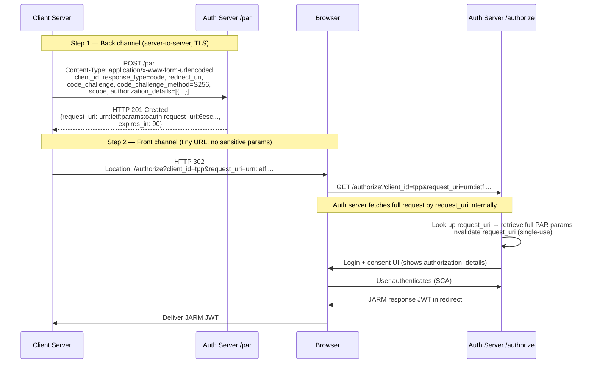

# Day 02 — PAR: Pushed Authorization Requests

## Why this matters

In 2023, a fintech's mobile banking app was intercepted at the mobile network layer. The app sent its full authorization request as a query string in the redirect URL — including `authorization_details` describing a £5,000 payment to a specific payee IBAN. The MITM (a rogue Wi-Fi access point at a hotel) captured the payment details from the redirect URL before the user had even been shown the authentication screen. The attacker knew the exact payment amount, the destination account, and the timing of the transaction. The user was tricked into authorising a different transaction.

PAR closes this by moving all authorization parameters off the front channel entirely. The redirect URL becomes an opaque reference — an unguessable URN — that reveals nothing about the underlying request.

## Core concepts

### RFC 9126 mechanics

PAR (Pushed Authorization Requests, RFC 9126) works in two steps:

**Step 1 — PAR POST (back channel):**
The client sends a `POST` to the authorization server's PAR endpoint with all authorization parameters in the request body:

```http
POST /par HTTP/1.1
Host: auth.bank.example.com
Content-Type: application/x-www-form-urlencoded

client_id=tpp_client&response_type=code&redirect_uri=https://tpp.example.com/callback
&code_challenge=E9Melhoa2OwvFrEMTJguCHaoeK1t8URWbuGJSstw-cM&code_challenge_method=S256
&scope=openid+payments&authorization_details=[...]
&client_assertion_type=urn%3Aietf%3Aparams%3Aoauth%3Aclient-assertion-type%3Ajwt-bearer
&client_assertion=<PLACEHOLDER_SIGNED_JWT>
```

The server responds with `201 Created`:

```json
{
  "request_uri": "urn:ietf:params:oauth:request_uri:6esc_11ACC5bwc014ltc14eY",
  "expires_in": 90
}
```

**Step 2 — Authorization redirect (front channel):**
The client redirects the user to the authorization endpoint with only:
- `client_id`
- `request_uri`

```
/authorize?client_id=tpp_client&request_uri=urn:ietf:params:oauth:request_uri:6esc_11ACC5bwc014ltc14eY
```

The authorization server looks up the full request by `request_uri` internally — no sensitive parameters are in the URL.

### `request_uri` format and properties

- **Format**: Must be a URN or opaque URI with the prefix `urn:ietf:params:oauth:request_uri:`, followed by a server-generated, non-guessable opaque identifier.
- **Entropy**: Must have at least 128 bits of entropy — the suffix cannot be sequential, predictable, or derived from client data.
- **TTL**: 60–90 seconds (recommended; spec maximum is not fixed but FAPI 2.0 recommends ≤90s).
- **Single-use**: The server must invalidate the `request_uri` after the first `/authorize` request consumes it. A second request with the same URI must return `invalid_request`.

### The redirect step: only `client_id` + `request_uri`

After a successful PAR POST, the client must redirect the user with only these two parameters. All other parameters — `scope`, `redirect_uri`, `code_challenge`, `authorization_details`, state — were submitted in the PAR body and are referenced server-side via the `request_uri`. They do not appear in the URL, browser history, server access logs, or referrer headers.

### Replay protection

The `request_uri` is single-use. After the first `/authorize` request fetches and consumes it:
- The server marks the URI as used.
- Any subsequent request with the same URI returns `error=invalid_request`.
- This prevents an attacker who captured the `request_uri` (e.g. from a log) from initiating a second authorization flow.

### The front-channel leakage attack

Without PAR, the client sends all parameters in the redirect URL. Those parameters appear in:
- Browser address bar and URL history
- Web server and proxy access logs (every GET URL is logged)
- Referrer headers sent to the redirect URI server
- Mobile OS "recent apps" screenshots
- Corporate network monitoring tools

With PAR, none of these locations contain sensitive data. The redirect URL carries only an opaque reference.

### PAR + PKCE interaction

The `code_challenge` and `code_challenge_method` are submitted in the PAR POST body, not in the redirect URL. At the token endpoint, the client submits the `code_verifier`. The server verifies `sha256(code_verifier) == code_challenge`. Neither the challenge nor the verifier ever appear in a URL.

### PAR + RAR interaction

The `authorization_details` parameter (RFC 9396, Rich Authorization Requests) carries structured payment or account-access details. This parameter can be kilobytes in size and contains highly sensitive information (IBANs, amounts, payees). It belongs in the PAR body — not in a redirect URL. PAR makes RAR practical by giving it a secure channel.

### PAR endpoint discovery

Clients discover the PAR endpoint via the authorization server's metadata document (RFC 8414):

```json
{
  "pushed_authorization_request_endpoint": "https://auth.bank.example.com/par"
}
```

### Error handling

| Error | Cause |
|-------|-------|
| `invalid_request` | Missing required parameter, malformed request, or expired/used `request_uri` |
| `invalid_client` | Client authentication failed |
| `400` with expired `request_uri` | `error=invalid_request`, `error_description=request_uri expired` |

### PAR flow diagram



## Anti-patterns / Common mistakes

- **Sending `request_uri` in the PAR body instead of the redirect**: The `request_uri` is returned from the PAR endpoint and must be used in the subsequent redirect step — not re-POSTed. Re-POSTing `request_uri` to `/par` is an error; the `request_uri` is a reference for the `/authorize` redirect only.

- **Setting `expires_in` too long (> 300s)**: A longer TTL increases the window during which a captured `request_uri` can be replayed by an attacker. The FAPI 2.0 recommendation is 90 seconds. Some implementations set 3600 seconds ("just to be safe") — this is a security regression, not a UX improvement.

- **Not invalidating `request_uri` after first use on the server side**: If the server accepts the same `request_uri` more than once, an attacker who captures the URI (e.g. from an application log that records the `/authorize` GET URL) can re-use it to initiate a second authorization flow and potentially confuse the user. Single-use enforcement is mandatory.

## Exercises

1. What is the minimum set of parameters the authorization redirect URI must contain after a successful PAR request?

   **Hint:** PAR already sent everything else.

   **Solution sketch:** Only `client_id` and `request_uri`. All other authorization parameters (scope, redirect_uri, code_challenge, authorization_details, etc.) were submitted in the PAR POST and are referenced server-side via the `request_uri`.

2. A PAR `request_uri` is valid for 90 seconds. The client takes 120 seconds to redirect the user (slow app load). What error does the auth server return, and what must the client do?

   **Hint:** Check the `expires_in` field the server returned.

   **Solution sketch:** The server returns `invalid_request` with `error_description` noting the `request_uri` has expired. The client must start over: generate a new PKCE pair, POST a new PAR request, and use the fresh `request_uri`. The first `request_uri` cannot be reused or extended.

3. Explain why PAR does not eliminate the need for PKCE in FAPI 2.0.

   **Hint:** PAR secures the request parameters. What does PKCE secure?

   **Solution sketch:** PAR prevents leakage of authorization parameters from the front channel. PKCE prevents authorization code interception: even if an attacker intercepts the authorization `code` in the redirect response, they cannot exchange it without the `code_verifier` (which was submitted in the PAR body, never visible on the front channel). Both are needed: PAR protects the request, PKCE protects the response.

## Lab

See `labs/day02/`. Goal: read the annotated PAR HTTP exchange and identify all security properties enforced at each step. Success signal: you can explain why each field exists without looking at RFC 9126.
