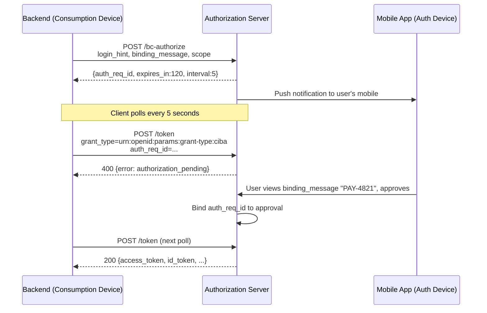
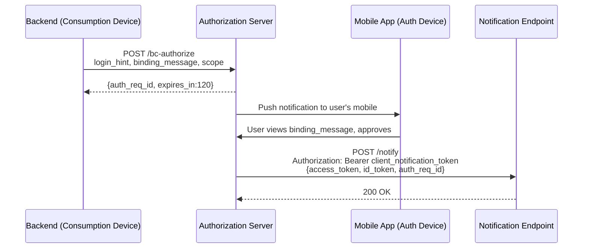

# Day 04 — CIBA: Client-Initiated Backchannel Authentication

## Why this matters

In 2021, a major bank's call centre was piloting a new high-value payment authorisation flow. A call centre agent needed to initiate a payment of €50,000 on behalf of a customer calling in. The customer's browser was not open — they were using only a mobile banking app. The bank attempted to solve this by emailing the customer a link, which introduced phishing risk and delay. A separate team tried generating a one-time code the agent read over the phone, which users found confusing and which was vulnerable to social engineering. Neither approach satisfied the bank's SCA requirements.

CIBA solves this by decoupling the authentication request (server-side, initiated by the call centre backend) from the user's authentication (mobile app push notification), allowing the bank's backend to initiate auth without controlling the user's device. The user receives a push notification on their enrolled mobile app, sees a binding message that matches what the agent reads to them, taps approve, and the call centre backend receives tokens — all without a browser redirect.

## Core concepts

### CIBA flow overview

CIBA (OpenID Connect Client-Initiated Backchannel Authentication, CIBA Core 1.0) involves three parties:

- **Consumption device**: the server-side component initiating the request (call centre backend, payment system)
- **Authentication device**: the user's enrolled mobile app where authentication happens
- **Authorization Server (AS)**: orchestrates the flow and issues tokens

Unlike OAuth 2.0 redirect flows, the consumption device and authentication device are separate and do not share a session.

### `POST /bc-authorize` request

The consumption device sends a backchannel authentication request:

```
POST /bc-authorize HTTP/1.1
Host: as.bank.com
Content-Type: application/x-www-form-urlencoded

client_id=call_centre_backend
&scope=openid payments
&login_hint=user@bank.com
&binding_message=PAY-4821
&authorization_details=[{"type":"payment_initiation","amount":50000}]
&client_assertion_type=urn%3Aietf%3Aparams%3Aoauth%3Aclient-assertion-type%3Ajwt-bearer
&client_assertion=<PLACEHOLDER: jwt_signed_with_tpp_private_key>
```

Key parameters:
- `login_hint`: identifies which user should authenticate (opaque reference to user account)
- `login_hint_token`: a signed JWT carrying user identity claims (alternative to `login_hint`)
- `id_token_hint`: a previously issued ID token identifying the user (alternative)
- `binding_message`: a short, human-readable string shown on BOTH the consumption device and the user's mobile app — this is the anti-substitution control
- `authorization_details`: RAR payload specifying what the user is authorising

The AS responds with:

```json
{
  "auth_req_id": "0c7839a1-4b2d-4e8f-9a3c-1f2e3d4c5b6a",
  "expires_in": 120,
  "interval": 5
}
```

- `auth_req_id`: opaque identifier for this backchannel auth request
- `expires_in`: seconds until the request expires (user must authenticate within this window)
- `interval`: minimum polling interval in seconds (poll mode only)

### Three delivery modes

#### Poll mode

The client polls the token endpoint repeatedly until the user authenticates or the request expires.



#### Ping mode

The AS sends a notification to the client's registered `client_notification_endpoint` when the user authenticates. The client then makes a single token request.

- Client registers a `client_notification_endpoint` URL
- On approval, AS sends a POST to that endpoint with `auth_req_id`
- Client makes one token request using that `auth_req_id`
- More efficient than polling for high-concurrency scenarios

#### Push mode

The AS pushes tokens directly to the `client_notification_endpoint`. No token request is needed.



### `binding_message`: anti-substitution control

The `binding_message` is a short (typically 6-8 character) human-readable string that the bank's consumption device displays to the call centre agent (and optionally reads to the customer) AND that appears in the user's mobile app push notification. The user must verify these match before approving.

Without `binding_message`, an attacker could:
1. Wait for the legitimate bank to initiate a CIBA request for user X
2. Simultaneously initiate their own CIBA request for user X targeting a fraudulent payment
3. The user receives two push notifications and approves one — the attacker hopes the user approves theirs

With `binding_message="PAY-4821"`, the agent says "please approve the request showing PAY-4821 on your app". The attacker's request shows a different code. The user sees the mismatch and rejects.

### Error states during polling

| Error | Meaning | Client action |
|-------|---------|---------------|
| `authorization_pending` | User has not yet authenticated | Continue polling at current interval |
| `slow_down` | Client is polling too fast | Add `interval` seconds to current wait, use new interval permanently |
| `expired_token` | `auth_req_id` expired before user authenticated | Fail the flow; do not retry with same `auth_req_id` |
| `access_denied` | User rejected the request | Fail the flow |

### `hint_type` values

| Hint parameter | Format | Use case |
|---------------|--------|---------|
| `login_hint` | Opaque string (email, phone, user ID) | Simple user identification by known attribute |
| `login_hint_token` | Signed JWT with user claims | Richer identity context; token is signed by the client |
| `id_token_hint` | Previously issued OIDC ID token | Re-authenticate a user already known to the AS |

## Anti-patterns / Common mistakes

- **Polling faster than `interval`**: The AS returns `slow_down`, which doubles the required wait interval. Subsequent violations continue doubling. A client that ignores `slow_down` will be permanently throttled for the session.

- **Not displaying `binding_message` on the consumption device**: The binding message is only effective if it is shown on the consumption device (e.g., read by the call centre agent to the customer). If only the mobile app shows it, the user has nothing to compare against — the anti-substitution property is lost entirely.

- **Using push mode without a hardened `client_notification_endpoint`**: Push mode delivers tokens to the notification endpoint over the network. The endpoint must validate the `client_notification_token` (a bearer token the AS sends in the Authorization header) before accepting. Without validation, any party that discovers the endpoint URL can deliver forged token responses.

## Exercises

1. A banking server initiates a CIBA request with `login_hint=user123` and `binding_message="PAY-4821"`. The user's mobile app shows "PAY-4821" and approves. What does the `binding_message` protect against?

   **Hint:** Think about what happens if an attacker simultaneously initiates their own CIBA request for the same user.

   **Solution sketch:** The `binding_message` links the consumption device (bank server) to the user's authentication device (mobile). Without it, an attacker could initiate a parallel CIBA request for a fraudulent payment — the user would see an approval request with no context and might approve it. With `binding_message`, the user sees "PAY-4821" on the bank UI AND on their mobile; if the codes differ, they reject. This is the CIBA equivalent of transaction dynamic linking.

2. A client polls `POST /token` with `auth_req_id` and receives `error: slow_down`. What must it do, and why does this error exist?

   **Hint:** The `slow_down` response includes an updated `interval` value.

   **Solution sketch:** The client must add the `interval` value (typically 5 seconds) to its current polling interval before the next attempt, then use the new interval going forward. `slow_down` exists to prevent DDoS-style polling storms against the AS during peak hours (e.g., bank-wide MFA challenge campaigns). The doubling mechanism naturally backs off heavy pollers while light pollers are unaffected.

3. Compare poll mode and push mode for a banking call centre use case (1,000 concurrent agent sessions, each waiting for customer approval). Which mode is more appropriate and why?

   **Hint:** Consider connection count, latency, and infrastructure complexity.

   **Solution sketch:** Push mode. With 1,000 concurrent sessions, poll mode would generate 1,000 polling threads/goroutines each making HTTP requests every 5 seconds = ~200 req/s sustained against the token endpoint, even when most users have not responded yet. Push mode eliminates polling entirely: the AS sends a single notification to the bank's endpoint when each user approves, reducing the token endpoint load to exactly the number of approvals per second. Trade-off: the bank must expose and secure a `client_notification_endpoint`.

## Lab

See `labs/day04/`. Goal: trace a CIBA poll-mode flow from bc-authorize request to token delivery.
Success signal: you can identify `auth_req_id`, polling interval, `binding_message`, and token grant type.
