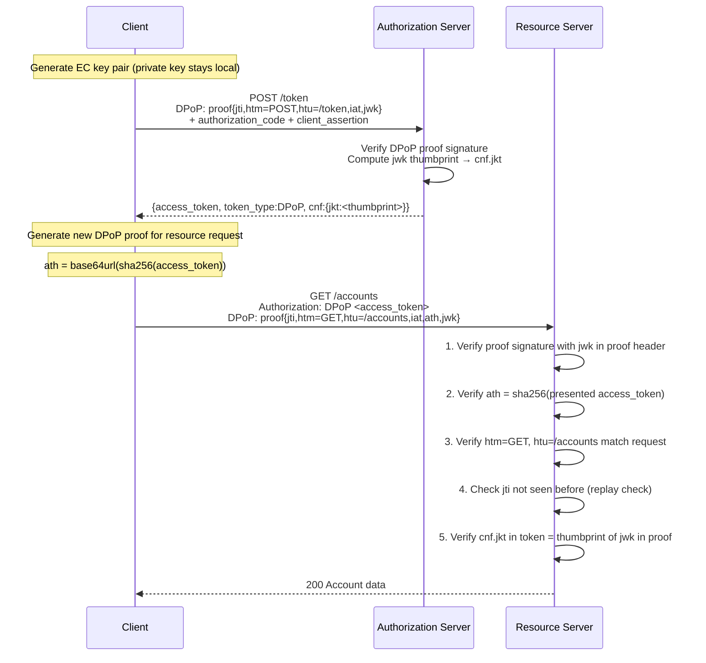

# Day 05 — DPoP: Demonstrating Proof of Possession

## Why this matters

In 2023, a bank deployed a modern API gateway that terminated TLS at the edge and forwarded requests to backend microservices over plain HTTP on an internal network. Security architects considered the internal network "trusted" — no TLS between gateway and backends. A rogue backend engineer discovered they could capture the `Authorization: Bearer` tokens flowing through internal traffic using a packet capture tool. Bearer tokens are possession-sufficient: whoever holds the token can use it from anywhere, at any time, until it expires. The engineer replayed captured tokens from their laptop against the payment API from home and exfiltrated several months of transaction data before the anomaly was detected.

DPoP (RFC 9449) makes tokens useless without the corresponding private key. The private key never leaves the legitimate client; even with the token, an attacker cannot forge a valid DPoP proof. Token theft from TLS termination proxies, log files, or network captures stops producing usable credentials.

## Core concepts

### RFC 9449: DPoP proof JWT structure

A DPoP proof is a JWT with specific header and claims:

**Header:**
```json
{
  "typ": "dpop+jwt",
  "alg": "ES256",
  "jwk": {
    "kty": "EC",
    "crv": "P-256",
    "x": "<PLACEHOLDER>",
    "y": "<PLACEHOLDER>"
  }
}
```

The `jwk` field embeds the client's **public key** directly in the proof header. This is how the resource server knows which key pair to use for verification — no separate key lookup required.

**Claims:**
```json
{
  "jti": "<PLACEHOLDER-unique-per-request>",
  "htm": "POST",
  "htu": "https://as.bank.com/token",
  "iat": 1727654400,
  "nonce": "<PLACEHOLDER-server-issued>"
}
```

| Claim | Purpose |
|-------|---------|
| `jti` | Unique proof ID — replay prevention; RS must reject previously-seen `jti` |
| `htm` | HTTP method this proof is valid for — bound to one method |
| `htu` | HTTP URL this proof is valid for — bound to one endpoint |
| `iat` | Issued-at timestamp — proofs are short-lived (RS rejects stale proofs) |
| `ath` | Access token hash: `base64url(sha256(access_token))` — binds proof to a specific token |
| `nonce` | Server-issued nonce — prevents offline pre-generation of proofs |

### `jwk` → `cnf.jkt`: how the public key becomes a token claim

At token issuance time:
1. Client sends a DPoP proof with the token request
2. AS extracts the `jwk` from the proof header
3. AS computes the JWK thumbprint: `base64url(sha256(canonical_jwk_json))`
4. AS embeds this thumbprint as `cnf.jkt` in the access token

The access token now carries a fingerprint of the client's DPoP key. The resource server uses `cnf.jkt` to verify that the DPoP proof it receives was created by the same key that was used during token issuance — without having a separate key database.

### Token request flow

```
POST /token HTTP/1.1
Host: as.bank.com
Content-Type: application/x-www-form-urlencoded
DPoP: <dpop_proof_jwt_for_token_endpoint>

grant_type=authorization_code
&code=<auth_code>
&redirect_uri=https://tpp.example.com/callback
&client_assertion_type=urn:ietf:params:oauth:client-assertion-type:jwt-bearer
&client_assertion=<private_key_jwt>
```

Response:
```json
{
  "access_token": "<PLACEHOLDER>",
  "token_type": "DPoP",
  "expires_in": 300,
  "cnf": {
    "jkt": "<PLACEHOLDER-jwk-thumbprint>"
  }
}
```

Note: `token_type: DPoP` signals to the resource server that this token requires DPoP proof validation.

### Resource request flow

```
GET /accounts HTTP/1.1
Host: api.bank.com
Authorization: DPoP <access_token>
DPoP: <dpop_proof_jwt_for_this_request>
```

The `Authorization` scheme changes from `Bearer` to `DPoP` — the resource server uses this to know DPoP validation is required.



### `nonce` challenge: preventing offline proof pre-generation

An AS or RS may send a `DPoP-Nonce` header in its response:

```
HTTP/1.1 400 Bad Request
WWW-Authenticate: DPoP error="use_dpop_nonce"
DPoP-Nonce: abc123xyz
```

The client must include this nonce as the `nonce` claim in its next DPoP proof. The server verifies the nonce matches one it recently issued. This prevents an attacker from pre-generating hundreds of DPoP proofs offline (before obtaining a stolen token) — each proof requires a nonce that was not available at pre-generation time.

### Why bearer token theft at TLS termination is defeated

When a TLS-terminating proxy captures the `Authorization: DPoP <token>` header:
- The attacker has the access token
- The attacker does NOT have the client's private key
- The attacker cannot forge a DPoP proof that passes `cnf.jkt` verification
- The token is bound to the key pair that only the legitimate client holds

The stolen token is cryptographically useless without the private key.

## Anti-patterns / Common mistakes

- **Reusing a DPoP proof across requests**: The `jti` replay check on the RS will reject it. The `htm` and `htu` are also request-specific — reusing a proof for a different method or URL will fail both checks. Generate a fresh proof per request.

- **Using the same DPoP key for all services**: Compromise of one service's logs exposes the `cnf.jkt` association for all services. Use per-service key pairs, or rotate keys periodically. The key pair should be ephemeral where possible — generated at application startup, not persisted.

- **Not validating `htm`/`htu` on the resource server**: Allows proof portability across endpoints. A proof generated for `GET /accounts` must not be accepted for `POST /payments`. Both method and URL must match exactly.

## Exercises

1. A DPoP proof JWT has `htm: "GET"` and `htu: "https://api.bank.com/accounts"`. The client sends this proof with a POST request to `https://api.bank.com/payments`. Does the RS accept it?

   **Hint:** What do `htm` and `htu` bind the proof to?

   **Solution sketch:** No. The RS validates `htm` against the actual HTTP method (POST ≠ GET) and `htu` against the actual URL (`/payments` ≠ `/accounts`). Both validations fail. The proof is method-and-URL-bound by design — it cannot be reused for a different endpoint or method. The client must generate a new DPoP proof for every request, binding `htm=POST` and `htu=https://api.bank.com/payments`.

2. Explain the role of `ath` (access token hash) in a DPoP proof and what attack it prevents.

   **Hint:** Consider what an attacker can do with a DPoP proof but no access token.

   **Solution sketch:** `ath` is `base64url(sha256(access_token_bytes))`. It binds the DPoP proof to a specific access token. Without `ath`, an attacker who intercepts a DPoP proof could pair it with a different access token (e.g., one with broader scopes). With `ath`, the RS computes sha256 of the presented access token and verifies it matches `ath` in the proof — the proof is useless with any other token.

3. A resource server returns `WWW-Authenticate: DPoP error="use_dpop_nonce"` with a `DPoP-Nonce: abc123` header. What must the client do on the next request?

   **Hint:** Nonces prevent pre-generated proofs.

   **Solution sketch:** The client must include `"nonce": "abc123"` in the claims of the next DPoP proof JWT. The RS (or AS) will verify the nonce matches the one it issued. This prevents an attacker from pre-generating a batch of DPoP proofs offline and replaying them later — each proof must incorporate a server-issued nonce that was not available at pre-generation time.

## Lab

See `labs/day05/`. Goal: annotate a DPoP proof JWT to identify how it binds to the access token and the HTTP request. Success signal: you can explain the purpose of every claim in the proof.
