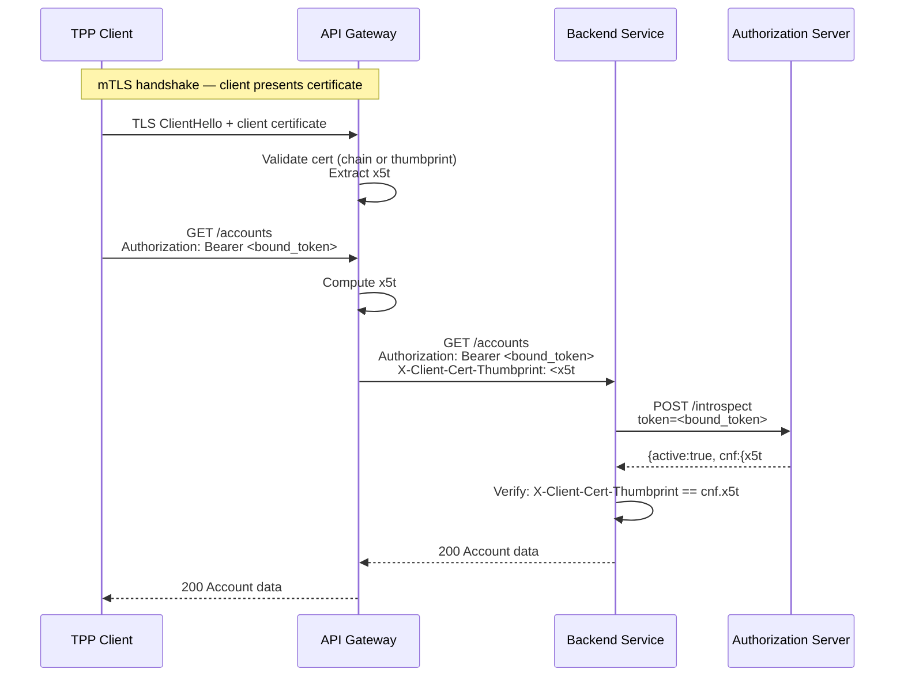

# Day 06 — mTLS Client Auth + Certificate-Bound Tokens

## Why this matters

In 2022, a bank's payment API was accessed from an unknown residential IP address using a valid access token. Investigation revealed the token had been scraped from a developer's local machine — the developer had logged the full HTTP response from a test environment that shared token issuance with production. The token was a bearer token: no binding to any client credential. Anyone who obtained the token could call the API from anywhere until it expired. The bank's rate limiting and fraud detection caught unusual access patterns after 48 hours, by which time thousands of transaction records had been exfiltrated.

mTLS token binding (RFC 8705) ensures that even a stolen access token is useless without the client certificate that was bound to it at issuance time. The token carries a cryptographic fingerprint of the certificate; the resource server verifies that the presenting client's TLS certificate matches that fingerprint on every request. A stolen token with no certificate is rejected.

## Core concepts

### RFC 8705: two mTLS client authentication methods

#### `tls_client_auth`

The client presents a certificate issued by a Certificate Authority (CA) that the authorization server trusts. The AS validates:
- The certificate chains to a trusted CA in its trust store
- The certificate's `Subject DN` or `SubjectAltName (SAN)` matches the `tls_client_auth_subject_dn` registered for the client

This method relies on PKI chain validation. The bank must maintain a trust store of accepted CAs. In open banking ecosystems (UK FCA, Brazil BCB, Australia CDR), the allowed CAs are defined by the ecosystem's trust framework — TPPs must obtain certificates from these specific CAs.

#### `self_signed_tls_client_auth`

The client presents a self-signed certificate. The AS does not validate the CA chain. Instead, it computes the SHA-256 thumbprint of the certificate (`x5t#S256`) and verifies it matches a thumbprint registered in the client's JWKS URI (via the `x5c` field).

- No CA dependency — the client generates its own key pair and self-signed cert
- Instant rotation — client registers a new cert's thumbprint without waiting for CA issuance
- No cost — no CA fees
- Trade-off: the bank cannot rely on CA-level identity; must verify TPP identity through its own onboarding process

### Certificate-bound access tokens

When the AS issues a token to an mTLS-authenticated client, it extracts the SHA-256 thumbprint of the client certificate from the TLS session and embeds it in the access token:

```json
{
  "sub": "client_id_tpp",
  "iss": "https://as.bank.com",
  "aud": "https://api.bank.com",
  "exp": 1727658000,
  "cnf": {
    "x5t#S256": "<PLACEHOLDER-base64url-sha256-cert-thumbprint>"
  }
}
```

The `cnf` (confirmation) claim carries `x5t#S256`: the base64url-encoded SHA-256 thumbprint of the client certificate used during authentication. This token is now bound to that specific certificate.

### Resource server validation

On each request to the resource server:



The resource server (or backend service) must:
1. Extract the client certificate's `x5t#S256` from the TLS session or trusted header
2. Introspect the token to obtain `cnf.x5t#S256`
3. Verify the two thumbprints match

### mTLS at the API gateway

When the API gateway terminates TLS:
- The gateway performs the mTLS handshake and certificate validation
- The gateway extracts the `x5t#S256` thumbprint and forwards it in a trusted internal header: `X-Client-Cert-Thumbprint: <thumbprint>`
- Backend services read this header and use it for `cnf` validation
- The header must be stripped from any external requests (enforce via gateway policy) to prevent thumbprint spoofing

Never forward the full PEM certificate in a header — it is large, exposes PKI structure, and is unnecessary. The thumbprint is sufficient for `cnf` validation.

### PKI chain in banking

| Component | Purpose |
|-----------|---------|
| Root CA | Trust anchor; offline; signs intermediate CAs only |
| Intermediate CA | Issues end-entity (leaf) certificates; can be revoked per ecosystem |
| End-entity cert | Used by TPP client for mTLS authentication |
| CRL (Certificate Revocation List) | List of revoked serial numbers; published by CA; checked by AS |
| OCSP (Online Certificate Status Protocol) | Real-time revocation check; AS queries OCSP responder per connection |
| OCSP Stapling | Server fetches OCSP response and includes it in the TLS handshake; reduces per-connection OCSP latency |

**Certificate rotation without service interruption:**
1. Generate new key pair and obtain new certificate (from CA, or self-sign)
2. Register new cert's `x5t#S256` in the JWKS URI alongside the existing cert
3. Both certs are now valid for client auth
4. Deploy new cert to the client application
5. After all connections using the old cert have finished, remove the old cert's registration
6. This zero-downtime rotation requires a dual-registration window

### mTLS vs DPoP

| Dimension | mTLS | DPoP |
|-----------|------|------|
| Binding level | TLS certificate (infrastructure) | Application-layer key pair |
| Key management | PKI / X.509 certificates | JWKS / EC or RSA key pair |
| TLS termination | Requires cert forwarding via header | Not affected by TLS termination |
| FAPI 2.0 | Allowed as client auth method | Allowed as token binding method |
| Combined use | Some deployments use both: mTLS for client auth, DPoP for token binding |

FAPI 2.0 allows either `tls_client_auth`/`self_signed_tls_client_auth` (mTLS) or `private_key_jwt` for client authentication. For token binding, mTLS certificate-bound tokens (RFC 8705) and DPoP (RFC 9449) are both supported.

## Anti-patterns / Common mistakes

- **Forwarding the full client certificate PEM in an HTTP header to backend services**: The PEM is large (2–4 KB), exposes the full certificate chain and subject details, and adds overhead to every request. Forward only the `x5t#S256` thumbprint (43 base64url characters). The backend needs only the thumbprint to validate `cnf`.

- **Not configuring OCSP stapling**: Without stapling, the API gateway (or AS) must make an outbound OCSP query on every new TLS connection. At high connection rates, OCSP responder latency (50–200ms) adds directly to connection setup time. OCSP stapling allows the gateway to cache the OCSP response and include it in the TLS handshake, eliminating the per-connection outbound query.

- **Rotating certificates without pre-registering the new cert**: If the old cert is revoked or expires before the new cert is registered, there is a window where every client connection is rejected. Always complete the registration of the new cert and verify it authenticates successfully before retiring the old cert.

## Exercises

1. A bank uses `tls_client_auth` for its TPP onboarding. A new TPP presents a certificate issued by an unknown intermediate CA. The AS rejects it. Explain why and what the TPP must do.

   **Hint:** `tls_client_auth` relies on PKI chain validation.

   **Solution sketch:** `tls_client_auth` requires the client certificate to chain up to a CA that the AS trusts. The AS maintains a trust store of accepted CA certificates. If the TPP's intermediate CA is not in the trust store, the TLS handshake fails at chain validation. The TPP must either obtain a certificate from a CA in the AS's trust store, or the bank must add the TPP's CA to the trust store. In open banking ecosystems (UK, AU, Brazil), the allowed CAs are defined by the ecosystem's trust framework — only those specific CAs are accepted.

2. Compare the operational burden of `tls_client_auth` vs `self_signed_tls_client_auth` for a fintech with 50 TPP clients rotating certificates annually.

   **Hint:** Consider CA dependency and cert registration steps.

   **Solution sketch:** `tls_client_auth` requires each TPP certificate to be issued by a trusted CA — the bank has no control over TPP cert issuance timelines, and CA-issued certs cost money and have lead time. With 50 TPPs rotating annually, that is 50 CA interactions, 50 approval windows, and potential service disruptions if any CA is slow. `self_signed_tls_client_auth` allows the TPP to generate its own keypair and register the cert's `x5t#S256` thumbprint via the JWKS URI — no CA dependency, instant rotation, zero cost. Trade-off: the bank cannot rely on CA-level identity validation; it must verify TPP identity via its own onboarding process. For closed ecosystems with a known set of partners, `self_signed_tls_client_auth` is often preferable.

3. An API gateway terminates TLS and forwards requests to a backend service. How should the gateway communicate the client's mTLS certificate identity to the backend?

   **Hint:** The backend cannot see the original TLS session.

   **Solution sketch:** The gateway should extract the `x5t#S256` thumbprint from the client certificate during the TLS handshake and forward it in a trusted internal header (e.g., `X-Client-Cert-Thumbprint: <base64url_sha256_thumbprint>`). The backend reads this header and validates it against the `cnf.x5t#S256` claim in the access token. The header must be stripped from external requests to prevent spoofing — only the gateway should be able to set it (enforce via mTLS between gateway and backend, or network policy). The full PEM must not be forwarded — it is large and unnecessary.

## Lab

See `labs/day06/`. Goal: annotate an mTLS client config and trace how the certificate thumbprint flows from TLS handshake to access token `cnf` claim to resource server validation.
Success signal: you can explain what `cnf.x5t#S256` means and how the RS validates it.
