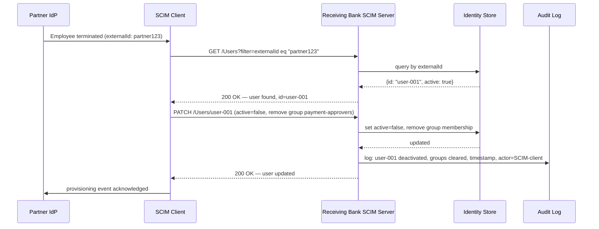

# Day 07 — SCIM 2.0 Provisioning

## Why this matters

A bank onboards a new partner bank via an API partnership. The partner bank needs access for 500 of its employees. The bank's IAM team manually creates 500 accounts — a process that takes 3 days and creates inconsistencies (wrong department, missing role, duplicate usernames). When 50 employees leave the partner bank over the following months, no offboarding notification arrives. The accounts remain active for 6 months. Several of those accounts are later found querying transaction records outside their scope. The compliance audit costs the bank €400,000 in remediation and a public reprimand from the regulator.

SCIM (System for Cross-domain Identity Management) eliminates manual provisioning and ensures deprovisioning is automatic, consistent, and auditable. A SCIM-push from the partner IdP to the bank's identity store creates, updates, and deactivates accounts in minutes, with a full audit trail tied to the partner's IdP events.

## Core concepts

### RFC 7643: SCIM Core Schema

SCIM defines portable, JSON-based schemas for identity resources.

#### `User` resource

Key attributes:

| Attribute | Type | Description |
|---|---|---|
| `id` | string | Immutable, server-assigned unique ID |
| `userName` | string | Unique, mutable login identifier |
| `name` | object | `formatted`, `givenName`, `familyName` |
| `emails` | array | Primary email and type |
| `groups` | array | Group memberships (read-only on User; manage via Group resource) |
| `active` | boolean | `true` = account active; `false` = deactivated |
| `externalId` | string | Caller-assigned identifier — the partner IdP's user ID |

#### `Group` resource

Key attributes: `id`, `displayName`, `members` (array of `{value, display, type}`).

Group membership changes require PATCHing the `Group` resource, not the `User` resource. The `groups` attribute on `User` is read-only in most implementations.

#### `EnterpriseUser` extension

Schema URN: `urn:ietf:params:scim:schemas:extension:enterprise:2.0:User`

Adds: `employeeNumber`, `organization`, `department`, `division`, `manager` (reference). Critical for banking where cost-centre and department drive entitlement policies.

---

### RFC 7644: SCIM Protocol

HTTP methods and canonical endpoints:

| Method | Path | Purpose |
|---|---|---|
| `GET` | `/Users/{id}` | Read a specific user |
| `POST` | `/Users` | Create (provision) a user |
| `PUT` | `/Users/{id}` | Replace all attributes (full update) |
| `PATCH` | `/Users/{id}` | Partial update — change specific attributes only |
| `DELETE` | `/Users/{id}` | Hard-delete the user record |
| `GET` | `/Users?filter=userName eq "john"` | Search by attribute |

`POST /Users` response: `201 Created` with the created user JSON including the server-assigned `id`.

`GET /Users?filter=externalId eq "partner123"` — used to locate a user by the partner's identifier before creating a duplicate.

---

### PATCH operation structure

PATCH uses a specific envelope. The `schemas` array must include the PatchOp schema URN:

```json
{
  "schemas": ["urn:ietf:params:scim:api:messages:2.0:PatchOp"],
  "Operations": [
    {
      "op": "replace",
      "path": "active",
      "value": false
    },
    {
      "op": "remove",
      "path": "groups",
      "value": [{"value": "<group-id-payment-approvers>"}]
    }
  ]
}
```

Supported `op` values: `add`, `remove`, `replace`.

`path` may use SCIM attribute notation or filter expressions: `"path": "emails[type eq \"work\"].value"`.

---

### JIT provisioning vs. scheduled SCIM sync

| Dimension | JIT provisioning | Scheduled SCIM sync |
|---|---|---|
| Timing | Account created at first login | Account created by batch job (nightly/hourly) |
| Audit trail | Account creation event = first login; no pre-login provisioning record | Provisioning log exists before any access; regulator can inspect |
| Deprovisioning | No automatic deprovisioning — requires separate trigger | Batch compares IdP roster vs. identity store; missing users deactivated |
| Access lag | Immediate (no batch wait) | Up to batch frequency (e.g., 1 hour lag before new user can log in) |
| Compliance suitability | Lower — no reviewed provisioning record before access | Higher — full lifecycle in provisioning system, independently auditable |

In regulated banking environments, scheduled SCIM sync is strongly preferred: the provisioning log is independent evidence that access was granted through a reviewed process, not as a side-effect of a first login.

---

### B2B org user federation

Flow: partner bank's IdP → SCIM client (push) → receiving bank's SCIM server → identity store.

1. Partner IdP emits an event: new employee `alice@partner.bank` (external ID `partner123`).
2. SCIM client calls `POST /Users` with `externalId: "partner123"` and the receiving bank assigns an internal `id`.
3. The `externalId` is stored alongside the internal `id` — this is the link back to the partner's source record.
4. On attribute changes (email update, role change), the SCIM client calls `PATCH /Users/{id}`.
5. On termination, the SCIM client calls `PATCH /Users/{id}` with `active=false`.

The `externalId` enables idempotent operations: before creating, search by `externalId`; if found (even if `active=false`), re-activate rather than create a duplicate.

---

### Deprovisioning: `PATCH active=false` vs. `DELETE`

`DELETE /Users/{id}` removes the user record from the identity store. In regulated environments this is almost never appropriate:

- Access logs, transaction records, and consent objects reference the user's internal `id`. Deleting the user breaks referential integrity in audit logs.
- Regulators require the ability to reconstruct who had access to what at any point in history. A deleted record makes this impossible.
- A re-joining employee's history is lost.

`PATCH active=false` (deactivation):
- The account record is retained; the user cannot log in.
- All tokens issued to the user should be invalidated via the token revocation list.
- Audit logs retain full referential integrity.
- Re-activation is a single PATCH: `active=true` plus any attribute updates.

The bank's SCIM server should enforce this: some implementations configure `DELETE` to map to `active=false` internally, returning 204 to the SCIM client while not destroying the record.

---

### Mermaid sequence diagram



## Anti-patterns / Common mistakes

**Using `DELETE` for deprovisioning in regulated environments**
`DELETE /Users/{id}` destroys the account record. Audit logs that reference the user's internal `id` lose their subject. Regulators cannot verify who held access. Use `PATCH active=false` instead — the account is deactivated but the record is preserved.

**Not propagating group membership changes**
If a user moves from `payment-approvers` to `read-only`, the SCIM client must PATCH the `Group` resource to remove the user from `payment-approvers` and add them to `read-only`. PATCHing only the user's `groups` attribute fails in most implementations because `groups` is read-only on the User resource. Group membership is authoritative on the `Group` resource.

**Ignoring `externalId`**
Without `externalId`, a re-provisioned employee gets a new internal account. Historical access records, consents, and transaction logs reference the old `id`. A user deprovisioned and re-joining 6 months later appears as a brand-new user — no audit continuity. Always search by `externalId` before `POST /Users`.

## Exercises

1. Write a SCIM PATCH operation to deactivate a user and remove them from the `payment-approvers` group without deleting the user record.

   **Hint:** Use two operations in one PATCH: set `active=false` and remove the group membership.

   **Solution sketch:** A PATCH to `/Users/{id}` with operations: (1) `{"op":"replace","path":"active","value":false}`, (2) `{"op":"remove","path":"groups","value":[{"value":"<group-id>"}]}`. Both in a single `Operations` array under the PatchOp schema URN. The group membership removal must also be reflected by PATCHing the `Group` resource's `members` array — the User-side `groups` is often read-only.

2. A partner bank's SCIM client provisions a user with `externalId: "partner123"`. Six months later, the user is deprovisioned (`active=false`). A year later, the same user returns. What should the SCIM client do, and why?

   **Hint:** Search by `externalId` before creating.

   **Solution sketch:** The SCIM client should first `GET /Users?filter=externalId eq "partner123"`. If found (with `active=false`), it should PATCH `active=true` and update any changed attributes — not create a new user. Creating a new user loses the audit trail linking the account to historical transactions and access events. Re-activating preserves continuity of identity across the employment gap, which regulators can inspect.

3. A bank switches from JIT provisioning to scheduled SCIM sync for regulatory compliance. What new operational requirement does this introduce, and what does it eliminate?

   **Hint:** Think about timing and audit evidence.

   **Solution sketch:** Scheduled SCIM sync requires running a provisioning job (typically nightly or hourly) and retaining job execution logs as audit evidence — the bank can prove exactly when and why each account was created or deprovisioned. It eliminates the risk of accounts being created at first login without a reviewed provisioning record (JIT creates accounts on-demand, which is hard to audit retroactively). Trade-off: scheduled sync has a lag — a user deprovisioned at 9am may retain access until the next sync job runs. The bank must define a maximum acceptable lag in its access control policy (e.g., deprovisioning sync runs every 15 minutes).

## Lab

See `labs/day07/`. Goal: annotate a SCIM PATCH operation for a user deactivation and a group membership removal. Success signal: you can write SCIM PATCH operations for the three most common provisioning events — create, deactivate, group-membership change — and explain why each field is present.
