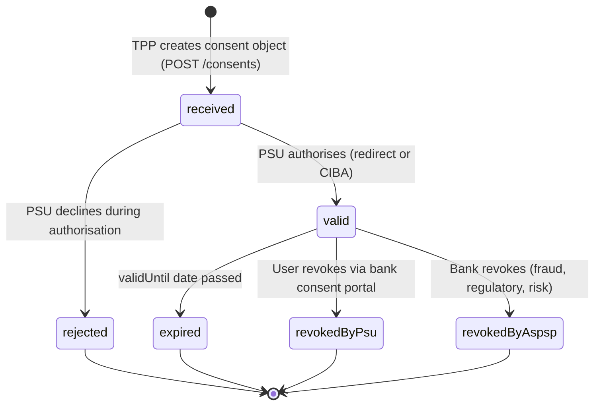

# Day 08 — Consent Management

## Why this matters

A bank's TPP integration had no consent lifecycle management. A token issued for a one-time payment was still valid 6 months later — the TPP made recurring charges without re-consent. A regulatory audit found 10,000 tokens authorising ongoing data access that users had never explicitly renewed. The bank could not demonstrate that any of those consents were still in the user's awareness or intent. PSD2's enforcement agency issued a €2.8 million fine and required the bank to contact all affected users to re-confirm or revoke their consents.

PSD2 mandates that consent is a first-class resource with a defined lifecycle, not just a one-time authorization event. Consent must be stored, trackable, revocable, and bound to specific access rights. A token is evidence that consent was given; the consent record is the authority.

## Core concepts

### PSD2 consent object

A consent object represents a user's explicit authorisation for a TPP to access specific data or initiate payments on their behalf.

Core fields:

| Field | Type | Description |
|---|---|---|
| `consentId` | string | Server-assigned unique identifier for this consent |
| `access` | object | Specific access rights: `accounts`, `balances`, `transactions` (each an array of IBANs or `"allAccounts"`) |
| `recurringIndicator` | boolean | `true` = consent is for recurring access; `false` = one-time |
| `validUntil` | date | Maximum date consent is valid; must be set by the bank |
| `frequencyPerDay` | integer | Maximum API calls per day under this consent |
| `consentStatus` | enum | Current lifecycle state (see below) |

---

### Consent lifecycle stages



Stage definitions:

- **`received`**: The consent object has been created by the TPP (POST /consents). It awaits user authorisation. No access token can be issued yet.
- **`valid`**: The user (PSU) has authorised the consent via the bank's authorisation flow. The AS can issue access tokens linked to this `consentId`. The TPP may call the data APIs.
- **`expired`**: The current date is past `validUntil`. All tokens linked to this consent cease to work. The TPP must initiate a new consent flow.
- **`revokedByPsu`**: The user revoked the consent via the bank's consent management portal. Immediate effect — all linked tokens must be invalidated.
- **`revokedByAspsp`**: The bank (ASPSP) revoked the consent — typically due to fraud detection, suspicious activity, or a regulatory requirement. Immediate effect — all linked tokens must be invalidated. The TPP should be notified.
- **`rejected`**: The user declined to authorise during the authorisation flow. The consent cannot be used.

---

### `recurringIndicator` and the 90-day rule

PSD2 RTS Article 10 requires that for AIS (Account Information Services) consents with `recurringIndicator: true`, the PSU must re-authenticate with the ASPSP at least every 90 days.

The bank must set `validUntil` to at most `today + 90 days`. The TPP cannot request a longer validity period for AIS. When the consent expires:
- The TPP's access tokens linked to this consent return 401.
- The TPP must initiate a new consent object and a new authorisation flow.
- The user must explicitly re-authorise — silent renewal (e.g., using a refresh token to extend) is not permitted for AIS under PSD2.

---

### Consent receipt

A consent receipt is a structured JSON document handed to the user (PSU) at the time of authorisation. It documents:
- What data the TPP will access (`accounts`, `balances`, `transactions`)
- For how long (`validUntil`)
- How frequently (`frequencyPerDay`)
- The identity of the TPP
- The `consentId` for future reference or revocation

The receipt gives the user a verifiable record of what they agreed to. The bank must retain a copy for audit purposes.

---

### `claims` parameter and consent

The OIDC `claims` request parameter allows a TPP to request specific claims in the ID token or UserInfo response, linked to the consent:

```json
{
  "id_token": {
    "sub": {"essential": true},
    "given_name": {"essential": false}
  }
}
```

In PSD2/FAPI contexts, the `claims` parameter is used alongside `authorization_details` (RAR) to tie the token's identity claims to the consented access. The AS only includes claims the consent authorises.

---

### Consent revocation API

`DELETE /consents/{consentId}` — the bank must:
1. Set the consent status to `revokedByPsu` or `revokedByAspsp`.
2. Locate all access tokens and refresh tokens linked to this `consentId` (via stored `jti` values).
3. Add those JTIs to the token revocation list.
4. Return 204 No Content.

Resource servers check the revocation list on each API call. A revoked consent's tokens return 401 immediately.

---

### Consent renewal

When `consentStatus` transitions to `expired`:
- The TPP initiates a new consent object (`POST /consents`) — it cannot reuse the expired `consentId`.
- The user must complete a new authorisation flow.
- A new `consentId` is returned; the TPP links its stored data to the new ID.

The bank may provide a "consent renewal" UX that pre-fills the same access rights for user convenience, but a new authorisation event must occur.

---

### Consent as a resource linked to `authorization_details`

In FAPI 2.0 / Open Banking, each consent record should store the original `authorization_details` array that was submitted in the PAR/authorization request:

```json
{
  "consentId": "consent-abc-001",
  "authorization_details": [
    {
      "type": "payment_initiation",
      "amount": {"currency": "EUR", "amount": "1000.00"},
      "creditorAccount": {"iban": "<PLACEHOLDER-creditor-iban>"}
    }
  ]
}
```

This creates an immutable audit record of the exact scope the user authorised, independently of what the TPP claims to have requested.

## Anti-patterns / Common mistakes

**Storing consent state only in the access token**
If `consentStatus` is derived from the JWT's claims (e.g., a `consent_status` claim), then revoking the consent has no effect until the token expires — there is no mechanism to invalidate a stateless JWT. Consent state must be stored server-side. Resource servers must check the consent store (or a token revocation list) on each call, not rely on the token's embedded claims.

**Setting `validUntil` to a date far in the future to avoid re-consent flows**
Setting `validUntil` to two years in the future for AIS consent violates PSD2 RTS Article 10 (90-day re-authentication requirement). It exposes the bank to regulatory action and to the scenario where users have forgotten they granted access. The bank must enforce the 90-day ceiling programmatically.

**Not propagating `revokedByAspsp` to the TPP**
If the bank revokes a consent without notifying the TPP, the TPP continues making API calls that return 401. The TPP has no way to tell the difference between a temporary outage and a permanent revocation. A webhook notification on `revokedByAspsp` (using the Event Notification API defined in Open Banking standards) allows the TPP to update its state immediately and stop polling.

## Exercises

1. A TPP created a consent with `recurringIndicator: true` and `validUntil: 2027-01-01`. Three months later, the user calls the bank to revoke TPP access. What status transition occurs, which party triggers it, and what must happen to the associated access token?

   **Hint:** User-initiated revocation has a specific status name.

   **Solution sketch:** The consent transitions from `valid` → `revokedByPsu`. The user (PSU) triggers it via the bank's consent management portal (ASPSP). The bank must immediately invalidate all access tokens and refresh tokens linked to this `consentId`. If the token is a JWT, the bank adds the `jti` to a token revocation list; on the next resource call the RS checks the revocation list and returns 401. The TPP should receive a webhook notification (if registered) to stop making API calls and update its stored consent state.

2. A bank issues an AIS consent with `recurringIndicator: true`. When must the TPP obtain a new consent, and what triggers the renewal?

   **Hint:** PSD2 RTS Article 10 sets the maximum validity.

   **Solution sketch:** PSD2 RTS Article 10 requires the PSU to re-authenticate at least every 90 days for AIS access with recurring indicator. The bank sets `validUntil` to at most today + 90 days. When the consent expires, API calls return 401. The TPP must initiate a new OAuth2/OIDC authorization flow with a new consent object — it cannot silently extend the old one. The user must explicitly re-authorise. This prevents indefinite data access without user awareness.

3. Design the data model for a consent record that satisfies PSD2 audit requirements. What fields must it contain, and why?

   **Hint:** Think about what a regulator would ask to see after an incident.

   **Solution sketch:** Minimum fields: `consentId` (PK), `psuId` (user), `tppId` (client), `consentStatus`, `createdAt`, `validUntil`, `revokedAt` (nullable), `revokedBy` (PSU/ASPSP), `revocationReason`, `accessRights` (the `authorization_details` or `access` object), `consentReceipt` (the JSON receipt given to the user), `linkedTokenJtis` (array of token IDs to revoke). Audit fields: `lastModifiedAt`, `modificationHistory` (array of status transitions with timestamps and actor). Without `linkedTokenJtis`, revocation cannot propagate to tokens. Without `modificationHistory`, regulators cannot reconstruct the consent lifecycle.

## Lab

See `labs/day08/`. Goal: annotate a PSD2 consent object and trace the status transitions through a complete lifecycle (creation → authorisation → use → revocation). Success signal: you can draw the consent state machine from memory and explain each transition's trigger and the immediate action the bank must take.
