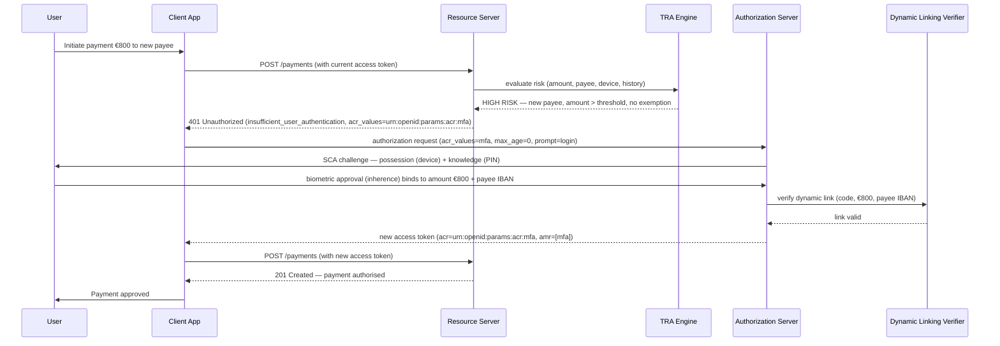

# Day 09 — SCA: Strong Customer Authentication

## Why this matters

A bank's mobile app used password-only authentication for payment approval. A credential-stuffing attack — using a list of 2 million breached credentials from unrelated data breaches — compromised 8,000 accounts in a single weekend. Each compromised password alone was enough to approve outgoing payments. The attackers transferred funds to mule accounts before the bank's fraud team detected the anomaly. Total losses: €3.2 million. Recovery: partial.

PSD2 SCA exists to make single-factor compromise insufficient. An attacker who obtains a user's password still cannot approve a payment without a second independent factor — and even if both factors are obtained, dynamic linking ensures the authentication is cryptographically bound to the specific transaction amount and payee. A passed SCA for €1 cannot be replayed for €10,000.

## Core concepts

### PSD2 RTS SCA requirements

SCA requires at least 2 of the following 3 independent factor categories:

| Category | Definition | Banking examples |
|---|---|---|
| **Possession** | Something the customer has | Mobile device with banking app, smart card, FIDO2 hardware token |
| **Knowledge** | Something the customer knows | PIN, password, passphrase, memorable answer |
| **Inherence** | Something the customer is | Fingerprint, face ID, voice recognition |

#### Factor independence

Independence means: compromise of one factor must not compromise the other.

- A PIN entered on the same device as the biometric reader — if the device is compromised, both the PIN (if stored) and the biometric reader are accessible to the attacker. PSD2 RTS requires that the factors are "independent" such that "the breach of one does not compromise the reliability of the other."
- SMS OTP + password: the SMS is delivered to the device. If the phone is compromised (SIM-swap, malware), the attacker has both the password (harvested via keylogger) and the SMS OTP. Not independent under a SIM-swap threat model.
- A dedicated FIDO2 hardware token (possession) + PIN (knowledge) — the PIN is not stored on the authenticator and the hardware token cannot be duplicated: genuinely independent.

---

### Dynamic linking

PSD2 RTS Article 5 requires that for payment transactions, the authentication code must be dynamically linked to:
- The specific **transaction amount**
- The specific **payee** (IBAN or account number)

Any change to either must invalidate the authentication.

How it works in practice:
1. The user initiates a payment: €1,000 to IBAN `<PLACEHOLDER-payee-iban>`.
2. The bank's authentication app generates a code derived from: the user's private key (possession factor) + transaction amount (`1000`) + payee IBAN.
3. The user approves (biometric or PIN is the second factor confirming intent).
4. The bank's backend verifies: compute the expected code using the stored key + the same amount + the same payee. If they match, authentication is accepted.
5. An attacker who intercepts this code cannot reuse it for a different amount or a different payee — the code is mathematically dependent on both parameters.

---

### Step-up authentication trigger

Step-up is triggered mid-session when a high-risk event occurs. The resource server or the authorization server evaluates the current session's authentication strength against the required strength for the requested operation.

Trigger conditions:
- Payment amount exceeds a threshold (e.g., > €500)
- New payee (not in the trusted beneficiary list)
- Suspicious IP or device
- User agent change mid-session
- Time since last SCA exceeds the bank's session policy

Signal from the AS or RS:

```
HTTP/1.1 401 Unauthorized
WWW-Authenticate: Bearer error="insufficient_user_authentication",
  error_description="SCA required for this transaction",
  acr_values="urn:openid:params:acr:mfa"
```

The client then re-initiates an OIDC authorization request with:
- `acr_values=urn:openid:params:acr:mfa` — required ACR level
- `max_age=0` — forces immediate re-authentication (ignores existing session)
- `prompt=login` — explicit re-authentication required

---

### SCA exemptions (PSD2 RTS Articles 10–18)

Exemptions allow a frictionless payment experience when risk is demonstrably low:

| Exemption | Conditions | Cap |
|---|---|---|
| **Low-value payments** | Single payment < €30 AND cumulative < €100 OR < 5 consecutive unauthenticated transactions | €100 cumulative or 5 transactions |
| **TRA (Transaction Risk Analysis)** | Bank's fraud rate for remote electronic payments is below RTS Annex 1 thresholds | Up to €500 per transaction |
| **Trusted beneficiary** | Payee is whitelisted by the PSU in the bank's portal | No cap, per payee |
| **Recurring transactions** | Same amount, same payee, series established with initial SCA | Exact amount must match |
| **Secure corporate payments** | Dedicated payment protocols with equivalent controls | As agreed with regulator |

TRA fraud rate thresholds (RTS Annex 1):
- Exemption up to €100: fraud rate < 0.13%
- Exemption up to €250: fraud rate < 0.06%
- Exemption up to €500: fraud rate < 0.01%

---

### Mermaid sequence diagram



## Anti-patterns / Common mistakes

**Applying TRA exemption without maintaining the required fraud rate below PSD2 thresholds**
If the bank's remote electronic payment fraud rate exceeds the RTS Annex 1 thresholds, the TRA exemption is no longer legally valid for the corresponding amount tier. Banks that continue applying the exemption after their fraud rate exceeds the limit are in violation of PSD2 RTS. The bank must monitor the fraud rate continuously and have an automated kill switch to disable TRA exemption if the threshold is exceeded.

**Using SMS OTP as a possession factor alongside a knowledge factor stored on the same device**
A user whose phone is compromised (SIM-swap attack, device malware) loses both the SMS OTP (delivered to the compromised number) and potentially the stored password (keylogged). These two factors are not independent under the SIM-swap threat model. PSD2 RTS requires independence. For regulated payment SCA, a FIDO2 hardware token or a dedicated authentication app with its own secure enclave provides genuine possession independence.

**Not implementing dynamic linking**
Passing SCA without binding the authentication to the specific transaction amount and payee is a compliance violation. An attacker who intercepts a passed SCA for a €1 test payment can attempt to replay it for a €10,000 transfer — if the authentication code is not tied to both amount and payee, the backend has no way to detect the substitution. Dynamic linking must be implemented at the cryptographic level, not just as a UI display that the user sees but the code does not verify.

## Exercises

1. A user has €25 in contactless payments so far today and attempts a €10 contactless payment. Is SCA required? What if the next attempt is a €10 bank transfer to a new payee?

   **Hint:** Apply the low-value cumulative threshold rules.

   **Solution sketch:** The contactless payment: cumulative is €25 + €10 = €35. The PSD2 RTS low-value cumulative threshold is €100 or 5 consecutive unauthenticated transactions. €35 < €100 and assuming < 5 consecutive, SCA is NOT required for the contactless payment. The bank transfer to a new payee: this does not qualify for the low-value exemption (bank transfers are not in-person contactless). TRA may apply if the bank's fraud rate qualifies. Otherwise, SCA IS required for a transfer to a new payee — the trusted beneficiary exemption does not apply because it is a new payee. The bank must prompt for SCA.

2. Explain dynamic linking with a concrete example. What field in the authentication response carries the dynamic link, and what does the bank verify on the backend?

   **Hint:** The "link" is cryptographic — a signature, not just a log entry.

   **Solution sketch:** Example: a user approves a payment of €1,000 to IBAN `<PLACEHOLDER-payee-iban>`. The bank's authentication app generates a TOTP-like code derived from: the user's device private key (possession factor) + the transaction amount (€1,000) + the payee IBAN. The code is submitted as part of the SCA response. The bank verifies: compute the expected code using the user's stored key + the same amount + the same payee. If they match, the authentication is accepted. An attacker who intercepts this code cannot use it for a different amount or payee — the dynamic link changes the code. The `amr` claim in the resulting token carries `mfa` and may carry additional claims indicating dynamic linking was performed.

3. A bank's fraud team wants to apply TRA exemption for transactions under €100. What ongoing operational requirement must they maintain, and what happens if they fail to maintain it?

   **Hint:** Check the PSD2 RTS fraud rate thresholds.

   **Solution sketch:** For TRA exemption up to €100, the bank must maintain a remote electronic payment fraud rate below 0.13% (RTS Annex 1). They must monitor this rate continuously and report it to their competent authority. If the fraud rate exceeds 0.13%, they must immediately stop applying the TRA exemption and require SCA for all transactions in that tier until the fraud rate returns to acceptable levels. Failure to do so is a PSD2 compliance violation with potential fines and supervisory action. The bank should have an automated circuit-breaker: if the rolling fraud rate crosses the threshold, TRA exemption is disabled automatically until a compliance officer manually re-enables it after confirming the rate is within bounds.

## Lab

See `labs/day09/`. Goal: trace a step-up authentication flow triggered by a high-value payment to a new payee. Success signal: you can identify the SCA trigger, the factors used, the dynamic linking mechanism in the HTTP exchange, and the difference between the initial access token and the step-up token.
