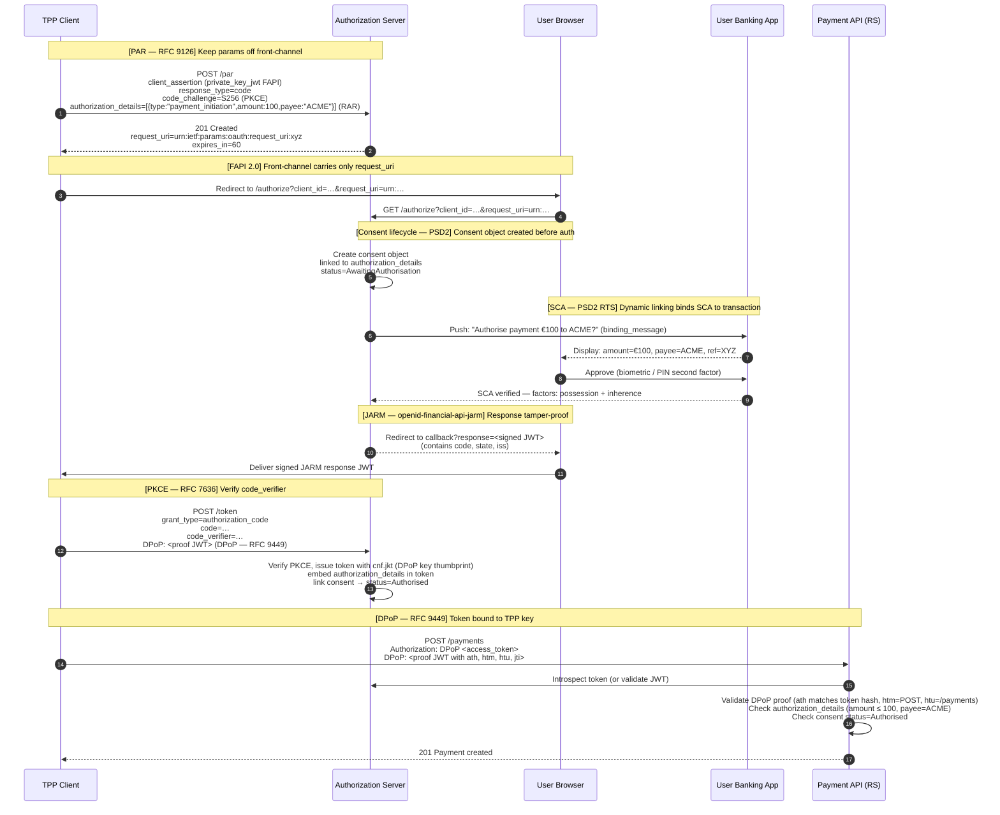
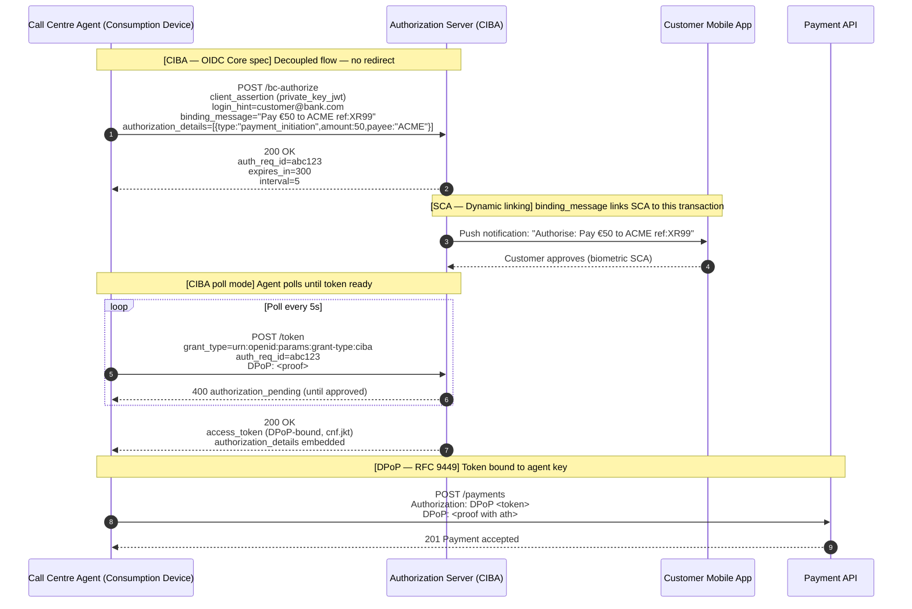

# Day 10 — Protocol Composition

## Why this matters

A European banking team spent four sprints implementing every protocol on their PSD2 compliance checklist: FAPI 2.0, PAR, RAR, CIBA, DPoP, mTLS, SCIM, consent management, and SCA. Each sprint delivered a green build and a passing integration test. On go-live, they discovered three silent failures that had never appeared in isolation:

- DPoP proofs reached the payment resource server without the `ath` (access token hash) claim, because the CIBA token endpoint team used a different DPoP library version than the payments team — each was technically compliant, but the RS rejected every CIBA-issued token silently and fell back to accepting plain Bearer tokens.
- Consent records were never linked to `authorization_details` from the RAR flow. The consent store held generic `"payment_initiation"` consents; the RS had no way to enforce the amount limit and payee restriction the TPP had put in the authorization request.
- When a defrauded customer was deactivated via the SCIM endpoint, their active access tokens kept working for 57 minutes until the JWT expiry. Three unauthorized transactions cleared in that window.

These were not bugs in individual protocols. Every protocol was implemented correctly. The failures lived at the *composition layer* — the points where one protocol hands off state to another. This day maps every handoff point so you can build systems where the protocols reinforce each other instead of silently undermining each other.

---

## Core concepts

### Scenario 1: Customer-facing PSD2 payment initiation

The complete protocol stack for a TPP-initiated single payment combines eight protocols in a single flow. Understanding the order of operations and the data dependencies between them is the core skill this day develops.

**Full stack:** PAR + PKCE + RAR (`payment_initiation`) + FAPI 2.0 client auth (`private_key_jwt`) + JARM + PSD2 consent lifecycle + SCA dynamic linking + DPoP or mTLS token binding.

**Grand composite sequence diagram:**

**Data dependencies to remember:**
- `authorization_details` originates in the PAR body → flows into consent record → embedded in access token claims → enforced by RS
- PKCE `code_challenge` must match `code_verifier` at token endpoint — prevents code interception even if PAR `request_uri` leaks
- JARM response is a signed JWT — TPP must verify `iss`, `aud`, `exp` before extracting `code`
- DPoP `ath` = base64url(SHA-256(access_token)) — must be recomputed per token issuance, not reused

---

### Scenario 2: Headless banking server (no browser)

When there is no browser or redirect available — call centre agent, backend batch, mobile-to-mobile — CIBA replaces the front-channel entirely. The SCA dynamic linking still applies, but via a `binding_message` displayed on the consumption device.

**Protocol stack:** CIBA (poll or push mode) + `binding_message` (SCA dynamic linking) + SCA factors on mobile app + `auth_req_id` + token bound with DPoP or mTLS.

**Key interaction rule:** The `binding_message` value displayed on the consumption device and sent in `/bc-authorize` is the SCA dynamic linking mechanism for CIBA. It must include enough information (amount, payee, reference) for the authorising user to distinguish this transaction from any other. Omitting it or using a generic message breaks SCA compliance.

---

### Scenario 3: B2B partner API access

When a partner institution — not an individual user — accesses the bank API, the flow drops user-facing protocols and focuses on institution-level identity, provisioning, and authorization.

**Protocol stack:** SCIM provisioning (user federation from partner IdP) + mTLS client auth (institution-level, PKI-backed) + RAR (`account_information` with partner scope) + institution-level consent / contract authorization.

**Flow summary:**

1. Partner institution enrolls via SCIM: `POST /scim/v2/Users` bulk-provisions their employees. SCIM groups map to authorization scopes.
2. Institution authenticates to token endpoint with mTLS (`tls_client_auth`). No user, no redirect — client credentials grant.
3. Token request includes `authorization_details` specifying `account_information` with the partner's allowed accounts.
4. RS validates mTLS certificate thumbprint (`cnf.x5t#S256` in token) and checks `authorization_details` against the partner's contract.

**Key interaction rule:** When a SCIM `PATCH active=false` deactivates a user at the partner institution, the bank's SCIM consumer must trigger consent revocation for all active consent records associated with that user. Failure to implement this cascading revocation leaves the user with access despite deprovisioning — this was the third failure in the opening scenario.

---

### Protocol interaction rules

These rules describe the handoff points where protocols exchange state. Getting them wrong produces the silent failures described in the opening scenario.

| Handoff | Rule |
|---------|------|
| PAR → consent | `authorization_details` from the PAR body must be stored in the consent record verbatim — do not summarise or normalise |
| Consent → access token | `authorization_details` from the consent must be embedded in the access token claims (or referenced via `jti` introspection) |
| Access token → DPoP proof | DPoP `ath` must be `base64url(SHA-256(access_token))` — recomputed per token, not reused across CIBA/PAR tokens |
| CIBA + DPoP | CIBA token endpoint must issue DPoP-bound tokens when `DPoP` header is present — same rules as PAR/code flow |
| SCIM deprovision → consent | `PATCH active=false` must trigger revocation of all active consent records for that `subject` |
| SCIM deprovision → tokens | Active access tokens must be added to the revocation list (or JTI blocklist) at deprovision time |
| SCA → consent | Dynamic linking applies to the consent authorisation step, not the token issuance step — the `binding_message` or displayed transaction details must match the `authorization_details` |
| mTLS + DPoP coexistence | mTLS at transport layer, DPoP at application layer — both can be required simultaneously (belt + suspenders); mTLS validates client identity, DPoP prevents token replay at the API call level |

### Protocol decision tree

Reference `content/appendices/PROTOCOL_DECISION_TREE.md` for the full decision matrix covering browser availability, caller type (human user vs. institution), and token scope.

---

## Anti-patterns / Common mistakes

**Implementing protocols in isolation without integration testing**
Each team writes passing unit tests and integration tests for their protocol surface. The PAR team tests PAR. The consent team tests consent. Nobody tests the PAR → consent → token → RS chain end-to-end until UAT. The interaction bugs only appear when the complete flow runs, and by then the fix is expensive. Mitigation: write a single end-to-end scenario test that covers all eight protocols in sequence from day one, even if it fails initially.

**Forgetting to propagate `authorization_details` from PAR → consent → token → RS**
Any break in the `authorization_details` chain makes the RS unable to enforce payment limits or account restrictions. Common breaks: consent store normalises `authorization_details` to a string; token endpoint omits `authorization_details` claim to reduce JWT size; RS reads scope instead of `authorization_details`. Mitigation: treat `authorization_details` as a first-class claim that flows through the entire chain verbatim.

**Applying SCA exemptions without checking consent type**
The TRA (Transaction Risk Analysis) exemption applies to Account Information Services (AIS) under certain fraud thresholds. It does not apply to Payment Initiation Services (PIS) for payments above the low-value threshold. Teams that implement a generic exemption engine without checking `authorization_details.type` incorrectly grant TRA exemptions to high-value payments. Mitigation: exemption logic must read `authorization_details.type` (`account_information` vs. `payment_initiation`) before applying any SCA exemption.

**Reusing DPoP proofs across different access tokens**
DPoP proofs contain `ath` (access token hash). A proof generated for a CIBA-issued token cannot be reused with a PAR/code-flow-issued token, even for the same client and endpoint, because the token values differ and `ath` will not match. Teams that share DPoP proof generation code across grant types sometimes cache and reuse proofs incorrectly. Mitigation: DPoP proofs must be generated fresh for each access token, not per client or per session.

---

## Exercises

1. A TPP initiates a payment via CIBA (call centre scenario). List the protocols involved in order, from the bank server's POST to `/bc-authorize` to the resource server accepting the payment.

   **Hint:** CIBA → token → payment API call with token binding.

   **Solution sketch:** (1) POST `/bc-authorize` with `login_hint`, `binding_message`, `authorization_details` (payment_initiation). (2) Receive `auth_req_id`. (3) User authenticates on mobile with SCA — dynamic linking binds SCA approval to amount + payee from `authorization_details` displayed via `binding_message`. (4) Poll or push delivers access token with DPoP `cnf.jkt` and embedded `authorization_details`. (5) POST to Payments API with `Authorization: DPoP <access_token>` + fresh DPoP proof (containing `ath`, `htm`, `htu`, `jti`). (6) RS introspects or validates JWT, validates DPoP proof (`ath` matches token hash, `htm=POST`, `htu=/payments`, `jti` not replayed), checks `authorization_details` against request body. (7) 201 Payment accepted.

2. A bank's operations team deactivates a user in the identity store via SCIM `PATCH active=false`. What downstream effects must the system trigger automatically?

   **Hint:** Think about active tokens, active consents, and active CIBA requests.

   **Solution sketch:** (1) Revoke all active access tokens for that user — add JTIs to revocation list (or call token revocation endpoint per RFC 7009). (2) Revoke all active consent records — set status to `revokedByAspsp` and record `revokedAt` timestamp. (3) Cancel any in-flight `auth_req_id` in CIBA poll mode — return `access_denied` to any poller for that user's `auth_req_id`. (4) Notify TPPs with active consents via webhook if the bank's open banking platform supports notification. (5) Update SCIM user record with `active=false`. Missing any of these leaves the user with active access despite deprovisioning — the bank may face regulatory liability for unauthorized access post-deactivation.

3. A bank must decide between DPoP and mTLS for token binding in its open banking platform. List two reasons to prefer mTLS and two reasons to prefer DPoP for this context.

   **Hint:** Think about infrastructure, TPP variety, and key management.

   **Solution sketch:** mTLS advantages: (1) Binding at transport layer — no application-level changes needed on the RS; the TLS stack enforces it automatically. (2) PKI chain validates TPP identity via CA — the bank can verify the TPP's regulatory certificate (eIDAS QWAC or QSEAL) as part of the handshake. DPoP advantages: (1) Works through TLS-terminating proxies where the mTLS client certificate is not forwarded — common in cloud API gateways (AWS API Gateway, Azure APIM, Kong) that terminate TLS before the RS. (2) TPPs can rotate application keys without CA re-issuance — a new asymmetric key pair is generated and the new public key thumbprint appears in the next token request. In practice: FAPI 2.0 allows either; many banks use mTLS for institutional clients (with PKI-enrolled regulatory certificates) and DPoP for smaller TPPs using cloud infrastructure without PKI.

---

## Lab

See `labs/day10/`. Goal: complete the composite flow checklist for a PSD2 payment scenario, identifying which protocol handles which security property. Success signal: you can trace a full payment flow end-to-end and name the protocol responsible for each security guarantee without referring back to Days 01–09.
