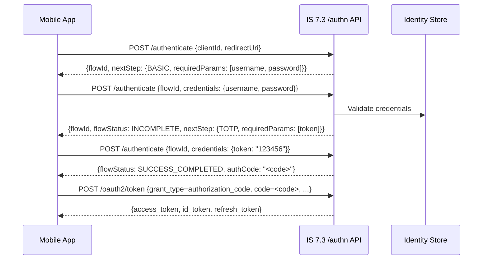

# Day 11 — App-Native Authentication

## Why this matters
A bank's mobile app team built a native iOS app that needed two-step authentication: username/password
then OTP. Their only option was to open an in-app browser to the IS 7.3 login page. The bank's design
team rejected the redirect: it broke the native UX, triggered app-store policy warnings about leaving
the app, and the default IS login page didn't match the bank's design system. IS 7.3's App-Native Auth
API (`/authn`) eliminates the redirect: the mobile app drives each authentication step via REST,
collecting credentials in native UI, without a browser ever opening.

## Core concepts

### The redirect problem
Standard OAuth2 requires a browser redirect to the authorization server's login page. For mobile
banking apps, this breaks native UX and prevents custom credential collection flows.

### IS 7.3 App-Native Auth API
IS 7.3 exposes a REST authentication API at `/api/identity/auth/v1.0/authenticate`. The flow:

1. **Initiate**: `POST /api/identity/auth/v1.0/authenticate` with `clientId` → IS 7.3 returns a `flowId`
   (session handle) and the first `nextStep` (e.g., `BASIC` for username/password)
2. **Step 1**: `POST /api/identity/auth/v1.0/authenticate` with `flowId` + step credentials →
   IS 7.3 validates, returns next step or `SUCCESS` / `FAIL`
3. **Step 2+**: Repeat until `SUCCESS` → IS 7.3 returns an authorization code
4. **Token exchange**: Client exchanges the code at `/oauth2/token` using standard authorization_code grant

### Stateful auth session model
IS 7.3 maintains a server-side auth session identified by `flowId`. Each step response carries:
- `flowStatus`: `INCOMPLETE` (more steps needed) | `SUCCESS_COMPLETED` | `FAIL_INCOMPLETE`
- `nextStep`: object describing the next authenticator (`authenticatorId`, `requiredParams`)
- `authData`: accumulated claims from completed steps

### Step types
IS 7.3 supports these step types via the native API:
- `BASIC`: username + password
- `TOTP`: time-based OTP (Google Authenticator compatible)
- `SMS_OTP`: SMS one-time passcode
- `EMAIL_OTP`: email OTP
- `FIDO2`: WebAuthn assertion (passkey)

### Console flow builder
IS 7.3's Console provides a visual step builder where admins define the authentication flow
(which authenticators, in what order, with which fallbacks). The App-Native API executes
whichever flow is configured for the application — the mobile app just drives steps.



## WSO2 IS 7.3 mapping

### Enabling App-Native Auth for an application
In IS 7.3 Console → Applications → [Your App] → Sign-in Method:
1. Toggle "App-Native Authentication" to enabled.
2. Define authentication steps (e.g., Step 1: Basic, Step 2: TOTP).
3. The application's `client_id` is used to initiate the flow.

`deployment.toml` (no special flag needed — enabled per-app in Console):
```toml
# App-Native Auth is enabled per-application in the Console, not globally in deployment.toml
# Ensure the REST API authentication endpoint is accessible:
[server]
enable_authentication_rest_api = true
```

### Initiation request
```http
POST /api/identity/auth/v1.0/authenticate HTTP/1.1
Host: <PLACEHOLDER: is-host>
Content-Type: application/json

{
  "clientId": "<PLACEHOLDER: app-client-id>",
  "redirectUri": "https://banking.example.com/callback",
  "responseType": "code",
  "scope": "openid accounts",
  "pkce": {
    "challenge": "<PLACEHOLDER: base64url(sha256(code_verifier))>",
    "challengeMethod": "S256"
  }
}
```

Response:
```json
{
  "flowId": "<PLACEHOLDER: server-generated-uuid>",
  "flowStatus": "INCOMPLETE",
  "nextStep": {
    "stepType": "MULTI_OPTIONS_PROMPT",
    "authenticators": [
      {
        "authenticatorId": "BasicAuthenticator",
        "authenticator": "Username & Password",
        "idp": "LOCAL",
        "requiredParams": ["username", "password"]
      }
    ]
  }
}
```

### Credential submission
```http
POST /api/identity/auth/v1.0/authenticate HTTP/1.1
Host: <PLACEHOLDER: is-host>
Content-Type: application/json

{
  "flowId": "<PLACEHOLDER: flowId-from-initiation>",
  "selectedAuthenticator": {
    "authenticatorId": "BasicAuthenticator",
    "params": {
      "username": "<PLACEHOLDER: user@example.com>",
      "password": "<PLACEHOLDER: password>"
    }
  }
}
```

## Anti-patterns / Common mistakes
- **Caching the `flowId` across sessions** — `flowId` is single-use for one authentication attempt;
  a new initiation must generate a new `flowId`. Reusing a completed `flowId` returns 400.
- **Submitting all credentials in step 1** — the API is step-by-step; submit only the current
  step's `requiredParams`. Extra params are ignored; missing params cause `FAIL_INCOMPLETE`.
- **Not handling `FAIL_INCOMPLETE` for retry** — the flow allows retry within the same `flowId` if
  `flowStatus=FAIL_INCOMPLETE`; the app should prompt the user again rather than restarting the flow.

## Exercises
1. A mobile app calls `POST /api/identity/auth/v1.0/authenticate` and gets `flowStatus: INCOMPLETE`
   with `nextStep.stepType: MULTI_OPTIONS_PROMPT` listing two authenticators: `BasicAuthenticator`
   and `GoogleAuthenticator`. Which `authenticatorId` should it submit, and what params does it need?
   **Hint:** The `requiredParams` array in each authenticator object tells you exactly what to collect.
   **Solution sketch:** The app should present both options to the user. If the user picks `BasicAuthenticator`,
   submit `{flowId, selectedAuthenticator: {authenticatorId: "BasicAuthenticator", params: {username, password}}}`.
   If the user picks `GoogleAuthenticator`, IS 7.3 will return an `idpRedirectUri` for the Google OAuth
   redirect — the app opens the in-app browser only for federated IdPs, not for local steps.

2. A bank wants the App-Native API flow to also request payment-initiation scope with
   `authorization_details`. How does `authorization_details` enter the flow?
   **Hint:** The initiation step is where all OAuth2 request parameters go.
   **Solution sketch:** Add `authorization_details` (URL-encoded JSON array) to the initiation
   `POST /authenticate` request body alongside `clientId`, `scope`, and `pkce`. IS 7.3 stores it
   in the auth session and includes it in the issued authorization code, which the client then
   exchanges at `/oauth2/token`. The resulting access token carries `authorization_details`.

3. IS 7.3 returns `flowStatus: FAIL_INCOMPLETE` with `failureReason: "INVALID_CREDENTIALS"` on
   step 1. The mobile app should allow the user to retry. What must the app send on the retry?
   **Hint:** The `flowId` is still valid for retry.
   **Solution sketch:** The app presents the error to the user ("Incorrect username or password")
   and sends the same `flowId` with corrected credentials. The flow continues from step 1 — no new
   initiation needed. If `flowStatus: FAIL_COMPLETED` is returned instead (e.g., account locked),
   retry is not possible and the app must restart with a new initiation call.

## Lab
See `labs/day11/`. Goal: trace the App-Native Auth API HTTP exchange from initiation to auth code.
Success signal: you can identify `flowId`, each step's `nextStep` object, and the final auth code
without referring to IS 7.3 documentation.
