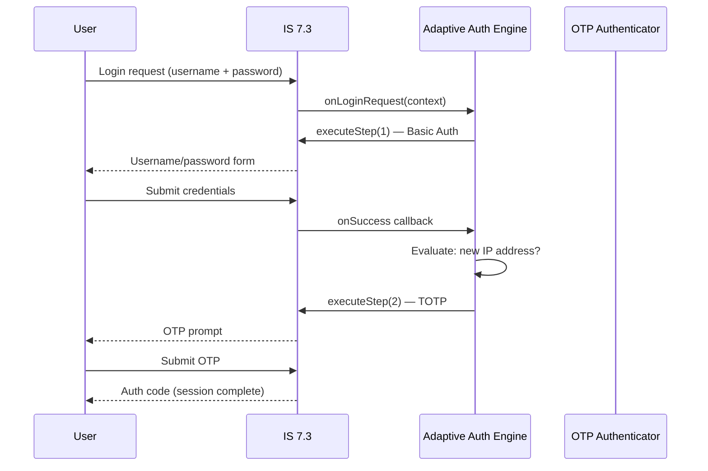

# Day 12 — Adaptive Authentication

## Why this matters
A bank deployed IS 7.3 with single-factor authentication (username + password) for its online banking
portal. A credential stuffing attack hit 4,000 accounts in one night — the attacker had a list of
valid usernames and passwords from a third-party breach and logged in from a data centre IP block. IS 7.3's
adaptive auth script could have detected the anomaly (new IP, new device, high-velocity logins) and
inserted an OTP step for those sessions — silently blocking the attack without affecting legitimate users.
The bank's mistake was treating authentication as binary (pass/fail) rather than risk-scored.

## Core concepts

### The adaptive auth model
IS 7.3's adaptive auth engine runs a JavaScript policy script on every authentication request.
The script receives the `context` object (request metadata, user history, completed steps) and
decides which steps to execute by calling `executeStep()`. If no condition triggers, the default
flow runs.

### The `context` object
Key `context` properties available in every script:
- `context.request.ip` — client IP address
- `context.request.headers` — HTTP headers (User-Agent, etc.)
- `context.request.params` — OAuth2 request params
- `context.steps[N].subject` — subject returned by step N (null if not yet executed)
- `context.steps[N].idp` — IdP used in step N
- `context.currentKnownSubject` — the authenticated user (set after a successful step)
- `context.lastAuthenticatedUser.logins` — recent login history

### `executeStep(stepNumber, options)`
Triggers an authentication step. `options`:
- `onSuccess`: callback `{function}` called when step succeeds
- `onFail`: callback `{function}` called when step fails
- `authenticatorParams`: extra params to pass to the authenticator

Steps are numbered as configured in the Console flow builder. Step 1 is always executed first
(as the initiating step); `executeStep` adds conditional steps.

### Risk signals available
IS 7.3 provides built-in functions for risk scoring:
- `getUserAgent(context)` — parsed user-agent object
- `isMemberOfRole(user, 'roleName')` — role check
- `getLastLoginTime(user)` — timestamp of last login
- `getLoginAttemptsByUser(user, startTime, endTime)` — login history
- `resolveIpCountry(ip)` — geolocation (requires GeoIP module)

### Example: step-up for new IP
```javascript
var onLoginRequest = function(context) {
    executeStep(1, {
        onSuccess: function(context) {
            var user = context.steps[1].subject;
            var lastLoginIP = getLastLoginTime(user); // simplified: use stored IP
            if (context.request.ip !== user.localClaims['http://wso2.org/claims/lastLoginIP']) {
                executeStep(2); // insert OTP step for unfamiliar IP
            }
        }
    });
};
```

### Example: role-based step-up
```javascript
var onLoginRequest = function(context) {
    executeStep(1, {
        onSuccess: function(context) {
            var user = context.steps[1].subject;
            if (isMemberOfRole(user, 'payment-approvers')) {
                executeStep(2); // always require OTP for payment approvers
            }
        }
    });
};
```



## WSO2 IS 7.3 mapping

### Deploying an adaptive auth script
In IS 7.3 Console → Applications → [App] → Sign-in Method:
1. Enable "Advanced" mode.
2. Define base steps (Step 1: Basic, Step 2: TOTP).
3. Paste JavaScript policy into the "Script Editor".
4. Click "Update". IS 7.3 compiles the script server-side.

No `deployment.toml` change needed for the script engine itself. To enable geolocation:
```toml
[authentication.adaptive]
enable_geo_ip = true
geo_ip_database_path = "<PLACEHOLDER: /path/to/GeoLite2-Country.mmdb>"
```

### Script editor constraints
- Scripts run synchronously in the IS 7.3 auth engine — no async/await, no I/O.
- Maximum script execution time: 200ms (configurable in `deployment.toml`).
- IS 7.3 provides only the built-in functions above; no external HTTP calls from scripts.
- User claims are accessible via `user.localClaims['http://wso2.org/claims/<claimURI>']`.

### deployment.toml — adaptive auth settings
```toml
[authentication.adaptive]
# Maximum time (ms) a script may run before IS 7.3 terminates it
script_execution_timeout = 200

# Allow scripts to read user's last login IP (stored as a user claim)
enable_last_login_time_claim = true

# Activate Nashorn JavaScript engine (default; Graal.js available as alternative)
js_engine = "Nashorn"
```

## Anti-patterns / Common mistakes
- **Calling `executeStep` outside a callback** — `executeStep` is only valid inside `onSuccess`/`onFail`
  callbacks; calling it at the top level (outside `onLoginRequest`) throws a runtime error.
- **Using `context.request.ip` for geofencing without a VPN signal** — enterprise users on VPN
  show the VPN exit IP, triggering false positives; combine IP with device fingerprint.
- **Making the adaptive auth script stateful across requests** — the script has no persistent state;
  use user claims (via IS 7.3's claim management) to store risk signals like last-login-IP.

## Exercises
1. Write an adaptive auth script that requires OTP (Step 2) only for users in the `payment-approvers`
   role, and allows all other users through with just Step 1.
   **Hint:** Use `isMemberOfRole(user, 'payment-approvers')` after Step 1 succeeds.
   **Solution sketch:**
   ```javascript
   var onLoginRequest = function(context) {
       executeStep(1, {
           onSuccess: function(context) {
               var user = context.steps[1].subject;
               if (isMemberOfRole(user, 'payment-approvers')) {
                   executeStep(2);
               }
           }
       });
   };
   ```
   This triggers Step 2 (TOTP) only for payment approvers. Other users complete auth after Step 1.

2. An adaptive auth script correctly triggers Step 2 for new-IP logins. A tester reports that every
   login from their laptop triggers the OTP step, even after the first login. Why, and how do you fix it?
   **Hint:** How does the script know the "last login IP"?
   **Solution sketch:** The script is comparing `context.request.ip` against a user claim that is
   never being updated after a successful login. To fix: in the `onSuccess` callback after Step 2,
   update the user's `lastLoginIP` claim: `user.localClaims['http://wso2.org/claims/lastLoginIP'] = context.request.ip`.
   IS 7.3 persists the claim if the script handler calls the claim update API (via Identity Event handler
   or a post-authentication handler that updates claims). Pure script execution alone cannot persist claims —
   a separate event handler or `executeScript` with claim update is needed.

3. A bank wants the adaptive auth script to deny login entirely (not just add a step) when the user's
   account has been flagged for fraud. How would you implement this in IS 7.3?
   **Hint:** IS 7.3 provides `fail()` function in adaptive auth scripts.
   **Solution sketch:** After Step 1 succeeds, check a user claim `isFraudFlagged`:
   ```javascript
   onSuccess: function(context) {
       var user = context.steps[1].subject;
       if (user.localClaims['http://wso2.org/claims/isFraudFlagged'] === 'true') {
           fail(); // terminates the flow with authentication failure
       } else {
           // normal flow continues
       }
   }
   ```
   `fail()` with no arguments returns a generic error to the client. `fail({errorCode: "ACCOUNT_BLOCKED",
   errorMessage: "Account suspended"})` returns structured error info.

## Lab
See `labs/day12/`. Goal: read the adaptive auth script and trace which steps execute for four
user scenarios (low-risk user, payment approver, new IP, fraud-flagged). Success signal: you can
predict the step sequence for each scenario before running it.
