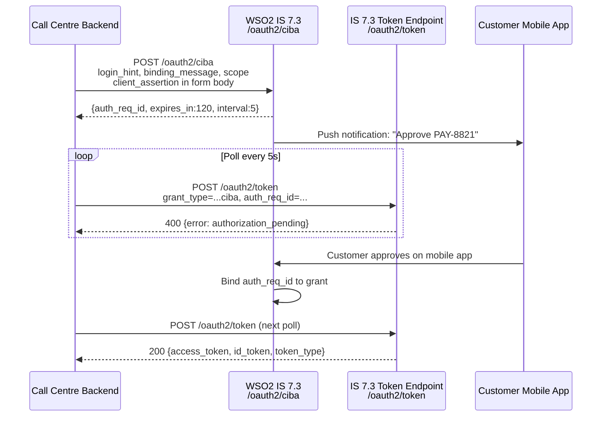
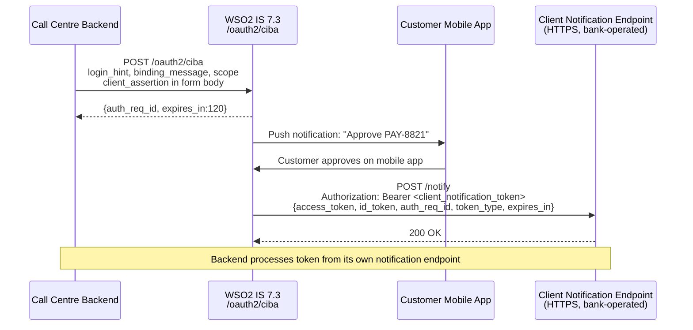

# Day 14 — CIBA in IS 7.3

## Why this matters

A bank deployed IS 7.3 CIBA for its call-centre payment authorisation flow with 1,200 concurrent agents.
Poll mode was chosen because it was the default — no one registered a `client_notification_endpoint`
in the IS 7.3 application settings, so IS 7.3 silently fell back to poll mode. After six months, the
operations team noticed load spikes on the token endpoint every weekday at 10am and 2pm — exactly
peak call-centre hours. Investigation revealed 1,200 goroutines each calling `POST /oauth2/token`
every 5 seconds: ~14,400 req/min sustained. IS 7.3 started returning `slow_down` errors, which doubled
polling intervals, but the goroutine pool did not shrink — it just slowed. The fix was registering an
HTTPS `client_notification_endpoint` in the IS 7.3 application config, switching to push mode, and
eliminating polling entirely. Token endpoint load dropped to the actual approval rate: ~30 req/min.

## Core concepts

### IS 7.3 CIBA endpoint

IS 7.3 exposes the backchannel authentication endpoint at:

```
POST /oauth2/ciba
```

(Some IS versions also expose `/oauth2/bc-authorize`; the canonical path in IS 7.3 is discoverable
via the OIDC metadata endpoint at `/.well-known/openid-configuration` under the key
`backchannel_authentication_endpoint`.)

The request is a standard `application/x-www-form-urlencoded` POST. Client authentication uses
`private_key_jwt` — the assertion goes in the **form body**, not in an Authorization header:

```
POST /oauth2/ciba HTTP/1.1
Host: identity.bank.com
Content-Type: application/x-www-form-urlencoded

scope=openid%20payments
&login_hint=customer%40bank.com
&binding_message=PAY-8821
&authorization_details=%5B%7B%22type%22%3A%22payment_initiation%22%7D%5D
&client_assertion_type=urn%3Aietf%3Aparams%3Aoauth%3Aclient-assertion-type%3Ajwt-bearer
&client_assertion=<PLACEHOLDER: jwt_signed_with_client_private_key>
```

IS 7.3 responds with:

```json
{
  "auth_req_id": "<PLACEHOLDER: opaque_request_id>",
  "expires_in": 120,
  "interval": 5
}
```

### `auth_req_id` lifecycle in IS 7.3

IS 7.3 stores the `auth_req_id` in its server-side session store (backed by the Carbon registry or an
external RDBMS, depending on deployment configuration). The lifecycle is:

1. **Created**: when IS 7.3 processes the `POST /oauth2/ciba` request and validates the client and login hint.
2. **Pending**: user has not yet responded; IS 7.3 returns `authorization_pending` on token polls.
3. **Approved**: user completed consent on their enrolled device; IS 7.3 binds the auth_req_id to the authorization grant.
4. **Consumed**: a token has been issued (poll mode) or delivered (push mode); the auth_req_id cannot be reused.
5. **Expired**: `expires_in` elapsed without user response; IS 7.3 returns `expired_token` on subsequent polls.

The expiry is controlled by `ciba_auth_req_expiry_seconds` in `deployment.toml`.

### Poll mode vs. push mode configuration

**Poll mode** (default): no `client_notification_endpoint` registered in the IS 7.3 application.
IS 7.3 holds the grant internally until the client polls `POST /oauth2/token`.

```
POST /oauth2/token HTTP/1.1
Content-Type: application/x-www-form-urlencoded

grant_type=urn%3Aopenid%3Aparams%3Agrant-type%3Aciba
&auth_req_id=<PLACEHOLDER: auth_req_id_from_ciba_response>
&client_assertion_type=urn%3Aietf%3Aparams%3Aoauth%3Aclient-assertion-type%3Ajwt-bearer
&client_assertion=<PLACEHOLDER: jwt_signed_with_client_private_key>
```



**Push mode**: `client_notification_endpoint` registered as an HTTPS URL in the IS 7.3 application settings
AND delivery mode set to `push` in the IS 7.3 application configuration. IS 7.3 POSTs tokens directly
to the endpoint on user approval — no polling required.



### Consent portal integration in IS 7.3

When IS 7.3 processes a CIBA request, it triggers the consent portal on the user's registered
authentication device. The consent portal displays:

- The application name and logo
- The requested scopes
- The `binding_message` value — IS 7.3 passes this directly to the consent portal template
- The `authorization_details` object (if RAR is used)

IS 7.3 sends a push notification to the user's enrolled device through its configured push
notification channel (FCM/APNs, configurable via IS 7.3 push notification provider settings).
The user's IS 7.3 Authenticator app (or a custom authenticator using the IS 7.3 mobile SDK)
receives the push, displays the consent portal, and sends the approval/rejection back to IS 7.3.

## WSO2 IS 7.3 mapping

### `deployment.toml` — CIBA global configuration

```toml
# deployment.toml — CIBA global settings
# File location: <IS_HOME>/repository/conf/deployment.toml

[oauth.ciba]
# Enable the CIBA grant type globally
enabled = true

# Seconds an auth_req_id remains valid before expiring (default: 120)
# Tune based on how long users typically take to respond on mobile
ciba_auth_req_expiry_seconds = 120

# Minimum polling interval (seconds) for poll mode clients
ciba_auth_req_id_poll_interval = 5

# Push mode: IS 7.3 will retry delivering tokens to client_notification_endpoint
# on failure; set retry count here
# ciba_push_delivery_retry_count = 3
```

### IS 7.3 application-level CIBA configuration

Enable CIBA at the application level in IS 7.3 Console:

1. Navigate to **Applications** → select your application → **Protocol** tab → **CIBA** section.
2. Set **Token Delivery Mode**:
   - `poll` — no notification endpoint needed; client polls token endpoint
   - `push` — IS 7.3 delivers tokens to the notification endpoint on approval
3. Set **Client Notification Endpoint** (required for push mode): must be an HTTPS URL reachable by IS 7.3.
4. Set **Authentication Request Expiry** (seconds).

Equivalent via IS 7.3 Management REST API:

```
PATCH /api/server/v1/applications/<APP_ID>
Content-Type: application/json
Authorization: Bearer <PLACEHOLDER: admin_token>

{
  "inboundProtocolConfiguration": {
    "oidc": {
      "cibaParameters": {
        "enabled": true,
        "deliveryMode": "push",
        "clientNotificationEndpoint": "https://backend.bank.com/ciba/notify",
        "authRequestExpirySeconds": 120
      }
    }
  }
}
```

### Poll-mode token request (annotated)

```
POST /oauth2/token HTTP/1.1
Host: identity.bank.com
Content-Type: application/x-www-form-urlencoded

# CIBA-specific grant type (full URN required — do not abbreviate)
grant_type=urn%3Aopenid%3Aparams%3Agrant-type%3Aciba

# Opaque ID returned by POST /oauth2/ciba
&auth_req_id=<PLACEHOLDER: auth_req_id_value>

# private_key_jwt client authentication — form body, NOT Authorization header
&client_assertion_type=urn%3Aietf%3Aparams%3Aoauth%3Aclient-assertion-type%3Ajwt-bearer
&client_assertion=<PLACEHOLDER: client_jwt>
```

### Push-mode delivery from IS 7.3 to notification endpoint

When push mode is configured and the user approves, IS 7.3 sends:

```
POST https://backend.bank.com/ciba/notify HTTP/1.1
Content-Type: application/json

# IS 7.3 authenticates itself to the notification endpoint using this token
# The client must validate this token before accepting the payload
Authorization: Bearer <PLACEHOLDER: client_notification_token>

{
  "auth_req_id": "<PLACEHOLDER: auth_req_id_value>",
  "access_token": "<PLACEHOLDER: issued_access_token>",
  "token_type": "Bearer",
  "expires_in": 3600,
  "id_token": "<PLACEHOLDER: id_token_jwt>"
}
```

The notification endpoint MUST validate the `Authorization: Bearer` token before trusting the payload.
The `client_notification_token` was issued by IS 7.3 and is tied to the specific auth_req_id.

## Anti-patterns / Common mistakes

- **Polling at a fixed 5s interval regardless of `slow_down` response**: The CIBA spec and IS 7.3 both require
  that on receiving `slow_down`, the client adds the current `interval` value to its wait before the next
  poll, and uses the new (longer) interval permanently for that session. A client that ignores `slow_down`
  and continues at 5s creates an escalating load — IS 7.3 keeps returning `slow_down`, but the client
  never backs off. At call-centre scale, this saturates the token endpoint within minutes.

- **Registering `client_notification_endpoint` as an HTTP URL**: IS 7.3 enforces HTTPS for the push
  notification endpoint. An HTTP endpoint is rejected at application registration time with a validation
  error. Even if it were accepted, delivering tokens over plain HTTP exposes them to interception — the
  push notification contains the actual access token, unlike ping mode where it contains only the
  `auth_req_id`.

- **Not validating `client_notification_token` at the push notification endpoint**: IS 7.3 sends
  `Authorization: Bearer <client_notification_token>` when posting to the endpoint. If the endpoint
  accepts any POST without validating this token, an attacker who discovers the endpoint URL can inject
  forged token responses — causing the backend to process fraudulent approvals. The notification endpoint
  must verify the token with IS 7.3 introspection before acting on the payload.

## Exercises

1. You are configuring IS 7.3 CIBA for push mode. The `deployment.toml` file has `[oauth.ciba] enabled = true`.
   What additional change must you make in IS 7.3 Console (or the Management API) to switch from poll to
   push mode?

   **Hint:** The global `deployment.toml` enables the grant type; the delivery mode and notification URL
   are configured per-application in IS 7.3 Console.

   **Solution sketch:** Two application-level fields must be set: (1) set **Token Delivery Mode** to `push`
   (instead of the default `poll`) in the application's CIBA configuration; (2) provide a valid HTTPS URL
   in **Client Notification Endpoint**. Without both, IS 7.3 falls back to poll mode. The `deployment.toml`
   change only enables CIBA globally — it does not set delivery mode.

2. A CIBA poll loop receives `error: slow_down` when polling IS 7.3. The current polling interval is 5s.
   `expires_in` was 120s in the original response and 40s have elapsed. What interval should the next poll
   use, and approximately how many remaining polls are possible before expiry?

   **Hint:** `slow_down` means add `interval` seconds to the current wait. Remaining time = 120 - 40 = 80s.
   New interval = 5 + 5 = 10s.

   **Solution sketch:** New interval = 5 (current) + 5 (interval value from original response) = 10s. With
   80s remaining and 10s between polls, approximately 8 polls are possible before `auth_req_id` expires.
   If `slow_down` is returned again, the interval becomes 15s. The backing-off behaviour is intentional —
   it naturally throttles pollers that are aggressive without requiring IS 7.3 to block clients.

3. A bank's call-centre backend sends `POST /oauth2/ciba` with `login_hint=customer@bank.com`. IS 7.3 returns
   `error: unknown_user_id`. The user exists in IS 7.3 but their username is `cust_00193847` (not their email).
   What hint parameter should the call-centre app use instead, and how should the bank resolve this long-term?

   **Hint:** `login_hint` resolves against IS 7.3 username by default. For email-based lookup, `login_hint_token`
   carries a signed JWT with an `email` claim.

   **Solution sketch:** Short-term: use `login_hint_token` — a JWT signed by the client containing
   `{"sub": "customer@bank.com", "hint_type": "email"}` (or similar claim set per IS 7.3's login hint
   token validator configuration). IS 7.3 resolves the user via the `email` attribute rather than username.
   Long-term: configure IS 7.3 user store to allow email-as-username, or maintain a lookup index mapping
   customer emails to IS 7.3 usernames for hint construction.

## Lab

See `labs/day14/`. Goal: configure IS 7.3 CIBA in both poll and push mode using the annotated TOML.
Success signal: you can identify the three configuration changes needed to switch a working poll-mode
setup to push mode without breaking the `auth_req_id` lifecycle.
