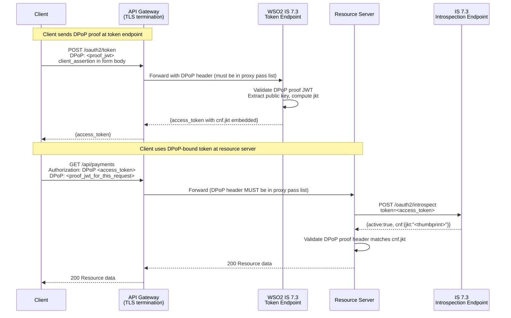

# Day 15 — DPoP + mTLS in IS 7.3

## Why this matters

A bank's API gateway terminated TLS for all external traffic, then forwarded requests to IS 7.3 over
plain HTTP on the internal network. The security team had correctly enabled DPoP token binding in IS 7.3
(`deployment.toml`) and the mobile clients were sending `DPoP:` proof headers. Tokens were being issued
with `cnf.jkt` (DPoP key thumbprint) embedded. On paper, sender-constrained tokens were active.

During a security audit, the auditors discovered that the NGINX gateway was stripping the `DPoP:` header
before forwarding to the resource server — it was not in the proxy's allowed headers list.
The resource servers were calling IS 7.3's introspection endpoint, receiving `active: true` and the
`cnf.jkt` claim in the response, but then not attempting to validate DPoP binding because no `DPoP:`
header arrived in the request. The `cnf.jkt` claim sat in every introspection response, ignored. A stolen
access token would have passed resource server validation unchanged. DPoP binding existed in IS 7.3
configuration but provided zero runtime protection.

The fix required two changes: add `DPoP` to the NGINX proxy pass headers list, and enforce DPoP validation
at the resource server on all tokens whose introspection response includes a `cnf.jkt` field.

## Core concepts

### DPoP token binding in IS 7.3

IS 7.3 implements DPoP (Demonstrating Proof of Possession, RFC 9449). When a client sends a valid
`DPoP:` proof header at the token endpoint, IS 7.3:

1. Validates the DPoP proof JWT (signature, `htm`, `htu`, `iat`, `jti`).
2. Extracts the public key from the proof's `jwk` header.
3. Computes the JWK Thumbprint (SHA-256) of that public key — `jkt`.
4. Embeds `"cnf": {"jkt": "<thumbprint>"}` in the issued access token.

The token is now DPoP-bound: a valid token presented without a matching DPoP proof at the resource
server MUST be rejected.

### mTLS token binding in IS 7.3

IS 7.3 implements mTLS certificate-bound tokens (RFC 8705). When mTLS token binding is enabled and
the client presents a client certificate at the token endpoint, IS 7.3:

1. Extracts the client certificate from the TLS session (or from the configured proxy header).
2. Computes the SHA-256 thumbprint of the certificate.
3. Embeds `"cnf": {"x5t#S256": "<thumbprint>"}` in the issued access token.

The token is certificate-bound: a valid token presented from a connection without the matching client
certificate MUST be rejected.

### Mutual exclusivity and precedence

If a client presents **both** a `DPoP:` header and a client certificate at the token endpoint:

- IS 7.3 issues a token with `cnf.jkt` (DPoP takes precedence).
- The mTLS binding is **not** added when DPoP is present — the token carries only the DPoP thumbprint.
- This is by design per RFC 9449 §5: DPoP supersedes mTLS binding when both are present.

This matters operationally: if IS 7.3 is behind a proxy that sometimes strips the `DPoP:` header,
the fallback to mTLS does NOT happen automatically — the token will simply have no `cnf` claim, and
IS 7.3 will issue an unbound (bearer) token if `require_dpop=false`.

### mTLS certificate extraction — direct vs. proxy header

IS 7.3 can extract the client certificate from two sources:

1. **Direct TLS** (`tls_client_auth`): IS 7.3 reads the certificate from the TLS session itself.
   Requires IS 7.3 to be the TLS termination point for the client connection (no reverse proxy between
   client and IS 7.3 for mTLS).

2. **Proxy header** (`self_signed_tls_client_auth` or `tls_client_auth` behind proxy): the load balancer
   terminates mTLS, extracts the client certificate, PEM-encodes it, and forwards it in a configured
   HTTP header (commonly `X-Client-Cert` or `ssl-client-cert`). IS 7.3 reads from this header.
   The `ssl_client_cert_header_name` setting in `deployment.toml` controls which header IS 7.3 reads.

### Token introspection response with `cnf`

IS 7.3 includes the `cnf` object in introspection responses for bound tokens:

```json
{
  "active": true,
  "sub": "user@bank.com",
  "scope": "payments",
  "exp": 1789012345,
  "iat": 1789008745,
  "cnf": {
    "jkt": "<PLACEHOLDER: dpop_key_thumbprint_sha256>",
    "x5t#S256": "<PLACEHOLDER: cert_thumbprint_sha256>"
    // Both shown here for illustration only — in practice DPoP takes precedence
    // and IS 7.3 will NOT embed x5t#S256 when DPoP is present (see precedence above)
  }
}
```

The resource server MUST check which binding type is present in `cnf` and validate accordingly:

- `cnf.jkt` present → require a valid `DPoP:` proof header matching the key thumbprint.
- `cnf.x5t#S256` present → require mTLS client certificate with matching thumbprint.
- Neither present → token is unbound bearer; no proof required (lower security profile).



## WSO2 IS 7.3 mapping

### `deployment.toml` — DPoP and mTLS token binding

```toml
# deployment.toml — token binding configuration
# File location: <IS_HOME>/repository/conf/deployment.toml

[oauth]
# Enable DPoP token binding globally
# When true, IS 7.3 will bind tokens when a valid DPoP proof is presented
dpop_token_binding_enabled = true

# If true, IS 7.3 requires DPoP proof for any token issued to DPoP-capable clients
# If false, DPoP is optional — clients without proof get an unbound bearer token
# For FAPI 2.0 banking compliance, set to true
dpop_token_binding_required = false

# Enable mTLS certificate-bound access tokens (RFC 8705)
# IS 7.3 embeds cnf.x5t#S256 in tokens when client presents a cert
tls_client_certificate_bound_access_tokens = true

[transport.https.ssl]
# When IS 7.3 is behind a reverse proxy that terminates mTLS,
# IS 7.3 reads the client cert from this header instead of the TLS session.
# The proxy (NGINX/HAProxy) must forward the PEM-encoded cert in this header.
# Example proxy config: proxy_set_header ssl-client-cert $ssl_client_cert;
ssl_client_cert_header_name = "ssl-client-cert"

# Set to true to enable reading client cert from the proxy header above
# (as opposed to direct TLS session — use false only when IS 7.3 terminates TLS directly)
enable_ssl_cert_from_header = true
```

### Annotated DPoP token request

```
POST /oauth2/token HTTP/1.1
Host: identity.bank.com
Content-Type: application/x-www-form-urlencoded

# DPoP proof JWT — must be forwarded by any proxy between client and IS 7.3
# Proof is bound to: method (POST), URL (https://identity.bank.com/oauth2/token), iat, jti
DPoP: <PLACEHOLDER: dpop_proof_jwt>

grant_type=authorization_code
&code=<PLACEHOLDER: authorization_code>
&redirect_uri=https%3A%2F%2Fapp.bank.com%2Fcallback
&code_verifier=<PLACEHOLDER: pkce_code_verifier>

# private_key_jwt client authentication — form body params, not Authorization header
&client_assertion_type=urn%3Aietf%3Aparams%3Aoauth%3Aclient-assertion-type%3Ajwt-bearer
&client_assertion=<PLACEHOLDER: client_jwt>
```

IS 7.3 response (token with DPoP binding):

```json
{
  "access_token": "<PLACEHOLDER: access_token_with_cnf_embedded>",
  "token_type": "DPoP",
  "expires_in": 3600,
  "scope": "payments"
}
```

Note: `token_type` is `DPoP` (not `Bearer`) when a DPoP-bound token is issued. Resource servers
must handle `Authorization: DPoP <token>` header format.

### Annotated introspection response with `cnf`

```json
{
  "active": true,
  "sub": "<PLACEHOLDER: user_subject>",
  "aud": "<PLACEHOLDER: client_id>",
  "iss": "https://identity.bank.com/oauth2/token",
  "scope": "payments",
  "exp": 1789012345,
  "iat": 1789008745,

  "cnf": {
    "jkt": "<PLACEHOLDER: dpop_jwk_thumbprint_base64url>",
    "x5t#S256": "<PLACEHOLDER: cert_sha256_thumbprint_base64url>"
  }
}
```

A resource server implementation checklist for `cnf` validation:

1. Call IS 7.3 introspection with the presented token.
2. Check `active: true`.
3. If `cnf.jkt` is present → extract and validate the `DPoP:` request header proof. Check:
   - Proof signature matches the public key whose thumbprint equals `cnf.jkt`.
   - `htm` = HTTP method of the current request.
   - `htu` = URL of the current request (without query string per RFC 9449 §4.3).
   - `ath` = base64url(SHA-256(`access_token`)) — binds proof to this specific token.
   - `iat` is recent (within skew tolerance, typically 60s).
   - `jti` is unique (replay detection).
4. If `cnf.x5t#S256` is present and no `cnf.jkt` → validate client TLS certificate thumbprint.
5. If neither → token is unbound bearer; log a warning (binding expected in banking environments).

## Anti-patterns / Common mistakes

- **Not forwarding the `DPoP:` header through the API gateway**: NGINX, HAProxy, and AWS ALB drop
  non-standard headers by default unless explicitly configured. If the `DPoP:` header does not reach
  IS 7.3 at the token endpoint, IS 7.3 issues an unbound bearer token (`token_type: Bearer`, no `cnf`).
  DPoP configuration in `deployment.toml` is irrelevant if the proof never arrives. Similarly, if
  the `DPoP:` header does not reach the resource server, it cannot validate binding even when
  `cnf.jkt` is present in the introspection response.

- **Configuring IS 7.3 mTLS behind a proxy without setting `ssl_client_cert_header_name`**: When IS 7.3
  is behind a TLS-terminating reverse proxy and `enable_ssl_cert_from_header` is not configured,
  IS 7.3 attempts to read the client certificate from the TLS session directly — which does not carry a
  client cert (the proxy terminated it). IS 7.3 sees no client cert and does not embed `cnf.x5t#S256`.
  The mTLS deployment works at the proxy layer but has zero effect on token binding.

- **Expecting automatic DPoP → mTLS fallback when DPoP proof is absent**: IS 7.3 does not fall back to
  mTLS binding if a client omits the `DPoP:` header. If `dpop_token_binding_required = false`, IS 7.3
  issues an unbound bearer token — not an mTLS-bound token. If you need a fallback, configure both
  `dpop_token_binding_enabled = true` and `tls_client_certificate_bound_access_tokens = true`, and
  test both paths explicitly. DPoP supersedes mTLS only when BOTH proofs are present simultaneously.

## Exercises

1. Write the `deployment.toml` stanzas to enable both DPoP token binding and mTLS certificate-bound
   tokens in IS 7.3. IS 7.3 is deployed behind an NGINX load balancer that terminates TLS and forwards
   the client certificate in the `X-SSL-Cert` header.

   **Hint:** Three keys are needed: `dpop_token_binding_enabled`, `tls_client_certificate_bound_access_tokens`,
   and the proxy header name setting.

   **Solution sketch:**
   ```toml
   [oauth]
   dpop_token_binding_enabled = true
   tls_client_certificate_bound_access_tokens = true

   [transport.https.ssl]
   ssl_client_cert_header_name = "X-SSL-Cert"
   enable_ssl_cert_from_header = true
   ```
   The NGINX config must also include `proxy_set_header X-SSL-Cert $ssl_client_cert;` in the proxy
   location block. Without the NGINX change, IS 7.3 receives the right header name setting but
   the header is never populated.

2. An IS 7.3 introspection response includes `cnf: {"jkt": "<thumbprint>"}`. The resource server receives
   a request with `Authorization: DPoP <token>` but the `DPoP:` header is absent (stripped by the gateway).
   Should the resource server accept the request?

   **Hint:** `cnf.jkt` in the introspection response means the token was issued as DPoP-bound.
   The resource server must validate the binding, not just token validity.

   **Solution sketch:** No — the resource server MUST reject the request with `401 Unauthorized`.
   RFC 9449 §7.1 states that a resource server receiving a token with `cnf.jkt` must require and
   validate a DPoP proof. A missing `DPoP:` header means the sender cannot prove possession of the
   private key that corresponds to `cnf.jkt`. The token may be stolen — this is exactly the attack
   DPoP is designed to prevent. The correct response also includes
   `WWW-Authenticate: DPoP error="use_dpop_nonce"` or similar to signal the requirement to compliant clients.

3. IS 7.3 is deployed behind an NGINX reverse proxy that terminates mTLS. The NGINX config forwards the
   client cert as `proxy_set_header ssl-client-cert $ssl_client_escaped_cert;`. What single `deployment.toml`
   setting tells IS 7.3 to read the client cert from this header, and what happens if this setting is omitted?

   **Hint:** Look at `[transport.https.ssl]` section. The header name must match exactly.

   **Solution sketch:** Set `ssl_client_cert_header_name = "ssl-client-cert"` under `[transport.https.ssl]`
   and `enable_ssl_cert_from_header = true`. If omitted, IS 7.3 looks for the client cert in the TLS
   handshake with the NGINX connection — which is a plain HTTP connection on the internal network, carrying
   no client cert. IS 7.3 sees no cert, issues tokens without `cnf.x5t#S256`, and mTLS token binding is
   silently inactive despite appearing to be configured.

## Lab

See `labs/day15/`. Goal: trace the DPoP token flow through IS 7.3, identifying where `cnf.jkt` is set
and where it must be validated.
Success signal: you can identify the two gateway configurations required for DPoP binding to work
end-to-end, and explain what the `cnf` object in the introspection response obligates the resource server to do.
