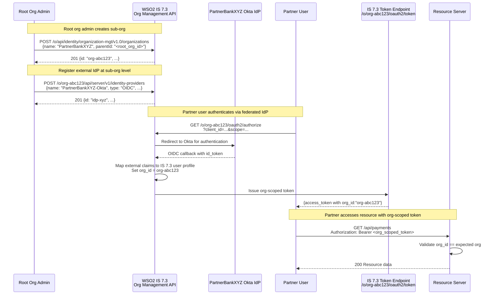

# Day 16 — B2B Organization Management in IS 7.3

## Why this matters

A bank onboarded a B2B fintech partner that required isolated identity management: their own user
directory (partner's Active Directory), their own login page branding, and a separate permission set.
The IS 7.3 team implemented this using separate tenants — one tenant for the bank, one for the partner.
Three months later, three failures converged:

1. **Cross-tenant token exchange was impossible**: a user authenticated in the partner tenant could not
   access shared bank APIs without re-authenticating against the bank tenant. IS 7.3 tenants are
   completely separate authorization domains with no built-in token exchange bridge.

2. **Root admin could not audit partner activity centrally**: the bank's compliance team needed a unified
   audit log across both tenants. IS 7.3 tenant audit logs are isolated — there is no cross-tenant audit
   query.

3. **Shared FAPI-registered applications could not be deployed to both tenants**: the bank's TPP client
   registration (FAPI 2.0 client, DCR-managed) existed only in the bank tenant. Replicating it to the
   partner tenant required a separate registration, duplicate lifecycle management, and diverging configs.

The correct IS 7.3 model is **Organizations** (introduced in IS 7.3): a root organization (the bank,
aligned with the IS 7.3 super-tenant) and sub-organizations (one per B2B partner). Sub-orgs share the
same IS 7.3 instance, can each have a federated external IdP (partner's AD/Okta), receive org-scoped
tokens, and can access shared applications registered at the root-org level. Cross-org token exchange
is possible via the organization switch grant. Audit logs aggregate at the root level.

## Core concepts

### IS 7.3 organization hierarchy

```
IS 7.3 super-tenant (root org: "Bank Corp")
├── Sub-org: "PartnerBankXYZ"    (org_id: org-abc123)
│   ├── Identity store: FEDERATED → PartnerBankXYZ's Okta IdP
│   └── Shared app: "FAPI-TPP-Client" (read-only, from root)
├── Sub-org: "FintechCo"         (org_id: org-def456)
│   ├── Identity store: LOCAL (IS 7.3 manages users)
│   └── Shared app: "FAPI-TPP-Client" (read-only, from root)
└── Root-org applications: "FAPI-TPP-Client", "AdminPortal"
```

Key properties:

- **Root org**: the IS 7.3 super-tenant. All sub-orgs exist within it. Root-org admin can see all sub-orgs.
- **Sub-org identity store**: either LOCAL (IS 7.3 manages users) or FEDERATED (external IdP per sub-org).
  A sub-org can have exactly one federated IdP.
- **Shared applications**: registered at the root-org level and shared down to sub-orgs. Sub-org admins
  can enable/disable shared apps but cannot modify their configuration. FAPI clients, payment apps, and
  regulatory-required apps are typically managed as shared apps.
- **Org-scoped tokens**: access tokens issued within a sub-org context include an `org_id` claim.
  Resource servers use this to enforce that the token only grants access to that org's resources.

### Org-scoped tokens and the `org_id` claim

When a user authenticates against sub-org `org-abc123`, IS 7.3 issues tokens with:

```json
{
  "sub": "partner_user_001@partnerbank.com",
  "iss": "https://identity.bank.com/o/org-abc123/oauth2/token",
  "aud": "<PLACEHOLDER: client_id>",
  "org_id": "org-abc123",
  "org_name": "PartnerBankXYZ",
  "scope": "payments read:accounts",
  "exp": 1789012345
}
```

The `iss` for org-scoped tokens uses the org-specific token endpoint path:
`/o/{orgId}/oauth2/token`. Resource servers can validate the `org_id` claim to enforce that the
token was issued within the expected sub-org context.

### Organization switch grant

A user authenticated at the root-org level (or sub-org level) can switch to another org context
without re-authentication using the organization switch grant:

```
grant_type=urn:ietf:params:oauth:grant-type:organization_switch
```

This exchanges a root-org token (or sub-org token) for a token scoped to the target sub-org.
Use case: a bank user (authenticated at root) needs to access a shared API on behalf of a specific
sub-org. They obtain a sub-org-scoped token without forcing the user to re-authenticate.



### B2B federation: external IdP per sub-org

Each sub-org can register its own federated external IdP (OIDC or SAML). The partner's users
authenticate against their own IdP; IS 7.3 receives the OIDC/SAML response, maps claims to the
IS 7.3 user model, and issues IS 7.3 tokens with the sub-org context. The bank's IS 7.3 never
manages partner user credentials — they remain in the partner's IdP.

Configuration at the sub-org level (not root-org) ensures the IdP is scoped to that partner only.
A root-org IdP would be globally visible across all sub-orgs — incorrect for isolated B2B federation.

## WSO2 IS 7.3 mapping

### Create a sub-organization

```
POST /o/api/identity/organization-mgt/v1.0/organizations HTTP/1.1
Host: identity.bank.com
Content-Type: application/json
Authorization: Bearer <PLACEHOLDER: root_admin_access_token>

{
  "name": "PartnerBankXYZ",
  "description": "B2B partner — PartnerBankXYZ financial services",
  "parentId": "<PLACEHOLDER: root_org_id>",
  "attributes": [
    {"key": "partner_type", "value": "bank"},
    {"key": "regulatory_id", "value": "<PLACEHOLDER: partner_regulatory_id>"}
  ]
}
```

Response:

```json
{
  "id": "<PLACEHOLDER: new_org_id>",
  "name": "PartnerBankXYZ",
  "status": "ACTIVE",
  "created": "2026-10-01T08:00:00.000Z",
  "lastModified": "2026-10-01T08:00:00.000Z",
  "parent": {
    "id": "<PLACEHOLDER: root_org_id>",
    "ref": "https://identity.bank.com/o/api/identity/organization-mgt/v1.0/organizations/<PLACEHOLDER: root_org_id>"
  }
}
```

### Org-scoped token endpoint

Once a sub-org exists, its OAuth2 token endpoint is:

```
POST /o/{orgId}/oauth2/token HTTP/1.1
Host: identity.bank.com
Content-Type: application/x-www-form-urlencoded

grant_type=authorization_code
&code=<PLACEHOLDER: authorization_code>
&redirect_uri=https%3A%2F%2Fpartnerapp.partnerbank.com%2Fcallback
&client_assertion_type=urn%3Aietf%3Aparams%3Aoauth%3Aclient-assertion-type%3Ajwt-bearer
&client_assertion=<PLACEHOLDER: client_jwt>
```

Replace `{orgId}` with the sub-org's `id` from the creation response.

### Organization switch grant (annotated)

Exchange a root-org token for a sub-org-scoped token:

```
POST /oauth2/token HTTP/1.1
Host: identity.bank.com
Content-Type: application/x-www-form-urlencoded

# Organization switch grant type (full URN — do not abbreviate)
grant_type=urn%3Aietf%3Aparams%3Aoauth%3Agrant-type%3Aorganization_switch

# The current token (root-org or another sub-org token)
&token=<PLACEHOLDER: current_access_token>
&token_type_hint=access_token

# The target sub-org ID to switch into
&switching_organization=<PLACEHOLDER: target_org_id>

# Scopes requested in the new sub-org context
&scope=payments%20read%3Aaccounts

# private_key_jwt client auth — form body
&client_assertion_type=urn%3Aietf%3Aparams%3Aoauth%3Aclient-assertion-type%3Ajwt-bearer
&client_assertion=<PLACEHOLDER: client_jwt>
```

Response: a new access token with `org_id` set to the target sub-org.

### Sample org-scoped token JWT claims (decoded)

```json
{
  "header": {
    "alg": "RS256",
    "kid": "<PLACEHOLDER: signing_key_id>"
  },
  "payload": {
    "sub": "<PLACEHOLDER: user_subject_within_sub_org>",
    "iss": "https://identity.bank.com/o/<PLACEHOLDER: org_id>/oauth2/token",
    "aud": "<PLACEHOLDER: client_id>",
    "exp": 1789012345,
    "iat": 1789008745,
    "jti": "<PLACEHOLDER: token_id>",
    "scope": "payments read:accounts",

    "org_id": "<PLACEHOLDER: sub_org_id>",
    "org_name": "PartnerBankXYZ",

    "user_org": "<PLACEHOLDER: user_home_org_id>",
    "account_type": "USER"
  }
}
```

Resource server validation checklist:
1. Verify JWT signature against IS 7.3 JWKS endpoint.
2. Check `iss` matches the expected org-specific issuer pattern.
3. Validate `org_id` matches the expected sub-org for this resource server.
4. Check `exp` and `iat` are within acceptable bounds.
5. Verify `scope` contains the required permission.

## Anti-patterns / Common mistakes

- **Confusing IS 7.3 Organizations with IS 7.3 tenants**: Organizations exist within the super-tenant
  (root org); they are a hierarchy and sharing model, not a separate isolation boundary. Tenants are
  completely isolated IS 7.3 deployments with separate user stores, applications, and audit logs.
  Cross-tenant features (shared apps, org switch grant, root-admin audit) do not exist for tenants.
  If you need true data isolation between organizations, tenants provide it — but at the cost of all
  B2B collaboration features. Organizations give collaboration and federation; tenants give isolation.
  Most banking B2B scenarios need collaboration, not complete isolation.

- **Registering federated IdPs at the root-org level for B2B partners**: An IdP registered at the
  root-org level is available across all sub-orgs — it becomes a global identity source. Partner A's
  Okta IdP registered at root level would allow Partner A users to log in to ANY sub-org, not just
  Partner A's. Federated B2B IdPs MUST be registered at the specific sub-org level. The IS 7.3
  sub-org admin (or the root admin using the sub-org API path `/o/{orgId}/api/server/v1/identity-providers`)
  is the correct registration point.

- **Issuing root-org tokens to B2B partner systems**: If a partner application authenticates via the
  root-org token endpoint (without an org path), IS 7.3 may issue a token without `org_id`. That token
  implicitly has access to all sub-orgs' resources if resource servers only check scopes, not `org_id`.
  B2B partner systems must always authenticate against the sub-org-specific token endpoint
  (`/o/{orgId}/oauth2/token`) so that all issued tokens carry the correct `org_id` claim.
  Root-org tokens are for root-org administrators only.

## Exercises

1. A B2B partner bank (sub-org `org-abc123`) needs their users to authenticate using their own Okta IdP.
   What are the IS 7.3 configuration steps, and at what level (root-org or sub-org) must the IdP be registered?

   **Hint:** The IdP must be scoped to the sub-org. Use the sub-org-scoped API path.

   **Solution sketch:** Steps: (1) Create sub-org `org-abc123` if it doesn't exist (root admin, via
   `POST /o/api/identity/organization-mgt/v1.0/organizations`). (2) Register the Okta IdP at the
   sub-org level: `POST /o/org-abc123/api/server/v1/identity-providers` with OIDC provider config
   (Okta's `.well-known` endpoint, client_id, client_secret as PLACEHOLDER). (3) Configure a federated
   authenticator in the sub-org's sign-in policy pointing to the Okta IdP. (4) Test by initiating an
   auth flow against `/o/org-abc123/oauth2/authorize` — users should be redirected to Okta.
   The IdP registration at sub-org level (not root-org) ensures Partner A's Okta users cannot access
   other sub-orgs.

2. A user authenticated against sub-org `org-abc123` needs to access a shared root-org service
   (analytics dashboard, admin API). What grant type do they use, and what does the resulting token's
   `org_id` claim look like?

   **Hint:** The organization switch grant exchanges an org-scoped token for a differently scoped token.
   Consider the direction: sub-org → root-org, not root-org → sub-org.

   **Solution sketch:** The user uses `grant_type=urn:ietf:params:oauth:grant-type:organization_switch`
   with their sub-org token as the `token` parameter and sets `switching_organization` to the root-org ID.
   The resulting token is issued from the root-org token endpoint and has `org_id` set to the root-org ID
   (or the `org_id` claim may be absent, since it is a root-org token). The resource server on the shared
   root-org service validates the token against the root-org issuer. Note: the switch requires the application
   to have permission to operate in the target org — IS 7.3 enforces this at grant time.

3. Write the IS 7.3 management API call to create a sub-organization named "PartnerBankXYZ" with
   `parentId` set to the root org ID `<ROOT_ORG_ID>`. Include all required headers.

   **Hint:** The endpoint is `POST /o/api/identity/organization-mgt/v1.0/organizations`. The `parentId`
   field links the new sub-org to the root org.

   **Solution sketch:**
   ```
   POST /o/api/identity/organization-mgt/v1.0/organizations HTTP/1.1
   Host: identity.bank.com
   Content-Type: application/json
   Authorization: Bearer <PLACEHOLDER: root_admin_token>

   {
     "name": "PartnerBankXYZ",
     "parentId": "<PLACEHOLDER: ROOT_ORG_ID>",
     "description": "B2B partner sub-organization"
   }
   ```
   The `parentId` must be the root org's `id` as returned by
   `GET /o/api/identity/organization-mgt/v1.0/organizations?filter=name+eq+<root_org_name>`.
   If `parentId` is omitted, IS 7.3 creates the org at the root level by default (same as providing
   the root org ID). A non-existent `parentId` returns `400 Bad Request`.

## Lab

See `labs/day16/`. Goal: trace the IS 7.3 organization management API calls and org-scoped token flow
for a B2B partner onboarding scenario.
Success signal: you can identify the four API calls needed to go from zero to a partner user receiving
an org-scoped token, and explain why the `org_id` claim prevents a partner from accessing another org's resources.
