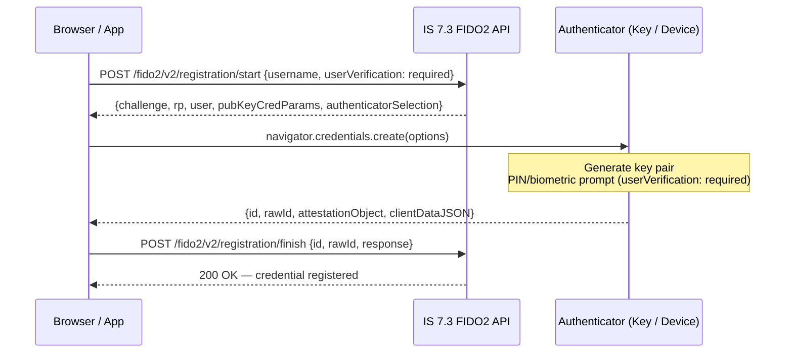
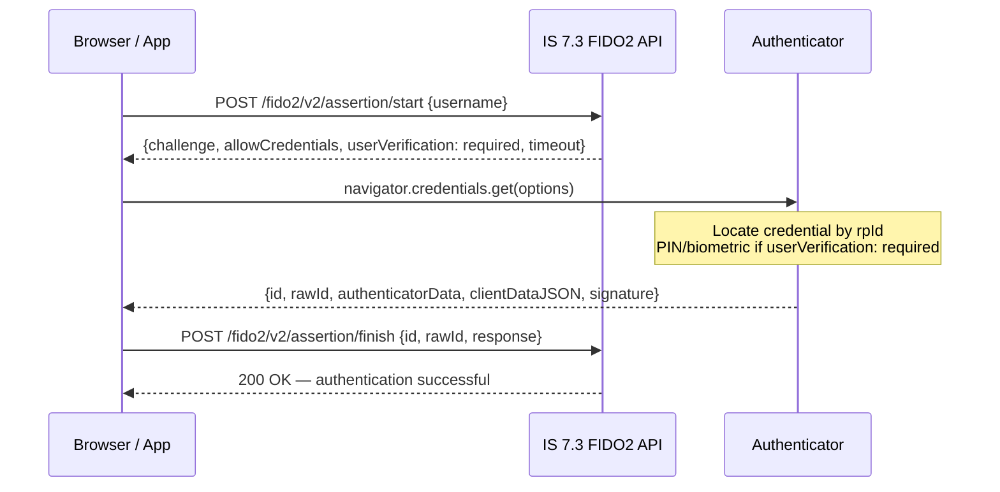

# Day 17 — FIDO2 / Passkeys

## Why this matters

A bank abandoned SMS OTP after a SIM-swap fraud campaign: attackers transferred victim phone numbers to
attacker SIMs and intercepted every OTP. The bank migrated to FIDO2 security keys. The first deployment
used `userVerification: discouraged` — a fast tap on the key, no PIN. The compliance audit failed
immediately: PSD2 SCA (RTS Article 4) requires **two** independent factors from {possession, knowledge,
inherence}. A tap with no PIN satisfies **possession** only — the holder has the key — but provides no
second factor. Setting `userVerification: required` forces the authenticator to prompt for a PIN or
biometric before signing. Now the ceremony proves **possession** (the key) + **knowledge** (PIN) or
**possession** + **inherence** (biometric) — either combination satisfies SCA. One flag change moved
the bank from one-factor to two-factor authentication under PSD2.

## Core concepts

### FIDO2 / WebAuthn fundamentals

FIDO2 is an asymmetric key-pair protocol. During **registration** the authenticator generates a key pair
specific to the relying party (RP). The private key never leaves the authenticator; the public key is
sent to the RP (IS 7.3) and stored. During **authentication** the authenticator signs a server-issued
challenge with the private key; the server verifies with the stored public key. No shared secret is
transmitted, so there is nothing to phish or intercept.

Key terms:
- **Relying Party (RP)**: the application/server verifying the credential — IS 7.3 acts as the RP
- **rpId**: the effective domain of the RP (e.g., `banking.example.com`). Credentials are scoped to this value
- **Challenge**: a cryptographic nonce issued per ceremony to prevent replay
- **Attestation**: proof of authenticator model and manufacture; IS 7.3 can verify (direct) or skip (none)

### Registration ceremony

1. Client calls `POST /fido2/v2/registration/start` with `username` and `userVerification` preference
2. IS 7.3 returns a `PublicKeyCredentialCreationOptions` object including: server `challenge`,
   `rp` (id + name), `user`, `pubKeyCredParams` (algorithm list), `authenticatorSelection`
3. Browser WebAuthn API calls `navigator.credentials.create(options)` — the authenticator generates
   the key pair, signs the challenge with an attestation key, returns the `AttestationObject`
4. Client calls `POST /fido2/v2/registration/finish` with `id`, `rawId`, `response.attestationObject`,
   `response.clientDataJSON`
5. IS 7.3 verifies: `origin` in `clientDataJSON` matches RP origins list, `rpIdHash` matches, attestation
   signature valid → stores credential public key under the user account



### Assertion ceremony (authentication)

1. Client calls `POST /fido2/v2/assertion/start` with `username` (or empty for resident keys)
2. IS 7.3 returns `PublicKeyCredentialRequestOptions`: `challenge`, `allowCredentials` (list of known
   credential ids for the user), `userVerification`, `timeout`
3. Browser calls `navigator.credentials.get(options)` — authenticator signs the challenge with the
   credential private key, returns `AuthenticatorAssertionResponse`
4. Client calls `POST /fido2/v2/assertion/finish` with assertion response
5. IS 7.3 verifies: signature valid against stored public key, `challenge` matches, `rpIdHash` matches,
   `userVerification` flag set if policy is `required` → completes authentication step



### Resident keys (passkeys)

A standard FIDO2 credential requires the RP to supply `allowCredentials` — the server must know which
credentials the user has (requires a username first). A **resident key** (also called a **passkey** or
discoverable credential) stores the credential on the authenticator indexed by `rpId`. At assertion time
the authenticator can enumerate its own credentials for the RP — no `allowCredentials` hint needed.

To enable resident keys, set `residentKey: required` in `authenticatorSelection` during registration.
This allows a passwordless flow: the user navigates to the bank login page, taps the key, the
authenticator presents stored accounts — no username entry required.

### `userVerification` policy

| Policy | Authenticator behaviour | SCA compliance |
|--------|------------------------|---------------|
| `required` | Must perform PIN / biometric — assertion fails if not verified | Yes — possession + knowledge/inherence |
| `preferred` | Use verification if available; tap-only acceptable fallback | Conditional — depends on authenticator |
| `discouraged` | Tap only; PIN/biometric not requested | No — possession factor only |

### Attestation

IS 7.3 supports:
- **None**: attestation not verified — credential registered from any authenticator
- **Indirect**: attestation verified against FIDO MDS (metadata service) — model confirmed
- **Direct**: full attestation statement checked — highest assurance, required for regulated deployments

## WSO2 IS 7.3 mapping

### deployment.toml — FIDO2 RP configuration

```toml
[fido2]
  # rpId MUST match the exact hostname the browser sees — no port, no path
  rp_id = "banking.example.com"

  # Origins that are allowed to complete ceremonies; include all app origins
  origins = [
    "https://banking.example.com",
    "https://app.banking.example.com"
  ]

  # Attestation preference for new registrations
  # Values: "none" | "indirect" | "direct"
  attestation_preference = "direct"
```

### IS 7.3 FIDO2 registration endpoint

```http
POST /fido2/v2/registration/start HTTP/1.1
Host: <PLACEHOLDER: is-host>
Content-Type: application/json
Authorization: Bearer <PLACEHOLDER: session-token-or-basic-auth>

{
  "username": "<PLACEHOLDER: user@banking.example.com>",
  "appId": "<PLACEHOLDER: app-client-id>",
  "userVerification": "required",
  "authenticatorSelection": {
    "residentKey": "required",
    "userVerification": "required"
  }
}
```

### IS 7.3 Console — FIDO2 in the flow builder

1. Console → Applications → [App] → Sign-in Method
2. Add authenticator to a step: choose "FIDO2" (or "Passkey")
3. The step configuration exposes `userVerification` policy — set to `required` for SCA-compliant flows
4. Add a fallback step: if no FIDO2 device is available, chain to `TOTP` or `EMAIL_OTP`

### Resident key policy in IS 7.3

Set in the FIDO2 authenticator configuration in Console or via the registration start request:
```json
{
  "authenticatorSelection": {
    "residentKey": "required",
    "requireResidentKey": true,
    "userVerification": "required"
  }
}
```

### Fallback authenticator chain

In IS 7.3 Console → flow builder, configure the step as:
```
Step 1:
  Option A: FIDO2 Authenticator  (primary)
  Option B: TOTP Authenticator   (fallback — user selects if no key available)
```
IS 7.3 presents both options to the client. The App-Native Auth API surfaces both under `nextStep.authenticators`.

## Anti-patterns / Common mistakes

- **`userVerification: discouraged` in a banking flow** — satisfies possession only (one factor).
  PSD2 SCA requires two factors; a compliance audit will flag this immediately. Always use `required`
  for any transaction that triggers SCA.

- **Wrong `rpId` in `deployment.toml`** — FIDO2 credentials are cryptographically bound to the `rpId`
  at registration time. If the RP ID changes (e.g., domain migration, misconfiguration), all existing
  credentials become unusable. Every user must re-register. Test RP ID configuration in a staging
  environment before any migration.

- **No fallback authenticator in the flow** — a user who loses their security key or whose device
  biometric fails cannot authenticate at all. IS 7.3 flow builder must include at least one fallback
  step (TOTP or SMS OTP) so users can recover via an alternate factor and then re-register their
  FIDO2 credential.

## Exercises

1. A bank's FIDO2 registration ceremony fails with `InvalidStateError` in the browser. What likely
   caused it and how is it fixed?

   **Hint:** `InvalidStateError` from `navigator.credentials.create()` indicates the authenticator
   already has a credential for this RP. Check the `excludeCredentials` field in the registration options.

   **Solution sketch:** The user already has a registered FIDO2 credential for this RP on this
   authenticator. IS 7.3 should include the user's existing credential ids in `excludeCredentials`
   in the `PublicKeyCredentialCreationOptions`. The browser uses this to detect a duplicate and
   throws `InvalidStateError` rather than creating a second credential for the same device. Fix:
   check whether the user already has a registered credential for this authenticator; if so, re-registration
   is not needed. If fresh registration is forced (lost key), the existing credential record must be
   deleted from IS 7.3 first, and the new registration issued without that credential in `excludeCredentials`.

2. Write the IS 7.3 `deployment.toml` fragment to configure the FIDO2 RP with hostname
   `banking.example.com` and enforce `userVerification: required`.

   **Hint:** The `deployment.toml` sets the RP-level origin list; `userVerification` policy is set
   per-application in the Console flow builder, not globally in `deployment.toml`.

   **Solution sketch:**
   ```toml
   [fido2]
     rp_id = "banking.example.com"
     origins = ["https://banking.example.com"]
     attestation_preference = "direct"
   ```
   In IS 7.3 Console → Applications → [App] → Sign-in Method → FIDO2 step, set `userVerification: required`.
   The `deployment.toml` does not have a global `userVerification` key; it is enforced per step.

3. Explain why setting `userVerification: required` satisfies PSD2 SCA but `discouraged` does not.

   **Hint:** PSD2 RTS Article 4 requires two factors from {possession, knowledge, inherence}.
   Map each FIDO2 element to a PSD2 factor category.

   **Solution sketch:** The FIDO2 security key itself is the **possession** factor — only the
   holder physically has the authenticator. With `userVerification: required`, the authenticator
   also prompts for a PIN (**knowledge**) or biometric (**inherence**) before signing. This
   satisfies the PSD2 requirement: possession + knowledge, or possession + inherence — two
   independent factors. With `userVerification: discouraged`, only possession is proven — the
   authenticator signs on tap without verifying who is holding it. A stolen or borrowed key
   would pass, and only one factor is present. PSD2 SCA requires two.

## Lab

See `labs/day17/`. Goal: trace the FIDO2 registration and assertion HTTP exchanges in IS 7.3, identifying
the role of each field. Success signal: you can explain what `challenge` prevents, why `userVerification`
appears in both the start request and the authenticator response, and what IS 7.3 stores after a
successful registration — all without referring to the WebAuthn specification.
