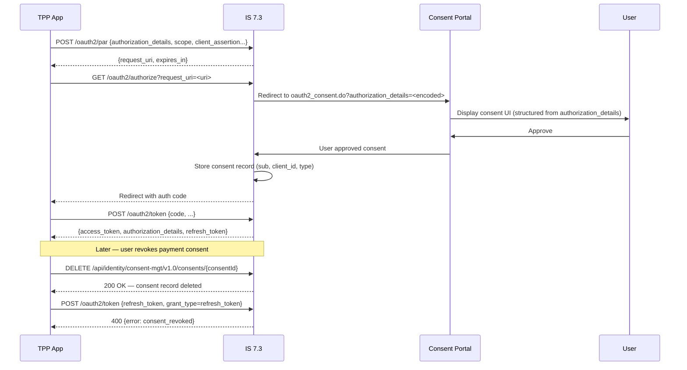

# Day 18 — RAR + Consent Portal

## Why this matters

A bank implemented PSD2 payment consent using IS 7.3 scope strings: the TPP (third-party provider)
requested `scope=accounts:DE89370400440532013000:balances`. When a user wanted to revoke only their
payment initiation consent — keeping account information access — the bank could not do it. There was
no structured record mapping a scope string to a specific consent decision. Revoking the access token
revoked everything. The PSD2 regulatory audit required the bank to produce a "consent receipt" —
a machine-readable record showing exactly what was consented to, for which account, when, and for
how long. The bank could not produce it because scope strings carry no structure and have no server-side
consent records tied to them.

IS 7.3's RAR integration stores each `authorization_details` object as a first-class consent record,
keyed by `sub`, `client_id`, and `authorization_details.type`. Selective revocation deletes exactly one
record. The consent management API returns the full `authorization_details` as the consent receipt.
The upgrade from scope strings to RAR required no changes to IS 7.3 core — only the PAR request and
the consent portal rendering template.

## Core concepts

### IS 7.3 RAR consent flow

When a PAR request includes `authorization_details`, IS 7.3 parses the array and carries it through
the authorization server flow:

1. **PAR + `authorization_details`**: TPP pushes authorization request to `/oauth2/par` including
   `authorization_details` (structured JSON array; see Day 3 for protocol details)
2. **Consent portal render**: IS 7.3 redirects the user to the consent portal
   (`/authenticationendpoint/oauth2_consent.do`), passing `authorization_details` as a request parameter
3. **User approves**: the consent portal UI displays the structured request fields (type, instructedAmount,
   creditorName, etc.) to the user
4. **IS 7.3 consent record**: on approval, IS 7.3 stores a structured consent record in its consent
   management store, keyed by (`sub`, `client_id`, `authorization_details.type`)
5. **Access token**: issued with `authorization_details` claim embedded (RFC 9396 §7)
6. **Consent revocation**: `DELETE /api/identity/consent-mgt/v1.0/consents/{consentId}` removes
   exactly one consent record
7. **Token refresh after revocation**: IS 7.3 checks consent validity on every refresh token grant;
   a revoked consent causes refresh rejection with `error: consent_revoked`



### Consent record structure

IS 7.3 stores each approved `authorization_details` entry as a consent object:

```json
{
  "consentId": "<PLACEHOLDER: uuid>",
  "userId": "<PLACEHOLDER: user@banking.example.com>",
  "clientId": "<PLACEHOLDER: tpp-client-id>",
  "consentType": "payment_initiation",
  "state": "ACTIVE",
  "createdTime": "<PLACEHOLDER: ISO-8601 timestamp>",
  "updatedTime": "<PLACEHOLDER: ISO-8601 timestamp>",
  "consentAttributes": {
    "instructedAmount": {
      "currency": "EUR",
      "amount": "<PLACEHOLDER: amount>"
    },
    "creditorName": "<PLACEHOLDER: Merchant Name>",
    "creditorAccount": {
      "iban": "<PLACEHOLDER: creditor-IBAN>"
    }
  }
}
```

### Consent portal — receiving `authorization_details`

IS 7.3 passes `authorization_details` to the consent portal as a URL-encoded request parameter on the
redirect. The portal's Jaggery/JSP template reads it from `request.getParameter("authorization_details")`,
decodes the JSON array, and renders each entry's fields in the consent UI.

Example: to display `creditorName` from a `payment_initiation` entry:
```javascript
// In the consent portal Jaggery template
var authDetails = JSON.parse(request.getParameter("authorization_details"));
var paymentEntry = authDetails.find(function(e) { return e.type === "payment_initiation"; });
var creditorName = paymentEntry ? paymentEntry.creditorName : "";
// Render creditorName in the consent UI template
```

### Consent revocation and token invalidation

IS 7.3 checks consent validity at every refresh token grant. The check is automatic when RAR is in use:
- Refresh token is mapped to a consent record at issuance time
- On `grant_type=refresh_token`, IS 7.3 looks up the linked consent record
- If the record is in state `REVOKED` (or absent): IS 7.3 returns `400 Bad Request` with
  `error=consent_revoked`, `error_description="Consent has been revoked"`
- Existing access tokens remain valid until expiry — revocation is not immediate for issued tokens
  (use short expiry for payment tokens)

## WSO2 IS 7.3 mapping

### Consent management REST API

List consents for a user:
```http
GET /api/identity/consent-mgt/v1.0/consents?userId=<PLACEHOLDER: user@banking.example.com>&clientId=<PLACEHOLDER: tpp-client-id> HTTP/1.1
Host: <PLACEHOLDER: is-host>
Authorization: Bearer <PLACEHOLDER: admin-token>
```

Get a specific consent:
```http
GET /api/identity/consent-mgt/v1.0/consents/{consentId} HTTP/1.1
Host: <PLACEHOLDER: is-host>
Authorization: Bearer <PLACEHOLDER: admin-token>
```

Revoke a consent:
```http
DELETE /api/identity/consent-mgt/v1.0/consents/{consentId} HTTP/1.1
Host: <PLACEHOLDER: is-host>
Authorization: Bearer <PLACEHOLDER: admin-token>
```

### Consent portal theme override

Do not edit the IS 7.3 `authenticationendpoint` WAR directly. Use the theme override mechanism:
```toml
# deployment.toml
[authentication.endpoint]
  # Path to custom theme — overrides default consent portal rendering
  custom_ui_path = "<PLACEHOLDER: /path/to/custom/theme>"
```

The custom theme directory must contain `oauth2_consent.do` (JSP/Jaggery template). IS 7.3 loads
the custom theme at startup and merges it with the default endpoint, leaving the WAR untouched.

### `deployment.toml` for RAR consent

```toml
[oauth]
  # Enable RAR (authorization_details) parsing and storage
  enable_rich_authorization_requests = true

  # Consent validation on token refresh
  validate_consent_on_token_refresh = true
```

### Consent portal field display configuration

IS 7.3 Console → Identity Provider → Consent Management → Configure which `authorization_details`
types are renderable and what display labels map to each field. This drives the consent UI rendering
without custom template code for new `authorization_details` types.

## Anti-patterns / Common mistakes

- **Not storing consent records when using RAR** — if IS 7.3 issues tokens with `authorization_details`
  embedded but has no server-side consent record, selective revocation is impossible. Every revocation
  becomes full token revocation. Enable `enable_rich_authorization_requests = true` and verify IS 7.3
  is writing consent records at authorization time (check the consent management API after a test flow).

- **Customizing the consent portal HTML directly inside the IS 7.3 `authenticationendpoint` WAR** —
  the WAR is overwritten on every IS 7.3 upgrade. All custom HTML is lost. Always use IS 7.3's theme
  override mechanism (`custom_ui_path` in `deployment.toml`) which survives upgrades by keeping
  customizations outside the WAR.

- **Issuing long-lived tokens for `payment_initiation` consent** — PSD2 Regulatory Technical Standards
  require that payment initiation consent is single-use: after the payment is authorized and executed,
  the consent must be revoked. Granting a long `expires_in` (e.g., 3600s) or a multi-use refresh token
  for payment consent contradicts PSD2 and allows repeated payment execution. Use single-use access
  tokens (no refresh token) for `payment_initiation` type, or set IS 7.3 consent lifecycle to `ONE_TIME`
  for that type.

## Exercises

1. A user revokes their payment initiation consent via the bank's app. The TPP holds a valid refresh
   token issued before revocation. What happens when the TPP calls `POST /oauth2/token` with
   `grant_type=refresh_token`?

   **Hint:** IS 7.3 checks the linked consent record's state before issuing a new access token.

   **Solution sketch:** IS 7.3 looks up the consent record linked to the refresh token. The consent
   record is in state `REVOKED`. IS 7.3 returns `HTTP 400 Bad Request` with body:
   `{"error": "consent_revoked", "error_description": "Consent has been revoked"}`. The TPP must
   handle this error and notify the user that the consent is no longer active — the TPP cannot
   silently retry. Note: any access tokens already issued and not yet expired remain valid until
   their `exp` time. If PSD2 compliance requires immediate invalidation, the bank should configure
   short access token lifetimes (≤ 15 minutes for payment tokens).

2. Write the IS 7.3 management API call to list all active consents for user `user123@bank.com`.

   **Hint:** The consent management API supports filtering by `userId` query parameter.

   **Solution sketch:**
   ```http
   GET /api/identity/consent-mgt/v1.0/consents?userId=user123@bank.com&state=ACTIVE HTTP/1.1
   Host: <PLACEHOLDER: is-host>
   Authorization: Bearer <PLACEHOLDER: admin-token>
   ```
   The response is a JSON array of consent objects, each containing `consentId`, `clientId`,
   `consentType` (matching `authorization_details.type`), `state`, `createdTime`, and
   `consentAttributes` (the structured fields from the original `authorization_details` object).
   This array is the machine-readable consent receipt a PSD2 audit requires.

3. A consent portal customisation needs to display the `creditorName` from `authorization_details`.
   How does the consent portal receive this value?

   **Hint:** IS 7.3 passes `authorization_details` to the consent portal as a URL-encoded parameter
   on the redirect from the authorization endpoint.

   **Solution sketch:** IS 7.3 includes `authorization_details` (JSON array, URL-encoded) as a
   query/POST parameter when redirecting to `/authenticationendpoint/oauth2_consent.do`. In the
   consent portal template, read it with `request.getParameter("authorization_details")`, parse
   the JSON array, find the entry with `type === "payment_initiation"`, and access
   `entry.creditorName`. The portal then renders this value in the consent UI. This approach works
   without changes to IS 7.3 core — only the consent portal template needs updating.

## Lab

See `labs/day18/`. Goal: trace the RAR consent flow from PAR request through consent portal approval,
consent record storage, and revocation — including the follow-up refresh token rejection.
Success signal: you can describe what IS 7.3 stores on approval, how the consent API retrieves it,
and why the refresh token fails after revocation — all without referring back to Day 3 or Day 8.
