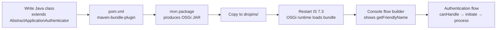

# Day 19 — IS 7.3 Extension Points

## Why this matters

A bank needed to add a custom authentication step: verify the user's biometric via a proprietary
third-party vendor API. No IS 7.3 built-in authenticator supported this vendor's SDK. The team's
first approach was to modify IS 7.3's source code to add the vendor call — which meant maintaining
a forked IS 7.3 build, applying security patches manually, and recompiling the entire server for
every vendor API update. When the bank's security team refused to approve a forked IS deployment,
the team discovered IS 7.3's Custom Authenticator SPI.

Using the SPI, they wrote a single Java class implementing `AbstractApplicationAuthenticator`, packaged
it as an OSGi bundle JAR, dropped it into `<IS_HOME>/repository/components/dropins/`, and restarted
IS 7.3. The authenticator appeared in the Console flow builder with no source modification to IS 7.3.
Vendor API updates required recompiling and redeploying only the custom JAR. Security patches applied
to IS 7.3 cleanly. The SPI converts a source-fork into a plugin deployment — a critical distinction
for a regulated institution that cannot run unsigned custom builds of its identity server.

## Core concepts

### Custom Authenticator SPI

IS 7.3 exposes a Java SPI (Service Provider Interface) for plugging in custom authentication steps.
Two base classes:
- `AbstractApplicationAuthenticator` — for federated authenticators (external IdP or custom step
  that redirects to an external page)
- `AbstractApplicationAuthenticator` implementing `LocalApplicationAuthenticator` — for local
  authenticators that handle credentials against the IS 7.3 user store

Key methods:

| Method | Called when | Purpose |
|--------|------------|---------|
| `canHandle(HttpServletRequest)` | Every authentication request | Return `true` only when this request is for this authenticator |
| `initiateAuthenticationRequest(request, response, context)` | First time the authenticator is invoked | Redirect to external page or render the first challenge |
| `processAuthenticationResponse(request, response, context)` | Callback from external page | Validate the response, set the authenticated subject |
| `getName()` | IS 7.3 startup discovery | Internal identifier used in configuration |
| `getFriendlyName()` | IS 7.3 Console display | Human-readable name in the flow builder |

### OSGi bundle packaging

IS 7.3 uses the OSGi component framework. A custom authenticator must be packaged as an OSGi bundle:

1. Add `maven-bundle-plugin` to `pom.xml`
2. Declare `Bundle-SymbolicName`, `Bundle-Version`, `Export-Package` (for the authenticator class),
   and `Import-Package` (for IS 7.3 authentication framework imports) in the Maven plugin config
3. The plugin generates a `MANIFEST.MF` with the required OSGi headers
4. Build with `mvn package` → produces a JAR with embedded OSGi manifest
5. Copy JAR to `<IS_HOME>/repository/components/dropins/`
6. Restart IS 7.3 → the OSGi runtime discovers the bundle → authenticator registered
7. Console → Applications → [App] → Sign-in Method: the custom authenticator appears in the
   authenticator list under its `getFriendlyName()`



### Custom grant handler

To support a non-standard OAuth2 grant type (e.g., a proprietary grant for agent delegation):
- Extend `AbstractAuthorizationGrantHandler`
- Override `validateGrant(OAuthTokenReqMessageContext)` — validate the custom grant parameters
- Override `issueAccessToken(OAuthTokenReqMessageContext)` — build the token; return
  `OAuth2AccessTokenRespDTO` with `accessToken`, `refreshToken`, `expiresIn`
- Register in `identity.xml`:
  ```xml
  <SupportedGrantType>
      <GrantTypeName>custom_grant</GrantTypeName>
      <GrantTypeHandlerImplClass>com.example.bank.grant.CustomGrantHandler</GrantTypeHandlerImplClass>
  </SupportedGrantType>
  ```

### Identity Event Framework

IS 7.3 fires events at key points in authentication and token flows. An event handler subscribes
to specific events and runs custom logic without modifying the core.

**Implement:**
```java
public class AuditEventHandler extends AbstractIdentityHandler {
    @Override
    public void handleEvent(Event event) throws IdentityEventException {
        // event.getEventName() returns the event type string
        // event.getEventProperties() returns a Map<String, Object> of context data
    }

    @Override
    public String getName() { return "AuditEventHandler"; }

    @Override
    public int getPriority(MessageContext messageContext) { return 50; } // lower = earlier
}
```

**Key event types:**

| Event | Fired when |
|-------|-----------|
| `PRE_AUTHENTICATION` | Before authentication step begins |
| `POST_AUTHENTICATION` | After successful authentication |
| `PRE_ISSUE_ACCESS_TOKEN` | Before access token is issued |
| `POST_ISSUE_ACCESS_TOKEN` | After access token is issued |
| `POST_ADD_NEW_USER` | After a new user is provisioned |

**Subscribe via `deployment.toml`:**
```toml
[[event_listener]]
  id = "audit_event_handler"
  type = "org.wso2.carbon.identity.core.handler.AbstractIdentityHandler"
  name = "com.example.bank.handler.AuditEventHandler"
  orderId = 1
  enable = true

[[event_listener.properties]]
  name = "subscriptions"
  value = "POST_AUTHENTICATION,POST_ISSUE_ACCESS_TOKEN"
```

### Event publisher to webhook

IS 7.3 can publish identity events to an external HTTP endpoint (webhook, SIEM, audit service):
```toml
[event_publisher]
  # Enable HTTP event publishing
  enable = true
  url = "https://<PLACEHOLDER: siem-host>/identity-events"
  http_method = "POST"
  authentication_type = "OAUTH2"
  client_id = "<PLACEHOLDER: siem-client-id>"
  client_secret = "<PLACEHOLDER: siem-client-secret>"
  token_endpoint = "https://<PLACEHOLDER: siem-token-endpoint>"
```

## WSO2 IS 7.3 mapping

### Java interface skeleton (key method signatures)

```java
// Custom Authenticator SPI skeleton for IS 7.3
// Package: com.example.bank.authenticator
// Deploy: copy OSGi JAR to <IS_HOME>/repository/components/dropins/

import org.wso2.carbon.identity.application.authentication.framework.AbstractApplicationAuthenticator;
import org.wso2.carbon.identity.application.authentication.framework.LocalApplicationAuthenticator;
import org.wso2.carbon.identity.application.authentication.framework.context.AuthenticationContext;
import org.wso2.carbon.identity.application.authentication.framework.exception.AuthenticationFailedException;
// Additional imports: HttpServletRequest, HttpServletResponse

public class BiometricAuthenticator extends AbstractApplicationAuthenticator
        implements LocalApplicationAuthenticator {

    @Override
    public boolean canHandle(HttpServletRequest request) {
        // Return true ONLY when the biometric callback token is present in the request
        // Incorrect: return true; — would intercept ALL requests, breaking other authenticators
        return request.getParameter("biometric_token") != null;
    }

    @Override
    protected void initiateAuthenticationRequest(HttpServletRequest request,
            HttpServletResponse response, AuthenticationContext context)
            throws AuthenticationFailedException {
        // Redirect to external biometric verification page with a state parameter
        // String sessionId = context.getContextIdentifier();
        // String redirectUrl = "<PLACEHOLDER: vendor-url>" + "?sessionId=" + sessionId;
        // response.sendRedirect(redirectUrl);
    }

    @Override
    protected void processAuthenticationResponse(HttpServletRequest request,
            HttpServletResponse response, AuthenticationContext context)
            throws AuthenticationFailedException {
        // Called when vendor page redirects back with biometric_token
        // Validate biometric_token against vendor API (with timeout + circuit-breaker)
        // On success: context.setSubject(authenticatedUser);
        // On failure: throw new AuthenticationFailedException("Biometric verification failed");
    }

    @Override
    public String getName() {
        return "BiometricAuthenticator"; // unique key — must not conflict with other authenticators
    }

    @Override
    public String getFriendlyName() {
        return "Biometric Authenticator"; // display name in IS 7.3 Console
    }
}
```

### OSGi `MANIFEST.MF` fragment (auto-generated by maven-bundle-plugin)

```
Bundle-SymbolicName: com.example.bank.authenticator
Bundle-Version: 1.0.0
Bundle-Name: Bank Biometric Authenticator
Export-Package: com.example.bank.authenticator;version="1.0.0"
Import-Package: org.wso2.carbon.identity.application.authentication.framework;version="[5,8)",
 javax.servlet.http;version="[2.6,4)"
```

### `deployment.toml` for event handler subscription

See the Identity Event Framework section above.

### Console: custom authenticator in the step builder

After deploying the OSGi bundle and restarting IS 7.3:
1. Console → Applications → [App] → Sign-in Method
2. Add Step → Add Authenticator
3. The custom authenticator appears under its `getFriendlyName()` in the "Local" category
4. It can be combined with other steps and configured as a fallback

## Anti-patterns / Common mistakes

- **Making external HTTP calls in `process()` without timeout or circuit-breaker** — IS 7.3 executes
  `processAuthenticationResponse()` on its authentication thread pool. A slow vendor API (or network
  partition) blocks that thread for the full socket timeout duration. If multiple users authenticate
  simultaneously, the thread pool exhausts and all authentication fails. Always use a bounded HTTP
  client with an explicit `connectTimeout` and `readTimeout` (e.g., 2 seconds each), and implement
  a circuit-breaker so a failing vendor API does not take down IS 7.3 authentication.

- **`canHandle()` returning `true` unconditionally** — IS 7.3 calls `canHandle()` on every registered
  authenticator for every incoming authentication request. If `canHandle()` always returns `true`,
  the custom authenticator intercepts requests that belong to other authenticators (TOTP, FIDO2, basic).
  This breaks all other authentication steps. `canHandle()` must return `true` only when the request
  contains a parameter or state that uniquely identifies a response to this authenticator (e.g.,
  a callback token, a specific parameter name set by `initiateAuthenticationRequest`).

- **Modifying token claims in a `PRE_ISSUE_ACCESS_TOKEN` event handler** — event handlers receive
  a reference to the token context, but modifications made in event handlers are not guaranteed to
  persist to the issued token in all IS 7.3 deployments. Token claim enrichment (adding custom claims,
  modifying scopes) must be done in a **custom claim provider** or **custom grant handler**, not in an
  event handler. Event handlers are for side effects (audit logging, notifications, external calls)
  — not for mutating the token.

## Exercises

1. You need to log all successful logins to an external SIEM. Which IS 7.3 extension point do you use,
   and why is an event handler better than modifying the custom authenticator for this purpose?

   **Hint:** Consider what happens when you have multiple authenticators (FIDO2, TOTP, biometric) and
   need to log success from all of them.

   **Solution sketch:** Use an **Identity Event handler** subscribing to `POST_AUTHENTICATION`. An
   event handler fires after any authentication step completes — regardless of which authenticator
   ran. If you put SIEM logging inside the custom authenticator's `processAuthenticationResponse()`,
   the logging only fires when that specific authenticator is invoked. Users authenticating with FIDO2
   or TOTP would not be logged. The event handler fires once per successful authentication regardless
   of method, giving a uniform audit trail across all authenticators. This also keeps the custom
   authenticator focused on authentication logic only — a single-responsibility advantage.

2. A custom authenticator's `canHandle()` method always returns `true` regardless of request state.
   What happens in IS 7.3?

   **Hint:** IS 7.3 evaluates `canHandle()` on all registered authenticators for each incoming request.

   **Solution sketch:** IS 7.3 calls `canHandle()` on each registered authenticator in priority order
   to find which one should handle the current request. If `canHandle()` always returns `true`, the
   custom authenticator claims every request. This means TOTP callbacks, FIDO2 assertion responses, and
   basic authentication callbacks are all routed to the custom authenticator, which will likely fail to
   process them. The result is that all authentication attempts fail unless the custom authenticator
   happens to be the only one registered. Fix: `canHandle()` must check for the specific parameter or
   state marker that this authenticator sets (e.g., `request.getParameter("biometric_token") != null`).

3. Write the minimum Java method signature for `process()` in a `LocalApplicationAuthenticator` that
   redirects the user to an external OTP page and resumes after callback.

   **Hint:** A `LocalApplicationAuthenticator` uses the split-method pattern: `initiateAuthenticationRequest`
   redirects, `processAuthenticationResponse` handles the callback. The parent `process()` method routes
   between them based on `canHandle()`.

   **Solution sketch:** For a `LocalApplicationAuthenticator`, you do not override `process()` directly.
   The `AbstractApplicationAuthenticator.process()` calls `canHandle()` to decide: if `false`, it calls
   `initiateAuthenticationRequest()` to start; if `true`, it calls `processAuthenticationResponse()` to
   finish. The minimum implementation requires:
   ```java
   @Override
   protected void initiateAuthenticationRequest(HttpServletRequest request,
           HttpServletResponse response, AuthenticationContext context)
           throws AuthenticationFailedException {
       // Set a session marker; redirect to OTP page
       String sessionId = context.getContextIdentifier();
       response.sendRedirect("<PLACEHOLDER: otp-page-url>?sessionId=" + sessionId);
   }

   @Override
   protected void processAuthenticationResponse(HttpServletRequest request,
           HttpServletResponse response, AuthenticationContext context)
           throws AuthenticationFailedException {
       // Validate OTP from request parameter; set subject or throw
   }

   @Override
   public boolean canHandle(HttpServletRequest request) {
       return request.getParameter("otp_response") != null; // unique to this authenticator
   }
   ```

## Lab

See `labs/day19/`. Goal: read the Custom Authenticator SPI skeleton and identify where each authentication
concern is handled. Success signal: you can explain the purpose of each method (`canHandle`, `initiateAuthenticationRequest`, `processAuthenticationResponse`, `getName`, `getFriendlyName`) and why
`canHandle` precision is critical — all without referring to IS 7.3 documentation.
