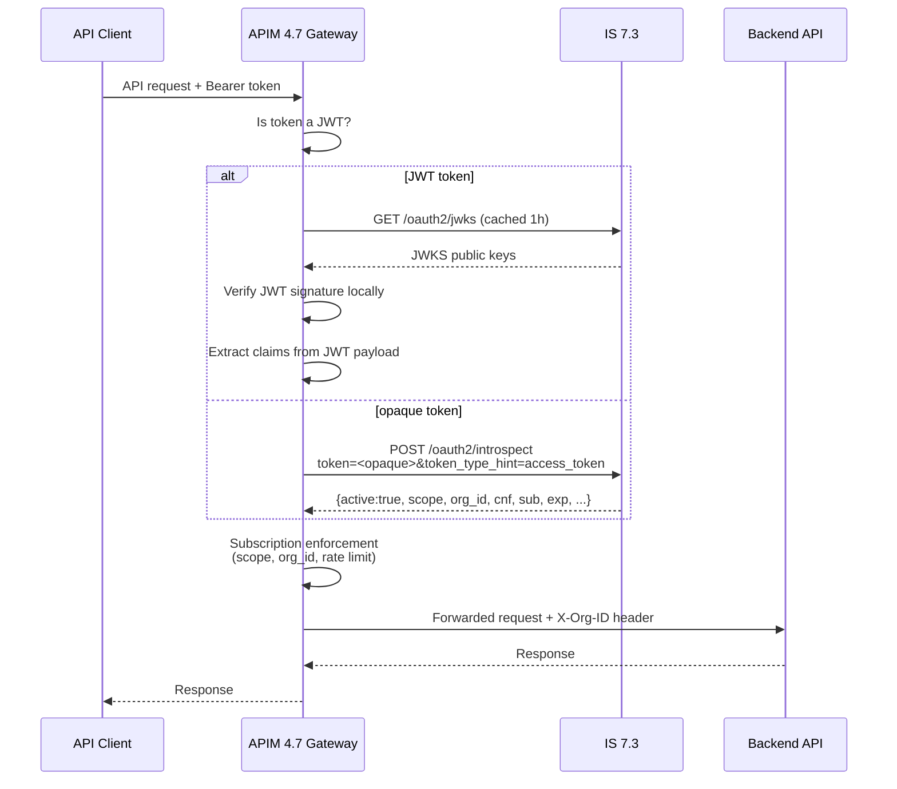
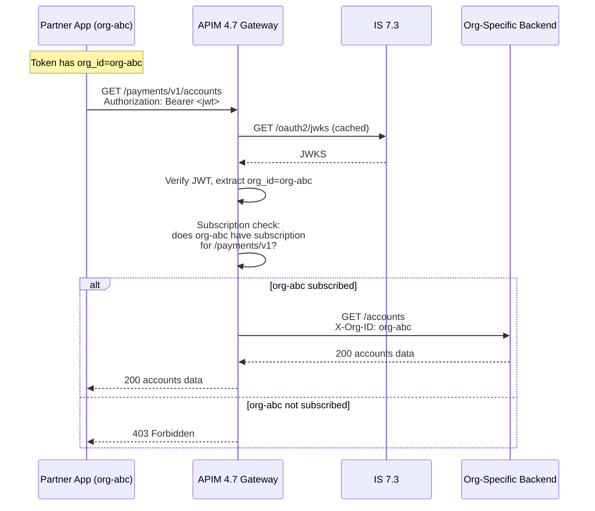
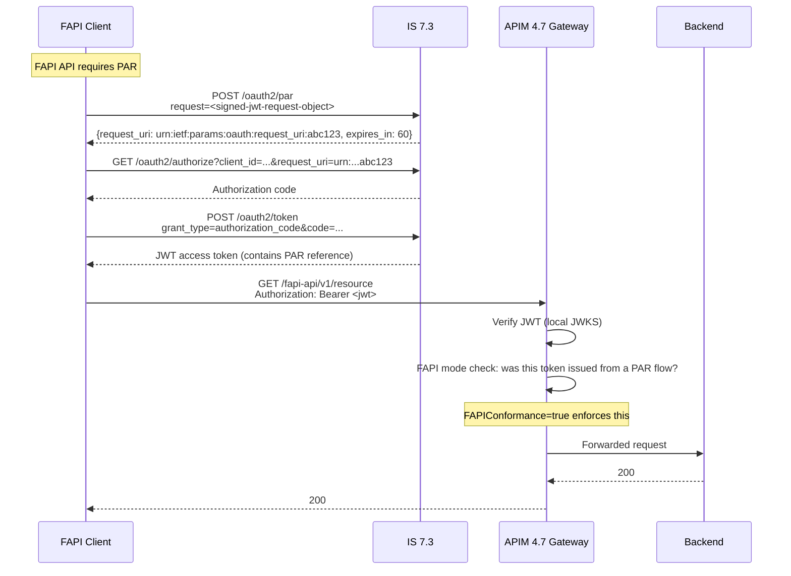

# Day 20 — IS 7.3 + APIM 4.7 Integration Patterns

## Why this matters

A bank had run the IS 2.x Key Manager integration for years: a separate `wso2is-km.war` WAR file
deployed on Identity Server acted as the bridge between APIM and IS. Token validation worked
because the WAR exposed an introspection endpoint that APIM knew how to call. The team understood
the path: APIM → IS-KM WAR → IS user store.

When they upgraded to IS 7.3, the upgrade checklist said to update the APIM `deployment.toml`. The
team updated the base URL pointing to IS 7.3 but left the key manager `type` and connector config
unchanged — they assumed the IS-KM WAR was still there. It was not. IS 7.3 removed the IS-KM WAR
entirely; Key Manager integration is now built natively into IS 7.3 via the `KeyManagerConnector`
extension and a new `type = "WSO2-IS"` config block.

The result: APIM called the old IS-KM WAR endpoints (which no longer existed), received 404s on
every token validation call, and rejected all API requests as unauthorized. The outage lasted four
hours while the team traced the problem to a missing config type change.

Three things changed in the upgrade:
1. The Key Manager connector changed from the IS-KM WAR bridge to native `KeyManagerConnector`
2. Org-scoped tokens required the gateway to pass `org_id` in the subscription enforcement path
3. FAPI mode on IS 7.3 meant the gateway needed to pass PAR `request_uri` references back to
   IS 7.3 for validation — not just bearer tokens

This day covers how to configure the integration correctly and why each endpoint in the config
matters.

## Core concepts

### Key Manager connector: IS 7.3 native integration

IS 7.3 dropped the separate IS-KM WAR. Key Manager integration is built into IS 7.3 natively.
In APIM 4.7, you configure this with `type = "WSO2-IS"` in the `[[apim.key_manager]]` block.
There is no external WAR to deploy, no IS-KM extension bundle — IS 7.3's built-in
`KeyManagerConnector` handles it.

The five endpoints APIM must know about:

| Endpoint config key | IS 7.3 path | Purpose |
|---|---|---|
| `introspect_url` | `/oauth2/introspect` | Validate opaque tokens, retrieve claims |
| `jwks_url` | `/oauth2/jwks` | Fetch public keys for local JWT verification |
| `client_registration_url` | `/api/identity/oauth2/dcr/v1.1/register` | Register OAuth2 clients via DCR |
| `token_url` | `/oauth2/token` | APIM service account token generation |
| `revoke_url` | `/oauth2/revoke` | Key deletion in the Dev Portal |

### Token validation path

APIM 4.7 uses two validation strategies depending on the token type:

- **JWT (self-contained):** APIM verifies the signature locally using IS 7.3's public keys fetched
  from `jwks_url`. APIM caches the JWKS (default TTL: 1 hour). Per-request round-trip to IS 7.3
  is avoided. After IS 7.3 key rotation, APIM may reject valid tokens until the cache expires.
- **Opaque token:** APIM calls `introspect_url` on every request. IS 7.3 returns an introspection
  response with `active`, `scope`, `org_id`, `cnf`, and other claims. APIM uses this response for
  subscription enforcement.



### Org-scoped tokens at the gateway

IS 7.3 issues org-scoped tokens for B2B partner access. These tokens carry an `org_id` claim
identifying the partner organization. APIM 4.7 reads this claim to enforce org-specific API
subscriptions: if a partner's `org_id` has no subscription for the requested API, APIM returns 403.

The claim name APIM reads is configured via `OrgIdClaimName` in the key manager config. The default
is `org_id`. After reading `org_id`, APIM adds an `X-Org-ID` header to the backend request so
downstream services can apply org-specific logic.



### FAPI-mode gateway

APIM 4.7 can publish APIs in FAPI 2.0 mode. For FAPI APIs, APIM enforces Pushed Authorization
Requests (PAR): clients must send the authorization request to IS 7.3's PAR endpoint first,
receive a `request_uri`, then present that `request_uri` to the authorization endpoint. APIM
validates that the token was issued from a PAR flow by checking for the PAR reference in the
introspection response or JWT claims.

When `FAPIConformance = true` in the key manager config, APIM enforces this requirement for
APIs flagged as FAPI in the API Publisher.



### Subscription enforcement with IS 7.3 scope delegation

In earlier IS versions, scope-to-role mapping was done inside APIM. In IS 7.3, scope validation
is delegated to IS 7.3: the introspection response's `scope` field lists only the scopes IS 7.3
has validated for this token. APIM uses this scope list for subscription enforcement without
re-validating against local role maps.

### B2B partner token flow via APIM

Full end-to-end flow for a B2B partner accessing an org-specific API:

1. Partner authenticates to IS 7.3 using the org-scoped token flow (e.g., client credentials
   with org context, or token exchange with `org_id` embedded)
2. IS 7.3 issues a token with `org_id: "org-abc"` and the subscribed scopes
3. Partner presents the token to APIM 4.7 gateway
4. APIM verifies the token (JWKS or introspect), extracts `org_id`
5. APIM checks org-abc's subscription for this API
6. If subscribed, APIM routes the request to the org-specific backend, adding `X-Org-ID: org-abc`
7. Backend applies org-specific data isolation

## WSO2 IS 7.3 mapping

### Annotated TOML config

```toml
# APIM 4.7 deployment.toml — IS 7.3 as Key Manager
# Add or replace the [[apim.key_manager]] section in:
#   <APIM_HOME>/repository/conf/deployment.toml

[[apim.key_manager]]
# Internal name — must match the name APIM admin portal displays
# Used in APIM internal references; changing after setup requires DB migration
name = "WSO2IdentityServer"

# Native IS 7.3 connector type — replaces the old IS-KM WAR connector
# IS 7.3 removed the IS-KM WAR; this is the correct type for IS 7.3
type = "WSO2-IS"

# Human-readable label in the APIM Developer Portal
display_name = "WSO2 Identity Server 7.3"

# IS 7.3 base URL — replace <PLACEHOLDER: is-host> with the actual IS 7.3 hostname
# Example: wso2is.internal.example.com
url = "https://<PLACEHOLDER: is-host>:9443"

# Introspection endpoint — APIM calls this for every opaque token
# IS 7.3 responds with: active, sub, scope, org_id, cnf, exp, iat, ...
introspect_url = "https://<PLACEHOLDER: is-host>:9443/oauth2/introspect"

# JWKS endpoint — APIM fetches IS 7.3 public keys here for local JWT verification
# APIM caches the response; TTL controlled by JWKSCacheTTL below
jwks_url = "https://<PLACEHOLDER: is-host>:9443/oauth2/jwks"

# DCR endpoint — APIM registers an OAuth2 client here when a developer generates
# API keys in the Developer Portal. Uses DCR v1.1 (IS 7.3 default)
client_registration_url = "https://<PLACEHOLDER: is-host>:9443/api/identity/oauth2/dcr/v1.1/register"

# Token endpoint — APIM uses this to obtain service account tokens for
# authenticating to IS 7.3 introspection and DCR endpoints
token_url = "https://<PLACEHOLDER: is-host>:9443/oauth2/token"

# Revoke endpoint — APIM calls this when a developer deletes an application key
# in the Developer Portal, ensuring IS 7.3 revokes the associated tokens
revoke_url = "https://<PLACEHOLDER: is-host>:9443/oauth2/revoke"

# Service account credentials — APIM authenticates to IS 7.3 for introspection calls
# Never hardcode real credentials here; use an env var reference or a secrets manager
[apim.key_manager.credentials]
username = "<PLACEHOLDER: apim-km-service-account>"
password = "<PLACEHOLDER>"

[apim.key_manager.configuration]
# Claim name in the JWT / introspection response that carries the org ID
# APIM reads this for org-scoped subscription enforcement (B2B partner access)
OrgIdClaimName = "org_id"

# FAPI 2.0 enforcement — set true for deployments that publish FAPI-flagged APIs
# When true, APIM validates that tokens for FAPI APIs were issued via a PAR flow
FAPIConformance = true

# JWKS cache TTL in seconds (default 3600 = 1h)
# After IS 7.3 key rotation, APIM will reject valid JWTs until this cache expires
# Lower in key-rotation-heavy environments; raise in stable environments
JWKSCacheTTL = 3600

# When true, APIM verifies JWT tokens locally using cached JWKS without
# calling IS 7.3 introspect per request — reduces latency significantly
# Set false only if every token must be validated server-side (e.g., immediate revocation)
EnableLocalJWTValidation = true
```

### Introspection call and response

APIM gateway calling IS 7.3 introspection for an opaque token:

```http
POST /oauth2/introspect HTTP/1.1
Host: <PLACEHOLDER: is-host>:9443
Content-Type: application/x-www-form-urlencoded
Authorization: Basic <PLACEHOLDER: base64(apim-km-service-account:password)>

token=<PLACEHOLDER: opaque-access-token>&token_type_hint=access_token
```

IS 7.3 response for an active org-scoped token:

```json
{
  "active": true,
  "sub": "user@org-abc.example.com",
  "username": "user@org-abc.example.com",
  "scope": "accounts:read payments:read",
  "org_id": "org-abc",
  "client_id": "<PLACEHOLDER: client-id>",
  "token_type": "Bearer",
  "exp": 1727827200,
  "iat": 1727823600,
  "cnf": {
    "x5t#S256": "<PLACEHOLDER: cert-thumbprint-sha256>"
  },
  "iss": "https://<PLACEHOLDER: is-host>:9443/oauth2/token",
  "aud": "https://<PLACEHOLDER: apim-host>:8243"
}
```

Key fields APIM uses:
- `active: true` — token is valid; APIM proceeds with enforcement
- `scope` — IS 7.3 has already validated the scopes; APIM uses this for subscription enforcement
- `org_id` — extracted using `OrgIdClaimName`; used for org-subscription lookup
- `cnf.x5t#S256` — certificate binding for mTLS (FAPI / PSD2 requirements)

## Anti-patterns

### Anti-pattern 1: Using the old IS-KM WAR connector with IS 7.3

**Mistake:** After upgrading IS 2.x → IS 7.3, leaving the APIM config with the old IS-KM WAR
connector type (or `type = "KeycloakConnector"` / custom type pointing to the IS-KM WAR paths).

**What happens:** IS 7.3 removed the `wso2is-km.war` entirely. APIM calls the old IS-KM paths
(`/keymanager-operations/...`) and receives 404s. Every token validation fails. APIM treats all
tokens as invalid and returns 401 on every API call.

**Fix:** Replace the `[apim.key_manager]` block with the native IS 7.3 config shown above.
Change `type` to `"WSO2-IS"`. Update all five endpoint URLs to point to IS 7.3 native paths.
The most common miss: `introspect_url` left pointing to the old IS-KM WAR introspection path
instead of `/oauth2/introspect`.

**Detection:** Check APIM gateway logs for 404 responses from IS 7.3; check IS 7.3 access logs
for requests to `/keymanager-operations/...` (none should appear in IS 7.3).

### Anti-pattern 2: Not updating `jwks_url` after IS 7.3 key rotation

**Mistake:** IS 7.3 key rotation (new signing key) invalidates the JWKS cached by APIM. If APIM
caches the old JWKS for `JWKSCacheTTL` seconds (default: 1 hour), all JWT validation fails for
that window because APIM verifies against the old public key.

**What happens:** Clients receive 401 errors on all API calls using JWTs. Opaque token flows are
unaffected. The error typically appears as "JWT signature verification failed" in APIM gateway logs.

**Mitigation options:**
- Lower `JWKSCacheTTL` in environments with frequent key rotation
- Trigger an APIM key cache flush via the APIM Admin API after IS 7.3 key rotation
- Use opaque tokens for latency-insensitive flows where immediate revocation matters more
- Coordinate key rotation with the APIM team so JWKS cache is flushed before rotation completes

**Note:** This is not an IS 7.3-specific problem — it affects all JWKS-based JWT validation
including external IdPs. IS 7.3 introduces it to the APIM integration path.

### Anti-pattern 3: Passing the full B2B user token to backends without claim stripping

**Mistake:** APIM forwards the raw IS 7.3 JWT to the backend API without stripping IS 7.3 internal
claims. The JWT contains `org_id`, `act` (actor), IS 7.3 internal subject identifiers, and
IS 7.3 server metadata (`iss` pointing to IS 7.3's internal hostname).

**What happens:** The backend receives a token carrying IS 7.3 internal information:
- `iss` reveals IS 7.3's internal hostname — information disclosure
- Internal IS 7.3 subject format (`user@org.internal`) may be logged by the backend, leaking
  IS 7.3's internal user representation
- `act` chain in delegation tokens exposes IS 7.3's internal actor chain — not appropriate for
  backend consumption

**Fix:** Use APIM's mediation policy (or a custom handler) to strip internal claims before
forwarding to the backend. Pass only: `sub`, `scope`, `org_id`, `exp`. Add the `X-Org-ID` header
from the gateway rather than forwarding the raw `org_id` claim in the token. The backend should
never need to inspect the raw IS 7.3 token — it trusts the gateway-added headers instead.

## Exercises

**Exercise 1:** A bank upgrades from IS 2.x Key Manager connector to IS 7.3 native integration.
After the upgrade, APIM cannot validate tokens. API calls return 401. The team confirms IS 7.3
is running and accessible. What is the most likely configuration change needed?

**Hint:** The IS 2.x connector used a WAR file (`wso2is-km.war`) deployed on Identity Server that
exposed custom endpoints. IS 7.3 removed that WAR entirely — the Key Manager functionality is now
built into IS 7.3 natively without any external WAR.

**Solution sketch:** Replace the old `[apim.key_manager]` section. The fix has two parts:
(1) Change `type` to `"WSO2-IS"` — this selects the native IS 7.3 connector, not the IS-KM WAR
connector. (2) Update all five endpoint URLs to IS 7.3 native paths: `introspect_url` →
`/oauth2/introspect`, `jwks_url` → `/oauth2/jwks`, `client_registration_url` →
`/api/identity/oauth2/dcr/v1.1/register`, `token_url` → `/oauth2/token`, `revoke_url` →
`/oauth2/revoke`. The most common miss after changing the type is leaving `introspect_url` pointing
to the old IS-KM path `/keymanager-operations/validate-token` — that path does not exist in IS 7.3.

---

**Exercise 2:** An org-scoped token includes the claim `org_id: "org-abc"`. The APIM gateway
receives an API request carrying this token. Walk through how APIM uses `org_id` for subscription
enforcement. What configuration field links APIM to the `org_id` claim?

**Hint:** APIM does not hardcode the claim name `org_id`. It reads the claim name from
`OrgIdClaimName` in `[apim.key_manager.configuration]`. This indirection allows different IS 7.3
deployments to use different claim names for the organization identifier.

**Solution sketch:**
1. APIM reads the JWT (or introspection response) and looks for the claim named in `OrgIdClaimName`
   (default: `"org_id"`). It finds `org_id: "org-abc"`.
2. APIM looks up the API subscription database for `org-abc` against the requested API.
3. If `org-abc` has an active subscription for this API, APIM proceeds. If not, APIM returns 403
   with `message: "You cannot access the resource."`.
4. When forwarding to the backend, APIM adds `X-Org-ID: org-abc` so the backend can apply
   org-specific data isolation without re-parsing the token.
5. The `OrgIdClaimName` field is the single configuration point — changing the claim name on IS 7.3
   requires a matching update to `OrgIdClaimName` in APIM's key manager config.

---

**Exercise 3:** Write the `[[apim.key_manager]]` section of APIM 4.7's `deployment.toml` that
configures APIM to use IS 7.3 as its Key Manager. Include all five endpoint URLs, org ID claim
configuration, FAPI mode, and local JWT validation.

**Hint:** The section header uses double-bracket syntax `[[apim.key_manager]]` (array of tables).
You need `type = "WSO2-IS"` plus separate credential and configuration sub-tables. Endpoint URLs
follow the pattern `https://<IS_HOST>:9443/<path>`.

**Solution sketch:**

```toml
[[apim.key_manager]]
name = "WSO2IdentityServer"
type = "WSO2-IS"
display_name = "WSO2 Identity Server 7.3"
url = "https://<IS_HOST>:9443"
introspect_url = "https://<IS_HOST>:9443/oauth2/introspect"
jwks_url = "https://<IS_HOST>:9443/oauth2/jwks"
client_registration_url = "https://<IS_HOST>:9443/api/identity/oauth2/dcr/v1.1/register"
token_url = "https://<IS_HOST>:9443/oauth2/token"
revoke_url = "https://<IS_HOST>:9443/oauth2/revoke"

[apim.key_manager.credentials]
username = "<PLACEHOLDER: apim-km-service-account>"
password = "<PLACEHOLDER>"

[apim.key_manager.configuration]
OrgIdClaimName = "org_id"
FAPIConformance = true
JWKSCacheTTL = 3600
EnableLocalJWTValidation = true
```

The four configuration fields serve distinct purposes: `OrgIdClaimName` links the B2B org claim to
APIM's subscription enforcement; `FAPIConformance` enforces PAR for FAPI-flagged APIs;
`JWKSCacheTTL` controls how long APIM trusts cached JWKS before re-fetching; and
`EnableLocalJWTValidation` avoids the introspection round-trip for JWT tokens.

## Lab

See `labs/day20/` for the hands-on config exercise.

**Goal:** Configure APIM 4.7 to use IS 7.3 as Key Manager for org-scoped token validation and
FAPI-mode APIs.

**Success signal:** You can identify all three integration endpoints (introspect, JWKS, DCR) in
`labs/day20/config/apim_keymanager.toml`, explain what each one does, identify which field controls
org-scoped subscription enforcement, and explain the JWKS cache invalidation risk after key rotation.

Work through `labs/day20/README.md` for the step-by-step exercise, then check your answers against
`labs/day20/SOLUTION.md`.
