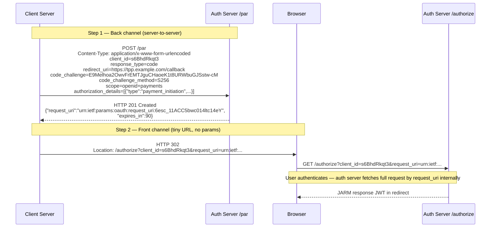

# AuthN/AuthZ Mastery — Phase 1 Implementation Plan

> **For agentic workers:** REQUIRED SUB-SKILL: Use superpowers:subagent-driven-development (recommended) or superpowers:executing-plans to implement this plan task-by-task. Steps use checkbox (`- [ ]`) syntax for tracking.

**Goal:** Author all scaffold files and 10 content days (Hard Protocols) for Phase 1 of authn_authz_mastery, producing study-ready day files + diagram/config labs for every day.

**Architecture:** Five tasks — one scaffold task that creates the directory skeleton and top-level files, then four content-authoring tasks (Days 1–3, 4–6, 7–9, 10 + Appendices). Each content task creates day files under `content/` and matching lab directories under `labs/`. Tasks 1–3 are independent and can be dispatched in parallel; Task 4 depends on Days 1–9 existing (it synthesises them).

**Tech Stack:** Markdown content files, Mermaid diagrams (inline in `diagram.md`), YAML/JSON/HTTP annotated config stubs, local Docker compose stubs (Phase 2 only — not used here).

**Spec:** `authn_authz_mastery/docs/superpowers/specs/2026-09-30-authn-authz-mastery-design.md`

## Global Constraints

- Never write real secrets, keys, tokens, or account IDs — use `<PLACEHOLDER>` + fill-in comments only.
- Never run `git status`, `git diff`, `git log`, `terraform apply`, or any cloud CLI command.
- Every exercise must ship with **Hint:** and **Solution sketch:** — no bare problems.
- Every lab directory must have `README.md`, `diagram.md`, `config/` (at least one stub file), and `SOLUTION.md`.
- Do not re-explain OAuth2/OIDC basics or JWT fundamentals — the learner completed wso2_mastery Phase 1.
- All day files must include sections: `## Why this matters`, `## Core concepts`, `## Anti-patterns / Common mistakes`, `## Exercises`, `## Lab`.
- Phase 1 days (1–10) omit the `## WSO2 IS 7.3 / AgentCore mapping` section — that belongs to Phase 2.
- Content must be banking/fintech-specific: every "Why this matters" opens with a concrete banking failure scenario.

## Review Focus

1. **Missing Hint + Solution sketch on exercises** — every numbered exercise must have both; a bare question with no hint is a content defect.
2. **Generic "Why this matters" paragraphs** — each must name a specific banking incident or failure mode (e.g. "a payment initiation redirect leak exposed the auth code"), not a vague statement about importance.
3. **Mermaid syntax errors in diagram.md** — sequence diagrams must use `sequenceDiagram` keyword and valid participant/arrow syntax; broken diagrams render as raw text.
4. **Config stubs containing real-looking secrets** — any value that looks like a real key, token, or cert fingerprint must be replaced with `<PLACEHOLDER>`.
5. **WSO2 IS 7.3 mapping section appearing in Phase 1 days** — it must be absent from days 01–10; its presence contradicts the phase boundary and misleads the learner.

---

## Task 0: Scaffold

**Files:**
- Create: `authn_authz_mastery/README.md`
- Create: `authn_authz_mastery/STRATEGY.md`
- Create: `authn_authz_mastery/PROGRESS.md`
- Create: `authn_authz_mastery/content/GLOSSARY.md`
- Create dirs: `authn_authz_mastery/content/appendices/`, `authn_authz_mastery/labs/capstone/`

**Interfaces:**
- Produces: top-level files referenced by all content tasks; no content tasks depend on each other, but all depend on the directory skeleton existing.

- [ ] **Step 1: Create directory skeleton**

```bash
mkdir -p authn_authz_mastery/content/appendices
mkdir -p authn_authz_mastery/labs/capstone
for d in $(seq -w 1 10); do
  mkdir -p authn_authz_mastery/labs/day${d}/config
done
```

- [ ] **Step 2: Write README.md**

Write `authn_authz_mastery/README.md` with these exact sections:

```markdown
# AuthN/AuthZ Mastery

**Duration:** 30 days · 3h/day · ~90h  
**Prerequisite:** wso2_mastery complete (OAuth2/OIDC, JWT, Key Manager assumed known)

## Phase Map

| Phase | Days  | Title                          | Status         |
|-------|-------|--------------------------------|----------------|
| 1     | 1–10  | Hard Protocols                 | ⬜ |
| 2     | 11–20 | WSO2 IS 7.3 Deep-dive          | ⬜ |
| 3     | 21–30 | AI Agent Identity + Capstone   | ⬜ |

## Quick Start

Start with `content/day01.md`. Each day: read the content file, work the 3 exercises,
then open `labs/dayNN/` and complete the lab. Check your work against `SOLUTION.md`.

## Day Index

### Phase 1 — Hard Protocols
- [Day 01](content/day01.md) — FAPI 2.0 Security Profile
- [Day 02](content/day02.md) — PAR: Pushed Authorization Requests
- [Day 03](content/day03.md) — RAR: Rich Authorization Requests
- [Day 04](content/day04.md) — CIBA: Backchannel Authentication
- [Day 05](content/day05.md) — DPoP: Proof-of-Possession Tokens
- [Day 06](content/day06.md) — mTLS Client Auth + Certificate-Bound Tokens
- [Day 07](content/day07.md) — SCIM 2.0 Provisioning
- [Day 08](content/day08.md) — Consent Management
- [Day 09](content/day09.md) — SCA: Strong Customer Authentication
- [Day 10](content/day10.md) — Protocol Composition

### Reference
- [GLOSSARY](content/GLOSSARY.md)
- [Protocol Decision Tree](content/appendices/PROTOCOL_DECISION_TREE.md)
- [FAPI Banking Reference](content/appendices/FAPI_BANKING_REFERENCE.md)
```

- [ ] **Step 3: Write STRATEGY.md**

Write `authn_authz_mastery/STRATEGY.md` with this content:

```markdown
# AuthN/AuthZ Mastery — Strategy

## The Unconventional Approach

Most engineers learn identity protocols by reading RFCs in isolation, accumulating a list of
features. This course flips the order: every protocol is introduced through the failure mode
or attack it was designed to prevent.

You learn PAR because you first understand front-channel authorization request leakage.
You learn DPoP because you understand bearer token theft at the TLS termination proxy.
You learn CIBA because you understand why redirect-based flows break headless banking servers.

This anchors the "why" before the "how" — the config details become obvious once the threat is clear.

## The Master Key for AI Agents

RFC 8693 (Token Exchange / OBO) is the single pattern that unlocks every AI agent auth problem.
Every agent identity challenge — AgentCore delegation, MCP tool auth, cross-service agent calls —
is a specialization of the token exchange primitive. Phase 3 of this course radiates outward from
Day 23 (OBO) rather than introducing each pattern independently.

## The Six Mistakes That Waste 80% of Your Time

1. **Treating FAPI 2.0 as a checklist** — it's a coherent threat model. Understand the threat first.
2. **Configuring CIBA without understanding poll vs. push** — silent failures in mobile banking flows.
3. **Using `client_credentials` for agent identity** — agents need OBO (delegated user context), not service account tokens.
4. **Building MCP tool auth with API keys** — breaks auditability and revocation.
5. **Skipping `actor` and `may_act` claims in OBO** — breaks downstream trust chain verification.
6. **Treating IS 7.3 B2B org management as multi-tenancy** — misses the federated IdP-per-org model banking partners require.

## Phase Strategy

- **Phase 1 (Days 1–10):** Master the protocols as threat-model → mechanics → composition.
  By Day 10 you can draw the full FAPI 2.0 composite banking auth flow without notes.
- **Phase 2 (Days 11–20):** Map every Phase 1 protocol to its IS 7.3 config. Zero new theory —
  only implementation depth.
- **Phase 3 (Days 21–30):** AI agent identity, built on OBO as the master primitive.
  The capstone (Days 29–30) forces you to make real architectural decisions.
```

- [ ] **Step 4: Write PROGRESS.md**

Write `authn_authz_mastery/PROGRESS.md`:

```markdown
# AuthN/AuthZ Mastery — Progress Tracker

**Spec:** `docs/superpowers/specs/2026-09-30-authn-authz-mastery-design.md`
**Total:** 3 phases × 10 days = 30 days, 3h/day (~90h)

## Current Status

| Phase | Days  | Title                          | Status          |
|-------|-------|--------------------------------|-----------------|
| 1     | 1–10  | Hard Protocols                 | ⬜ NOT STARTED  |
| 2     | 11–20 | WSO2 IS 7.3 Deep-dive          | ⬜ NOT STARTED  |
| 3     | 21–30 | AI Agent Identity + Capstone   | ⬜ NOT STARTED  |

## Session Log

| Date       | Session goal        | Result                                          |
|------------|--------------------|-------------------------------------------------|
| 2026-09-30 | Brainstorm + spec  | Spec written. 3-phase breakdown complete.       |
| 2026-09-30 | Phase 1 plan       | Plan written. Tasks 0–4 defined. Ready to author. |

## Next Session Instructions

**Phase 1 content authoring:** invoke `superpowers:subagent-driven-development`, pointer to
`docs/superpowers/plans/2026-09-30-authn-authz-phase1-plan.md`. Dispatch Tasks 0 first
(scaffold), then Tasks 1–3 in parallel, then Task 4.

## Phase Plans

| Phase | Plan file | Content Status |
|-------|-----------|----------------|
| 1 | `docs/superpowers/plans/2026-09-30-authn-authz-phase1-plan.md` | ⬜ Not started |
| 2 | `docs/superpowers/plans/2026-09-30-authn-authz-phase2-plan.md` | ⬜ Not written |
| 3 | `docs/superpowers/plans/2026-09-30-authn-authz-phase3-plan.md` | ⬜ Not written |

## WSO2 + AWS Source References

| Component | Local path |
|-----------|-----------|
| WSO2 IS 7.3 | `/Users/hunghan/Downloads/wso2is-7.3.0` |
| WSO2 APIM Universal GW 4.7 | `/Users/hunghan/Downloads/wso2am-universal-gw-4.7.0` |
| WSO2 APIM Control Plane 4.7 | `/Users/hunghan/Downloads/wso2am-acp-4.7.0` |
```

- [ ] **Step 5: Write GLOSSARY.md stub**

Write `authn_authz_mastery/content/GLOSSARY.md` with an initial set of terms for Phase 1:

```markdown
# Glossary

Terms introduced in Phase 1 (Hard Protocols). Phase 2 and 3 terms appended by their respective plans.

## A

**Actor claim (`act`)** — JWT claim in an OBO token identifying the party that is acting on behalf of the subject. RFC 8693.

**`authorization_details`** — JSON array parameter (RFC 9396 / RAR) carrying fine-grained authorization information beyond scopes. Each element has a `type` field identifying the authorization type.

**`auth_req_id`** — Opaque identifier issued by the server in a CIBA flow. The client polls or waits for a push notification using this ID.

## C

**CIBA** — Client-Initiated Backchannel Authentication. An OpenID Connect flow where the authentication request and the user's authentication happen on separate channels (RFC draft: openid-client-initiated-backchannel-authentication-core).

**`cnf` claim** — Confirmation claim in a JWT (RFC 7800). Used by DPoP and mTLS to bind a token to a cryptographic key. Sub-claims: `jkt` (DPoP key thumbprint), `x5t#S256` (mTLS certificate thumbprint).

**Consent receipt** — A structured record given to the user documenting what data processing they consented to. PSD2 requires consent receipts for payment and account-information services.

## D

**DPoP** — Demonstrating Proof of Possession (RFC 9449). A mechanism for sender-constraining OAuth2 tokens using a public/private key pair. The client proves possession of the private key on every request via a DPoP proof JWT.

**Dynamic linking** — PSD2 SCA requirement that the authentication code be cryptographically linked to the specific transaction amount and payee, preventing substitution attacks.

## F

**FAPI 2.0** — Financial-grade API Security Profile 2.0. An OAuth2/OIDC security profile mandating PAR, PKCE, JARM, and other hardening measures for open banking and financial APIs.

**FAPI Baseline / Advanced** — FAPI 1.0 profiles (deprecated in favour of FAPI 2.0). Still encountered in legacy UK Open Banking and older Australian CDR implementations.

## J

**JARM** — JWT Secured Authorization Response Mode (openid-financial-api-jarm). The authorization response is returned as a signed (and optionally encrypted) JWT, preventing response tampering.

**JIT provisioning** — Just-in-Time provisioning. A user account is created in the target system the first time the user authenticates via federation, rather than via a pre-provisioned sync.

## M

**`may_act` claim** — JWT claim (RFC 8693) that identifies parties authorised to impersonate the token subject. Used to pre-authorise an actor before the token exchange happens.

**mTLS** — Mutual TLS. Both the client and server present X.509 certificates during the TLS handshake, providing two-way authentication at the transport layer.

## P

**PAR** — Pushed Authorization Requests (RFC 9126). The client POSTs the authorization request directly to the authorization server and receives a `request_uri` to use in the redirect, keeping request parameters off the front channel.

**PKCE** — Proof Key for Code Exchange (RFC 7636). The client generates a `code_verifier` and sends its hash (`code_challenge`) in the auth request; the server verifies possession of the verifier at token exchange, preventing authorization code interception.

## R

**RAR** — Rich Authorization Requests (RFC 9396). Extends OAuth2 to carry structured, fine-grained authorization information in the `authorization_details` parameter.

**`request_uri`** — An opaque URI returned by the PAR endpoint. Replaces the full authorization request parameters in the redirect URI, valid for a short TTL (typically 60–90 seconds).

## S

**SCA** — Strong Customer Authentication. PSD2 RTS requirement that customer-facing payment or account-access authentication combines at least two of: possession, knowledge, inherence.

**SCIM** — System for Cross-domain Identity Management (RFC 7643, 7644). A REST API standard for provisioning and deprovisioning user and group accounts across systems.

**Sender-constrained token** — An access token bound to a client's cryptographic key (via DPoP or mTLS) so that possession of the token alone is insufficient to use it.

## T

**TRA** — Transaction Risk Analysis. A PSD2 SCA exemption allowing low-risk transactions below a value threshold to skip the full SCA flow based on fraud scoring.
```

- [ ] **Step 6: Verify scaffold**

```bash
# Verify key files exist
ls authn_authz_mastery/README.md \
   authn_authz_mastery/STRATEGY.md \
   authn_authz_mastery/PROGRESS.md \
   authn_authz_mastery/content/GLOSSARY.md

# Verify lab directories created
ls authn_authz_mastery/labs/day01/config/ \
   authn_authz_mastery/labs/day10/config/

# Verify appendices dir
ls authn_authz_mastery/content/appendices/

# Verify no credentials
grep -r "BEGIN PRIVATE\|BEGIN CERTIFICATE\|secret_key\|api_key" authn_authz_mastery/ && echo "FAIL: credentials found" || echo "PASS: no credentials"
```

Expected: all files exist, no credentials found.

---

## Task 1: Days 1–3 — FAPI 2.0, PAR, RAR

**Files:**
- Create: `authn_authz_mastery/content/day01.md`
- Create: `authn_authz_mastery/content/day02.md`
- Create: `authn_authz_mastery/content/day03.md`
- Create: `authn_authz_mastery/labs/day01/README.md`
- Create: `authn_authz_mastery/labs/day01/diagram.md`
- Create: `authn_authz_mastery/labs/day01/config/fapi_client_registration.json`
- Create: `authn_authz_mastery/labs/day01/SOLUTION.md`
- Create: `authn_authz_mastery/labs/day02/README.md`
- Create: `authn_authz_mastery/labs/day02/diagram.md`
- Create: `authn_authz_mastery/labs/day02/config/par_request.http`
- Create: `authn_authz_mastery/labs/day02/SOLUTION.md`
- Create: `authn_authz_mastery/labs/day03/README.md`
- Create: `authn_authz_mastery/labs/day03/diagram.md`
- Create: `authn_authz_mastery/labs/day03/config/authorization_details.json`
- Create: `authn_authz_mastery/labs/day03/SOLUTION.md`

**Interfaces:**
- Consumes: scaffold from Task 0 (directories exist)
- Produces: days 01–03 content and labs; Task 4 (Day 10 synthesis) references these days

- [ ] **Step 1: Write content/day01.md — FAPI 2.0 Security Profile**

Content requirements for `authn_authz_mastery/content/day01.md`:

```markdown
# Day 01 — FAPI 2.0 Security Profile

## Why this matters
[Open with: a bank's TPP redirect flow was intercepted — the authorization request parameters
were visible in server logs and referrer headers, leaking the payment amount and payee.
FAPI 2.0 exists to close that class of attack. Explain the specific failure before naming the fix.]

## Core concepts

Cover all of the following with explanations and a Mermaid sequence diagram for the FAPI 2.0 flow:

- FAPI 2.0 threat model: front-channel leakage, authorization code interception, CSRF, PKCE downgrade
- How FAPI 2.0 compares to plain OAuth2 and FAPI 1.0 (Baseline/Advanced): what each mandate adds
- PAR as a FAPI 2.0 mandatory requirement: why the request must leave the front channel
- PKCE enforcement: S256 only, no plain, no optional — why mandatory in FAPI 2.0
- JARM (JWT Secured Authorization Response Mode): the authorization response as a signed JWT,
  `response_mode=jwt`, preventing response tampering and replay
- `response_type=code` only (no implicit, no hybrid) — rationale
- Short-lived `request_uri` TTL (60–90 seconds) — why
- FAPI 2.0 client authentication: `private_key_jwt` or mTLS (no `client_secret_basic`)

Include a Mermaid sequenceDiagram showing: Client → PAR endpoint (POST auth request) →
receives request_uri → redirects user with request_uri only → auth server → JARM response JWT →
client verifies JARM → token endpoint with PKCE verifier → access token

## Anti-patterns / Common mistakes
- Making PAR optional ("we'll add it later") — FAPI 2.0 mandates it; partial compliance fails audits
- Accepting `response_mode=query` alongside `jwt` — the non-JWT mode leaks params to server logs
- Using `client_secret_basic` for FAPI clients — disallowed; use `private_key_jwt` or mTLS

## Exercises
1. List the four protocol-level differences between FAPI 1.0 Advanced and FAPI 2.0 Security Profile.
   **Hint:** Compare PAR requirements, client auth methods, response modes, and PKCE mandates.
   **Solution sketch:** FAPI 2.0 mandates PAR (FAPI 1.0 Advanced only recommended it); FAPI 2.0
   removes `response_type=id_token` and hybrid flows; FAPI 2.0 mandates `private_key_jwt` or mTLS
   (FAPI 1.0 still allowed `client_secret_jwt`); FAPI 2.0 mandates JARM (`response_mode=jwt`).

2. A bank's auth server receives an authorization request via redirect with `response_mode=query`.
   Explain why this violates FAPI 2.0 and what specific attack it enables.
   **Hint:** Think about where `code` appears in a query-mode response and what systems log it.
   **Solution sketch:** `response_mode=query` puts the authorization `code` in the redirect URL,
   which gets logged by web servers, proxies, and referrer headers. An attacker with log access
   can replay the code. FAPI 2.0 mandates `response_mode=jwt` (JARM) so the response is a signed
   JWT; the code is inside the JWT payload, not in the URL. Replay is prevented by the JARM
   `iat`/`exp` and the `code` is bound to the client via the PKCE verifier.

3. Draw the FAPI 2.0 authorization flow from memory: label each step, identify where PAR, PKCE,
   and JARM each appear, and mark which steps happen on the front channel vs. back channel.
   **Hint:** Front channel = browser redirect. Back channel = direct HTTP from client server.
   **Solution sketch:** Back channel: (1) Client POSTs full auth request to PAR endpoint →
   receives `request_uri`. Front channel: (2) Redirect to auth server with `request_uri` only.
   Auth server: (3) Authenticates user, verifies PKCE `code_challenge`. Front channel: (4) JARM
   response JWT redirected back to client. Back channel: (5) Client POSTs to token endpoint with
   `code` + `code_verifier` → receives access token.

## Lab
See `labs/day01/`. Goal: annotate a FAPI 2.0 client registration JSON and trace the auth flow
in the sequence diagram. Success signal: you can identify which fields enforce which FAPI 2.0
requirements without referring to the spec.
```

- [ ] **Step 2: Write content/day02.md — PAR**

Content requirements for `authn_authz_mastery/content/day02.md`:

```markdown
# Day 02 — PAR: Pushed Authorization Requests

## Why this matters
[Open with: a fintech's mobile banking app sent authorization parameters — including
`authorization_details` describing a £5,000 payment — in the redirect URL. A MITM at the
mobile network layer captured the payment details before authentication even began.
PAR closes this by moving all parameters off the front channel entirely.]

## Core concepts

Cover all of the following with a Mermaid sequence diagram:

- RFC 9126 mechanics: `POST /par` with full auth request parameters → 201 response with
  `request_uri` and `expires_in`
- `request_uri` format: must be a URN or opaque URI, not guessable, short TTL (60–90s)
- The redirect step: client sends ONLY `client_id` + `request_uri` — no auth params in URL
- Replay protection: `request_uri` is single-use; the server invalidates it after first use
- The front-channel leakage attack: what gets logged, what gets leaked, why redirect params are dangerous
- PAR + PKCE interaction: `code_challenge` goes in the PAR body, not the redirect
- PAR + RAR interaction: `authorization_details` goes in the PAR body
- PAR endpoint discovery: `pushed_authorization_request_endpoint` in server metadata
- Error handling: `invalid_request`, `invalid_client`, expired `request_uri`

Include Mermaid sequenceDiagram: Client → PAR endpoint (POST, back channel) →
`{request_uri, expires_in}` → Client → Auth server (redirect with request_uri only) →
user authentication → JARM response → Client validates

## Anti-patterns / Common mistakes
- Sending `request_uri` in the PAR body instead of the redirect — defeats the purpose; `request_uri`
  must be used in the redirect step, not re-POSTed
- Setting `expires_in` too long (> 300s) — increases window for `request_uri` replay
- Not invalidating `request_uri` after first use on the server side — allows replay attacks

## Exercises
1. What is the minimum set of parameters the authorization redirect URI must contain after
   a successful PAR request?
   **Hint:** PAR already sent everything else.
   **Solution sketch:** Only `client_id` and `request_uri`. All other authorization parameters
   (scope, redirect_uri, code_challenge, authorization_details, etc.) were submitted in the PAR
   POST and are referenced server-side via the `request_uri`.

2. A PAR `request_uri` is valid for 90 seconds. The client takes 120 seconds to redirect the
   user (slow app load). What error does the auth server return, and what must the client do?
   **Hint:** Check the `expires_in` field the server returned.
   **Solution sketch:** The server returns `invalid_request` with `error_description` noting the
   `request_uri` has expired. The client must start over: generate a new PKCE pair, POST a new
   PAR request, and use the fresh `request_uri`. The first `request_uri` cannot be reused or extended.

3. Explain why PAR does not eliminate the need for PKCE in FAPI 2.0.
   **Hint:** PAR secures the request parameters. What does PKCE secure?
   **Solution sketch:** PAR prevents leakage of authorization parameters from the front channel.
   PKCE prevents authorization code interception: even if an attacker intercepts the authorization
   `code` in the redirect response, they cannot exchange it without the `code_verifier` (which was
   submitted in the PAR body, never visible on the front channel). Both are needed: PAR protects
   the request, PKCE protects the response.

## Lab
See `labs/day02/`. Goal: read the annotated PAR HTTP exchange and identify all security properties
enforced at each step. Success signal: you can explain why each field exists without looking at RFC 9126.
```

- [ ] **Step 3: Write content/day03.md — RAR**

Content requirements for `authn_authz_mastery/content/day03.md`:

```markdown
# Day 03 — RAR: Rich Authorization Requests

## Why this matters
[Open with: a PSD2 payment API was called with `scope=payments` — a string that conveyed no
information about which account, which amount, or which payee. The API gateway had no way to
enforce per-transaction limits. A compromised token allowed unlimited payments on any account.
RAR exists to carry structured, transaction-specific authorization data into the token.]

## Core concepts

Cover all of the following with annotated JSON examples and a Mermaid diagram:

- RFC 9396: the `authorization_details` parameter as a JSON array of authorization objects
- Each object's required `type` field: the namespace identifying the authorization type
- Banking-specific `type` values:
  - `payment_initiation`: fields: `instructedAmount` (`{currency, amount}`), `creditorAccount`
    (`{iban}`), `creditorName`, `remittanceInformationUnstructured`
  - `account_information`: fields: `access` (`{accounts, balances, transactions}`)
- Comparison with scope strings: why `scope=payments:write:iban:DE89370400440532013000:EUR:100`
  is a hack and RAR is the correct solution
- How `authorization_details` survives into the access token: server mirrors it in the token or
  introspection response
- RAR + PAR interaction: `authorization_details` goes in the PAR POST body
- Resource server enforcement: the RS reads `authorization_details` from the token to enforce
  per-transaction limits (amount, payee, account)
- Downscoping: the token can carry a subset of the originally requested `authorization_details`

Include Mermaid diagram showing the flow of `authorization_details` from PAR request through
to access token and resource server enforcement.

## Anti-patterns / Common mistakes
- Encoding authorization details in custom scope strings — not machine-parseable, breaks interop
- Omitting `authorization_details` from the access token (only keeping it server-side) — the RS
  cannot enforce limits without reading it
- Using a single global `type` namespace per organisation — leads to `authorization_details` bloat;
  use distinct `type` values per resource type

## Exercises
1. Write an `authorization_details` array for a PSD2 payment initiation of €250.00 from
   IBAN DE89370400440532013000 to creditor "Acme GmbH" IBAN GB29NWBK60161331926819.
   **Hint:** Use the `payment_initiation` type. Include `instructedAmount` and `creditorAccount`.
   **Solution sketch:**
   ```json
   [
     {
       "type": "payment_initiation",
       "instructedAmount": { "currency": "EUR", "amount": "250.00" },
       "creditorAccount": { "iban": "GB29NWBK60161331926819" },
       "creditorName": "Acme GmbH",
       "remittanceInformationUnstructured": "Invoice INV-2026-0042"
     }
   ]
   ```

2. A resource server receives an access token. It needs to verify that the token authorises
   exactly the payment described in the request body. What claim does it read, and what fields
   does it check?
   **Hint:** The RS reads `authorization_details` from the introspection response or JWT payload.
   **Solution sketch:** The RS reads the `authorization_details` array and finds the object with
   `"type": "payment_initiation"`. It checks `instructedAmount.currency`, `instructedAmount.amount`,
   `creditorAccount.iban`, and `creditorName` against the request body. If any field mismatches,
   the RS rejects with 403. This prevents a token issued for a €1 payment being used for a €10,000 one.

3. Explain what "downscoping" means in the context of RAR and give a concrete banking example of
   when a server would downscope an `authorization_details` request.
   **Hint:** The authorisation server can grant less than what was requested.
   **Solution sketch:** Downscoping means the server issues a token with a subset of the requested
   `authorization_details`. Example: a TPP requests access to `accounts`, `balances`, and
   `transactions` for a customer's account. The customer consents only to `balances`. The server
   issues a token with `"access": {"balances": [...]}` only, omitting `accounts` and `transactions`.
   The TPP receives the downscoped `authorization_details` in the token response and knows to
   update its consent UI accordingly.

## Lab
See `labs/day03/`. Goal: annotate an `authorization_details` JSON and trace how it flows from the
PAR request to the resource server enforcement check. Success signal: you can write valid
`authorization_details` for a payment initiation and an account information request from memory.
```

- [ ] **Step 4: Write lab files for Day 01**

Write `authn_authz_mastery/labs/day01/README.md`:
```markdown
# Day 01 Lab — FAPI 2.0 Client Registration Annotation

**Goal:** Annotate a FAPI 2.0 client registration JSON to identify which fields enforce which
FAPI 2.0 requirements.

**Success signal:** You can explain the purpose of every field in `config/fapi_client_registration.json`
and identify which FAPI 2.0 mandate each field satisfies — without referring to the spec.

**Steps:**
1. Open `config/fapi_client_registration.json`.
2. For each field, write a one-line comment explaining: (a) what it configures, (b) which FAPI 2.0
   requirement it satisfies.
3. Identify which fields would be present in a plain OAuth2 client registration but are absent here.
4. Check your annotations against `SOLUTION.md`.
```

Write `authn_authz_mastery/labs/day01/diagram.md`:
```markdown
# Day 01 — FAPI 2.0 Authorization Flow Diagram

## Full FAPI 2.0 Flow

```mermaid
sequenceDiagram
    participant C as Client (TPP)
    participant PAR as PAR Endpoint
    participant AS as Authorization Server
    participant U as User (Browser)
    participant TE as Token Endpoint
    participant RS as Resource Server

    Note over C,PAR: Back channel — parameters never touch browser
    C->>PAR: POST /par<br/>client_id, redirect_uri, code_challenge,<br/>response_type=code, scope, authorization_details
    PAR-->>C: 201 {request_uri, expires_in: 90}

    Note over C,U: Front channel — only opaque reference
    C->>U: Redirect to /authorize?client_id=X&request_uri=urn:...
    U->>AS: GET /authorize?client_id=X&request_uri=urn:...
    AS->>AS: Fetch PAR request by request_uri<br/>Validate client, scopes, authorization_details
    AS->>U: Login + consent UI
    U->>AS: Authenticate (SCA factors)
    AS->>AS: Issue auth code, bind code_challenge

    Note over AS,U: JARM — response as signed JWT
    AS->>U: Redirect to redirect_uri?response=<JWT>
    U->>C: Deliver JARM JWT
    C->>C: Verify JARM signature, iss, aud, exp

    Note over C,TE: Back channel — code exchange with PKCE
    C->>TE: POST /token<br/>code, code_verifier, client_assertion (private_key_jwt)
    TE->>TE: Verify code_verifier against code_challenge<br/>Verify client_assertion signature
    TE-->>C: {access_token, token_type: DPoP, ...}

    C->>RS: GET /resource<br/>Authorization: DPoP <token><br/>DPoP: <proof>
    RS-->>C: 200 Resource data
```

## Key security properties at each step

| Step | Protocol | What it prevents |
|------|----------|-----------------|
| PAR POST | PAR (RFC 9126) | Front-channel parameter leakage |
| `request_uri` only in redirect | PAR | Authorization params in browser logs/history |
| JARM response | JARM | Response tampering, replay |
| `code_verifier` at token endpoint | PKCE | Authorization code interception |
| `private_key_jwt` client auth | FAPI 2.0 | Client impersonation |
```

Write `authn_authz_mastery/labs/day01/config/fapi_client_registration.json`:
```json
{
  "client_name": "PSD2 Payment Initiation TPP",
  "redirect_uris": ["https://tpp.example.com/callback"],
  "grant_types": ["authorization_code"],
  "response_types": ["code"],
  "scope": "openid payments accounts",
  "token_endpoint_auth_method": "private_key_jwt",
  "token_endpoint_auth_signing_alg": "PS256",
  "request_object_signing_alg": "PS256",
  "authorization_signed_response_alg": "PS256",
  "authorization_encrypted_response_alg": "RSA-OAEP",
  "authorization_encrypted_response_enc": "A256GCM",
  "require_pushed_authorization_requests": true,
  "require_signed_request_object": true,
  "tls_client_certificate_bound_access_tokens": true,
  "jwks_uri": "https://tpp.example.com/.well-known/jwks.json",
  "id_token_signed_response_alg": "PS256"
}
```

Write `authn_authz_mastery/labs/day01/SOLUTION.md`:
```markdown
# Day 01 Lab — Solution

## Field-by-field annotations

| Field | Purpose | FAPI 2.0 requirement |
|-------|---------|----------------------|
| `grant_types: ["authorization_code"]` | Only auth code flow | FAPI 2.0 prohibits implicit and hybrid |
| `response_types: ["code"]` | Auth code only | No `id_token` or hybrid response types |
| `token_endpoint_auth_method: "private_key_jwt"` | Client authenticates with signed JWT | FAPI 2.0 mandates `private_key_jwt` or mTLS; `client_secret_*` disallowed |
| `token_endpoint_auth_signing_alg: "PS256"` | RSA-PSS SHA-256 | FAPI 2.0 requires PS256 or ES256; RS256 disallowed |
| `authorization_signed_response_alg: "PS256"` | JARM signing algorithm | FAPI 2.0 mandates JARM (`response_mode=jwt`); this sets the signing key |
| `require_pushed_authorization_requests: true` | Server rejects non-PAR requests | FAPI 2.0 mandates PAR |
| `require_signed_request_object: true` | Authorization request must be a JWT | FAPI 2.0 Advanced requirement; prevents parameter tampering |
| `tls_client_certificate_bound_access_tokens: true` | Access tokens are certificate-bound | mTLS token binding (RFC 8705); DPoP is an alternative |
| `jwks_uri` | Public keys for client_assertion verification | Required for `private_key_jwt` client auth |

## Fields absent from plain OAuth2 registration

A plain OAuth2 client registration would not have:
- `require_pushed_authorization_requests` (plain OAuth2 has no PAR concept)
- `authorization_signed_response_alg` (no JARM requirement)
- `tls_client_certificate_bound_access_tokens` (no RFC 8705 binding)
- `require_signed_request_object` (JAR not required by plain OAuth2)
```

- [ ] **Step 5: Write lab files for Day 02**

Write `authn_authz_mastery/labs/day02/README.md`:
```markdown
# Day 02 Lab — PAR Request Trace

**Goal:** Read the annotated PAR HTTP exchange and explain the security property enforced at each step.

**Success signal:** You can explain why each HTTP header, parameter, and response field exists
in the PAR flow without referring to RFC 9126.

**Steps:**
1. Open `config/par_request.http` and read the annotated request/response pair.
2. For each annotated comment, verify you understand what would break if that element were missing.
3. Trace what happens if the `request_uri` expires before use.
4. Check your understanding against `SOLUTION.md`.
```

Write `authn_authz_mastery/labs/day02/diagram.md`:
```markdown
# Day 02 — PAR Front-Channel vs Back-Channel Separation



## What gets logged at each step

| Step | What's in server logs | Risk if exposed |
|------|----------------------|-----------------|
| PAR POST | Full auth params — but it's back-channel TLS | No browser, no proxy, safe |
| Redirect URL | Only `client_id` + `request_uri` (opaque) | Opaque reference — no sensitive data |
| JARM redirect | Signed JWT | Tamper-evident; replaying fails `exp` check |
```

Write `authn_authz_mastery/labs/day02/config/par_request.http`:
```http
### Step 1: PAR POST — all parameters go here, not in the redirect
POST /par HTTP/1.1
Host: auth.bank.example.com
Content-Type: application/x-www-form-urlencoded
# Client authenticates with private_key_jwt (FAPI 2.0 requirement)
Authorization: Bearer <PLACEHOLDER: private_key_jwt client_assertion>

# Authorization parameters — all sensitive, all back-channel
client_id=<PLACEHOLDER: tpp_client_id>
&response_type=code
# redirect_uri is registered; validated server-side — not echoed in logs
&redirect_uri=https://tpp.example.com/callback
# PKCE — code_challenge sent here, code_verifier sent at token exchange
&code_challenge=<PLACEHOLDER: base64url(sha256(code_verifier))>
&code_challenge_method=S256
&scope=openid+payments+accounts
# RAR — structured authorization details, not visible in any redirect URL
&authorization_details=%5B%7B%22type%22%3A%22payment_initiation%22%2C%22instructedAmount%22%3A%7B%22currency%22%3A%22EUR%22%2C%22amount%22%3A%22250.00%22%7D%7D%5D

### Step 1 Response
HTTP/1.1 201 Created
Content-Type: application/json

{
  "request_uri": "urn:ietf:params:oauth:request_uri:6esc_11ACC5bwc014ltc14eY",
  "expires_in": 90
}

### Step 2: Redirect — only opaque request_uri, no sensitive parameters in URL
# Browser URL bar shows: /authorize?client_id=...&request_uri=urn:ietf:...
# Server logs show: same — no payment details, no IBAN, no amount
GET /authorize?client_id=<PLACEHOLDER>&request_uri=urn:ietf:params:oauth:request_uri:6esc_11ACC5bwc014ltc14eY HTTP/1.1
Host: auth.bank.example.com
```

Write `authn_authz_mastery/labs/day02/SOLUTION.md`:
```markdown
# Day 02 Lab — Solution

## Security property at each step

**PAR POST body:**
- All authorization parameters submitted directly to the auth server over mTLS/TLS back-channel.
- `authorization_details` (payment details including amount/IBAN) never touches the browser.
- If a network proxy logs the redirect URL, it sees only an opaque `request_uri`.

**`request_uri` format:**
- `urn:ietf:params:oauth:request_uri:` prefix is required by RFC 9126.
- The opaque suffix is server-generated, non-guessable (must have ≥128 bits of entropy).
- Single-use: the server invalidates it after the first `/authorize` request uses it.

**`expires_in: 90`:**
- The client must redirect the user within 90 seconds.
- Expiry limits the window for `request_uri` guessing or replay.

## What happens if `request_uri` expires

The client redirects after 90 seconds. The auth server looks up `request_uri`, finds it expired,
and returns `error=invalid_request&error_description=request_uri+expired`. The client must
generate a new PKCE pair and POST a new PAR request. The expired `request_uri` is discarded.

## What would break without PAR

Without PAR, the client would send `authorization_details` (including payment amount, IBAN,
payee name) in the redirect URL query string. That URL appears in:
- Browser history
- Referrer headers sent to the redirect_uri server
- Proxy and CDN access logs
- Mobile OS "recent apps" screenshots

PAR moves all of this to a back-channel TLS POST where none of those vectors apply.
```

- [ ] **Step 6: Write lab files for Day 03**

Write `authn_authz_mastery/labs/day03/README.md`:
```markdown
# Day 03 Lab — RAR Authorization Details Trace

**Goal:** Write valid `authorization_details` for two banking scenarios and trace how the
values flow from the PAR request to the resource server enforcement check.

**Success signal:** You can write `authorization_details` for a payment initiation and an
account information request from memory, and explain how a resource server uses each field.

**Steps:**
1. Open `config/authorization_details.json` — two annotated examples.
2. For each field, note: (a) which party writes it, (b) which party reads it, (c) what happens
   if the field is missing or wrong.
3. Write a third `authorization_details` object for a standing order (recurring payment) of
   €50/month. See `SOLUTION.md` for one possible answer.
```

Write `authn_authz_mastery/labs/day03/diagram.md`:
```markdown
# Day 03 — Authorization Details Flow

```mermaid
sequenceDiagram
    participant TPP as TPP Client
    participant PAR as PAR Endpoint
    participant AS as Authorization Server
    participant U as User
    participant TE as Token Endpoint
    participant RS as Payments API

    TPP->>PAR: POST /par<br/>authorization_details=[{type:payment_initiation,<br/>instructedAmount:{EUR,250.00},<br/>creditorAccount:{iban:GB29...}}]
    PAR-->>TPP: {request_uri, expires_in}

    TPP->>U: Redirect with request_uri
    U->>AS: Authenticate + review consent UI
    Note over AS,U: Consent UI shows: "Pay Acme GmbH €250.00"<br/>(rendered from authorization_details)
    U->>AS: Approve
    AS->>AS: Store consent record linked to auth_code<br/>Bind authorization_details to consent

    AS-->>TPP: Auth code (JARM)
    TPP->>TE: POST /token + code + code_verifier
    TE-->>TPP: {access_token with authorization_details embedded}

    TPP->>RS: POST /payments<br/>Authorization: Bearer <token><br/>Body: {amount: EUR 250.00, creditorIban: GB29...}
    RS->>RS: Introspect token → read authorization_details<br/>Compare body fields vs token claims
    Note over RS: Amount matches? Payee matches? IBAN matches?
    RS-->>TPP: 201 Payment accepted (or 403 if mismatch)
```
```

Write `authn_authz_mastery/labs/day03/config/authorization_details.json`:
```json
[
  {
    "type": "payment_initiation",
    "instructedAmount": {
      "currency": "EUR",
      "amount": "250.00"
    },
    "creditorAccount": {
      "iban": "GB29NWBK60161331926819"
    },
    "creditorName": "Acme GmbH",
    "remittanceInformationUnstructured": "Invoice INV-2026-0042"
  },
  {
    "type": "account_information",
    "access": {
      "accounts": [
        { "iban": "DE89370400440532013000" }
      ],
      "balances": [
        { "iban": "DE89370400440532013000" }
      ],
      "transactions": [
        { "iban": "DE89370400440532013000" }
      ]
    },
    "recurringIndicator": false,
    "validUntil": "2026-12-31",
    "frequencyPerDay": 4
  }
]
```

Write `authn_authz_mastery/labs/day03/SOLUTION.md`:
```markdown
# Day 03 Lab — Solution

## Field-by-field annotation

### Payment initiation object

| Field | Written by | Read by | Missing = |
|-------|-----------|---------|-----------|
| `type: "payment_initiation"` | TPP | AS (consent UI), RS (enforcement) | Unknown object type — server must reject |
| `instructedAmount` | TPP | AS (consent display), RS (amount check) | No amount constraint — token authorises any amount |
| `creditorAccount.iban` | TPP | AS (consent display), RS (payee check) | No payee constraint — token authorises payment to anyone |
| `creditorName` | TPP | AS (consent display UI only) | Consent UI shows blank payee name |
| `remittanceInformationUnstructured` | TPP | RS (payment reference) | Payment has no reference |

### Standing order (recurring payment) example

```json
{
  "type": "standing_order",
  "instructedAmount": {
    "currency": "EUR",
    "amount": "50.00"
  },
  "frequency": "Monthly",
  "startDate": "2026-10-01",
  "endDate": "2027-09-30",
  "dayOfExecution": "01",
  "creditorAccount": {
    "iban": "GB29NWBK60161331926819"
  },
  "creditorName": "Acme GmbH"
}
```

The `type` value (`standing_order`) is the key differentiator. The auth server must know this
`type` and its schema to render a meaningful consent UI. If the server does not recognise the
`type`, it must reject with `invalid_authorization_details`.
```

- [ ] **Step 7: Verify Task 1**

```bash
# Verify all day files exist with required sections
for day in 01 02 03; do
  for section in "Why this matters" "Core concepts" "Anti-patterns" "Exercises" "Lab"; do
    grep -q "$section" authn_authz_mastery/content/day${day}.md || echo "FAIL: day${day}.md missing section: $section"
  done
  # Verify exercises have Hint and Solution sketch
  grep -c "Hint:" authn_authz_mastery/content/day${day}.md | grep -q "^3$" || echo "WARN: day${day}.md may not have 3 hints"
  grep -c "Solution sketch:" authn_authz_mastery/content/day${day}.md | grep -q "^3$" || echo "WARN: day${day}.md may not have 3 solution sketches"
done

# Verify lab files exist
for day in 01 02 03; do
  ls authn_authz_mastery/labs/day${day}/README.md \
     authn_authz_mastery/labs/day${day}/diagram.md \
     authn_authz_mastery/labs/day${day}/SOLUTION.md || echo "FAIL: missing lab file for day${day}"
done

# Verify Mermaid in diagrams
for day in 01 02 03; do
  grep -q "sequenceDiagram\|flowchart\|graph" authn_authz_mastery/labs/day${day}/diagram.md || echo "FAIL: day${day} diagram.md missing Mermaid block"
done

# Verify no real credentials
grep -r "BEGIN PRIVATE\|BEGIN CERT\|AKIA[A-Z0-9]\|sk-[a-zA-Z0-9]" authn_authz_mastery/content/day0[123].md authn_authz_mastery/labs/day0[123]/ && echo "FAIL: credentials found" || echo "PASS: no credentials"

# Verify Phase 1 days do NOT contain IS 7.3 mapping section
grep -l "WSO2 IS 7.3 / AgentCore mapping" authn_authz_mastery/content/day0[123].md && echo "FAIL: Phase 1 days must not have IS mapping section" || echo "PASS: no IS mapping section in Phase 1"
```

Expected: all PASS, no FAILs.

---

## Task 2: Days 4–6 — CIBA, DPoP, mTLS

**Files:**
- Create: `authn_authz_mastery/content/day04.md`
- Create: `authn_authz_mastery/content/day05.md`
- Create: `authn_authz_mastery/content/day06.md`
- Create: `authn_authz_mastery/labs/day04/README.md`
- Create: `authn_authz_mastery/labs/day04/diagram.md`
- Create: `authn_authz_mastery/labs/day04/config/ciba_request.http`
- Create: `authn_authz_mastery/labs/day04/SOLUTION.md`
- Create: `authn_authz_mastery/labs/day05/README.md`
- Create: `authn_authz_mastery/labs/day05/diagram.md`
- Create: `authn_authz_mastery/labs/day05/config/dpop_proof.json`
- Create: `authn_authz_mastery/labs/day05/SOLUTION.md`
- Create: `authn_authz_mastery/labs/day06/README.md`
- Create: `authn_authz_mastery/labs/day06/diagram.md`
- Create: `authn_authz_mastery/labs/day06/config/mtls_client_config.yaml`
- Create: `authn_authz_mastery/labs/day06/SOLUTION.md`

**Interfaces:**
- Consumes: scaffold from Task 0
- Produces: days 04–06 content and labs; referenced by Task 4 (Day 10 synthesis)

- [ ] **Step 1: Write content/day04.md — CIBA**

Content requirements for `authn_authz_mastery/content/day04.md`:

```markdown
# Day 04 — CIBA: Client-Initiated Backchannel Authentication

## Why this matters
[Open with: a bank's call centre agent needs to initiate a high-value payment confirmation
on behalf of a customer who is on the phone. The customer's browser is not open — they're
using a mobile app. A standard redirect-based OAuth2 flow is impossible: there is no browser
session to redirect. CIBA solves this by decoupling the authentication request (server-side)
from the user's authentication (mobile app), allowing the bank's backend to initiate auth
without controlling the user's device.]

## Core concepts

Cover all of the following with Mermaid sequence diagrams for each mode:

- CIBA flow overview: three parties — consumption device (server), authentication device (mobile), AS
- `POST /bc-authorize` request: `login_hint`, `binding_message`, `scope`, `authorization_details`
- `auth_req_id`: opaque identifier, `expires_in`, `interval` (polling interval)
- Three delivery modes:
  - **Poll mode**: client polls `POST /token` with `grant_type=urn:openid:params:grant-type:ciba`
    and `auth_req_id` until the user authenticates or it expires
  - **Ping mode**: AS sends a notification to the client's `client_notification_endpoint` when
    ready; client then makes one token request
  - **Push mode**: AS pushes the tokens directly to `client_notification_endpoint`; no token request needed
- `binding_message`: shown on both the consumption device and the mobile app to prevent MITM
  substitution — the user must verify they match before approving
- Error states: `authorization_pending` (keep polling), `slow_down` (back off), `expired_token`
- `hint_type` values: `login_hint` (opaque user ref), `login_hint_token` (JWT), `id_token_hint`

Include two Mermaid sequence diagrams:
1. Poll mode: client → bc-authorize → auth_req_id → polling loop → user auth → token
2. Push mode: AS → client notification endpoint → tokens delivered

## Anti-patterns / Common mistakes
- Polling faster than the `interval` value — AS returns `slow_down`, doubles the interval
- Not displaying `binding_message` on the consumption device — allows substitution attacks where
  the user approves the wrong transaction
- Using push mode without a hardened `client_notification_endpoint` — push tokens arrive over
  the network; the endpoint must validate the `client_notification_token` before accepting

## Exercises
1. A banking server initiates a CIBA request with `login_hint=user123` and `binding_message="PAY-4821"`.
   The user's mobile app shows "PAY-4821" and approves. What does the binding_message protect against?
   **Hint:** Think about what happens if an attacker simultaneously initiates their own CIBA request.
   **Solution sketch:** The `binding_message` links the consumption device (bank server) to the
   user's authentication device (mobile). Without it, an attacker could initiate a parallel CIBA
   request for a fraudulent payment — the user would see an approval request with no context and
   might approve it. With `binding_message`, the user sees "PAY-4821" on the bank UI AND on their
   mobile; if the codes differ, they reject. This is the CIBA equivalent of transaction dynamic linking.

2. A client polls `POST /token` with `auth_req_id` and receives `error: slow_down`. What must
   it do, and why does this error exist?
   **Hint:** The `slow_down` response includes an updated `interval`.
   **Solution sketch:** The client must add the `interval` value (typically 5 seconds) to its
   current polling interval before the next attempt, then use the new interval going forward.
   `slow_down` exists to prevent DDoS-style polling storms against the AS during peak hours
   (e.g., bank-wide MFA challenge campaigns). The doubling mechanism naturally backs off heavy
   pollers while light pollers are unaffected.

3. Compare poll mode and push mode for a banking call centre use case (1,000 concurrent agent
   sessions, each waiting for customer approval). Which mode is more appropriate and why?
   **Hint:** Consider connection count, latency, and infrastructure complexity.
   **Solution sketch:** Push mode. With 1,000 concurrent sessions, poll mode would generate
   1,000 polling threads/goroutines each making HTTP requests every 5 seconds = ~200 req/s
   sustained against the token endpoint, even when most users haven't responded yet. Push mode
   eliminates polling entirely: the AS sends a single notification to the bank's endpoint when
   each user approves, reducing the token endpoint load to exactly the number of approvals per
   second. Trade-off: the bank must expose and secure a `client_notification_endpoint`.

## Lab
See `labs/day04/`. Goal: trace a CIBA poll-mode flow from bc-authorize request to token delivery.
Success signal: you can identify `auth_req_id`, polling interval, binding_message, and token grant type.
```

- [ ] **Step 2: Write content/day05.md — DPoP**

Content requirements for `authn_authz_mastery/content/day05.md`:

```markdown
# Day 05 — DPoP: Demonstrating Proof of Possession

## Why this matters
[Open with: a bank deploys an API gateway that terminates TLS and forwards requests to
backend services over plain HTTP. A rogue backend engineer captures the `Authorization: Bearer`
token from internal traffic and replays it from their laptop to exfiltrate payment data.
Bearer tokens are possession-sufficient: whoever holds the token can use it. DPoP makes the token
useless without the corresponding private key — which never leaves the legitimate client.]

## Core concepts

Cover all of the following with annotated JWT examples and a Mermaid sequence diagram:

- RFC 9449: DPoP proof JWT structure — header: `typ: dpop+jwt`, `alg`, `jwk` (public key);
  claims: `jti` (nonce), `htm` (HTTP method), `htu` (HTTP URL), `iat`, `ath` (access token hash)
- How the `jwk` in the DPoP proof header becomes the `cnf.jkt` (JWK thumbprint) in the access token
- The token request flow: client sends `DPoP: <proof>` header in the token request;
  AS issues token with `token_type: DPoP` and `cnf.jkt`
- The resource request flow: client sends `Authorization: DPoP <token>` + `DPoP: <new proof>`;
  RS verifies: (a) `ath` in proof matches sha256(access_token), (b) `htm`/`htu` match request,
  (c) `jti` not seen before (replay check), (d) `cnf.jkt` matches `jwk` thumbprint in proof
- `nonce` challenge: AS/RS may send `DPoP-Nonce` header; client must include it in next proof's
  `nonce` claim — prevents offline proof pre-generation
- Why bearer token theft at TLS termination proxy is defeated: attacker has the token but not the
  private key; forging a DPoP proof requires the private key

Include a Mermaid sequence diagram showing the full DPoP token request and resource request flow,
including the `ath` binding between proof and token.

## Anti-patterns / Common mistakes
- Reusing a DPoP proof across requests — `jti` replay check on the RS will reject it; generate
  a fresh proof per request
- Using the same DPoP key for all services — compromise of one service's logs exposes the key
  association; use per-service key pairs
- Not validating `htm`/`htu` on the resource server — allows proof portability across endpoints

## Exercises
1. A DPoP proof JWT has `htm: "GET"` and `htu: "https://api.bank.com/accounts"`. The client
   sends this proof with a POST request to `https://api.bank.com/payments`. Does the RS accept it?
   **Hint:** What do `htm` and `htu` bind the proof to?
   **Solution sketch:** No. The RS validates `htm` against the actual HTTP method (POST ≠ GET)
   and `htu` against the actual URL (`/payments` ≠ `/accounts`). Both validations fail. The proof
   is method-and-URL-bound by design — it cannot be reused for a different endpoint or method.
   The client must generate a new DPoP proof for every request, binding `htm`=`POST` and
   `htu`=`https://api.bank.com/payments`.

2. Explain the role of `ath` (access token hash) in a DPoP proof and what attack it prevents.
   **Hint:** Consider what an attacker can do with a DPoP proof but no access token.
   **Solution sketch:** `ath` is `base64url(sha256(access_token_bytes))`. It binds the DPoP
   proof to a specific access token. Without `ath`, an attacker who intercepts a DPoP proof
   could pair it with a different access token (e.g., one with broader scopes). With `ath`, the
   RS computes sha256 of the presented access token and verifies it matches `ath` in the proof —
   the proof is useless with any other token.

3. A resource server returns `WWW-Authenticate: DPoP error="use_dpop_nonce"` with a
   `DPoP-Nonce: abc123` header. What must the client do on the next request?
   **Hint:** Nonces prevent pre-generated proofs.
   **Solution sketch:** The client must include `"nonce": "abc123"` in the claims of the next
   DPoP proof JWT. The RS (or AS) will verify the nonce matches the one it issued. This prevents
   an attacker from pre-generating a batch of DPoP proofs offline and replaying them later —
   each proof must incorporate a server-issued nonce that was not available at pre-generation time.

## Lab
See `labs/day05/`. Goal: annotate a DPoP proof JWT to identify how it binds to the access token
and the HTTP request. Success signal: you can explain the purpose of every claim in the proof.
```

- [ ] **Step 3: Write content/day06.md — mTLS**

Content requirements for `authn_authz_mastery/content/day06.md`:

```markdown
# Day 06 — mTLS Client Auth + Certificate-Bound Tokens

## Why this matters
[Open with: a bank's API was called from an unknown IP with a valid access token stolen from a
developer's laptop. The token was bearer — no binding to the developer's TLS certificate.
Any holder could use it. mTLS token binding ensures that even a stolen token is useless without
the client certificate that was bound to it at issuance time.]

## Core concepts

Cover all of the following with annotated config examples and a Mermaid diagram:

- RFC 8705: two mTLS client authentication methods:
  - `tls_client_auth`: the client presents a certificate with a `Subject DN` or `SAN` that
    matches the registered `tls_client_auth_subject_dn` — relies on PKI CA validation
  - `self_signed_tls_client_auth`: the client presents a self-signed certificate whose public
    key thumbprint (`x5t#S256`) matches the registered `jwks_uri` certificate — no CA required
- Certificate-bound access tokens: when the AS issues a token to an mTLS-authenticated client,
  it embeds `cnf.x5t#S256` (SHA-256 thumbprint of the client cert) in the token
- Resource server validation: on each request the RS extracts the client cert from the TLS
  session, computes its `x5t#S256`, and verifies it matches the `cnf.x5t#S256` in the token
- mTLS at the API gateway: the gateway terminates TLS, extracts the cert, and forwards cert info
  in a header (e.g., `X-Client-Cert-Thumbprint`) to backend services
- PKI chain in banking: CA hierarchy, intermediate CAs, certificate revocation (CRL/OCSP),
  certificate rotation without service interruption
- mTLS vs DPoP: mTLS binds to a TLS certificate (infrastructure-level); DPoP binds to an
  application-level key pair. FAPI 2.0 allows either; some deployments use both.

Include a Mermaid sequence diagram showing mTLS handshake → client auth → token with cnf →
resource request → cert extraction → cnf verification.

## Anti-patterns / Common mistakes
- Forwarding the full client certificate PEM in an HTTP header to backend services — cert is
  large, exposes PKI details; forward only the `x5t#S256` thumbprint
- Not configuring OCSP stapling — certificate revocation checks add latency; stapling moves the
  check to the server and caches the OCSP response
- Rotating certificates without pre-registering the new cert — causes a window where the new cert
  is rejected; always register the replacement cert before retiring the old one

## Exercises
1. A bank uses `tls_client_auth` for its TPP onboarding. A new TPP presents a certificate
   issued by an unknown intermediate CA. The AS rejects it. Explain why and what the TPP must do.
   **Hint:** `tls_client_auth` relies on PKI chain validation.
   **Solution sketch:** `tls_client_auth` requires the client certificate to chain up to a CA that
   the AS trusts. The AS maintains a trust store of accepted CA certificates. If the TPP's
   intermediate CA is not in the trust store, the TLS handshake fails. The TPP must either obtain
   a certificate from a CA in the AS's trust store, or the bank must add the TPP's CA to the trust
   store (common in closed banking ecosystems). In open banking (UK, AU, Brazil), the allowed CAs
   are defined by the ecosystem's trust framework.

2. Compare the operational burden of `tls_client_auth` vs `self_signed_tls_client_auth` for a
   fintech with 50 TPP clients rotating certificates annually.
   **Hint:** Consider CA dependency and cert registration steps.
   **Solution sketch:** `tls_client_auth` requires each TPP certificate to be issued by a trusted
   CA — the bank has no control over TPP cert issuance timelines, and CA-issued certs cost money
   and have lead time. `self_signed_tls_client_auth` allows the TPP to generate its own keypair
   and register the cert's `x5t#S256` thumbprint via the JWKS URI — no CA dependency, instant
   rotation, zero cost. Trade-off: the bank cannot rely on CA-level identity validation; it must
   verify TPP identity via its own onboarding process. For closed ecosystems with a known set of
   partners, `self_signed_tls_client_auth` is often preferable.

3. An API gateway terminates TLS and forwards requests to a backend service. How should the
   gateway communicate the client's mTLS certificate identity to the backend?
   **Hint:** The backend cannot see the original TLS session.
   **Solution sketch:** The gateway should extract the `x5t#S256` thumbprint from the client
   certificate during the TLS handshake and forward it in a trusted internal header (e.g.,
   `X-Client-Cert-Thumbprint: <base64url_sha256_thumbprint>`). The backend reads this header and
   validates it against the `cnf.x5t#S256` claim in the access token. The header must be stripped
   from external requests to prevent spoofing — only the gateway should be able to set it (enforce
   via mTLS between gateway and backend, or network policy).

## Lab
See `labs/day06/`. Goal: annotate an mTLS client config and trace how the certificate thumbprint
flows from TLS handshake to access token `cnf` claim to resource server validation.
Success signal: you can explain what `cnf.x5t#S256` means and how the RS validates it.
```

- [ ] **Step 4: Write all lab files for Days 04–06**

For each of days 04, 05, 06, write minimal but complete lab files following the Day 01–03 pattern:

**Day 04 labs:**

`labs/day04/README.md` — Lab goal: trace a CIBA poll-mode HTTP exchange from bc-authorize to token delivery.

`labs/day04/diagram.md` — Mermaid sequenceDiagram showing poll mode and push mode CIBA flows side by side.

`labs/day04/config/ciba_request.http` — Annotated HTTP exchange:
- `POST /bc-authorize` with `login_hint`, `binding_message`, `scope`, `authorization_details`
- 200 response with `auth_req_id`, `expires_in`, `interval`
- `POST /token` poll with `grant_type=urn:openid:params:grant-type:ciba&auth_req_id=...`
- 400 response with `error=authorization_pending`
- Second poll response: 200 with access token

`labs/day04/SOLUTION.md` — Explain: what each field in bc-authorize does, why `binding_message` is
shown to the user, what `authorization_pending` means and when polling stops.

**Day 05 labs:**

`labs/day05/README.md` — Lab goal: annotate a DPoP proof JWT to understand how each claim binds
the proof to the access token and the HTTP request.

`labs/day05/diagram.md` — Mermaid sequenceDiagram: DPoP token request flow showing proof header,
`cnf.jkt` in access token, resource request with `ath`, RS validation steps.

`labs/day05/config/dpop_proof.json` — Two annotated JSON objects:
1. DPoP proof JWT decoded (header + claims), with comments on each field
2. Corresponding access token decoded (showing `cnf.jkt` and `token_type: DPoP`)

All key/fingerprint values must be `<PLACEHOLDER>`.

`labs/day05/SOLUTION.md` — Explain: why each claim exists, how `ath` links proof to token,
what the RS checks in order, what `jti` prevents.

**Day 06 labs:**

`labs/day06/README.md` — Lab goal: trace the certificate thumbprint from TLS handshake through
access token `cnf` to resource server validation.

`labs/day06/diagram.md` — Mermaid sequenceDiagram: client TLS cert → AS token with `cnf.x5t#S256` →
API gateway cert extraction → backend header forwarding → token introspection validation.

`labs/day06/config/mtls_client_config.yaml` — Annotated YAML showing:
- Client JWKS URI entry with a `x5c` (cert chain) value as `<PLACEHOLDER>`
- Token response showing `cnf: {x5t#S256: "<PLACEHOLDER>"}` 
- Resource server config showing how it validates `cnf` against the forwarded header

`labs/day06/SOLUTION.md` — Explain: `tls_client_auth` vs `self_signed_tls_client_auth` differences,
how certificate rotation works without downtime, why thumbprints (not full PEM) are forwarded.

- [ ] **Step 5: Verify Task 2**

```bash
for day in 04 05 06; do
  for section in "Why this matters" "Core concepts" "Anti-patterns" "Exercises" "Lab"; do
    grep -q "$section" authn_authz_mastery/content/day${day}.md || echo "FAIL: day${day}.md missing: $section"
  done
  grep -c "Hint:" authn_authz_mastery/content/day${day}.md | grep -q "^3$" || echo "WARN: day${day}.md may not have 3 hints"
  ls authn_authz_mastery/labs/day${day}/README.md \
     authn_authz_mastery/labs/day${day}/diagram.md \
     authn_authz_mastery/labs/day${day}/SOLUTION.md || echo "FAIL: missing lab file for day${day}"
  grep -q "sequenceDiagram\|flowchart\|graph" authn_authz_mastery/labs/day${day}/diagram.md || echo "FAIL: day${day} diagram.md missing Mermaid"
done
grep -r "BEGIN PRIVATE\|BEGIN CERT\|AKIA[A-Z0-9]" authn_authz_mastery/content/day0[456].md authn_authz_mastery/labs/day0[456]/ && echo "FAIL: credentials found" || echo "PASS"
grep -l "WSO2 IS 7.3 / AgentCore mapping" authn_authz_mastery/content/day0[456].md && echo "FAIL: Phase 1 must not have IS mapping" || echo "PASS"
```

---

## Task 3: Days 7–9 — SCIM, Consent Management, SCA

**Files:**
- Create: `authn_authz_mastery/content/day07.md`
- Create: `authn_authz_mastery/content/day08.md`
- Create: `authn_authz_mastery/content/day09.md`
- Create: `authn_authz_mastery/labs/day07/README.md`
- Create: `authn_authz_mastery/labs/day07/diagram.md`
- Create: `authn_authz_mastery/labs/day07/config/scim_user_patch.json`
- Create: `authn_authz_mastery/labs/day07/SOLUTION.md`
- Create: `authn_authz_mastery/labs/day08/README.md`
- Create: `authn_authz_mastery/labs/day08/diagram.md`
- Create: `authn_authz_mastery/labs/day08/config/consent_object.json`
- Create: `authn_authz_mastery/labs/day08/SOLUTION.md`
- Create: `authn_authz_mastery/labs/day09/README.md`
- Create: `authn_authz_mastery/labs/day09/diagram.md`
- Create: `authn_authz_mastery/labs/day09/config/sca_step_up_flow.http`
- Create: `authn_authz_mastery/labs/day09/SOLUTION.md`

**Interfaces:**
- Consumes: scaffold from Task 0
- Produces: days 07–09 content and labs; referenced by Task 4 (Day 10 synthesis)

- [ ] **Step 1: Write content/day07.md — SCIM 2.0**

Content requirements:

```markdown
# Day 07 — SCIM 2.0 Provisioning

## Why this matters
[Open with: a bank onboards a new partner bank via an API partnership. The partner bank needs
access for 500 of its employees. The bank's IAM team manually creates 500 accounts — a process
that takes 3 days and creates inconsistencies (wrong department, missing role). When 50 employees
leave the partner bank, no offboarding notification arrives and the accounts remain active for
6 months. SCIM eliminates manual provisioning and ensures deprovisioning is automatic and auditable.]

## Core concepts

Cover all of the following:

- RFC 7643: SCIM Core Schema — `User` resource (attributes: `id`, `userName`, `name`, `emails`,
  `groups`, `active`, `externalId`), `Group` resource, `EnterpriseUser` extension
- RFC 7644: SCIM Protocol — HTTP methods and endpoints:
  - `GET /Users/{id}` — read a user
  - `POST /Users` — create a user (provision)
  - `PUT /Users/{id}` — replace a user (full update)
  - `PATCH /Users/{id}` — partial update (most common for attribute changes)
  - `DELETE /Users/{id}` — deprovision
  - `GET /Users?filter=userName eq "john"` — search
- `PATCH` operation structure: `{"schemas":["urn:ietf:params:scim:api:messages:2.0:PatchOp"],
  "Operations":[{"op":"replace","path":"active","value":false}]}`
- JIT provisioning vs. scheduled SCIM sync: tradeoffs for banking (compliance audit trail favours
  scheduled SCIM; user experience favours JIT)
- B2B org user federation: partner bank's IdP → SCIM push to receiving bank → user created with
  `externalId` linking back to partner's IdP user ID
- Deprovisioning: `PATCH active=false` vs `DELETE` — compliance implications (DELETE loses audit
  history; `active=false` retains the account record)

Include a Mermaid sequence diagram: partner IdP → SCIM client → `/Users` POST/PATCH/DELETE →
receiving bank's identity store → user lifecycle.

## Anti-patterns / Common mistakes
- Using `DELETE` for deprovisioning in regulated environments — destroys audit trail; use
  `PATCH active=false` instead
- Not propagating group membership changes — if a user moves from `payment-approvers` to
  `read-only`, the SCIM client must PATCH the `Group` resource, not just the user
- Ignoring `externalId` — without it, re-provisioning creates duplicate accounts

## Exercises
1. Write a SCIM PATCH operation to deactivate a user and remove them from the `payment-approvers`
   group without deleting the user record.
   **Hint:** Use two operations in one PATCH: set `active=false` and remove the group membership.
   **Solution sketch:** A PATCH to `/Users/{id}` with operations: (1) `{"op":"replace","path":"active","value":false}`, (2) `{"op":"remove","path":"groups","value":[{"value":"<group-id>"}]}`. Both in a single `Operations` array.

2. A partner bank's SCIM client provisions a user with `externalId: "partner123"`. Six months
   later, the user is deprovisioned (`active=false`). A year later, the same user returns. What
   should the SCIM client do, and why?
   **Hint:** Search by `externalId` before creating.
   **Solution sketch:** The SCIM client should first `GET /Users?filter=externalId eq "partner123"`.
   If found (with `active=false`), it should PATCH `active=true` and update any changed attributes —
   not create a new user. Creating a new user loses the audit trail linking the account to historical
   transactions and access events. Re-activating preserves continuity.

3. A bank switches from JIT provisioning to scheduled SCIM sync for regulatory compliance.
   What new operational requirement does this introduce, and what does it eliminate?
   **Hint:** Think about timing and audit evidence.
   **Solution sketch:** Scheduled SCIM sync requires running a provisioning job (typically nightly
   or hourly) and retaining job execution logs as audit evidence — the bank can prove exactly when
   and why each account was created or deprovisioned. It eliminates the risk of accounts being
   created at first login without a reviewed provisioning record (JIT creates accounts on-demand,
   which is hard to audit retroactively). Trade-off: scheduled sync has a lag — a user deprovisioned
   at 9am may retain access until the next sync job runs.

## Lab
See `labs/day07/`. Goal: annotate a SCIM PATCH operation for a user deactivation and a group
membership removal. Success signal: you can write SCIM PATCH operations for the three most
common provisioning events: create, deactivate, group-membership change.
```

- [ ] **Step 2: Write content/day08.md — Consent Management**

Content requirements:

```markdown
# Day 08 — Consent Management

## Why this matters
[Open with: a bank's TPP integration had no consent lifecycle management. A token issued for
a one-time payment was still valid 6 months later — the TPP made recurring charges without
re-consent. A regulatory audit found 10,000 tokens authorising ongoing data access that users
had never explicitly renewed. PSD2 mandates that consent is a first-class resource with a
defined lifecycle, not just a one-time authorization event.]

## Core concepts

Cover all of the following with Mermaid lifecycle diagram:

- PSD2 consent object: `consentId`, `access` (accounts/balances/transactions), `recurringIndicator`,
  `validUntil`, `frequencyPerDay`, `consentStatus` (received → valid → expired/revokedByPsu/revokedByAspsp/rejected)
- Consent lifecycle stages:
  - `received`: consent object created, awaiting user authorisation
  - `valid`: user authorised, TPP can use the linked access token
  - `expired`: past `validUntil` date — token calls fail with 401
  - `revokedByPsu`: user revoked via bank's consent management portal
  - `revokedByAspsp`: bank revoked (fraud, suspicious activity, regulatory requirement)
  - `rejected`: user declined during authorisation
- `recurringIndicator: true` — AIS consent is valid for up to 90 days (PSD2 RTS Art. 10)
- Consent receipt: structured JSON handed to the user documenting what they consented to
- `claims` parameter: requesting specific ID token claims linked to consent (e.g., `sub`, `given_name`)
- Consent revocation API: `DELETE /consents/{consentId}` — bank must invalidate all tokens linked
  to the consent immediately
- Consent renewal: consent expires after `validUntil`; TPP must initiate a new consent flow —
  cannot silently extend
- Consent as a resource: how it links to `authorization_details` (RAR) — each consent record
  should store the original `authorization_details` for audit

Include Mermaid stateDiagram showing consent status transitions.

## Anti-patterns / Common mistakes
- Storing consent state only in the access token — revocation requires token invalidation, which
  is impossible with stateless JWTs; consent must be stored server-side
- Setting `validUntil` to a date far in the future to avoid re-consent flows — violates PSD2 90-day
  AIS renewal requirement; exposes bank to regulatory action
- Not propagating `revokedByAspsp` to the TPP — the TPP continues making API calls that fail with
  401; a webhook notification on revocation allows the TPP to update its state immediately

## Exercises
1. A TPP created a consent with `recurringIndicator: true` and `validUntil: 2027-01-01`. Three
   months later, the user calls the bank to revoke TPP access. What status transition occurs,
   which party triggers it, and what must happen to the associated access token?
   **Hint:** User-initiated revocation has a specific status name.
   **Solution sketch:** The consent transitions from `valid` → `revokedByPsu`. The user (PSU)
   triggers it via the bank's consent management portal (ASPSP). The bank must immediately
   invalidate all access tokens and refresh tokens linked to this `consentId`. If the token is a
   JWT, the bank adds the `jti` to a token revocation list; on the next resource call the RS
   checks the revocation list and returns 401. The TPP should receive a notification (if it
   registered a webhook) to stop making API calls.

2. A bank issues an AIS consent with `recurringIndicator: true`. When must the TPP obtain a new
   consent, and what triggers the renewal?
   **Hint:** PSD2 RTS Article 10 sets the maximum validity.
   **Solution sketch:** PSD2 RTS Article 10 requires the PSU to re-authenticate at least every
   90 days for AIS access with recurring indicator. The bank sets `validUntil` to at most
   today + 90 days. When the consent expires, API calls return 401. The TPP must initiate a new
   OAuth2/OIDC authorization flow with a new consent object — it cannot silently extend the old one.
   The user must explicitly re-authorise. This prevents indefinite data access without user awareness.

3. Design the data model for a consent record that satisfies PSD2 audit requirements. What fields
   must it contain, and why?
   **Hint:** Think about what a regulator would ask to see after an incident.
   **Solution sketch:** Minimum fields: `consentId` (PK), `psuId` (user), `tppId` (client),
   `consentStatus`, `createdAt`, `validUntil`, `revokedAt` (nullable), `revokedBy` (PSU/ASPSP),
   `revocationReason`, `accessRights` (the `authorization_details` or `access` object),
   `consentReceipt` (the JSON receipt given to the user), `linkedTokenJtis` (array of token IDs
   to revoke). Audit fields: `lastModifiedAt`, `modificationHistory` (array of status transitions
   with timestamps). Without `linkedTokenJtis`, revocation cannot propagate to tokens. Without
   `modificationHistory`, regulators cannot reconstruct the consent lifecycle.

## Lab
See `labs/day08/`. Goal: annotate a PSD2 consent object and trace the status transitions through
a complete lifecycle (creation → authorisation → use → revocation). Success signal: you can
draw the consent state machine from memory and explain each transition's trigger.
```

- [ ] **Step 3: Write content/day09.md — SCA**

Content requirements:

```markdown
# Day 09 — SCA: Strong Customer Authentication

## Why this matters
[Open with: a bank's mobile app used password-only authentication for payment approval. A
credential-stuffing attack using a list of 2 million breached credentials compromised 8,000
accounts in a weekend. PSD2 SCA exists to make single-factor compromise insufficient —
an attacker needs two independent factors, and the authentication must be cryptographically
linked to the specific transaction to prevent substitution attacks.]

## Core concepts

Cover all of the following with Mermaid diagrams:

- PSD2 RTS SCA requirements: at least 2 of 3 independent factors:
  - **Possession**: device, smart card, token generator (something you have)
  - **Knowledge**: PIN, password, passphrase (something you know)
  - **Inherence**: biometric — fingerprint, face ID, voice (something you are)
- Factor independence: factors must be from different categories AND be independent (compromise
  of one must not compromise the other — a PIN stored on the same device as the biometric
  reader does not count as independent)
- Dynamic linking: the authentication output must be cryptographically linked to:
  - The specific transaction amount
  - The specific payee (IBAN/account number)
  - Any change to either must invalidate the authentication
- Step-up authentication trigger: when a high-risk event occurs mid-session
  (e.g., payment > threshold, new payee, suspicious IP), the AS issues `max_age=0` to force
  immediate re-authentication
- SCA exemptions (PSD2 RTS Art. 10–18):
  - **Low-value payments**: < €30 per transaction AND < €100 cumulative OR < 5 consecutive
  - **TRA (Transaction Risk Analysis)**: fraud rate below threshold → exemption up to €500
  - **Trusted beneficiary**: payee whitelisted by PSU in the bank's portal
  - **Recurring transactions**: same amount, same payee, established series
  - **Secure corporate payments**: using dedicated payment protocols with similar controls
- How the AS signals a required SCA step-up: `error=interaction_required` with ACR claims,
  or `prompt=login` with `acr_values=urn:openid:params:acr:mfa`

Include Mermaid sequence diagram: payment initiation → TRA evaluation → exemption OR
step-up trigger → SCA factors → dynamic linking → authorisation.

## Anti-patterns / Common mistakes
- Applying TRA exemption without maintaining the required fraud rate below PSD2 thresholds —
  if the bank's fraud rate exceeds the RTS limit, the exemption is no longer valid
- Using SMS OTP as a possession factor alongside a knowledge factor stored on the same device —
  if the phone is compromised, both factors are compromised; they are not independent
- Not implementing dynamic linking — passing SCA without binding to the specific transaction
  amount and payee is a compliance violation; a passed SCA for €1 could be replayed for €10,000

## Exercises
1. A user has €25 in contactless payments so far today and attempts a €10 contactless payment.
   Is SCA required? What if the next attempt is a €10 bank transfer to a new payee?
   **Hint:** Apply the low-value cumulative threshold rules.
   **Solution sketch:** The contactless payment: cumulative is €25 + €10 = €35. The PSD2 RTS
   low-value cumulative threshold is €100 or 5 consecutive unauthenticated transactions. €35 < €100
   and assuming < 5 consecutive, SCA is NOT required for the contactless payment. The bank transfer
   to a new payee: this does not qualify for the low-value exemption (bank transfers are not
   contactless/remote low-value). TRA may apply if the bank's fraud rate qualifies. Otherwise,
   SCA IS required for a transfer to a new payee — trusted beneficiary exemption does not apply
   because it's a new payee.

2. Explain dynamic linking with a concrete example. What field in the authentication response
   carries the dynamic link, and what does the bank verify on the backend?
   **Hint:** The "link" is cryptographic — a signature, not just a log entry.
   **Solution sketch:** Example: a user approves a payment of €1,000 to IBAN DE89370400440532013000.
   The bank's authentication app generates a TOTP-like code derived from: the user's private key
   (possession factor) + the transaction amount (€1,000) + the payee IBAN
   (DE89370400440532013000). The code is entered or auto-submitted. The bank verifies: compute the
   expected code using the user's stored key + the same amount + the same payee. If they match,
   the authentication is accepted. An attacker who intercepts this code cannot use it for a different
   amount or payee — the dynamic link changes the code.

3. A bank's fraud team wants to apply TRA exemption for transactions under €100. What ongoing
   operational requirement must they maintain, and what happens if they fail to maintain it?
   **Hint:** Check the PSD2 RTS fraud rate thresholds.
   **Solution sketch:** For TRA exemption up to €100, the bank must maintain a fraud rate (remote
   electronic payments) below 0.13% (reference fraud rate in RTS Annex 1). They must monitor this
   rate continuously and report it to their competent authority. If the fraud rate exceeds the
   threshold, they must immediately stop applying the TRA exemption and require SCA for all
   transactions until the fraud rate returns to acceptable levels. Failure to do so is a PSD2
   compliance violation.

## Lab
See `labs/day09/`. Goal: trace a step-up authentication flow triggered by a high-value payment
to a new payee. Success signal: you can identify the SCA trigger, the factors used, and the
dynamic linking mechanism in the HTTP exchange.
```

- [ ] **Step 4: Write all lab files for Days 07–09**

**Day 07 labs:**

`labs/day07/README.md` — Goal: annotate SCIM PATCH operations for user deactivation and group removal.

`labs/day07/diagram.md` — Mermaid sequenceDiagram: partner IdP → SCIM client → receiving bank `/Users` POST/PATCH/DELETE → audit log.

`labs/day07/config/scim_user_patch.json` — Two annotated SCIM PATCH requests:
1. Set `active=false` + remove from payment-approvers group
2. Re-activate user + restore group membership

`labs/day07/SOLUTION.md` — Explain why `DELETE` is avoided, how `externalId` enables re-activation, and what the audit log entry looks like.

**Day 08 labs:**

`labs/day08/README.md` — Goal: annotate a PSD2 consent object and trace status transitions.

`labs/day08/diagram.md` — Mermaid stateDiagram showing consent lifecycle transitions with triggers.

`labs/day08/config/consent_object.json` — Full annotated PSD2 consent JSON including `access`, `recurringIndicator`, `validUntil`, `consentStatus`, `consentReceipt`, with all IBANs as `<PLACEHOLDER>`.

`labs/day08/SOLUTION.md` — Annotated consent object with field-by-field explanations and the state machine drawn in ASCII.

**Day 09 labs:**

`labs/day09/README.md` — Goal: trace a step-up auth flow from normal session to SCA challenge.

`labs/day09/diagram.md` — Mermaid sequenceDiagram: user session → high-value payment attempt → TRA evaluation → SCA step-up trigger → factor collection → dynamic link verification → payment authorised.

`labs/day09/config/sca_step_up_flow.http` — Annotated HTTP exchange:
- Normal API call succeeds
- Payment API call triggers step-up: `401 WWW-Authenticate: Bearer error="insufficient_user_authentication", acr_values="urn:openid:params:acr:mfa"`
- OIDC silent re-auth with `acr_values` and `max_age=0`
- New token with stronger `acr` claim
- Payment API call succeeds

`labs/day09/SOLUTION.md` — Explain each HTTP response, what triggers step-up, how dynamic linking is verified.

- [ ] **Step 5: Verify Task 3**

```bash
for day in 07 08 09; do
  for section in "Why this matters" "Core concepts" "Anti-patterns" "Exercises" "Lab"; do
    grep -q "$section" authn_authz_mastery/content/day${day}.md || echo "FAIL: day${day}.md missing: $section"
  done
  grep -c "Hint:" authn_authz_mastery/content/day${day}.md | grep -q "^3$" || echo "WARN: day${day}.md hints count"
  ls authn_authz_mastery/labs/day${day}/README.md \
     authn_authz_mastery/labs/day${day}/diagram.md \
     authn_authz_mastery/labs/day${day}/SOLUTION.md || echo "FAIL: missing lab file day${day}"
  grep -q "sequenceDiagram\|stateDiagram\|flowchart\|graph" authn_authz_mastery/labs/day${day}/diagram.md || echo "FAIL: day${day} diagram.md missing Mermaid"
done
grep -r "BEGIN PRIVATE\|BEGIN CERT\|AKIA[A-Z0-9]" authn_authz_mastery/content/day0[789].md authn_authz_mastery/labs/day0[789]/ && echo "FAIL: credentials" || echo "PASS"
grep -l "WSO2 IS 7.3 / AgentCore mapping" authn_authz_mastery/content/day0[789].md && echo "FAIL: Phase 1 must not have IS mapping" || echo "PASS"
```

---

## Task 4: Day 10 + Appendices — Protocol Composition

**Files:**
- Create: `authn_authz_mastery/content/day10.md`
- Create: `authn_authz_mastery/labs/day10/README.md`
- Create: `authn_authz_mastery/labs/day10/diagram.md`
- Create: `authn_authz_mastery/labs/day10/config/composite_flow_checklist.md`
- Create: `authn_authz_mastery/labs/day10/SOLUTION.md`
- Create: `authn_authz_mastery/content/appendices/PROTOCOL_DECISION_TREE.md`
- Create: `authn_authz_mastery/content/appendices/FAPI_BANKING_REFERENCE.md`

**Interfaces:**
- Consumes: days 01–09 (content must reference specific days for concepts)
- Produces: synthesis layer; the protocol decision tree is referenced in Phase 2 and Phase 3

- [ ] **Step 1: Write content/day10.md — Protocol Composition**

Content requirements:

```markdown
# Day 10 — Protocol Composition

## Why this matters
[Open with: an engineering team building a PSD2 payment API is given a compliance checklist:
FAPI 2.0, PAR, RAR, CIBA, DPoP, mTLS, SCIM, consent management, SCA. They implement each
protocol independently in a different sprint — and ship a system where the protocols interact
in unexpected ways: DPoP proofs sent without `ath` because the team forgot about it when
implementing CIBA tokens; consent records not linked to `authorization_details` from RAR;
SCIM provisioning not triggering consent revocation on deactivation. The protocols are not
independent modules — they form a single coherent system.]

## Core concepts

Cover protocol composition across three banking scenarios:

### Scenario 1: Customer-facing PSD2 payment initiation
The complete protocol stack for a TPP-initiated single payment:
PAR + PKCE + RAR (`payment_initiation`) + FAPI 2.0 client auth (`private_key_jwt`) +
JARM + consent (PSD2 consent lifecycle) + SCA (dynamic linking) + DPoP or mTLS token binding.

Draw a Mermaid sequenceDiagram showing all protocol layers interacting in one flow.

### Scenario 2: Headless banking server (no browser)
When there is no browser/redirect available (call centre, backend batch):
CIBA (poll or push mode) + `binding_message` (dynamic linking via message) + SCA factors
on mobile app + `auth_req_id` + token bound with DPoP or mTLS.

### Scenario 3: B2B partner API access
When a partner institution (not a user) accesses the bank API:
SCIM provisioning (user federation) + mTLS client auth (no user, institution-level) +
RAR (`account_information` with partner's client ID in claims) + consent at institution level.

### Protocol interaction rules
- `authorization_details` belongs in PAR body; it flows into the consent record and the access token
- DPoP `ath` must reference the access token from the CIBA or PAR flow — same token, new proof per request
- SCIM deprovisioning must trigger consent revocation for all active consent records for that user
- SCA dynamic linking applies to the consent creation step, not the token issuance step
- mTLS and DPoP can coexist: mTLS at transport, DPoP at application layer (belt + suspenders)

### Protocol decision tree
Reference `content/appendices/PROTOCOL_DECISION_TREE.md` for the full decision matrix.

## Anti-patterns / Common mistakes
- Implementing protocols in isolation without integration testing — each protocol may be
  correct individually but break at the interaction points
- Forgetting to propagate `authorization_details` from PAR → consent record → access token →
  resource server — any break in this chain makes the resource server unable to enforce limits
- Applying SCA exemptions without checking consent type — TRA exemption applies to AIS, not PIS
  for payments above threshold

## Exercises
1. A TPP initiates a payment via CIBA (call centre scenario). List the protocols involved in order,
   from the bank server's POST to `/bc-authorize` to the resource server accepting the payment.
   **Hint:** CIBA → token → payment API call with token binding.
   **Solution sketch:** (1) POST `/bc-authorize` with `login_hint`, `binding_message`, `authorization_details` (payment_initiation). (2) Receive `auth_req_id`. (3) User authenticates on mobile with SCA (dynamic linking to amount + payee from `authorization_details`). (4) Poll or push delivers token with DPoP `cnf.jkt` and embedded `authorization_details`. (5) POST to Payments API with `Authorization: DPoP <token>` + fresh DPoP proof (with `ath`). (6) RS introspects token, validates DPoP proof (`ath`, `htm`, `htu`, `jti`), checks `authorization_details` against request body. (7) 201 Payment accepted.

2. A bank's operations team deactivates a user in the identity store (via SCIM `PATCH active=false`).
   What downstream effects must the system trigger automatically?
   **Hint:** Think about active tokens, active consents, and active CIBA requests.
   **Solution sketch:** (1) Revoke all active access tokens for that user (add JTIs to revocation list). (2) Revoke all active consent records (status → `revokedByAspsp`). (3) Cancel any in-flight `auth_req_id` in CIBA poll mode (return `access_denied` to pollers). (4) Notify TPPs with active consents via webhook if registered. (5) Update SCIM user record with `active=false` and `revokedAt` timestamp. Missing any of these leaves the user with active access despite deprovisioning.

3. A bank must decide between DPoP and mTLS for token binding in its open banking platform.
   List two reasons to prefer mTLS and two reasons to prefer DPoP for this context.
   **Hint:** Think about infrastructure, TPP variety, and key management.
   **Solution sketch:** mTLS advantages: (1) binding at transport layer — no application-level
   changes needed on the RS; (2) PKI chain validates TPP identity via CA. DPoP advantages:
   (1) works through TLS-terminating proxies where mTLS cert is not forwarded (common in cloud API
   gateways); (2) TPPs can rotate application keys without CA re-issuance. In practice: FAPI 2.0
   allows either; many banks use mTLS for institutional clients (with PKI) and DPoP for smaller TPPs.

## Lab
See `labs/day10/`. Goal: complete the composite flow checklist for a PSD2 payment scenario,
identifying which protocol handles which security property. Success signal: you can trace a
full payment flow end-to-end and name the protocol responsible for each security guarantee.
```

- [ ] **Step 2: Write labs/day10 files**

`labs/day10/README.md` — Goal: complete the composite flow checklist without referring to earlier days.

`labs/day10/diagram.md` — Grand composite Mermaid sequenceDiagram: full PSD2 payment flow with ALL protocols labelled (PAR, PKCE, RAR, FAPI 2.0 client auth, JARM, consent lifecycle, SCA dynamic linking, DPoP/mTLS). This is the Phase 1 capstone diagram.

`labs/day10/config/composite_flow_checklist.md`:
```markdown
# Phase 1 Composite Flow Checklist

For each security property, identify which protocol provides it:

| Security Property | Protocol | Day covered |
|------------------|----------|-------------|
| Authorization request parameters off the front channel | ? | ? |
| Fine-grained authorization data (payment amount, payee) | ? | ? |
| Client authentication without shared secrets | ? | ? |
| Auth response tamper protection | ? | ? |
| Authorization code interception protection | ? | ? |
| Token binding to client key (application layer) | ? | ? |
| Token binding to TLS certificate (transport layer) | ? | ? |
| Headless authentication (no browser) | ? | ? |
| Transaction binding (dynamic linking) | ? | ? |
| User provisioning and deprovisioning | ? | ? |
| Consent lifecycle management | ? | ? |
| SCA factor requirements | ? | ? |
```

`labs/day10/SOLUTION.md` — Filled checklist with protocol names and brief explanations for each row.

- [ ] **Step 3: Write PROTOCOL_DECISION_TREE.md**

Write `authn_authz_mastery/content/appendices/PROTOCOL_DECISION_TREE.md`:

```markdown
# Protocol Decision Tree

Use this decision tree to determine which protocol combination to apply for a given banking use case.

## Is there a browser/redirect available?

**Yes → Standard OAuth2/OIDC flow**
- FAPI 2.0 required? (regulated banking, PSD2, FAPI-certified) → YES: add PAR + JARM + PKCE (S256)
- Fine-grained authorization needed (payment amount, specific account)? → YES: add RAR
- Token replay protection needed beyond TLS? → DPoP (preferred for cloud APIs) or mTLS (PKI required)

**No → CIBA (headless / decoupled)**
- User has a mobile app → CIBA push or ping mode
- User does NOT have mobile app (batch/backend) → CIBA poll mode with `binding_message` displayed on consumption device

---

## Is the caller a human user or an institution?

**Human user (PSU)**
- SCA required? (payments > threshold, new payee) → YES: require `acr_values=urn:openid:params:acr:mfa` + dynamic linking
- SCA exemption possible? → check low-value / TRA / trusted beneficiary thresholds
- Consent required? (PSD2 AIS/PIS) → YES: create consent object before auth; bind to `authorization_details`

**Institution (TPP, partner bank)**
- Client auth: `private_key_jwt` (FAPI) or mTLS (PKI with CA)
- No user consent required → institution-level consent / contract-based authorization
- User provisioning needed? → SCIM push from institution's IdP

---

## Is the token leaving the bank's internal network?

**No (internal service-to-service)**
- JWT Bearer Assertion (RFC 7523) → service presents private key JWT to token endpoint
- No DPoP needed (internal mTLS handles transport)

**Yes (external TPP, partner, AI agent)**
- Sender-constrained: DPoP (cloud API, TLS-terminating proxy) or mTLS (PKI-enrolled client)
- AI agent calling on behalf of user → OBO (RFC 8693 token exchange) — see Phase 3

---

## Quick reference: which protocol for which threat

| Threat | Protocol |
|--------|----------|
| Auth params in browser logs | PAR |
| Auth code interception | PKCE |
| Auth response tampering | JARM |
| Scope strings too coarse for PSD2 | RAR |
| No browser available | CIBA |
| Transaction substitution attack | SCA dynamic linking |
| Bearer token theft | DPoP or mTLS |
| No CA available for client cert | DPoP or self_signed_tls_client_auth |
| Manual user provisioning | SCIM |
| Indefinite data access without re-consent | PSD2 consent lifecycle |
| AI agent calling on behalf of user | OBO (Phase 3) |
```

- [ ] **Step 4: Write FAPI_BANKING_REFERENCE.md**

Write `authn_authz_mastery/content/appendices/FAPI_BANKING_REFERENCE.md` as a quick-reference card:

```markdown
# FAPI 2.0 Banking Quick Reference

## Mandatory requirements (FAPI 2.0 Security Profile)

| Requirement | Value |
|-------------|-------|
| Authorization endpoint | PAR mandatory (`require_pushed_authorization_requests: true`) |
| Response type | `code` only |
| Response mode | `jwt` (JARM) |
| PKCE | Required, S256 only |
| Client auth | `private_key_jwt` or `tls_client_auth` |
| Token signing alg | PS256 or ES256 (RS256 disallowed) |
| Token binding | DPoP or mTLS (both allowed) |
| `request_uri` TTL | ≤ 90 seconds |

## FAPI 2.0 vs FAPI 1.0 comparison

| Feature | FAPI 1.0 Baseline | FAPI 1.0 Advanced | FAPI 2.0 |
|---------|------------------|------------------|---------|
| PAR | Optional | Recommended | **Mandatory** |
| PKCE | Optional | Required | **Required (S256 only)** |
| JARM | Not required | Optional | **Mandatory** |
| Client auth | `client_secret_jwt` allowed | `private_key_jwt` required | `private_key_jwt` or mTLS |
| `response_type` | `code id_token` allowed | `code id_token` allowed | **`code` only** |

## PSD2 SCA exemption thresholds (RTS)

| Exemption | Threshold |
|-----------|-----------|
| Low-value contactless | €50/transaction, €150 cumulative or 5 consecutive |
| Low-value remote | €30/transaction, €100 cumulative or 5 consecutive |
| TRA (low risk) | Up to €100 if fraud rate < 0.13% |
| TRA (medium risk) | Up to €250 if fraud rate < 0.06% |
| TRA (high threshold) | Up to €500 if fraud rate < 0.01% |
| Trusted beneficiary | Any amount if payee whitelisted by PSU |
| Recurring | Same amount, same payee, established series |

## Key RFC references

| Protocol | RFC/Spec |
|----------|----------|
| PAR | RFC 9126 |
| RAR | RFC 9396 |
| DPoP | RFC 9449 |
| mTLS | RFC 8705 |
| PKCE | RFC 7636 |
| JARM | openid-financial-api-jarm |
| CIBA | openid-client-initiated-backchannel-authentication-core |
| SCIM | RFC 7643, RFC 7644 |
| OBO / Token Exchange | RFC 8693 |
| JWT Bearer Assertion | RFC 7523 |
| JWT Confirmation | RFC 7800 |
```

- [ ] **Step 5: Update PROGRESS.md to reflect Phase 1 complete**

Update `authn_authz_mastery/PROGRESS.md` — change Phase 1 status from `⬜ NOT STARTED` to `✅ COMPLETE — all content + labs authored` and add a session log entry for the Phase 1 content authoring date.

- [ ] **Step 6: Verify Task 4 and full Phase 1**

```bash
# Day 10 checks
for section in "Why this matters" "Core concepts" "Anti-patterns" "Exercises" "Lab"; do
  grep -q "$section" authn_authz_mastery/content/day10.md || echo "FAIL: day10.md missing: $section"
done
grep -c "Hint:" authn_authz_mastery/content/day10.md | grep -q "^3$" || echo "WARN: day10 hints"
ls authn_authz_mastery/labs/day10/README.md \
   authn_authz_mastery/labs/day10/diagram.md \
   authn_authz_mastery/labs/day10/SOLUTION.md || echo "FAIL: day10 lab missing"

# Appendices
ls authn_authz_mastery/content/appendices/PROTOCOL_DECISION_TREE.md \
   authn_authz_mastery/content/appendices/FAPI_BANKING_REFERENCE.md || echo "FAIL: appendices missing"

# Full Phase 1 sweep — all 10 days
for day in 01 02 03 04 05 06 07 08 09 10; do
  [ -f "authn_authz_mastery/content/day${day}.md" ] || echo "FAIL: content/day${day}.md missing"
  [ -f "authn_authz_mastery/labs/day${day}/README.md" ] || echo "FAIL: labs/day${day}/README.md missing"
  [ -f "authn_authz_mastery/labs/day${day}/diagram.md" ] || echo "FAIL: labs/day${day}/diagram.md missing"
  [ -f "authn_authz_mastery/labs/day${day}/SOLUTION.md" ] || echo "FAIL: labs/day${day}/SOLUTION.md missing"
done

# No credentials anywhere in Phase 1
grep -r "BEGIN PRIVATE\|BEGIN CERT\|AKIA[A-Z0-9]\|sk-[a-zA-Z0-9]" authn_authz_mastery/content/ authn_authz_mastery/labs/ && echo "FAIL: credentials found" || echo "PASS: clean"

# No IS mapping in Phase 1 days
for day in 01 02 03 04 05 06 07 08 09 10; do
  grep -q "WSO2 IS 7.3 / AgentCore mapping" authn_authz_mastery/content/day${day}.md && echo "FAIL: day${day} has IS mapping (Phase 1 must not)"
done
echo "Phase 1 verification complete"
```

Expected: all files exist, PASS on credentials, no IS mapping sections.
