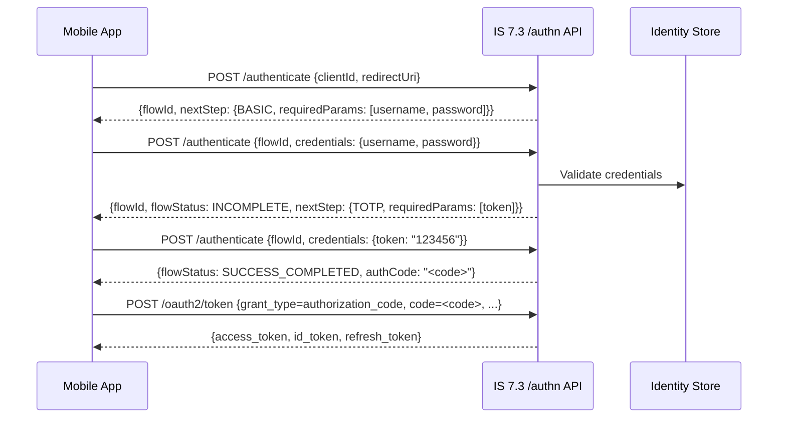
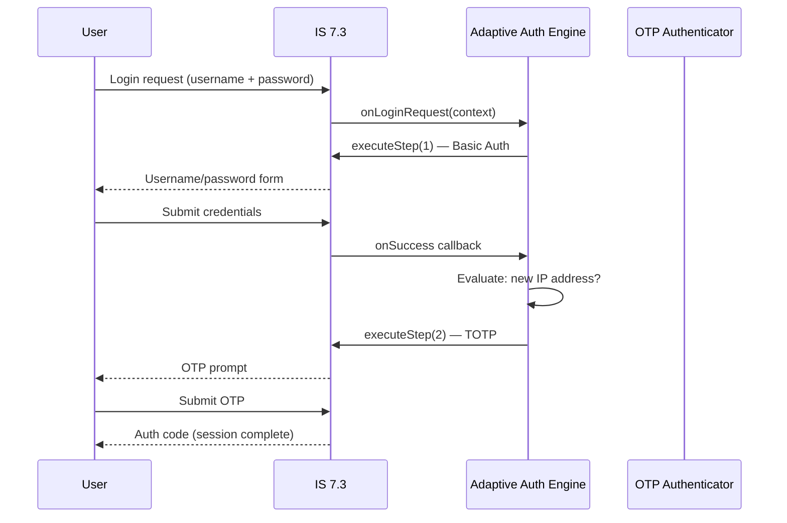
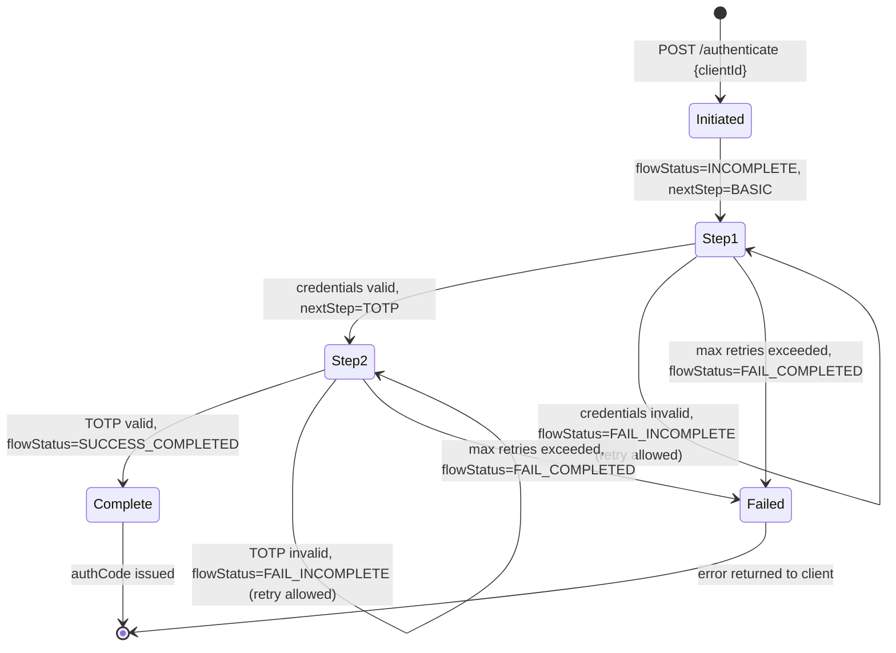
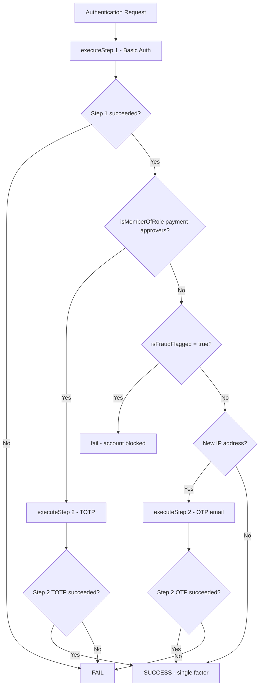
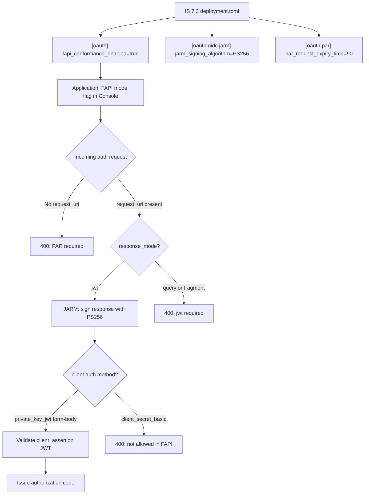
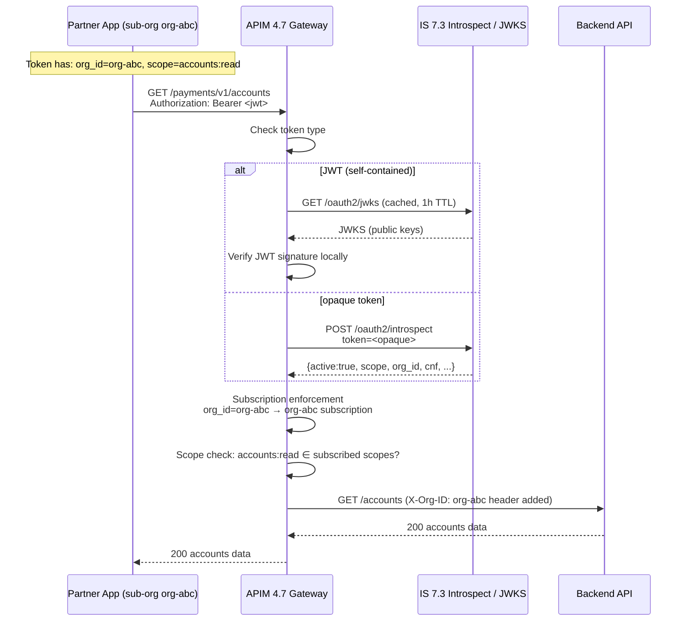

# AuthN/AuthZ Mastery — Phase 2 Implementation Plan

> **For agentic workers:** REQUIRED SUB-SKILL: Use superpowers:subagent-driven-development (recommended) or superpowers:executing-plans to implement this plan task-by-task. Steps use checkbox (`- [ ]`) syntax for tracking.

**Goal:** Author all content files and labs for Phase 2 (Days 11–20, WSO2 IS 7.3 Deep-dive), producing study-ready day files with annotated IS 7.3 config stubs for every day.

**Architecture:** Five tasks — one scaffold task that extends directory skeleton for days 11–20, then four content-authoring tasks (Days 11–13, 14–16, 17–19, 20). Tasks 1–3 are independent and can be dispatched in parallel; Task 4 depends on Days 11–19 existing (it synthesises IS 7.3 + APIM integration patterns). Every day file MUST include a `## WSO2 IS 7.3 mapping` section — the defining feature of Phase 2.

**Tech Stack:** Markdown content files, Mermaid diagrams, TOML/JSON/YAML/HTTP annotated IS 7.3 config stubs.

**Spec:** `authn_authz_mastery/docs/superpowers/specs/2026-09-30-authn-authz-mastery-design.md`

## Global Constraints

- Never write real secrets, keys, tokens, certificates, or account IDs — use `<PLACEHOLDER>` + fill-in comments only.
- Never run `git status`, `git diff`, `git log`, `terraform apply`, or any cloud CLI command.
- Every exercise must ship with **Hint:** and **Solution sketch:** — no bare problems.
- Every lab directory must have `README.md`, `diagram.md`, `config/` (at least one stub file), and `SOLUTION.md`.
- Every Phase 2 day file MUST include `## WSO2 IS 7.3 mapping` section — this is the core Phase 2 deliverable.
- No AI agent / AgentCore content in Phase 2 days (Days 11–20) — belongs to Phase 3.
- `private_key_jwt` client auth always uses form body params: `client_assertion_type=urn:ietf:params:oauth:client-assertion-type:jwt-bearer&client_assertion=<jwt>` — NOT `Authorization: Bearer`.
- Assume learner completed Phase 1 (Days 1–10); do not re-explain FAPI 2.0, PAR, RAR, CIBA, DPoP, mTLS, SCIM, Consent, SCA protocol basics — only show how they map to IS 7.3 config.
- WSO2 IS 7.3 config stubs use `deployment.toml` (TOML) for server config, REST JSON for management API calls.

## Review Focus

1. **Missing `## WSO2 IS 7.3 mapping` section** — every day 11–20 must have it; absence contradicts Phase 2's purpose.
2. **`private_key_jwt` sent as `Authorization: Bearer`** — must always be form body: `client_assertion_type` + `client_assertion`.
3. **Config stubs with real-looking values** — any JWT, cert thumbprint, client ID, or tenant domain must be `<PLACEHOLDER>`.
4. **AI agent / AgentCore content in Phase 2** — must be absent; flag any OBO / AgentCore mentions.
5. **"Why this matters" without IS 7.3 failure scenario** — each must open with a concrete IS 7.3 misconfiguration incident.

---

## Task 0: Scaffold Phase 2

**Files:**
- Create dirs: `authn_authz_mastery/labs/day11/config/` through `authn_authz_mastery/labs/day20/config/`
- Modify: `authn_authz_mastery/README.md` (add Phase 2 day index)
- Modify: `authn_authz_mastery/content/GLOSSARY.md` (append IS 7.3 terms)
- Modify: `authn_authz_mastery/PROGRESS.md` (update Phase 2 status + session log)

**Interfaces:**
- Produces: directory skeleton and updated top-level files that Tasks 1–4 write into.

- [ ] **Step 1: Create lab directories**

```bash
for d in $(seq -w 11 20); do
  mkdir -p authn_authz_mastery/labs/day${d}/config
done
```

- [ ] **Step 2: Update README.md — add Phase 2 day index**

Add the following after the `### Phase 1 — Hard Protocols` section in `authn_authz_mastery/README.md`:

```markdown
### Phase 2 — WSO2 IS 7.3 Deep-dive
- [Day 11](content/day11.md) — App-Native Authentication
- [Day 12](content/day12.md) — Adaptive Authentication
- [Day 13](content/day13.md) — FAPI 2.0 Compliance Mode in IS 7.3
- [Day 14](content/day14.md) — CIBA in IS 7.3
- [Day 15](content/day15.md) — DPoP + mTLS in IS 7.3
- [Day 16](content/day16.md) — B2B Organization Management
- [Day 17](content/day17.md) — FIDO2 / Passkeys
- [Day 18](content/day18.md) — RAR + Consent Portal
- [Day 19](content/day19.md) — IS 7.3 Extension Points
- [Day 20](content/day20.md) — IS 7.3 + APIM 4.7 Integration Patterns
```

Also update the Phase Map table row for Phase 2: change `⬜` to `🔄 IN PROGRESS`.

- [ ] **Step 3: Append IS 7.3 terms to GLOSSARY.md**

Append to `authn_authz_mastery/content/GLOSSARY.md`:

```markdown

---

## Phase 2 — WSO2 IS 7.3 Terms

**App-Native Authentication** — IS 7.3's REST-based auth API that lets mobile/SPA clients drive
authentication step-by-step without browser redirects. The client POSTs to `/api/identity/auth/v1.0/authenticate`,
receives a `flowId` for the session, and submits credentials for each step.

**Adaptive Authentication** — IS 7.3's JavaScript policy engine that evaluates risk signals at
login time and conditionally inserts or skips authentication steps. Policy scripts run server-side,
not in the browser.

**`onLoginRequest(context)`** — The JavaScript entry-point called by IS 7.3's adaptive auth engine
on every authentication request. The `context` object carries step results, request metadata, and
the current user subject.

**`executeStep(stepNumber, {options})`** — IS 7.3 adaptive auth function that triggers an
authentication step. The `options` object accepts `onSuccess` and `onFail` callbacks.

**FAPI Compliance Mode (IS 7.3)** — A server-level flag in `deployment.toml` that enables PAR
enforcement, JARM signing, and `private_key_jwt`-only client auth for FAPI-registered applications.

**DCR (Dynamic Client Registration)** — RFC 7591. IS 7.3 exposes `/api/identity/oauth2/dcr/v1.1/register`
for programmatic FAPI client registration. Requires a DCR-permitted JWT (`software_statement`).

**Backchannel Endpoint (IS 7.3 CIBA)** — IS 7.3's CIBA request entry point: `POST /oauth2/ciba`.
Issues `auth_req_id` for poll/push delivery. Config toggles poll vs. push mode per application.

**`client_notification_endpoint`** — URL registered on a CIBA push-mode client where IS 7.3
POSTs tokens when the user authenticates. Must validate the `client_notification_token` Bearer header.

**Token Binding (IS 7.3)** — IS 7.3's mechanism for embedding `cnf` claims (DPoP JWK thumbprint
or mTLS cert thumbprint) into access tokens. Enabled in `deployment.toml` under `[oauth]`.

**Root Organization** — Top-level org in IS 7.3's B2B org model. Owns the super-admin identity
store, shared applications, and sub-org governance policies.

**Sub-organization** — A child org in IS 7.3 with its own identity store or federated IdP.
Users authenticate against the sub-org's IdP; tokens carry `org_id` scoped to that sub-org.

**Org-scoped Token** — An IS 7.3 access token carrying `org_id` claim. The resource server
enforces access only to resources belonging to that org. Issued via org-switch grant or B2B flow.

**Organization Switch Grant** — IS 7.3 custom grant type `urn:ietf:params:oauth:grant-type:organization_switch`
that exchanges a root-org token for a sub-org token without re-authentication.

**WebAuthn / FIDO2** — W3C standard for public-key auth via hardware authenticators. IS 7.3
implements FIDO2 registration ceremony (`/fido2/v2/registration/start`) and assertion ceremony
(`/fido2/v2/assertion/start`).

**Resident Key / Passkey** — A FIDO2 credential stored on the authenticator (no username hint
needed at assertion). IS 7.3 supports resident keys when `residentKey=required` in the RP policy.

**`userVerification`** — WebAuthn RP policy: `required` (biometric/PIN mandatory), `preferred`
(use if available), `discouraged` (fast tap, no PIN). IS 7.3 config: `user_verification_requirement`.

**Custom Authenticator SPI** — IS 7.3 Java extension: implement `AbstractApplicationAuthenticator`
or `LocalApplicationAuthenticator`, package as OSGi bundle, deploy to `dropins/`. IS 7.3 discovers
it at startup and exposes it in the Console flow builder.

**Identity Event Framework** — IS 7.3 event bus for pre/post hooks on identity operations
(login, token issue, user create, password reset). Handlers implement `AbstractIdentityHandler`.
Used to publish events to external systems (Choreo, webhooks, Kafka).

**IS 7.3 Key Manager role** — IS 7.3 acts as APIM 4.7's OAuth2 key manager: token generation,
introspection, revocation, scope validation. Replaces the older IS-as-KM connector with a
native integration via `KeyManagerConnector` config in `deployment.toml`.
```

- [ ] **Step 4: Update PROGRESS.md**

In `authn_authz_mastery/PROGRESS.md`:
- Change Phase 2 row status to `🔄 IN PROGRESS — authoring Days 11–20`
- Add session log entry: `| 2026-10-01 | Phase 2 plan | Plan written. Tasks 0–4 defined. Ready to author. |`
- Update Next Session Instructions: "Phase 2 authoring: invoke subagent-driven-development on `docs/superpowers/plans/2026-09-30-authn-authz-phase2-plan.md`. Dispatch Task 0 first, then Tasks 1–3 in parallel, then Task 4."

- [ ] **Step 5: Verify scaffold**

```bash
for d in $(seq -w 11 20); do
  ls authn_authz_mastery/labs/day${d}/config/ 2>/dev/null || echo "FAIL: labs/day${d}/config/ missing"
done
grep -q "Day 11" authn_authz_mastery/README.md && echo "PASS: README Phase 2 links" || echo "FAIL"
grep -q "App-Native Authentication" authn_authz_mastery/content/GLOSSARY.md && echo "PASS: GLOSSARY Phase 2 terms" || echo "FAIL"
grep -q "2026-10-01" authn_authz_mastery/PROGRESS.md && echo "PASS: PROGRESS updated" || echo "FAIL"
```

---

## Task 1: Days 11–13 — App-Native Auth, Adaptive Auth, FAPI 2.0

**Files:**
- Create: `authn_authz_mastery/content/day11.md`
- Create: `authn_authz_mastery/content/day12.md`
- Create: `authn_authz_mastery/content/day13.md`
- Create: `authn_authz_mastery/labs/day11/README.md`
- Create: `authn_authz_mastery/labs/day11/diagram.md`
- Create: `authn_authz_mastery/labs/day11/config/authn_api_flow.http`
- Create: `authn_authz_mastery/labs/day11/SOLUTION.md`
- Create: `authn_authz_mastery/labs/day12/README.md`
- Create: `authn_authz_mastery/labs/day12/diagram.md`
- Create: `authn_authz_mastery/labs/day12/config/adaptive_auth_script.js`
- Create: `authn_authz_mastery/labs/day12/SOLUTION.md`
- Create: `authn_authz_mastery/labs/day13/README.md`
- Create: `authn_authz_mastery/labs/day13/diagram.md`
- Create: `authn_authz_mastery/labs/day13/config/fapi_deployment.toml`
- Create: `authn_authz_mastery/labs/day13/SOLUTION.md`

**Interfaces:**
- Consumes: scaffold from Task 0
- Produces: days 11–13 content and labs; Task 4 references Day 13 for FAPI mode config

- [ ] **Step 1: Write content/day11.md — App-Native Authentication**

Write `authn_authz_mastery/content/day11.md`:

```markdown
# Day 11 — App-Native Authentication

## Why this matters
A bank's mobile app team built a native iOS app that needed two-step authentication: username/password
then OTP. Their only option was to open an in-app browser to the IS 7.3 login page. The bank's design
team rejected the redirect: it broke the native UX, triggered app-store policy warnings about leaving
the app, and the default IS login page didn't match the bank's design system. IS 7.3's App-Native Auth
API (`/authn`) eliminates the redirect: the mobile app drives each authentication step via REST,
collecting credentials in native UI, without a browser ever opening.

## Core concepts

### The redirect problem
Standard OAuth2 requires a browser redirect to the authorization server's login page. For mobile
banking apps, this breaks native UX and prevents custom credential collection flows.

### IS 7.3 App-Native Auth API
IS 7.3 exposes a REST authentication API at `/api/identity/auth/v1.0/authenticate`. The flow:

1. **Initiate**: `POST /api/identity/auth/v1.0/authenticate` with `clientId` → IS 7.3 returns a `flowId`
   (session handle) and the first `nextStep` (e.g., `BASIC` for username/password)
2. **Step 1**: `POST /api/identity/auth/v1.0/authenticate` with `flowId` + step credentials →
   IS 7.3 validates, returns next step or `SUCCESS` / `FAIL`
3. **Step 2+**: Repeat until `SUCCESS` → IS 7.3 returns an authorization code
4. **Token exchange**: Client exchanges the code at `/oauth2/token` using standard authorization_code grant

### Stateful auth session model
IS 7.3 maintains a server-side auth session identified by `flowId`. Each step response carries:
- `flowStatus`: `INCOMPLETE` (more steps needed) | `SUCCESS_COMPLETED` | `FAIL_INCOMPLETE`
- `nextStep`: object describing the next authenticator (`authenticatorId`, `requiredParams`)
- `authData`: accumulated claims from completed steps

### Step types
IS 7.3 supports these step types via the native API:
- `BASIC`: username + password
- `TOTP`: time-based OTP (Google Authenticator compatible)
- `SMS_OTP`: SMS one-time passcode
- `EMAIL_OTP`: email OTP
- `FIDO2`: WebAuthn assertion (passkey)

### Console flow builder
IS 7.3's Console provides a visual step builder where admins define the authentication flow
(which authenticators, in what order, with which fallbacks). The App-Native API executes
whichever flow is configured for the application — the mobile app just drives steps.



## WSO2 IS 7.3 mapping

### Enabling App-Native Auth for an application
In IS 7.3 Console → Applications → [Your App] → Sign-in Method:
1. Toggle "App-Native Authentication" to enabled.
2. Define authentication steps (e.g., Step 1: Basic, Step 2: TOTP).
3. The application's `client_id` is used to initiate the flow.

`deployment.toml` (no special flag needed — enabled per-app in Console):
```toml
# App-Native Auth is enabled per-application in the Console, not globally in deployment.toml
# Ensure the REST API authentication endpoint is accessible:
[server]
enable_authentication_rest_api = true
```

### Initiation request
```http
POST /api/identity/auth/v1.0/authenticate HTTP/1.1
Host: <PLACEHOLDER: is-host>
Content-Type: application/json

{
  "clientId": "<PLACEHOLDER: app-client-id>",
  "redirectUri": "https://banking.example.com/callback",
  "responseType": "code",
  "scope": "openid accounts",
  "pkce": {
    "challenge": "<PLACEHOLDER: base64url(sha256(code_verifier))>",
    "challengeMethod": "S256"
  }
}
```

Response:
```json
{
  "flowId": "<PLACEHOLDER: server-generated-uuid>",
  "flowStatus": "INCOMPLETE",
  "nextStep": {
    "stepType": "MULTI_OPTIONS_PROMPT",
    "authenticators": [
      {
        "authenticatorId": "BasicAuthenticator",
        "authenticator": "Username & Password",
        "idp": "LOCAL",
        "requiredParams": ["username", "password"]
      }
    ]
  }
}
```

### Credential submission
```http
POST /api/identity/auth/v1.0/authenticate HTTP/1.1
Host: <PLACEHOLDER: is-host>
Content-Type: application/json

{
  "flowId": "<PLACEHOLDER: flowId-from-initiation>",
  "selectedAuthenticator": {
    "authenticatorId": "BasicAuthenticator",
    "params": {
      "username": "<PLACEHOLDER: user@example.com>",
      "password": "<PLACEHOLDER: password>"
    }
  }
}
```

## Anti-patterns / Common mistakes
- **Caching the `flowId` across sessions** — `flowId` is single-use for one authentication attempt;
  a new initiation must generate a new `flowId`. Reusing a completed `flowId` returns 400.
- **Submitting all credentials in step 1** — the API is step-by-step; submit only the current
  step's `requiredParams`. Extra params are ignored; missing params cause `FAIL_INCOMPLETE`.
- **Not handling `FAIL_INCOMPLETE` for retry** — the flow allows retry within the same `flowId` if
  `flowStatus=FAIL_INCOMPLETE`; the app should prompt the user again rather than restarting the flow.

## Exercises
1. A mobile app calls `POST /api/identity/auth/v1.0/authenticate` and gets `flowStatus: INCOMPLETE`
   with `nextStep.stepType: MULTI_OPTIONS_PROMPT` listing two authenticators: `BasicAuthenticator`
   and `GoogleAuthenticator`. Which `authenticatorId` should it submit, and what params does it need?
   **Hint:** The `requiredParams` array in each authenticator object tells you exactly what to collect.
   **Solution sketch:** The app should present both options to the user. If the user picks `BasicAuthenticator`,
   submit `{flowId, selectedAuthenticator: {authenticatorId: "BasicAuthenticator", params: {username, password}}}`.
   If the user picks `GoogleAuthenticator`, IS 7.3 will return an `idpRedirectUri` for the Google OAuth
   redirect — the app opens the in-app browser only for federated IdPs, not for local steps.

2. A bank wants the App-Native API flow to also request payment-initiation scope with
   `authorization_details`. How does `authorization_details` enter the flow?
   **Hint:** The initiation step is where all OAuth2 request parameters go.
   **Solution sketch:** Add `authorization_details` (URL-encoded JSON array) to the initiation
   `POST /authenticate` request body alongside `clientId`, `scope`, and `pkce`. IS 7.3 stores it
   in the auth session and includes it in the issued authorization code, which the client then
   exchanges at `/oauth2/token`. The resulting access token carries `authorization_details`.

3. IS 7.3 returns `flowStatus: FAIL_INCOMPLETE` with `failureReason: "INVALID_CREDENTIALS"` on
   step 1. The mobile app should allow the user to retry. What must the app send on the retry?
   **Hint:** The `flowId` is still valid for retry.
   **Solution sketch:** The app presents the error to the user ("Incorrect username or password")
   and sends the same `flowId` with corrected credentials. The flow continues from step 1 — no new
   initiation needed. If `flowStatus: FAIL_COMPLETED` is returned instead (e.g., account locked),
   retry is not possible and the app must restart with a new initiation call.

## Lab
See `labs/day11/`. Goal: trace the App-Native Auth API HTTP exchange from initiation to auth code.
Success signal: you can identify `flowId`, each step's `nextStep` object, and the final auth code
without referring to IS 7.3 documentation.
```

- [ ] **Step 2: Write content/day12.md — Adaptive Authentication**

Write `authn_authz_mastery/content/day12.md`:

```markdown
# Day 12 — Adaptive Authentication

## Why this matters
A bank deployed IS 7.3 with single-factor authentication (username + password) for its online banking
portal. A credential stuffing attack hit 4,000 accounts in one night — the attacker had a list of
valid usernames and passwords from a third-party breach and logged in from a data centre IP block. IS 7.3's
adaptive auth script could have detected the anomaly (new IP, new device, high-velocity logins) and
inserted an OTP step for those sessions — silently blocking the attack without affecting legitimate users.
The bank's mistake was treating authentication as binary (pass/fail) rather than risk-scored.

## Core concepts

### The adaptive auth model
IS 7.3's adaptive auth engine runs a JavaScript policy script on every authentication request.
The script receives the `context` object (request metadata, user history, completed steps) and
decides which steps to execute by calling `executeStep()`. If no condition triggers, the default
flow runs.

### The `context` object
Key `context` properties available in every script:
- `context.request.ip` — client IP address
- `context.request.headers` — HTTP headers (User-Agent, etc.)
- `context.request.params` — OAuth2 request params
- `context.steps[N].subject` — subject returned by step N (null if not yet executed)
- `context.steps[N].idp` — IdP used in step N
- `context.currentKnownSubject` — the authenticated user (set after a successful step)
- `context.lastAuthenticatedUser.logins` — recent login history

### `executeStep(stepNumber, options)`
Triggers an authentication step. `options`:
- `onSuccess`: callback `{function}` called when step succeeds
- `onFail`: callback `{function}` called when step fails
- `authenticatorParams`: extra params to pass to the authenticator

Steps are numbered as configured in the Console flow builder. Step 1 is always executed first
(as the initiating step); `executeStep` adds conditional steps.

### Risk signals available
IS 7.3 provides built-in functions for risk scoring:
- `getUserAgent(context)` — parsed user-agent object
- `isMemberOfRole(user, 'roleName')` — role check
- `getLastLoginTime(user)` — timestamp of last login
- `getLoginAttemptsByUser(user, startTime, endTime)` — login history
- `resolveIpCountry(ip)` — geolocation (requires GeoIP module)

### Example: step-up for new IP
```javascript
var onLoginRequest = function(context) {
    executeStep(1, {
        onSuccess: function(context) {
            var user = context.steps[1].subject;
            var lastLoginIP = getLastLoginTime(user); // simplified: use stored IP
            if (context.request.ip !== user.localClaims['http://wso2.org/claims/lastLoginIP']) {
                executeStep(2); // insert OTP step for unfamiliar IP
            }
        }
    });
};
```

### Example: role-based step-up
```javascript
var onLoginRequest = function(context) {
    executeStep(1, {
        onSuccess: function(context) {
            var user = context.steps[1].subject;
            if (isMemberOfRole(user, 'payment-approvers')) {
                executeStep(2); // always require OTP for payment approvers
            }
        }
    });
};
```



## WSO2 IS 7.3 mapping

### Deploying an adaptive auth script
In IS 7.3 Console → Applications → [App] → Sign-in Method:
1. Enable "Advanced" mode.
2. Define base steps (Step 1: Basic, Step 2: TOTP).
3. Paste JavaScript policy into the "Script Editor".
4. Click "Update". IS 7.3 compiles the script server-side.

No `deployment.toml` change needed for the script engine itself. To enable geolocation:
```toml
[authentication.adaptive]
enable_geo_ip = true
geo_ip_database_path = "<PLACEHOLDER: /path/to/GeoLite2-Country.mmdb>"
```

### Script editor constraints
- Scripts run synchronously in the IS 7.3 auth engine — no async/await, no I/O.
- Maximum script execution time: 200ms (configurable in `deployment.toml`).
- IS 7.3 provides only the built-in functions above; no external HTTP calls from scripts.
- User claims are accessible via `user.localClaims['http://wso2.org/claims/<claimURI>']`.

### deployment.toml — adaptive auth settings
```toml
[authentication.adaptive]
# Maximum time (ms) a script may run before IS 7.3 terminates it
script_execution_timeout = 200

# Allow scripts to read user's last login IP (stored as a user claim)
enable_last_login_time_claim = true

# Activate Nashorn JavaScript engine (default; Graal.js available as alternative)
js_engine = "Nashorn"
```

## Anti-patterns / Common mistakes
- **Calling `executeStep` outside a callback** — `executeStep` is only valid inside `onSuccess`/`onFail`
  callbacks; calling it at the top level (outside `onLoginRequest`) throws a runtime error.
- **Using `context.request.ip` for geofencing without a VPN signal** — enterprise users on VPN
  show the VPN exit IP, triggering false positives; combine IP with device fingerprint.
- **Making the adaptive auth script stateful across requests** — the script has no persistent state;
  use user claims (via IS 7.3's claim management) to store risk signals like last-login-IP.

## Exercises
1. Write an adaptive auth script that requires OTP (Step 2) only for users in the `payment-approvers`
   role, and allows all other users through with just Step 1.
   **Hint:** Use `isMemberOfRole(user, 'payment-approvers')` after Step 1 succeeds.
   **Solution sketch:**
   ```javascript
   var onLoginRequest = function(context) {
       executeStep(1, {
           onSuccess: function(context) {
               var user = context.steps[1].subject;
               if (isMemberOfRole(user, 'payment-approvers')) {
                   executeStep(2);
               }
           }
       });
   };
   ```
   This triggers Step 2 (TOTP) only for payment approvers. Other users complete auth after Step 1.

2. An adaptive auth script correctly triggers Step 2 for new-IP logins. A tester reports that every
   login from their laptop triggers the OTP step, even after the first login. Why, and how do you fix it?
   **Hint:** How does the script know the "last login IP"?
   **Solution sketch:** The script is comparing `context.request.ip` against a user claim that is
   never being updated after a successful login. To fix: in the `onSuccess` callback after Step 2,
   update the user's `lastLoginIP` claim: `user.localClaims['http://wso2.org/claims/lastLoginIP'] = context.request.ip`.
   IS 7.3 persists the claim if the script handler calls the claim update API (via Identity Event handler
   or a post-authentication handler that updates claims). Pure script execution alone cannot persist claims —
   a separate event handler or `executeScript` with claim update is needed.

3. A bank wants the adaptive auth script to deny login entirely (not just add a step) when the user's
   account has been flagged for fraud. How would you implement this in IS 7.3?
   **Hint:** IS 7.3 provides `fail()` function in adaptive auth scripts.
   **Solution sketch:** After Step 1 succeeds, check a user claim `isFraudFlagged`:
   ```javascript
   onSuccess: function(context) {
       var user = context.steps[1].subject;
       if (user.localClaims['http://wso2.org/claims/isFraudFlagged'] === 'true') {
           fail(); // terminates the flow with authentication failure
       } else {
           // normal flow continues
       }
   }
   ```
   `fail()` with no arguments returns a generic error to the client. `fail({errorCode: "ACCOUNT_BLOCKED",
   errorMessage: "Account suspended"})` returns structured error info.

## Lab
See `labs/day12/`. Goal: read the adaptive auth script and trace which steps execute for four
user scenarios (low-risk user, payment approver, new IP, fraud-flagged). Success signal: you can
predict the step sequence for each scenario before running it.
```

- [ ] **Step 3: Write content/day13.md — FAPI 2.0 Compliance Mode**

Write `authn_authz_mastery/content/day13.md`:

```markdown
# Day 13 — FAPI 2.0 Compliance Mode in IS 7.3

## Why this matters
A bank passed its FAPI 2.0 security audit on paper — the IS 7.3 configuration checklist was complete.
But in production, a TPP client was still able to register with `token_endpoint_auth_method: client_secret_basic`
and receive access tokens. IS 7.3's FAPI mode had been enabled at the server level but not enforced at the
application level: per-app overrides were silently accepting non-FAPI clients. The bank's TPP ecosystem
was FAPI-compliant on the server but not on the client registration path. Enabling FAPI mode requires both
the server-level flag and ensuring DCR rejects non-compliant client registrations.

## Core concepts

### What FAPI Compliance Mode enables in IS 7.3
When FAPI 2.0 compliance mode is active for an application, IS 7.3 enforces:
- PAR mandatory: requests without `request_uri` are rejected
- PKCE: `code_challenge_method=S256` required; plain PKCE rejected
- JARM: `response_mode=jwt` required; other response modes rejected
- Client auth: only `private_key_jwt` or `tls_client_auth`; `client_secret_*` rejected
- Response type: `code` only; `token`, `id_token`, hybrid rejected
- Request object: signed JAR (`request` or `request_uri`) required for PAR

### IS 7.3 PAR endpoint
IS 7.3 exposes PAR at `POST /oauth2/par`. The endpoint is always present; FAPI mode makes it mandatory
(requests without PAR are rejected). Discovery via `.well-known/openid-configuration`:
```json
{
  "pushed_authorization_request_endpoint": "https://<PLACEHOLDER: is-host>/oauth2/par"
}
```

### JARM in IS 7.3
IS 7.3 signs authorization responses as JWTs using the server's signing key (PS256 or ES256).
The JARM JWT carries: `iss`, `aud`, `exp`, `iat`, `code`, `state`. The TPP verifies the signature
using IS 7.3's JWKS (`/oauth2/jwks`).

### DCR (Dynamic Client Registration)
IS 7.3's DCR endpoint (`POST /api/identity/oauth2/dcr/v1.1/register`) accepts a client registration
JWT. For FAPI mode, the registration must include:
- `token_endpoint_auth_method`: `private_key_jwt` or `tls_client_auth`
- `response_types`: `["code"]`
- `grant_types`: `["authorization_code", "refresh_token"]`
- `require_pushed_authorization_requests`: `true`
- `authorization_signed_response_alg`: `PS256` or `ES256`
- `jwks_uri`: URL of the TPP's JWKS

```mermaid
sequenceDiagram
    participant TPP as TPP
    participant DCR as IS 7.3 /dcr/register
    participant PAR as IS 7.3 /oauth2/par
    participant AZ as IS 7.3 /oauth2/authorize
    participant TE as IS 7.3 /oauth2/token

    Note over TPP,DCR: One-time registration
    TPP->>DCR: POST /register {software_statement JWT, jwks_uri, require_par=true, auth_method=private_key_jwt}
    DCR-->>TPP: {client_id, client_secret=null (FAPI: no secret)}

    Note over TPP,PAR: Per-transaction flow
    TPP->>PAR: POST /par {client_id, code_challenge, authorization_details, ...}<br/>client_assertion_type=urn:...:jwt-bearer&client_assertion=<signed_jwt>
    PAR-->>TPP: {request_uri, expires_in: 90}

    TPP->>AZ: GET /authorize?client_id=X&request_uri=urn:...
    AZ-->>TPP: JARM JWT (redirect)
    TPP->>TPP: Verify JARM signature via IS 7.3 JWKS

    TPP->>TE: POST /token {code, code_verifier, client_assertion_type=..., client_assertion=<jwt>}
    TE-->>TPP: {access_token, token_type: Bearer/DPoP}
```

## WSO2 IS 7.3 mapping

### Server-level FAPI flag in deployment.toml
```toml
[oauth]
# Enable FAPI 2.0 compliance mode globally — enforces PAR, JARM, strict client auth
fapi_conformance_enabled = true

# JARM: sign all authorization responses
[oauth.oidc.jarm]
jarm_response_jwt_validity = 120
jarm_signing_algorithm = "PS256"

# PAR endpoint settings
[oauth.par]
par_request_expiry_time = 90
```

### Application-level FAPI enforcement
In IS 7.3 Console → Applications → [FAPI App] → Advanced:
- Set "Token Endpoint Auth Method" to `Private Key JWT`
- Enable "FAPI Conformance"
- Set "Response Mode" to `jwt`
- Set "Request Object Method" to `PAR`

### DCR registration for a FAPI client
```http
POST /api/identity/oauth2/dcr/v1.1/register HTTP/1.1
Host: <PLACEHOLDER: is-host>
Content-Type: application/json
Authorization: Bearer <PLACEHOLDER: dcr-registration-token>

{
  "client_name": "PSD2 TPP Banking Client",
  "grant_types": ["authorization_code", "refresh_token"],
  "response_types": ["code"],
  "token_endpoint_auth_method": "private_key_jwt",
  "token_endpoint_auth_signing_alg": "PS256",
  "authorization_signed_response_alg": "PS256",
  "require_pushed_authorization_requests": true,
  "jwks_uri": "https://tpp.example.com/.well-known/jwks.json",
  "redirect_uris": ["https://tpp.example.com/callback"],
  "scope": "openid accounts payments"
}
```

### Verifying FAPI mode is enforced
```http
# Attempt non-PAR request — must fail with FAPI mode enabled
GET /oauth2/authorize?client_id=<PLACEHOLDER>&response_type=code&scope=openid HTTP/1.1
Host: <PLACEHOLDER: is-host>
# Expected response: 400 error=invalid_request, error_description="PAR is mandatory for FAPI"
```

## Anti-patterns / Common mistakes
- **Enabling FAPI at server level but not per-application** — IS 7.3 applies FAPI constraints only
  to applications registered with FAPI enabled; a non-FAPI app on the same IS 7.3 instance ignores the flag.
- **Using `Authorization: Bearer <client_assertion>` for `private_key_jwt` client auth** — FAPI requires
  `client_assertion_type=urn:ietf:params:oauth:client-assertion-type:jwt-bearer` and `client_assertion=<jwt>`
  as form body params in the POST body. Bearer header is rejected.
- **JARM signing key mismatch** — if IS 7.3's JARM signing key is rotated but the TPP's cached JWKS is stale,
  the TPP will reject valid JARM responses; always check `kid` in the JARM header against current JWKS.

## Exercises
1. A TPP attempts to register with DCR using `token_endpoint_auth_method: client_secret_basic`.
   IS 7.3 FAPI mode is enabled. What happens, and what must the TPP change?
   **Hint:** FAPI 2.0 disallows `client_secret_*` methods.
   **Solution sketch:** IS 7.3 rejects the DCR request with `400 Bad Request` and
   `error: invalid_client_metadata`, `error_description: "client_secret_basic not allowed in FAPI mode"`.
   The TPP must change `token_endpoint_auth_method` to `private_key_jwt` (preferred) or `tls_client_auth`,
   provide a `jwks_uri`, and ensure its signing algorithm is `PS256` or `ES256`.

2. Write the `deployment.toml` stanza that enables FAPI compliance, sets JARM signing to PS256,
   and sets PAR expiry to 60 seconds.
   **Hint:** Three separate config sections: `[oauth]`, `[oauth.oidc.jarm]`, `[oauth.par]`.
   **Solution sketch:**
   ```toml
   [oauth]
   fapi_conformance_enabled = true
   [oauth.oidc.jarm]
   jarm_response_jwt_validity = 120
   jarm_signing_algorithm = "PS256"
   [oauth.par]
   par_request_expiry_time = 60
   ```

3. A FAPI client sends a PAR request with `client_assertion` in the `Authorization: Bearer` header
   instead of the POST body. IS 7.3 rejects it. Explain why and write the corrected request.
   **Hint:** `private_key_jwt` is a form-body client auth method per RFC 7521.
   **Solution sketch:** RFC 7521 and FAPI 2.0 require `private_key_jwt` as form-body parameters.
   `Authorization: Bearer` is for access tokens, not client assertions. Corrected request:
   ```http
   POST /oauth2/par HTTP/1.1
   Host: <PLACEHOLDER: is-host>
   Content-Type: application/x-www-form-urlencoded

   client_id=<PLACEHOLDER>
   &client_assertion_type=urn:ietf:params:oauth:client-assertion-type:jwt-bearer
   &client_assertion=<PLACEHOLDER: signed-jwt>
   &response_type=code
   &redirect_uri=https://tpp.example.com/callback
   &code_challenge=<PLACEHOLDER>
   &code_challenge_method=S256
   ```

## Lab
See `labs/day13/`. Goal: enable FAPI mode in IS 7.3 via `deployment.toml` and register a FAPI client
via DCR. Success signal: you can identify each FAPI-required field in the config stubs and explain
why removing any one of them would cause a compliance failure.
```

- [ ] **Step 4: Write lab files for Day 11**

Write `authn_authz_mastery/labs/day11/README.md`:
```markdown
# Day 11 Lab — App-Native Auth API Trace

**Goal:** Trace the IS 7.3 App-Native Auth API HTTP exchange for a two-step authentication flow
(username/password → TOTP).

**Success signal:** You can identify `flowId`, each step's `nextStep` object, and the final
`authCode` in the exchange, and explain what IS 7.3 does server-side at each step.

**Steps:**
1. Open `config/authn_api_flow.http` — annotated HTTP exchange for a two-step flow.
2. For each request/response pair, identify: (a) what the app sends, (b) what IS 7.3 validates,
   (c) what the response carries for the next step.
3. Trace the `flowId` through all steps — note it never changes.
4. Check your understanding against `SOLUTION.md`.
```

Write `authn_authz_mastery/labs/day11/diagram.md`:
```markdown
# Day 11 — App-Native Auth Session State Machine



## Key session state transitions

| `flowStatus` | Meaning | App action |
|---|---|---|
| `INCOMPLETE` | More steps required | Submit next step credentials |
| `FAIL_INCOMPLETE` | Step failed, retry allowed | Prompt user, resubmit same step |
| `SUCCESS_COMPLETED` | All steps passed | Exchange `authCode` at `/oauth2/token` |
| `FAIL_COMPLETED` | Flow terminated (locked/expired) | New initiation required |
```

Write `authn_authz_mastery/labs/day11/config/authn_api_flow.http`:
```http
### Step 1: Initiate App-Native Auth flow
POST /api/identity/auth/v1.0/authenticate HTTP/1.1
Host: <PLACEHOLDER: is-host:9443>
Content-Type: application/json

{
  "clientId": "<PLACEHOLDER: app-client-id>",
  "redirectUri": "https://banking.example.com/callback",
  "responseType": "code",
  "scope": "openid accounts",
  "pkce": {
    "challenge": "<PLACEHOLDER: base64url(sha256(code_verifier))>",
    "challengeMethod": "S256"
  }
}

### Response 1: IS 7.3 returns flowId and first step
# HTTP 200 OK
{
  "flowId": "<PLACEHOLDER: server-uuid-session-id>",
  "flowStatus": "INCOMPLETE",
  "nextStep": {
    "stepType": "MULTI_OPTIONS_PROMPT",
    "authenticators": [
      {
        "authenticatorId": "BasicAuthenticator",
        "authenticator": "Username & Password",
        "idp": "LOCAL",
        "requiredParams": ["username", "password"]
      }
    ]
  }
}

### Step 2: Submit username/password for Step 1
POST /api/identity/auth/v1.0/authenticate HTTP/1.1
Host: <PLACEHOLDER: is-host:9443>
Content-Type: application/json

{
  "flowId": "<PLACEHOLDER: same-flowId-as-step1>",
  "selectedAuthenticator": {
    "authenticatorId": "BasicAuthenticator",
    "params": {
      "username": "<PLACEHOLDER: user@bank.example.com>",
      "password": "<PLACEHOLDER: password>"
    }
  }
}

### Response 2: Step 1 passed, next step is TOTP
# HTTP 200 OK
{
  "flowId": "<PLACEHOLDER: same-flowId>",
  "flowStatus": "INCOMPLETE",
  "nextStep": {
    "stepType": "MULTI_OPTIONS_PROMPT",
    "authenticators": [
      {
        "authenticatorId": "totp",
        "authenticator": "TOTP",
        "idp": "LOCAL",
        "requiredParams": ["token"]
      }
    ]
  }
}

### Step 3: Submit TOTP code for Step 2
POST /api/identity/auth/v1.0/authenticate HTTP/1.1
Host: <PLACEHOLDER: is-host:9443>
Content-Type: application/json

{
  "flowId": "<PLACEHOLDER: same-flowId>",
  "selectedAuthenticator": {
    "authenticatorId": "totp",
    "params": {
      "token": "<PLACEHOLDER: 6-digit-totp-code>"
    }
  }
}

### Response 3: Auth complete — authCode issued
# HTTP 200 OK
{
  "flowId": "<PLACEHOLDER: same-flowId>",
  "flowStatus": "SUCCESS_COMPLETED",
  "authData": {
    "code": "<PLACEHOLDER: authorization-code>",
    "session_state": "<PLACEHOLDER: session-state-hash>"
  }
}

### Step 4: Exchange auth code for tokens
POST /oauth2/token HTTP/1.1
Host: <PLACEHOLDER: is-host:9443>
Content-Type: application/x-www-form-urlencoded

grant_type=authorization_code
&code=<PLACEHOLDER: authorization-code>
&redirect_uri=https://banking.example.com/callback
&client_id=<PLACEHOLDER: app-client-id>
&code_verifier=<PLACEHOLDER: original-code-verifier>
```

Write `authn_authz_mastery/labs/day11/SOLUTION.md`:
```markdown
# Day 11 Lab — Solution

## What happens at each step

**Initiation**: IS 7.3 creates a server-side auth session, returns `flowId` (opaque session handle).
The PKCE `challenge` is stored in the session for verification at token exchange.

**Step 1 (Basic)**: IS 7.3 validates username/password against the LOCAL identity store. If valid,
marks Step 1 complete in the session, returns `flowStatus: INCOMPLETE` with TOTP as `nextStep`.

**Step 2 (TOTP)**: IS 7.3 verifies the 6-digit TOTP against the user's enrolled TOTP secret.
If valid, marks Step 2 complete → `flowStatus: SUCCESS_COMPLETED`, issues `authCode` (short-lived, ~60s).

**Token exchange**: IS 7.3 validates: (1) `code` matches the session, (2) `code_verifier` matches stored
`code_challenge`, (3) `redirect_uri` matches registered value. Issues `access_token` + `id_token`.

## Why `flowId` never changes
The `flowId` is the session handle. Changing it would require the client to re-correlate sessions.
IS 7.3 keeps the same `flowId` for the entire multi-step flow — the server-side session is mutable.

## What happens if TOTP fails
IS 7.3 returns `flowStatus: FAIL_INCOMPLETE` with `failureReason: "INVALID_TOKEN"`. The app
can retry Step 2 with the same `flowId` (IS 7.3 allows N retries, configurable per application).
After max retries: `FAIL_COMPLETED` — the session is terminated and a new initiation is needed.
```

- [ ] **Step 5: Write lab files for Day 12**

Write `authn_authz_mastery/labs/day12/README.md`:
```markdown
# Day 12 Lab — Adaptive Auth Script Analysis

**Goal:** Read the adaptive auth script in `config/adaptive_auth_script.js` and predict which
authentication steps execute for four user scenarios.

**Success signal:** You can trace the JavaScript execution path for each scenario and identify
which `executeStep()` calls fire, without running the script.

**Scenarios to trace:**
1. Regular user, known IP, no special role
2. User in `payment-approvers` role, known IP
3. Regular user, new IP address (first login from this IP)
4. User with `isFraudFlagged: true` claim

**Steps:**
1. Read `config/adaptive_auth_script.js` carefully.
2. For each scenario, trace which `executeStep()` calls execute and why.
3. Check your predictions against `SOLUTION.md`.
```

Write `authn_authz_mastery/labs/day12/diagram.md`:
```markdown
# Day 12 — Adaptive Auth Decision Flow


```

Write `authn_authz_mastery/labs/day12/config/adaptive_auth_script.js`:
```javascript
// IS 7.3 Adaptive Authentication Script
// Application: Banking Portal
// Steps configured in Console:
//   Step 1: BasicAuthenticator (username + password)
//   Step 2: TOTP (for payment-approvers)
//   Step 3: EmailOTP (for new IP detection)

var onLoginRequest = function(context) {
    executeStep(1, {
        onSuccess: function(context) {
            var user = context.steps[1].subject;

            // Rule 1: Payment approvers always require TOTP (Step 2)
            if (isMemberOfRole(user, 'payment-approvers')) {
                executeStep(2, {
                    onFail: function(context) {
                        fail({
                            errorCode: 'AUTH_FAILED',
                            errorMessage: 'TOTP verification failed'
                        });
                    }
                });
                return; // early return: don't evaluate other rules
            }

            // Rule 2: Fraud-flagged accounts are denied entirely
            var fraudFlag = user.localClaims['http://wso2.org/claims/isFraudFlagged'];
            if (fraudFlag === 'true') {
                fail({
                    errorCode: 'ACCOUNT_BLOCKED',
                    errorMessage: 'Account suspended for security review'
                });
                return;
            }

            // Rule 3: New IP address triggers email OTP (Step 3)
            var lastKnownIP = user.localClaims['http://wso2.org/claims/lastLoginIP'];
            if (lastKnownIP && context.request.ip !== lastKnownIP) {
                executeStep(3, {
                    onFail: function(context) {
                        fail({
                            errorCode: 'AUTH_FAILED',
                            errorMessage: 'Email OTP verification failed'
                        });
                    }
                });
            }
            // If no rule triggered: user passes with Step 1 only
        },
        onFail: function(context) {
            fail({
                errorCode: 'INVALID_CREDENTIALS',
                errorMessage: 'Username or password incorrect'
            });
        }
    });
};
```

Write `authn_authz_mastery/labs/day12/SOLUTION.md`:
```markdown
# Day 12 Lab — Solution

## Scenario trace

### Scenario 1: Regular user, known IP, no special role
- Step 1 executes → succeeds
- `isMemberOfRole('payment-approvers')` → false → skip rule 1
- `isFraudFlagged` → not 'true' → skip rule 2
- `context.request.ip === lastKnownIP` → true (known IP) → skip rule 3
- **Result: Step 1 only. User authenticates with username/password.**

### Scenario 2: User in `payment-approvers`, known IP
- Step 1 executes → succeeds
- `isMemberOfRole('payment-approvers')` → true → executeStep(2) for TOTP
- `return` prevents rule 2 and rule 3 from evaluating
- **Result: Steps 1 + 2 (Basic + TOTP). IP is irrelevant for this role.**

### Scenario 3: Regular user, new IP
- Step 1 executes → succeeds
- `isMemberOfRole('payment-approvers')` → false
- `isFraudFlagged` → not 'true'
- `context.request.ip !== lastKnownIP` → true (new IP) → executeStep(3) for Email OTP
- **Result: Steps 1 + 3 (Basic + Email OTP).**

### Scenario 4: User with `isFraudFlagged: true`
- Step 1 executes → succeeds (credentials are valid)
- `isMemberOfRole('payment-approvers')` → false
- `isFraudFlagged === 'true'` → true → `fail({errorCode: 'ACCOUNT_BLOCKED'})` called
- **Result: Authentication denied. Access token never issued.**

## What `return` does in scenario 2
Without `return` after rule 1, the script would continue to rules 2 and 3.
For a payment-approver on a new IP, both TOTP (rule 1) and Email OTP (rule 3) would trigger,
adding an unnecessary third factor. The `return` ensures mutually exclusive rule evaluation.
```

- [ ] **Step 6: Write lab files for Day 13**

Write `authn_authz_mastery/labs/day13/README.md`:
```markdown
# Day 13 Lab — FAPI 2.0 Config in IS 7.3

**Goal:** Enable FAPI compliance mode in IS 7.3 and register a FAPI-compliant client via DCR.

**Success signal:** You can identify every FAPI-required field in the config stubs and explain
what IS 7.3 would reject without each one.

**Steps:**
1. Review `config/fapi_deployment.toml` — IS 7.3 server FAPI settings.
2. Trace which requests IS 7.3 would accept vs. reject with these settings active.
3. Identify the three fields in the TOML that enforce PAR, JARM, and `private_key_jwt` respectively.
4. Check your answers against `SOLUTION.md`.
```

Write `authn_authz_mastery/labs/day13/diagram.md`:
```markdown
# Day 13 — FAPI 2.0 in IS 7.3: Config Points


```

Write `authn_authz_mastery/labs/day13/config/fapi_deployment.toml`:
```toml
# WSO2 IS 7.3 — FAPI 2.0 Compliance Configuration
# File location: <IS_HOME>/repository/conf/deployment.toml

[oauth]
# Enable FAPI 2.0 compliance mode globally
# This enforces PAR, JARM, and strict client auth at the server level.
# Individual applications must also have FAPI mode enabled in the Console.
fapi_conformance_enabled = true

# Allowed token endpoint auth methods (FAPI 2.0: private_key_jwt or tls_client_auth only)
# client_secret_basic and client_secret_post are implicitly disallowed when fapi_conformance_enabled=true
supported_client_auth_methods = ["private_key_jwt", "tls_client_auth"]

[oauth.oidc.jarm]
# JARM: sign all authorization responses as JWTs
# This enables response_mode=jwt for all FAPI-registered applications
jarm_response_jwt_validity = 120
# Signing algorithm: PS256 (FAPI 2.0 required) or ES256
jarm_signing_algorithm = "PS256"
# JWKS endpoint (TPP uses this to verify JARM signatures):
# https://<is-host>:9443/oauth2/jwks

[oauth.par]
# PAR endpoint: POST /oauth2/par
# Requests without PAR are rejected for FAPI applications
par_request_expiry_time = 90
# Maximum size of the PAR request body (bytes) — increase if authorization_details is large
par_request_maximum_size = 65536

[oauth.token]
# Token binding: enable DPoP support
dpop_enable = true
# mTLS token binding: extract client cert from TLS and embed cnf.x5t#S256
mtls_token_binding_enable = true

# IS 7.3 DCR endpoint for FAPI client registration:
# POST /api/identity/oauth2/dcr/v1.1/register
# Requires valid registration access token (issued to trusted registration client)
[oauth.dcr]
dcr_endpoint_enabled = true
# Require software_statement assertion for DCR (ecosystem-level cert from trust framework)
require_software_statement = false   # Set true for regulated open banking ecosystems
```

Write `authn_authz_mastery/labs/day13/SOLUTION.md`:
```markdown
# Day 13 Lab — Solution

## Three fields that enforce PAR, JARM, and private_key_jwt

| FAPI requirement | deployment.toml field | What IS 7.3 rejects without it |
|---|---|---|
| PAR mandatory | `[oauth] fapi_conformance_enabled = true` + app-level FAPI flag | Auth requests without `request_uri` → 400 |
| JARM | `[oauth.oidc.jarm] jarm_signing_algorithm = "PS256"` | `response_mode=query` or `fragment` → 400 |
| `private_key_jwt` only | `supported_client_auth_methods = ["private_key_jwt", "tls_client_auth"]` | `client_secret_basic` → 401 |

## Request IS 7.3 accepts vs. rejects

| Request | Accepted? | Reason |
|---|---|---|
| PAR POST with `client_assertion` in form body | Yes | `private_key_jwt` via form params ✓ |
| PAR POST with `Authorization: Bearer <client_assertion>` | No | `private_key_jwt` must be form body |
| `/authorize` with `request_uri` | Yes | PAR used ✓ |
| `/authorize` with full params (no PAR) | No | FAPI mandates PAR |
| Auth response with `response_mode=jwt` | Yes | JARM ✓ |
| Auth response with `response_mode=query` | No | JARM mandatory in FAPI mode |

## Why `fapi_conformance_enabled` alone is not enough
Server-level FAPI flag enforces the constraints only for applications that have "FAPI Conformance"
checked in the Console. A non-FAPI app registered on the same IS 7.3 instance is not subject to
these constraints. This is by design: IS 7.3 supports mixed-mode (FAPI and non-FAPI apps) on one instance.
```

- [ ] **Step 7: Verify Task 1**

```bash
for day in 11 12 13; do
  for section in "Why this matters" "Core concepts" "WSO2 IS 7.3 mapping" "Anti-patterns" "Exercises" "Lab"; do
    grep -q "$section" authn_authz_mastery/content/day${day}.md || echo "FAIL: day${day}.md missing section: $section"
  done
  grep -c "Hint:" authn_authz_mastery/content/day${day}.md | grep -qE "^[3-9]" || echo "WARN: day${day}.md may be missing hints"
  ls authn_authz_mastery/labs/day${day}/README.md \
     authn_authz_mastery/labs/day${day}/diagram.md \
     authn_authz_mastery/labs/day${day}/SOLUTION.md || echo "FAIL: missing lab file for day${day}"
done
grep -r "BEGIN PRIVATE\|BEGIN CERT\|AKIA[A-Z0-9]\|sk-[a-zA-Z0-9]" \
  authn_authz_mastery/content/day1[123].md authn_authz_mastery/labs/day1[123]/ \
  && echo "FAIL: credentials found" || echo "PASS: no credentials"
# Phase 2 days must NOT contain AgentCore mapping
grep -l "AgentCore mapping" authn_authz_mastery/content/day1[123].md \
  && echo "FAIL: AgentCore in Phase 2" || echo "PASS: no AgentCore"
# private_key_jwt must not use Authorization: Bearer
grep -r "Authorization: Bearer.*client_assertion\|Authorization: Bearer.*private_key_jwt" \
  authn_authz_mastery/labs/day1[123]/ && echo "FAIL: private_key_jwt as Bearer" || echo "PASS"
```

---

## Task 2: Days 14–16 — CIBA in IS 7.3, DPoP+mTLS, B2B Org Management

**Files:**
- Create: `authn_authz_mastery/content/day14.md`
- Create: `authn_authz_mastery/content/day15.md`
- Create: `authn_authz_mastery/content/day16.md`
- Create: `authn_authz_mastery/labs/day14/README.md`
- Create: `authn_authz_mastery/labs/day14/diagram.md`
- Create: `authn_authz_mastery/labs/day14/config/ciba_is73_config.toml`
- Create: `authn_authz_mastery/labs/day14/SOLUTION.md`
- Create: `authn_authz_mastery/labs/day15/README.md`
- Create: `authn_authz_mastery/labs/day15/diagram.md`
- Create: `authn_authz_mastery/labs/day15/config/token_binding_deployment.toml`
- Create: `authn_authz_mastery/labs/day15/SOLUTION.md`
- Create: `authn_authz_mastery/labs/day16/README.md`
- Create: `authn_authz_mastery/labs/day16/diagram.md`
- Create: `authn_authz_mastery/labs/day16/config/org_management_api.http`
- Create: `authn_authz_mastery/labs/day16/SOLUTION.md`

**Interfaces:**
- Consumes: scaffold from Task 0
- Produces: days 14–16 content and labs; Task 4 references Day 16 B2B org model for Day 20 APIM integration

- [ ] **Step 1: Write content/day14.md — CIBA in IS 7.3**

Write `authn_authz_mastery/content/day14.md` covering:

**Why this matters:** A bank configured IS 7.3 CIBA in poll mode for its call-centre payment flow
(1,200 concurrent agents). After 6 months, token endpoint load spikes appeared every weekday at 10am
and 2pm — peak call-centre hours. Investigation revealed 1,200 polling threads each hitting `/oauth2/token`
every 5 seconds, totalling ~14,400 req/min against one endpoint. IS 7.3 started returning `slow_down`
errors, which doubled the polling interval, but the goroutine pool kept running. The fix was switching
to push mode — eliminating polling entirely.

**Core concepts** (all from Day 4 but now with IS 7.3 specifics):
- IS 7.3 CIBA endpoint: `POST /oauth2/ciba` (or `/oauth2/bc-authorize` — discoverable via metadata)
- `auth_req_id` lifecycle in IS 7.3: stored in server-side session, expires per `expires_in`
- Poll mode config: no `client_notification_endpoint` registered → IS 7.3 uses poll mode automatically
- Push mode config: register `client_notification_endpoint` in the application settings
- IS 7.3 consent portal integration: the CIBA backchannel request triggers the consent portal
  on the user's registered device (IS 7.3 uses push notification to the user's device via registered notification channel)
- `binding_message` display: IS 7.3 passes it to the consent portal for display alongside the transaction details

Include Mermaid diagrams for both poll mode and push mode flows with IS 7.3-specific endpoint names.

**WSO2 IS 7.3 mapping:**
- `deployment.toml` stanza for CIBA with push notification endpoint
- IS 7.3 application-level CIBA config (enable CIBA, set delivery mode, notification endpoint)
- Annotated `POST /oauth2/ciba` request with `client_assertion_type` + `client_assertion` in form body
- Poll token request with `grant_type=urn:openid:params:grant-type:ciba&auth_req_id=...`
- Push mode: IS 7.3 POSTs `{access_token, expires_in, token_type}` to `client_notification_endpoint`

**Anti-patterns (3):**
- Polling at fixed 5s interval regardless of `interval` response value
- Registering `client_notification_endpoint` over HTTP (not HTTPS) — IS 7.3 rejects it
- Not validating `client_notification_token` Bearer header at the push endpoint — allows spoofed pushes

**Exercises (3 with Hint + Solution sketch):**
1. Configure IS 7.3 for CIBA push mode. What `deployment.toml` setting enables push and what application-level field must be set?
2. A CIBA poll loop receives `error: slow_down`. The current interval is 5s. What interval should the next poll use, and how many total polls might occur before `expires_in: 120` is reached?
3. A bank's call-centre app sends a CIBA request with `login_hint=customer@bank.com`. IS 7.3 cannot find a user with that email as username. What error is returned and what hint type should the app use instead?

**Lab:** `labs/day14/`. Goal: configure IS 7.3 CIBA in both poll and push mode using the annotated TOML. Success signal: you can identify the three config changes needed to switch from poll to push mode.

- [ ] **Step 2: Write content/day15.md — DPoP + mTLS in IS 7.3**

Write `authn_authz_mastery/content/day15.md` covering:

**Why this matters:** A bank's API gateway terminated TLS for all external traffic and forwarded requests
to IS 7.3 backend services over plain HTTP. A DPoP-enabled client received a token with `cnf.jkt` set.
But IS 7.3's token introspection endpoint was not forwarding the DPoP proof from the gateway to the backend
service — the gateway stripped the `DPoP:` header. Introspection responses showed valid tokens but
the `cnf.jkt` claim was never validated at the resource server. DPoP binding existed on paper but not in practice.

**Core concepts** (from Day 5 & 6 — now IS 7.3 config focus):
- IS 7.3 DPoP config: enabling DPoP token binding in `deployment.toml`
- How IS 7.3 embeds `cnf.jkt` in access tokens when DPoP proof presented at token endpoint
- mTLS in IS 7.3: IS 7.3 reads client cert from TLS session (or `X-Client-Cert` header from gateway)
- `cnf.x5t#S256` injection: IS 7.3 adds cert thumbprint to token when `tls_client_certificate_bound_access_tokens=true`
- Token introspection response: IS 7.3 includes `cnf` object so resource server can validate binding
- Gateway config for mTLS passthrough: IS 7.3 behind a load balancer reading `ssl-client-cert` header

Include Mermaid diagram: DPoP proof → IS 7.3 token endpoint → `cnf.jkt` in token → RS receives DPoP header + token → IS 7.3 introspection with `cnf` → RS validates.

**WSO2 IS 7.3 mapping:**
- `deployment.toml` sections for `[oauth]` DPoP enable and mTLS token binding
- Annotated token request with `DPoP: <proof>` header
- Annotated introspection response showing `cnf.jkt` and `cnf.x5t#S256`
- Reverse proxy header config for mTLS behind load balancer: `ssl-client-cert` header forwarding

**Anti-patterns (3):**
- Not forwarding `DPoP:` header through the gateway to IS 7.3 — IS 7.3 never issues DPoP-bound token
- Configuring IS 7.3 mTLS behind a proxy without setting `ssl_client_cert_header_name` — IS 7.3 reads the wrong source for cert
- Using DPoP and mTLS together without understanding which binding IS 7.3 prefers (DPoP takes precedence; mTLS is fallback if DPoP header absent)

**Exercises (3):**
1. Write the `deployment.toml` stanzas to enable both DPoP and mTLS token binding in IS 7.3.
2. An IS 7.3 introspection response includes `cnf: {jkt: "<thumbprint>"}`. The RS receives a request with `Authorization: DPoP <token>` but no `DPoP:` header. Should the RS accept the request?
3. IS 7.3 is deployed behind an NGINX reverse proxy that terminates mTLS. What `deployment.toml` setting tells IS 7.3 to read the client cert from the `X-Client-Cert` header instead of the TLS session directly?

**Lab:** `labs/day15/`. Goal: trace the DPoP token flow through IS 7.3, identifying where `cnf.jkt` is set and validated.

- [ ] **Step 3: Write content/day16.md — B2B Organization Management**

Write `authn_authz_mastery/content/day16.md` covering:

**Why this matters:** A bank onboarded a B2B fintech partner that needed isolated identity management —
their own user directory, their own login page branding, and their own set of permissions. The IS 7.3
team tried to implement this with separate tenants. After three months, cross-tenant token exchange
was impossible, the root-org admin couldn't audit sub-org activity centrally, and shared applications
(like the FAPI-registered TPP app) couldn't be deployed to both tenants at once. IS 7.3's B2B Organization
model (introduced in 7.3) solves this with a root-org → sub-org hierarchy where organizations share
the same IS 7.3 instance but each has isolated identity, federated external IdPs, and org-scoped tokens.

**Core concepts:**
- IS 7.3 org hierarchy: root org (IS 7.3 super-tenant) → sub-orgs (each has `org_id`)
- Sub-org identity store: can be LOCAL (IS 7.3 manages users) or FEDERATED (external IdP per sub-org)
- Shared applications: registered at root-org level, shared down to sub-orgs (sub-org admin cannot modify)
- Org-scoped tokens: token for sub-org includes `org_id` claim; RS enforces access to that org's resources only
- Organization switch grant: `grant_type=urn:ietf:params:oauth:grant-type:organization_switch` exchanges
  a root-org token for a sub-org token without re-auth
- B2B federation: external IdP (partner bank's Okta/AD FS) registered at sub-org level; partner bank users
  authenticate against their own IdP, IS 7.3 receives the OIDC/SAML assertion and issues an IS 7.3 token

Include Mermaid diagram: root-org admin creates sub-org → registers external IdP → partner user authenticates
via federated IdP → IS 7.3 issues org-scoped token → resource server validates `org_id`.

**WSO2 IS 7.3 mapping:**
- Management API calls: `POST /o/api/identity/organization-mgt/v1.0/organizations` (create sub-org)
- `GET /o/{orgId}/oauth2/token` — token endpoint scoped to a specific sub-org
- Organization switch grant request (annotated HTTP)
- Federated IdP registration at sub-org level via IS 7.3 Console
- `org_id` claim in token (JWT decode showing `org_id`)

**Anti-patterns (3):**
- Confusing IS 7.3 Organizations with IS tenants — orgs are within the super-tenant; tenant isolation is stronger but incompatible with org hierarchy features
- Registering federated IdPs at the root-org level for B2B — federated IdPs must be registered at the sub-org they belong to; root-org IdPs are shared globally
- Issuing root-org tokens to B2B partner systems — partner systems must receive sub-org-scoped tokens; root-org tokens allow access to all sub-orgs

**Exercises (3):**
1. A B2B partner bank (sub-org `org-abc`) needs their users to authenticate using their own Okta IdP. What IS 7.3 configuration steps are needed?
2. A user authenticated against sub-org `org-abc` needs to access a shared service at the root org. What grant type do they use, and what does the resulting token look like?
3. Write the IS 7.3 management API call to create a sub-organization named "PartnerBankXYZ" with `parentId` set to the root org.

**Lab:** `labs/day16/`. Goal: trace the org management API calls and org-scoped token flow.

- [ ] **Step 4: Write all lab files for Days 14–16**

For each lab, write complete files following the Day 11–13 pattern:

**Day 14 lab config — `labs/day14/config/ciba_is73_config.toml`:**
Annotated TOML with:
- `[oauth.ciba]` section: enable CIBA, set expiry, delivery mode
- Example bc-authorize HTTP request (poll mode) with `client_assertion_type` + `client_assertion` in form body
- Example bc-authorize HTTP request (push mode) with `client_notification_endpoint` registered
- Poll token request and push delivery example

All JWT values and client IDs as `<PLACEHOLDER>`.

**Day 15 lab config — `labs/day15/config/token_binding_deployment.toml`:**
Annotated TOML with:
- `[oauth]` DPoP enable flag, mTLS token binding enable
- `[transport.https.ssl]` section for mTLS client cert header config
- Annotated introspection response JSON (showing `cnf.jkt` and `cnf.x5t#S256`)

**Day 16 lab config — `labs/day16/config/org_management_api.http`:**
Annotated HTTP exchange:
- `POST /o/api/identity/organization-mgt/v1.0/organizations` — create sub-org
- `POST /oauth2/token` with organization switch grant
- Sample org-scoped token JWT claims (decoded, showing `org_id`)

All diagrams must be Mermaid sequence diagrams. All SOLUTION.md files must explain what would fail without each annotated field.

- [ ] **Step 5: Verify Task 2**

```bash
for day in 14 15 16; do
  for section in "Why this matters" "Core concepts" "WSO2 IS 7.3 mapping" "Anti-patterns" "Exercises" "Lab"; do
    grep -q "$section" authn_authz_mastery/content/day${day}.md || echo "FAIL: day${day}.md missing: $section"
  done
  ls authn_authz_mastery/labs/day${day}/README.md \
     authn_authz_mastery/labs/day${day}/diagram.md \
     authn_authz_mastery/labs/day${day}/SOLUTION.md || echo "FAIL: lab files missing for day${day}"
done
grep -r "BEGIN PRIVATE\|BEGIN CERT\|AKIA[A-Z0-9]" \
  authn_authz_mastery/content/day1[456].md authn_authz_mastery/labs/day1[456]/ \
  && echo "FAIL: credentials" || echo "PASS: no credentials"
grep -r "Authorization: Bearer.*client_assertion\|Authorization: Bearer.*private_key_jwt" \
  authn_authz_mastery/labs/day1[456]/ && echo "FAIL: private_key_jwt as Bearer" || echo "PASS"
grep -l "AgentCore" authn_authz_mastery/content/day1[456].md \
  && echo "FAIL: AgentCore in Phase 2" || echo "PASS"
```

---

## Task 3: Days 17–19 — FIDO2/Passkeys, RAR+Consent Portal, Extension Points

**Files:**
- Create: `authn_authz_mastery/content/day17.md`
- Create: `authn_authz_mastery/content/day18.md`
- Create: `authn_authz_mastery/content/day19.md`
- Create: `authn_authz_mastery/labs/day17/README.md`
- Create: `authn_authz_mastery/labs/day17/diagram.md`
- Create: `authn_authz_mastery/labs/day17/config/fido2_registration.http`
- Create: `authn_authz_mastery/labs/day17/SOLUTION.md`
- Create: `authn_authz_mastery/labs/day18/README.md`
- Create: `authn_authz_mastery/labs/day18/diagram.md`
- Create: `authn_authz_mastery/labs/day18/config/consent_api.http`
- Create: `authn_authz_mastery/labs/day18/SOLUTION.md`
- Create: `authn_authz_mastery/labs/day19/README.md`
- Create: `authn_authz_mastery/labs/day19/diagram.md`
- Create: `authn_authz_mastery/labs/day19/config/custom_authenticator_spi.java`
- Create: `authn_authz_mastery/labs/day19/SOLUTION.md`

**Interfaces:**
- Consumes: scaffold from Task 0
- Produces: days 17–19 content and labs; Day 18 (consent portal) connects to Day 3 RAR knowledge

- [ ] **Step 1: Write content/day17.md — FIDO2 / Passkeys**

Write `authn_authz_mastery/content/day17.md` covering:

**Why this matters:** A bank deployed SMS OTP as its second factor. After a SIM-swap fraud campaign
(attacker transferred victim's phone number to attacker's SIM, intercepting OTPs), the bank switched
to FIDO2. First implementation used `userVerification: discouraged` — fast tap on security key, no PIN.
Compliance audit failed: PSD2 SCA requires `possession` factor (the key) + `inherence` OR `knowledge` factor.
A tap without PIN satisfies `possession` only (one factor). Setting `userVerification: required` added
the PIN/biometric, satisfying `possession + knowledge` — a valid SCA combination.

**Core concepts:**
- FIDO2 (WebAuthn) overview: asymmetric key pair, private key on authenticator, public key registered with relying party (IS 7.3)
- Registration ceremony: `POST /fido2/v2/registration/start` → challenge → authenticator signs → `POST /fido2/v2/registration/finish`
- Assertion ceremony: `POST /fido2/v2/assertion/start` → challenge → authenticator signs → `POST /fido2/v2/assertion/finish`
- Resident keys (passkeys): credential stored on authenticator without needing `allowCredentials` hint
- `userVerification` policy: `required` (PIN/biometric mandatory), `preferred` (use if available), `discouraged`
- Fallback authenticator chains: if FIDO2 device unavailable, chain to TOTP or SMS OTP
- Attestation: IS 7.3 can verify authenticator model (direct attestation) or skip (none/indirect)

Include Mermaid diagrams for registration and assertion ceremonies.

**WSO2 IS 7.3 mapping:**
- IS 7.3 FIDO2 registration start/finish endpoints
- `deployment.toml` for FIDO2 RP configuration (RP ID = hostname, origin list)
- Application-level FIDO2 authenticator config in Console (step + fallback)
- Resident key policy in IS 7.3: `residentKey` requirement setting

**Anti-patterns (3):**
- Setting `userVerification: discouraged` for banking — fails PSD2 SCA (only one factor: possession)
- Using the wrong RP ID — FIDO2 credentials are RP-ID-scoped; changing the domain breaks all existing credentials
- Not configuring a fallback authenticator — a user with a lost security key cannot authenticate at all

**Exercises (3 with Hint + Solution sketch):**
1. A bank's FIDO2 registration ceremony fails with `InvalidStateError`. What likely caused it and how is it fixed?
2. Write the IS 7.3 `deployment.toml` to configure the FIDO2 RP with hostname `banking.example.com` and `userVerification: required`.
3. Explain why setting `userVerification: required` satisfies PSD2 SCA but `discouraged` does not.

**Lab:** `labs/day17/`. Goal: trace the FIDO2 registration and assertion ceremony HTTP exchanges in IS 7.3.

- [ ] **Step 2: Write content/day18.md — RAR + Consent Portal**

Write `authn_authz_mastery/content/day18.md` covering:

**Why this matters:** A bank implemented PSD2 consent using IS 7.3 scope strings (`scope=accounts:DE89370400440532013000:balances`). Consent revocation required finding and deleting a specific scope — impossible to do selectively without revoking all consent. Regulatory audit required producing a "consent receipt" showing exactly what was consented to, when, and for how long. The bank could not produce it because scope strings have no structured storage. IS 7.3's RAR integration with the consent portal stores each `authorization_details` object as a structured consent record, supports selective revocation, and produces machine-readable consent receipts.

**Core concepts:**
- IS 7.3 parses `authorization_details` from the PAR request and passes it to the consent portal for display
- Consent portal renders a consent UI driven by `authorization_details` type/fields (not scope strings)
- Consent record stored in IS 7.3's consent management store (per `sub`, per `client_id`, per `authorization_details.type`)
- Consent revocation API: `DELETE /api/identity/consent-mgt/v1.0/consents/{consentId}` — revokes specific consent record
- Token refresh: if the underlying consent is revoked, IS 7.3 rejects the refresh token with `consent_revoked`
- Consent receipt: IS 7.3 management API for consent listing with full `authorization_details` stored

Include Mermaid diagram: PAR with `authorization_details` → consent portal → user approves → IS 7.3 stores consent record → access token with `authorization_details` → revocation API.

**WSO2 IS 7.3 mapping:**
- Consent portal customization: IS 7.3 uses a Jaggery/JSP-based consent portal at `/authenticationendpoint/oauth2_consent.do`
- How IS 7.3 passes `authorization_details` to the consent portal (as request params)
- Consent management REST API: list, get, revoke consent
- Consent-linked token refresh: IS 7.3 checks consent validity on every refresh
- `deployment.toml` for consent portal theme/branding path

**Anti-patterns (3):**
- Not storing consent records when using RAR — `authorization_details` in the token with no server-side consent record means selective revocation is impossible
- Customizing the consent portal HTML directly in IS 7.3's `authenticationendpoint` WAR — breaks on IS 7.3 upgrade; use the theme override mechanism
- Granting a long `expires_in` for payment initiation consent — PSD2 limits payment consent to a single use; IS 7.3 consent records should be single-use for `payment_initiation` type

**Exercises (3):**
1. A user revokes their payment initiation consent via the bank's UI. The TPP holds a valid refresh token. What happens when the TPP calls `POST /oauth2/token` with `grant_type=refresh_token`?
2. Write the IS 7.3 management API call to list all active consents for user `user123@bank.com`.
3. A consent portal customisation needs to display the `creditorName` from `authorization_details`. How does the consent portal receive this value?

**Lab:** `labs/day18/`. Goal: trace the RAR consent flow including consent record creation and revocation.

- [ ] **Step 3: Write content/day19.md — IS 7.3 Extension Points**

Write `authn_authz_mastery/content/day19.md` covering:

**Why this matters:** A bank needed a custom authentication step: verify the user's biometric via
a third-party vendor API (not FIDO2 — a proprietary SDK). IS 7.3 had no built-in authenticator for it.
Without the Custom Authenticator SPI, the team would have had to modify IS 7.3's source or build an
external auth service with a separate redirect. Using the SPI, they wrote a Java class, packaged it as
an OSGi bundle, dropped it into `dropins/`, and IS 7.3 discovered it at startup — no source modification,
no fork, hot-deployable.

**Core concepts:**
- Custom Authenticator SPI: implement `AbstractApplicationAuthenticator` (federated) or `LocalApplicationAuthenticator` (local)
- Key methods: `canHandle(HttpServletRequest)`, `process(HttpServletRequest, HttpServletResponse, AuthenticationContext)`, `getName()`, `getFriendlyName()`
- OSGi bundle packaging: `pom.xml` with `maven-bundle-plugin`, `Bundle-SymbolicName`, exported packages
- Deploy: copy JAR to `<IS_HOME>/repository/components/dropins/` → restart IS 7.3 → authenticator appears in Console
- Custom grant handler: extend `AbstractAuthorizationGrantHandler`, override `validateGrant()` and `issueAccessToken()`
- Identity Event Framework: implement `AbstractIdentityHandler`, subscribe to events via `EventMappingModule.xml`
- Event types: `PRE_AUTHENTICATION`, `POST_AUTHENTICATION`, `PRE_ISSUE_ACCESS_TOKEN`, `POST_ISSUE_ACCESS_TOKEN`, `POST_ADD_NEW_USER`
- Event publisher to webhook: IS 7.3 can publish events to a remote HTTP endpoint for audit/SIEM

Include Mermaid diagram: custom authenticator bundle lifecycle (build → deploy → IS 7.3 discovery → Console → execution).

**WSO2 IS 7.3 mapping:**
- Java interface skeleton for `AbstractApplicationAuthenticator` (key method signatures, no logic)
- OSGi `MANIFEST.MF` fragment showing required headers
- `deployment.toml` for event handler subscription
- Console: how custom authenticators appear in the step builder after bundle deployment
- Event publisher config in `deployment.toml` for webhook publishing

**Anti-patterns (3):**
- Making HTTP calls to external services in `process()` without timeout/circuit-breaker — blocks IS 7.3's auth thread pool
- Not implementing `canHandle()` correctly — IS 7.3 calls `canHandle()` on every registered authenticator for every request; a slow or incorrect `canHandle()` degrades all authentication
- Subscribing to `PRE_ISSUE_ACCESS_TOKEN` in an event handler and making token modifications there instead of using a custom grant handler — token modifications in event handlers are not persisted reliably

**Exercises (3):**
1. You need to log all successful logins to an external SIEM. Which IS 7.3 extension point do you use, and why is an event handler better than modifying the custom authenticator?
2. A custom authenticator's `canHandle()` method always returns `true` regardless of request state. What happens in IS 7.3?
3. Write the minimum Java method signature for `process()` in a `LocalApplicationAuthenticator` that redirects the user to an external OTP page and resumes after callback.

**Lab:** `labs/day19/`. Goal: read the Custom Authenticator SPI skeleton and identify where each authentication concern is handled. Success signal: you can explain the purpose of each method without the IS 7.3 documentation.

- [ ] **Step 4: Write all lab files for Days 17–19**

Follow the Day 11–13 lab file pattern for all three days:

**Day 17 labs:**

`labs/day17/config/fido2_registration.http` — Annotated HTTP exchange for FIDO2 registration ceremony:
- `POST /fido2/v2/registration/start` with `username`, `userVerification: required`
- 200 response with `challenge` (base64url-encoded, `<PLACEHOLDER>`), `rp`, `pubKeyCredParams`
- `POST /fido2/v2/registration/finish` with `id`, `rawId`, `response.attestationObject`, `response.clientDataJSON` (all `<PLACEHOLDER>`)
- 200 success confirming credential registered

`labs/day17/diagram.md` — Mermaid sequence diagram: browser ↔ IS 7.3 FIDO2 API, showing registration and assertion ceremonies.

`labs/day17/SOLUTION.md` — Explain: what `challenge` prevents (replay), what `userVerification: required` enforces at the authenticator, what IS 7.3 stores after registration, how assertion uses the stored public key.

**Day 18 labs:**

`labs/day18/config/consent_api.http` — Annotated HTTP exchange:
- RAR PAR request including `authorization_details` for `payment_initiation`
- IS 7.3 consent management API: `GET /api/identity/consent-mgt/v1.0/consents?userId=<PLACEHOLDER>`
- Response showing stored consent record with `authorization_details`
- `DELETE /api/identity/consent-mgt/v1.0/consents/{consentId}` — revocation
- Follow-up `POST /oauth2/token` with revoked refresh token → error `consent_revoked`

`labs/day18/diagram.md` — Mermaid sequence: PAR with `authorization_details` → consent portal display → user approves → IS 7.3 consent record → access token → revocation → refresh denied.

`labs/day18/SOLUTION.md` — Explain: where IS 7.3 stores consent records, what happens to existing tokens after revocation, how the consent portal receives `authorization_details`.

**Day 19 labs:**

`labs/day19/config/custom_authenticator_spi.java` — Java interface skeleton (no functional logic):
```java
// Custom Authenticator SPI skeleton for IS 7.3
// Package: com.example.bank.authenticator
// Deploy: copy JAR to <IS_HOME>/repository/components/dropins/

import org.wso2.carbon.identity.application.authentication.framework.AbstractApplicationAuthenticator;
import org.wso2.carbon.identity.application.authentication.framework.LocalApplicationAuthenticator;
// ... (import stubs with <PLACEHOLDER> package paths)

public class BiometricAuthenticator extends AbstractApplicationAuthenticator
        implements LocalApplicationAuthenticator {

    @Override
    public boolean canHandle(HttpServletRequest request) {
        // Return true only when this authenticator's response is present in the request
        // e.g., return request.getParameter("biometric_token") != null;
        return "<PLACEHOLDER: check request for authenticator-specific param>" != null;
    }

    @Override
    protected void initiateAuthenticationRequest(HttpServletRequest request,
            HttpServletResponse response, AuthenticationContext context)
            throws AuthenticationFailedException {
        // Redirect user to external biometric verification page
        // String redirectUrl = "<PLACEHOLDER: biometric-vendor-url>" + "?sessionId=" + context.getContextIdentifier();
        // response.sendRedirect(redirectUrl);
    }

    @Override
    protected void processAuthenticationResponse(HttpServletRequest request,
            HttpServletResponse response, AuthenticationContext context)
            throws AuthenticationFailedException {
        // Called after redirect back from biometric page
        // Validate the returned biometric_token against vendor API
        // If valid: context.setSubject(authenticatedUser);
        // If invalid: throw new AuthenticationFailedException("Biometric verification failed");
    }

    @Override
    public String getName() {
        return "BiometricAuthenticator"; // unique name, appears in Console step builder
    }

    @Override
    public String getFriendlyName() {
        return "Biometric Authenticator"; // display name in Console
    }
}
```

`labs/day19/diagram.md` — Mermaid diagram: build bundle → copy to dropins → IS 7.3 startup discovery → Console step builder → authentication flow execution.

`labs/day19/SOLUTION.md` — Explain: purpose of each method, why `canHandle` must be precise, how IS 7.3 routes requests between multiple registered authenticators, how to test the authenticator before deploying to production.

- [ ] **Step 5: Verify Task 3**

```bash
for day in 17 18 19; do
  for section in "Why this matters" "Core concepts" "WSO2 IS 7.3 mapping" "Anti-patterns" "Exercises" "Lab"; do
    grep -q "$section" authn_authz_mastery/content/day${day}.md || echo "FAIL: day${day}.md missing: $section"
  done
  ls authn_authz_mastery/labs/day${day}/README.md \
     authn_authz_mastery/labs/day${day}/diagram.md \
     authn_authz_mastery/labs/day${day}/SOLUTION.md || echo "FAIL: lab missing for day${day}"
done
grep -r "BEGIN PRIVATE\|BEGIN CERT\|AKIA[A-Z0-9]" \
  authn_authz_mastery/content/day1[789].md authn_authz_mastery/labs/day1[789]/ \
  && echo "FAIL: credentials" || echo "PASS"
grep -l "AgentCore" authn_authz_mastery/content/day1[789].md \
  && echo "FAIL: AgentCore in Phase 2" || echo "PASS"
```

---

## Task 4: Day 20 — IS 7.3 + APIM 4.7 Integration Patterns

**Files:**
- Create: `authn_authz_mastery/content/day20.md`
- Create: `authn_authz_mastery/labs/day20/README.md`
- Create: `authn_authz_mastery/labs/day20/diagram.md`
- Create: `authn_authz_mastery/labs/day20/config/apim_keymanager.toml`
- Create: `authn_authz_mastery/labs/day20/SOLUTION.md`
- Modify: `authn_authz_mastery/PROGRESS.md` (mark Phase 2 complete, write Phase 3 next steps)

**Interfaces:**
- Consumes: all Phase 2 days complete (Days 11–19 exist)
- Produces: Day 20 synthesis + updated PROGRESS.md with Phase 3 handoff

- [ ] **Step 1: Write content/day20.md — IS 7.3 + APIM 4.7 Integration Patterns**

Write `authn_authz_mastery/content/day20.md` covering:

**Why this matters:** A bank ran wso2_mastery Phase 1 (IS 2.x as Key Manager) and knew the standard
gateway-to-IS token validation path. Upgrading to IS 7.3 changed three things: (1) the Key Manager
connector changed from the IS-KM bridge to native `KeyManagerConnector`, (2) org-scoped tokens required
the gateway to pass `org_id` in the subscription enforcement path, and (3) FAPI mode on IS 7.3 meant the
gateway needed to pass PAR `request_uri` references back to IS 7.3 for validation — not just bearer tokens.
The team upgraded IS 7.3 without updating the APIM key manager config and lost all token validation for 4 hours.

**Core concepts — what changed in IS 7.3 vs wso2_mastery Phase 1:**
- Key Manager connector: IS 7.3 uses native APIM 4.7 Key Manager integration (no separate IS-KM WAR)
- Token validation path: APIM 4.7 gateway calls IS 7.3 introspection endpoint (`/oauth2/introspect`) for opaque tokens; for JWTs, verifies locally using IS 7.3's JWKS (`/oauth2/jwks`)
- Org-scoped tokens at the gateway: APIM 4.7 subscription enforcement reads `org_id` claim to scope API access to org-specific subscriptions
- FAPI-mode gateway: APIM 4.7 can enforce PAR validation (request objects) for FAPI APIs — passes PAR state to IS 7.3
- Subscription enforcement updates: in IS 7.3, scope-to-role mapping moved to IS 7.3 roles; APIM 4.7 delegates scope validation to IS 7.3 via introspection response `scope` field
- B2B partner token flow via APIM: partner uses org-scoped token → APIM gateway validates `org_id` → routes to org-specific backend
- FAPI-mode API publishing in APIM 4.7: API creator flags API as FAPI; gateway enforces FAPI client constraints at subscription

Include Mermaid diagrams:
1. Token validation path: APIM gateway → IS 7.3 introspect/JWKS → subscription check → backend
2. Org-scoped B2B flow: partner token with `org_id` → APIM gateway → `org_id` subscription enforcement → org-specific backend
3. FAPI-mode gateway: PAR request → IS 7.3 PAR → APIM gateway FAPI validation → API

**WSO2 IS 7.3 mapping:**

```toml
# APIM 4.7 deployment.toml — IS 7.3 as Key Manager
[apim.key_manager]
type = "WSO2-IS"
name = "WSO2 Identity Server"
display_name = "WSO2 Identity Server 7.3"
url = "https://<PLACEHOLDER: is-host>:9443"
introspect_url = "https://<PLACEHOLDER: is-host>:9443/oauth2/introspect"
client_registration_url = "https://<PLACEHOLDER: is-host>:9443/api/identity/oauth2/dcr/v1.1/register"
token_url = "https://<PLACEHOLDER: is-host>:9443/oauth2/token"
revoke_url = "https://<PLACEHOLDER: is-host>:9443/oauth2/revoke"
jwks_url = "https://<PLACEHOLDER: is-host>:9443/oauth2/jwks"

[apim.key_manager.configuration]
Username = "<PLACEHOLDER: apim-is-service-account>"
Password = "<PLACEHOLDER>"
# Organization claim in JWT — APIM reads this for org-scoped subscription enforcement
OrgIdClaimName = "org_id"
# Enable FAPI-mode token validation (PAR enforcement)
FAPIConformance = true
```

Annotated HTTP: APIM introspection call to IS 7.3, response with `active`, `scope`, `org_id`, `cnf`.

**Anti-patterns (3):**
- Using the old IS-KM WAR connector with IS 7.3 — IS 7.3 dropped the IS-KM bridge in favour of native APIM Key Manager integration; the old connector silently rejects valid IS 7.3 tokens
- Not updating `jwks_url` after IS 7.3 key rotation — APIM caches JWKS; stale JWKS causes JWT validation failures for all API calls after key rotation
- Passing the full B2B user token to backends without stripping internal IS 7.3 claims — the `org_id`, `act`, and IS 7.3 internal claims must be stripped or the backend exposes IS 7.3 internals

**Exercises (3 with Hint + Solution sketch):**
1. A bank upgrades from IS 2.x Key Manager connector to IS 7.3 native integration. After the upgrade, APIM cannot validate tokens. What is the most likely config change needed?
2. An org-scoped token includes `org_id: "org-abc"`. The APIM gateway receives an API request with this token. How does APIM use `org_id` for subscription enforcement?
3. Write the APIM `deployment.toml` section that points APIM 4.7 to IS 7.3 for introspection and JWKS.

**Lab:** See `labs/day20/`. Goal: configure APIM 4.7 to use IS 7.3 as Key Manager for org-scoped token validation and FAPI-mode APIs. Success signal: you can identify all three integration points (introspect, JWKS, DCR) and explain what each one does.

- [ ] **Step 2: Write lab files for Day 20**

Write `authn_authz_mastery/labs/day20/README.md`:
```markdown
# Day 20 Lab — IS 7.3 + APIM 4.7 Key Manager Config

**Goal:** Configure APIM 4.7 to use IS 7.3 as Key Manager for org-scoped token validation.

**Success signal:** You can identify the three integration endpoints (introspect, JWKS, DCR)
in `config/apim_keymanager.toml` and explain what APIM uses each one for.

**Steps:**
1. Open `config/apim_keymanager.toml` and read all annotated fields.
2. Identify which field controls JWT local validation vs. introspection-based validation.
3. Trace an org-scoped token through the APIM gateway — which field enables `org_id` enforcement?
4. Check your understanding against `SOLUTION.md`.
```

Write `authn_authz_mastery/labs/day20/diagram.md`:
```markdown
# Day 20 — IS 7.3 + APIM 4.7 Token Validation Flow



## Key Manager integration points

| APIM action | IS 7.3 endpoint | When |
|---|---|---|
| JWT validation | `/oauth2/jwks` | Every JWT (cached, ~1h) |
| Opaque token validation | `/oauth2/introspect` | Every opaque token request |
| Client registration (DCR) | `/api/identity/oauth2/dcr/v1.1/register` | At subscription key generation |
| Token generation (for APIM internal calls) | `/oauth2/token` | APIM service account tokens |
| Token revocation | `/oauth2/revoke` | Key deletion in Dev Portal |
```

Write `authn_authz_mastery/labs/day20/config/apim_keymanager.toml`:
```toml
# APIM 4.7 deployment.toml — IS 7.3 as Key Manager
# Add to: <APIM_HOME>/repository/conf/deployment.toml

[[apim.key_manager]]
# Key Manager name — must match what APIM admin portal shows
name = "WSO2IdentityServer"
type = "WSO2-IS"
display_name = "WSO2 Identity Server 7.3"

# IS 7.3 base URL — all sub-paths derived from here
url = "https://<PLACEHOLDER: is-host>:9443"

# Introspection endpoint — APIM uses this for opaque token validation
# Called on every API request with an opaque Bearer token
introspect_url = "https://<PLACEHOLDER: is-host>:9443/oauth2/introspect"

# JWKS endpoint — APIM caches public keys here for local JWT validation
# APIM checks this periodically (default: 1h cache TTL)
jwks_url = "https://<PLACEHOLDER: is-host>:9443/oauth2/jwks"

# DCR endpoint — APIM registers OAuth2 clients here when devs generate API keys
client_registration_url = "https://<PLACEHOLDER: is-host>:9443/api/identity/oauth2/dcr/v1.1/register"

# Token endpoint — APIM uses this for generating its own service account tokens
token_url = "https://<PLACEHOLDER: is-host>:9443/oauth2/token"

# Revoke endpoint — APIM calls this when a developer deletes an application key
revoke_url = "https://<PLACEHOLDER: is-host>:9443/oauth2/revoke"

# Service account credentials — APIM authenticates to IS 7.3 for introspection calls
[apim.key_manager.credentials]
# Never use real credentials here — load from environment or secret store
username = "<PLACEHOLDER: apim-km-service-account>"
password = "<PLACEHOLDER>"

[apim.key_manager.configuration]
# IS 7.3 claim that carries the organization ID in org-scoped tokens
# APIM reads this claim to enforce org-specific subscriptions
OrgIdClaimName = "org_id"

# Enable FAPI 2.0 mode — APIM enforces PAR requirement for FAPI-flagged APIs
FAPIConformance = true

# JWKS cache TTL in seconds (default 3600 = 1h)
# Lower this if IS 7.3 key rotation is frequent
JWKSCacheTTL = 3600

# Enable local JWT validation (avoid introspection round-trip for JWT tokens)
# IS 7.3 JWTs are verified locally using cached JWKS
EnableLocalJWTValidation = true
```

Write `authn_authz_mastery/labs/day20/SOLUTION.md`:
```markdown
# Day 20 Lab — Solution

## Three integration endpoints and what APIM uses them for

| Endpoint | Purpose | Frequency |
|---|---|---|
| `jwks_url` | Fetch IS 7.3 public keys for local JWT signature verification | Cached (hourly) — not per-request |
| `introspect_url` | Validate opaque tokens and get token metadata (`scope`, `org_id`, `cnf`, `active`) | Per API request with opaque token |
| `client_registration_url` (DCR) | Register OAuth2 client when developer generates API keys in Dev Portal | Once per application key generation |

## Which field controls JWT local validation
`EnableLocalJWTValidation = true` — when set, APIM verifies JWT tokens locally using cached JWKS
without calling IS 7.3 per-request. For opaque tokens, APIM always calls `introspect_url`.

## How `org_id` flows to subscription enforcement
1. Partner receives IS 7.3 org-scoped token with `org_id: "org-abc"` claim.
2. APIM gateway reads JWT claim `org_id` (field specified in `OrgIdClaimName`).
3. APIM looks up the subscription for `org-abc` — the partner must have an org-specific API subscription.
4. If no org-abc subscription exists for this API, APIM returns 403.
5. The `X-Org-ID` header is added to backend requests for downstream enforcement.

## Upgrade gotcha: IS 2.x connector vs IS 7.3 native
The old IS 2.x Key Manager used a separate `wso2is-km.war` deployed on IS. IS 7.3 removed this WAR —
Key Manager integration is built into IS 7.3 natively via the `KeyManagerConnector` extension.
After upgrade: delete the old `[apim.key_manager]` section pointing to the IS-KM WAR, replace with
the native IS 7.3 `type = "WSO2-IS"` config above. Failure to update causes APIM to call the old
IS-KM endpoints (gone in IS 7.3), getting 404s on every token validation.
```

- [ ] **Step 3: Update PROGRESS.md for Phase 2 completion**

Edit `authn_authz_mastery/PROGRESS.md`:

1. Change Phase 2 status row to: `✅ COMPLETE — all content + labs authored`
2. Add session log entry: `| 2026-10-01 | Phase 2 authoring | All 10 days + labs authored. Phase 2 complete. |`
3. Update Next Session Instructions:

```markdown
## Next Session Instructions

**Phase 2 is complete.** Next action: write the Phase 3 plan, then execute it.

### Step 1 — Write the Phase 3 plan

Invoke `superpowers:writing-plans` with:
- Spec: `authn_authz_mastery/docs/superpowers/specs/2026-09-30-authn-authz-mastery-design.md`
  — Phase 3 section (Days 21–30, AI Agent Identity + Capstone)
- Save to: `authn_authz_mastery/docs/superpowers/plans/2026-09-30-authn-authz-phase3-plan.md`
- Plan structure mirrors Phase 2: Task 0 scaffold + Tasks 1–3 content batches + Task 4 capstone deliverable

### Step 2 — Execute via SDD

Invoke `superpowers:subagent-driven-development` on the Phase 3 plan.
- Use a worktree (branch name: `authoring+authn-authz-phase3`)
- Global constraints carried forward from Phases 1–2:
  - Never write real secrets/keys/tokens — placeholders only
  - No `git status/diff/log` in subagents
  - Every exercise ships with Hint + Solution sketch
  - Labs need README + diagram.md + config/ + SOLUTION.md
  - Phase 3 days (21–30) MUST include `## AgentCore / Agent mapping` sections where relevant
  - `private_key_jwt` client auth always uses form body params
  - Days 21–28 focus on agent identity; Days 29–30 are architect synthesis + capstone deliverable

### Context for Phase 3 content

Phase 3 radiates outward from Day 23 (OBO / RFC 8693 as the master pattern):
- Day 21: Agent Identity Fundamentals (principal hierarchies, delegation chains, confused deputy)
- Day 22: JWT Bearer Assertion / RFC 7523 (service-to-service auth, private_key_jwt)
- Day 23: OBO — On-Behalf-Of (RFC 8693) (the master key: subject_token, actor, may_act)
- Day 24: AWS AgentCore Gateway Architecture (IAM role per agent, SigV4, credential vending)
- Day 25: AgentCore + OBO (RFC 8693 token exchange for WSO2-protected APIs)
- Day 26: MCP Service Authentication (OAuth2 for MCP, tool discovery, IS 7.3 as OAuth2 AS)
- Day 27: WSO2 IS 7.3 as Agent IdP (token-exchange grant, agent policy, audit tagging)
- Day 28: End-to-End Delegation Chain (full trace + revocation propagation)
- Day 29: Architecture Synthesis (company's three integration scenarios)
- Day 30: Capstone Architect Deliverable (5 Mermaid diagrams, IS 7.3 + AgentCore config stubs, ADR)
```

- [ ] **Step 4: Verify Task 4**

```bash
# Verify day20 has all required sections
for section in "Why this matters" "Core concepts" "WSO2 IS 7.3 mapping" "Anti-patterns" "Exercises" "Lab"; do
  grep -q "$section" authn_authz_mastery/content/day20.md || echo "FAIL: day20.md missing: $section"
done

# Verify all Phase 2 days exist
for day in $(seq -w 11 20); do
  ls authn_authz_mastery/content/day${day}.md 2>/dev/null || echo "FAIL: content/day${day}.md missing"
  ls authn_authz_mastery/labs/day${day}/SOLUTION.md 2>/dev/null || echo "FAIL: labs/day${day}/SOLUTION.md missing"
done

# Verify all Phase 2 days have WSO2 IS 7.3 mapping section
for day in $(seq -w 11 20); do
  grep -q "WSO2 IS 7.3 mapping" authn_authz_mastery/content/day${day}.md \
    || echo "FAIL: day${day}.md missing WSO2 IS 7.3 mapping"
done

# Verify PROGRESS.md updated
grep -q "COMPLETE" authn_authz_mastery/PROGRESS.md && echo "PASS: Phase 2 complete" || echo "WARN: PROGRESS not updated"

# Verify no credentials
grep -rE "BEGIN PRIVATE|BEGIN CERT|AKIA[A-Z0-9]{16}" authn_authz_mastery/content/day[12][0-9].md \
  && echo "FAIL: credentials found" || echo "PASS: no credentials"

# Verify no AgentCore in Phase 2
grep -l "AgentCore" authn_authz_mastery/content/day1[1-9].md authn_authz_mastery/content/day20.md 2>/dev/null \
  && echo "FAIL: AgentCore in Phase 2" || echo "PASS: no AgentCore"

echo "Phase 2 complete verification done"
```
