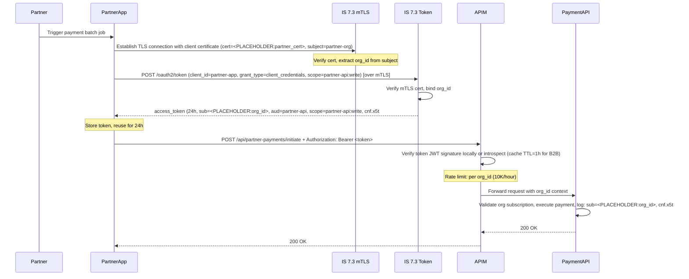
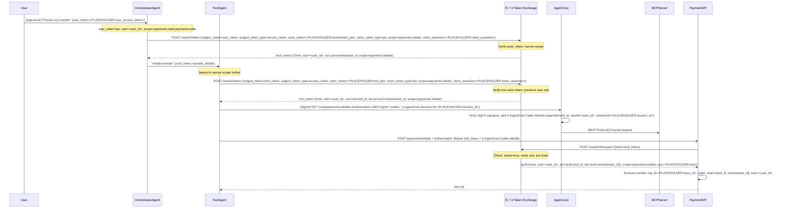
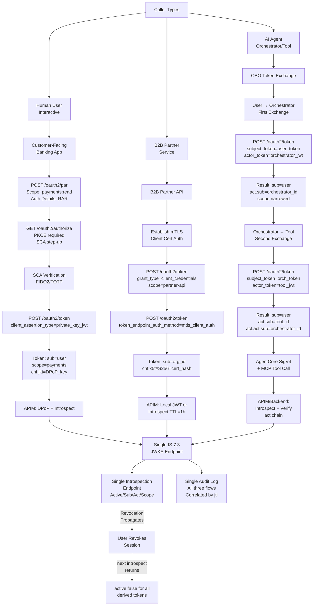
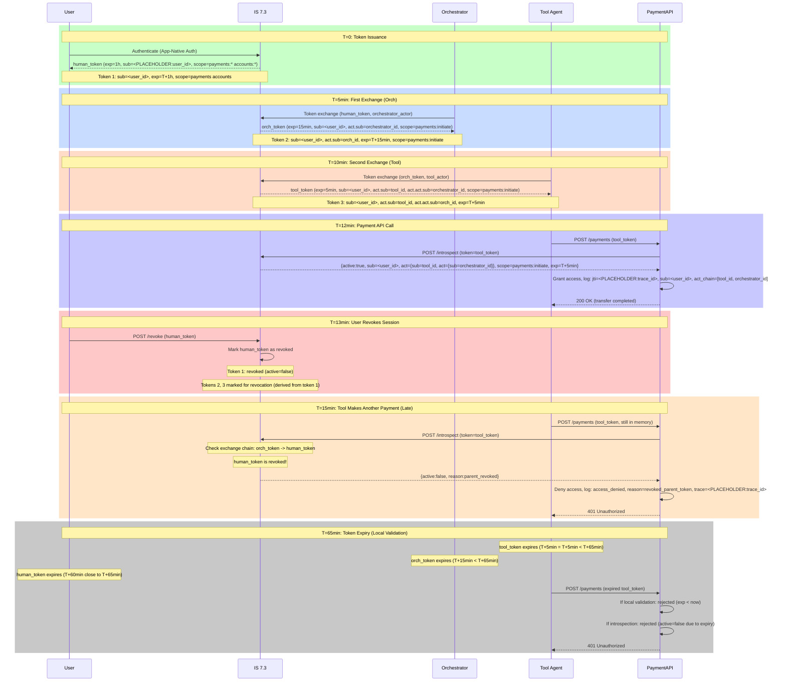

# Architecture Diagrams — IS 7.3 + AgentCore Hub

Five Mermaid sequence diagrams covering the three integration flows, their convergence on IS 7.3, and token lifecycle with revocation.

## Diagram 1: Customer-Facing Banking App (FAPI 2.0 + PAR + RAR + DPoP + SCA)

```mermaid
sequenceDiagram
    participant User
    participant MobileApp
    participant PAR as IS 7.3 PAR
    participant AuthZ as IS 7.3 AuthZ
    participant SCA as SCA Backend
    participant JARM as IS 7.3 JARM
    participant APIM
    participant PaymentAPI

    User->>MobileApp: Open app, tap "Pay"
    MobileApp->>PAR: POST /oauth2/par (client_id, redirect_uri, scope=payments:write accounts:read, authorization_details=<PLACEHOLDER:RAR>)
    PAR-->>MobileApp: request_uri, expires_in=600
    MobileApp->>AuthZ: GET /oauth2/authorize (request_uri, PKCE challenge)
    AuthZ->>User: [UI] Verify identity + consent
    AuthZ->>SCA: Out-of-band: FIDO2 passkey or TOTP challenge
    User->>SCA: Approve
    SCA-->>AuthZ: SCA verified
    AuthZ-->>MobileApp: HTTP 302 redirect to redirect_uri?code=<PLACEHOLDER:code>&state=<PLACEHOLDER:state> (JARM response, signed JWT)
    MobileApp->>JARM: POST /oauth2/token (code, code_verifier, client_assertion_type=private_key_jwt, client_assertion=<PLACEHOLDER:jwt>)
    Note over JARM: Verify PKCE, client auth
    JARM-->>MobileApp: access_token (1h, sub=<PLACEHOLDER:user_id>, aud=payment-api, scope=payments:write accounts:read, cnf.jkt=<PLACEHOLDER:dpop_binding>), refresh_token
    Note over MobileApp: Bind token to DPoP public key
    MobileApp->>APIM: POST /api/payments/initiate + Authorization: DPoP <token> + DPoP: <PLACEHOLDER:dpop_proof>
    APIM->>APIM: Verify DPoP binding, token signature
    Note over APIM: Cache introspection (TTL=5min)
    APIM->>PaymentAPI: Forward request with validated context
    PaymentAPI->>PaymentAPI: Execute payment, log: sub=<PLACEHOLDER:user_id>, jti=<PLACEHOLDER:trace_id>
    PaymentAPI-->>APIM: 200 OK
    APIM-->>MobileApp: 200 OK
```

---

## Diagram 2: B2B Partner Payment API (mTLS + Org-Scoped Token)



---

## Diagram 3: AI Agent Delegation Chain (OBO + AgentCore + MCP Tool)



---

## Diagram 4: IS 7.3 Hub — All Three Flows Converging



---

## Diagram 5: Token Lifecycle and Revocation Propagation



---

## Diagram Notes

1. **Diagram 1 (Customer FAPI 2.0)**: Shows the full FAPI 2.0 + PAR + RAR + DPoP + SCA flow. The token is DPoP-bound (`cnf.jkt`), meaning it cannot be used without proof of possession of the corresponding DPoP key. JARM is used for the redirect response (signed JWT instead of plain redirect parameters).

2. **Diagram 2 (B2B mTLS)**: Demonstrates mTLS client authentication. The client certificate is used to authenticate and to bind the token (`cnf.x5t#S256` = certificate thumbprint). Unlike the customer flow, there is no user; the `sub` is the partner organization's `org_id`.

3. **Diagram 3 (AI Agent OBO + AgentCore + MCP)**: The orchestrator agent exchanges the user's token for an agent-scoped token via RFC 8693. The tool agent then exchanges the orchestrator token for its own narrower token. The `act` claim nests to show the full delegation chain. AgentCore provides SigV4-signed credentials for additional access control.

4. **Diagram 4 (IS 7.3 Hub)**: Visual representation of all three flows converging on a single IS 7.3 instance. Key endpoints: PAR, authorization, token, introspection. All three flows share the same JWKS, audit log, and revocation mechanism.

5. **Diagram 5 (Token Lifecycle)**: Traces a token through its full lifecycle: issuance, exchange chain, use, revocation, and expiry. Shows that introspection-based revocation propagates through the chain immediately, while local JWT validation does not detect revocation until token expiry.

