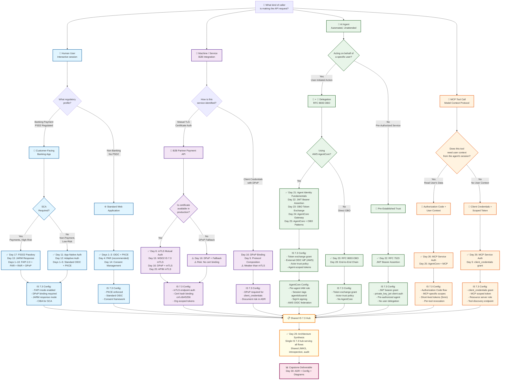

# Protocol Decision Tree — 30-Day AuthN/AuthZ Curriculum

## Master Question: What kind of caller is making the API request?

This flowchart routes all caller types (human users, B2B services, AI agents, MCP tools) through the authentication and authorization protocols covered in Days 1–30.



---

## Decision Tree Walkthrough

### Path 1: Customer-Facing Banking App (Human User, FAPI 2.0)

**Caller:** Mobile banking app user

**Protocol chain:**
1. **Day 1-3: OIDC + PKCE** — Foundation
2. **Day 4: PAR** — Pushed Authorization Request (secure request submission)
3. **Day 8: RAR** — Rich Authorization Request (granular consent: which accounts, payment limit)
4. **Day 9: JARM** — JWT-encoded authorization response (prevents parameter tampering)
5. **Day 13: SCA** — Strong Customer Authentication (FIDO2 passkey or TOTP)
6. **Day 16: DPoP** — Demonstration of Possession (token binding to client device)
7. **Day 17: Consent & Revocation** — User can revoke session in-app; revocation propagates via introspection

**IS 7.3 Configuration Needed:**
```toml
[server.fapi]
enable_fapi_mode = true
[oauth]
allowed_grant_types = ["authorization_code", "refresh_token"]
[oauth.dpop]
require_dpop_for_fapi = true
[oauth.jarm]
enable_jarm = true
```

---

### Path 2: B2B Partner Integration (Service, mTLS)

**Caller:** Partner organization's payment processing service

**Protocol chain:**
1. **Day 6: mTLS** — Mutual TLS (certificate-based client auth)
2. **Day 15: WSO2 IS 7.3 mTLS** — Configure IS 7.3 to accept partner certs
3. **Day 20: APIM Integration** — APIM gateway validates org-scoped tokens
4. **Token binding:** `cnf.x5t#S256` (certificate thumbprint)
5. **Scope:** Partner-specific (e.g., `partner-api:write`), not user-scoped

**IS 7.3 Configuration Needed:**
```toml
[oauth.mtls]
enable_client_cert_auth = true
client_cert_validation_mode = "STRICT"
cert_claim_mapping { org_id = "CN" }
[oauth]
allowed_grant_types = ["client_credentials"]
```

---

### Path 3a: AI Agent with User Delegation (AgentCore + OBO)

**Caller:** Bedrock agent (via AgentCore)

**User involved:** Yes — agent acts on behalf of user

**Protocol chain:**
1. **Day 21: Agent Identity Fundamentals** — Why delegated tokens, not `client_credentials`
2. **Day 22: RFC 7523 JWT Bearer** — Agent authenticates via `private_key_jwt`
3. **Day 23: RFC 8693 OBO** — Agent exchanges user token for narrowed agent token
4. **Day 24: AgentCore Gateway** — AWS STS credential vending with session tags
5. **Day 25: AgentCore + OBO** — Full integration: AgentCore SigV4 + IS 7.3 token exchange
6. **Day 26: MCP** — If agent calls MCP tools, MCP tools get scoped tokens
7. **Day 27: IS 7.3 Agent IdP** — IS 7.3 as identity hub for agents
8. **Day 28: End-to-End Chain** — Full trace: user → orchestrator → tool → API

**Token structure:**
```json
{
  "sub": "<user_id>",
  "act": {"sub": "agent_client_id"},
  "scope": "agent:payments:initiate",
  "exp": "<T+900>"
}
```

**IS 7.3 Configuration Needed:**
```toml
[oauth.token_exchange]
enable_token_exchange = true
[identity_provider.federated_idps]
name = "AWS_AgentCore"
type = "OIDC"
oidc_discovery_url = "https://oidc.eks.region.amazonaws.com/id/<cluster-id>/.well-known/openid-configuration"
```

---

### Path 3b: AI Agent Without User (Pre-Authorized Service)

**Caller:** Service account agent (no user context)

**User involved:** No — agent operates independently

**Protocol chain:**
1. **Day 22: RFC 7523 JWT Bearer** — Agent authenticates via private key; gets pre-authorized token
2. **No user identity** — `sub` is the agent client_id, no `act` claim
3. **Use case:** Scheduled batch jobs, maintenance tasks, no user accountability required

**Not suitable for:** Banking payments, user-initiated actions (regulatory requirement: must have user context)

---

### Path 4: MCP Tool Authentication

**Caller:** MCP tool (sub-agent)

**Scenarios:**

**4a: Tool needs user context (e.g., read user's account balance)**
- Use Authorization Code flow
- Tool gets token with `sub=user`, `scope=mcp:accounts:read`
- Token lifetime: 5min (short-lived for per-operation permission)

**4b: Tool does not need user context (e.g., validate payment amount against rules)**
- Use client_credentials grant
- Tool gets token with `sub=tool_id`, `scope=mcp:validate`
- Tokens are scoped narrowly per tool capability

**IS 7.3 Configuration Needed:**
```toml
[[oauth.scope.definitions]]
scope = "mcp:payments:read"
apps = ["MCPPaymentsTool"]

[[oauth.scope.definitions]]
scope = "mcp:payments:write"
apps = ["MCPPaymentsTool"]
```

---

## Anti-Pattern: How NOT to Route Requests

| Anti-Pattern | Why It's Wrong | Correct Path |
|---|---|---|
| Use `client_credentials` for all agent tokens | No user context; breaks auditability and revocation; PSD2 non-compliant | Use RFC 8693 OBO for user-initiated actions |
| Pass user's token directly to agent | Agent inherits full user scope; agent appears as user in logs; confused deputy risk | Exchange user token for narrowed agent token with `act` claim |
| Route B2B via Authorization Code + user account | B2B is service-to-service; no user; authorization code requires user browser | Use mTLS + client_credentials with org-scoped tokens |
| Skip FAPI 2.0 for banking apps | Missing PSD2 compliance requirements (PAR, RAR, SCA, DPoP) | Follow Path 1: FAPI 2.0 full chain |
| Use API keys for MCP tools | No OAuth2 scope, no revocation per user, no audit trail | Use OAuth2 with scoped MCP tokens |

---

## Integration Matrix: Caller Type vs. IS 7.3 Endpoint

| Caller Type | Endpoint | Grant Type | Auth Method | User Context | Audit Claims |
|---|---|---|---|---|---|
| **Customer (FAPI)** | `/oauth2/authorize` | `authorization_code` | PKCE + private_key_jwt | `sub`=user | `sub`, `scope`, `jti` |
| **B2B Partner** | `/oauth2/token` | `client_credentials` | `mtls_client_auth` | None (org-scoped) | `sub`=org_id, `cnf.x5t#S256` |
| **AI Agent (with user)** | `/oauth2/token` | `token-exchange` | `private_key_jwt` | `sub`=user, `act`=agent | `sub`, `act`, `scope`, `jti` |
| **AI Agent (pre-auth)** | `/oauth2/token` | `jwt-bearer` | `private_key_jwt` | None | `sub`=agent_id |
| **MCP Tool (user context)** | `/oauth2/authorize` | `authorization_code` | `private_key_jwt` + PKCE | `sub`=user | `sub`, `scope`, `mcp:*` |
| **MCP Tool (no user)** | `/oauth2/token` | `client_credentials` | `private_key_jwt` | None | `sub`=tool_id, `scope=mcp:*` |

---

## Success Criteria for This Decision Tree

✅ **Can you explain why each path uses the protocol it does?**
- Example: "Customer uses FAPI 2.0 because PSD2 requires SCA for payments."

✅ **Can you trace a request from caller to IS 7.3 endpoint without looking at day files?**
- Example: "B2B partner → mTLS cert auth → IS 7.3 `/oauth2/token` → `client_credentials` → org-scoped token."

✅ **Can you identify anti-patterns and suggest the correct path?**
- Example: "Agent using `client_credentials` with no user → should use RFC 8693 OBO → recommends Day 23."

✅ **Can you explain which protocols share endpoints and which diverge?**
- Example: "Customer and B2B both use `/oauth2/token`, but different grant types and auth methods."

---

## References to Day Files

- **Days 1–10 (Phase 1):** Hard protocols — FAPI 2.0, PAR, RAR, DPoP, mTLS, CIBA, SCIM, Consent, SCA, Protocol Composition
- **Days 11–20 (Phase 2):** WSO2 IS 7.3 deep-dive — App-Native Auth, Adaptive Auth, FAPI mode, CIBA, DPoP+mTLS, B2B Org, FIDO2, RAR+Consent, Extension Points, APIM integration
- **Days 21–30 (Phase 3):** AI Agent Identity — Fundamentals, JWT Bearer, OBO, AgentCore, AgentCore+OBO, MCP, IS 7.3 Agent IdP, End-to-End Chain, Synthesis, Capstone

