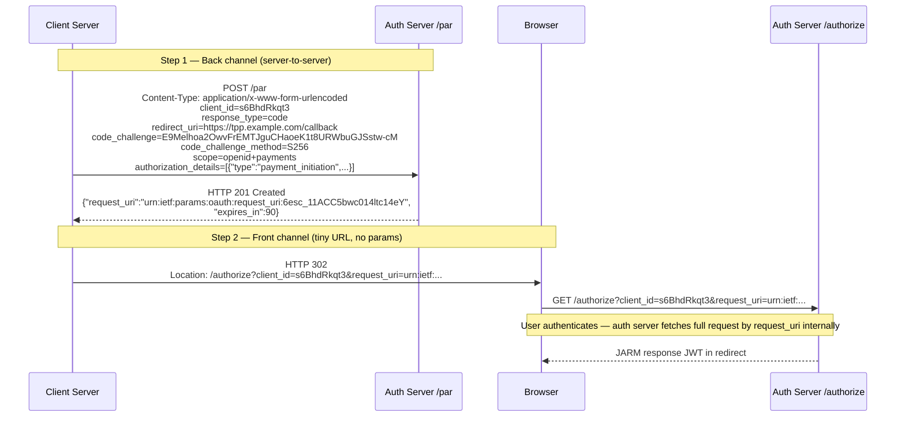

# Day 02 — PAR Front-Channel vs Back-Channel Separation

## What gets logged at each step

| Step | What is in server logs | Risk if exposed |
|------|----------------------|-----------------|
| PAR POST | Full auth params — but it is back-channel TLS | No browser, no proxy, safe |
| Redirect URL | Only `client_id` + `request_uri` (opaque) | Opaque reference — no sensitive data |
| JARM redirect | Signed JWT | Tamper-evident; replaying fails `exp` check |
