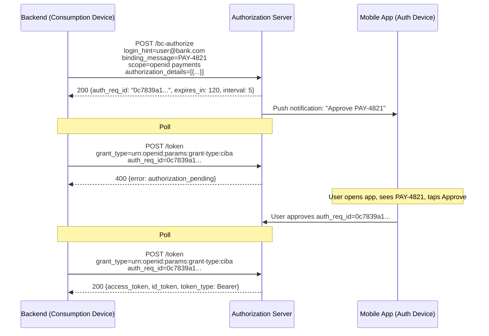
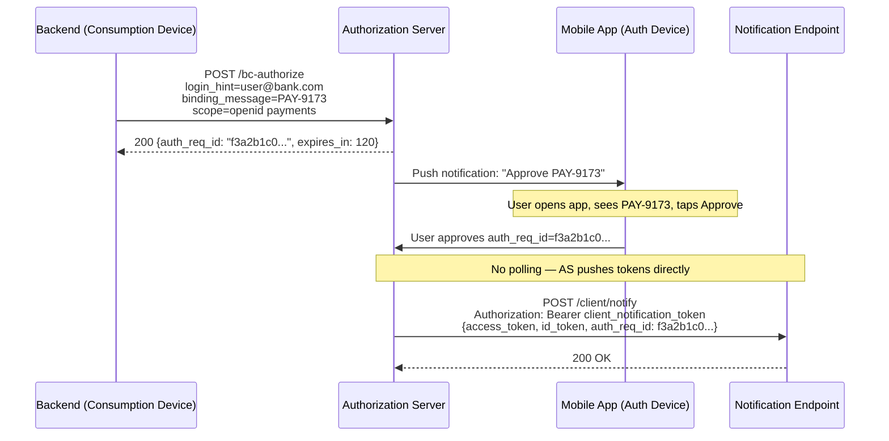

# Day 04 — CIBA Flow Diagrams

## Poll Mode

## Push Mode

## Key differences

| Aspect | Poll mode | Push mode |
|--------|-----------|-----------|
| Token delivery | Client polls until approval | AS pushes to notification endpoint |
| Infrastructure | No endpoint required | Requires `client_notification_endpoint` |
| Load at 1,000 sessions | ~200 req/s polling | ~1 req per approval |
| Security requirement | Standard token endpoint | Notification endpoint must validate bearer token |
