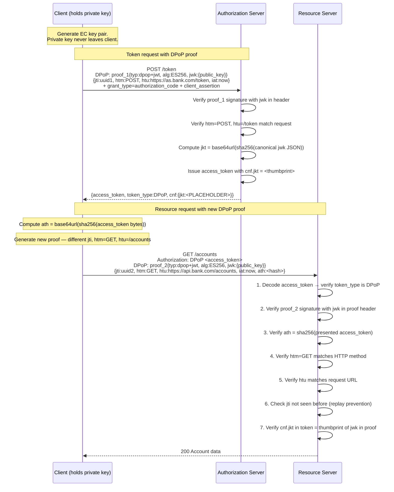

# Day 05 — DPoP Flow Diagram

## Full DPoP Token Request and Resource Request Flow

## What each validation step prevents

| RS check | Attack prevented |
|----------|-----------------|
| Proof signature | Forged proof without private key |
| `ath` = sha256(token) | Proof used with a different token |
| `htm` match | Proof reused for wrong HTTP method |
| `htu` match | Proof reused for wrong endpoint |
| `jti` replay check | Proof replayed in a second request |
| `cnf.jkt` = thumbprint(jwk) | Different key pair used in proof |
