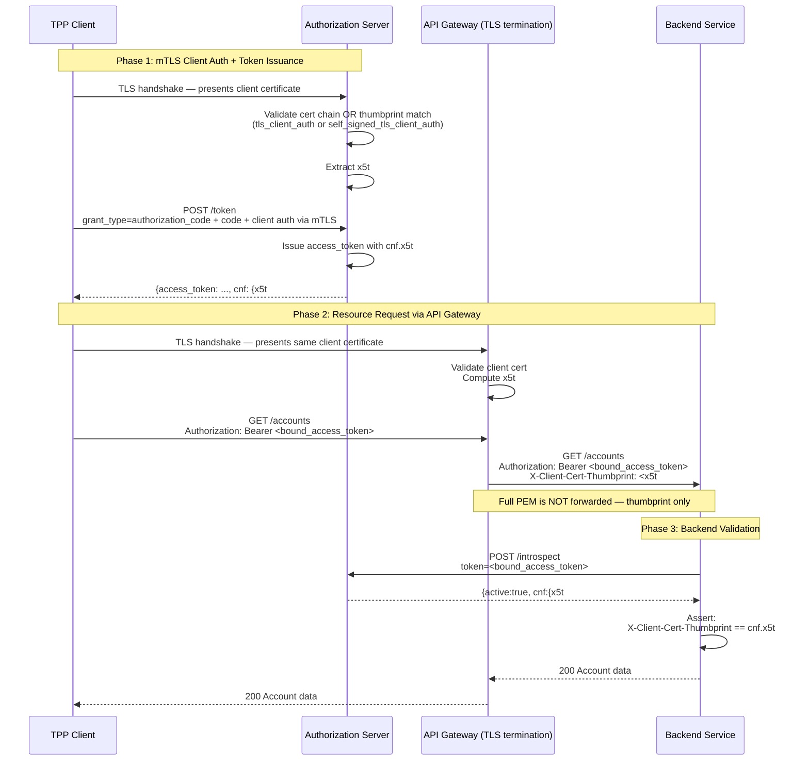

# Day 06 — mTLS Certificate-Bound Token Flow

## Full mTLS Flow: Handshake → Token Issuance → Resource Request → Validation

## What each step prevents

| Step | Security property |
|------|------------------|
| mTLS client auth at AS | Only the registered client with the matching cert can obtain tokens |
| `cnf.x5t#S256` in token | Token is bound to the cert used at issuance |
| Gateway extracts thumbprint | Backend never sees raw TLS; thumbprint is forwarded |
| Backend verifies thumbprint == cnf | Stolen token without matching cert is rejected |
| Gateway strips cert headers from external requests | Prevents thumbprint spoofing by external callers |
