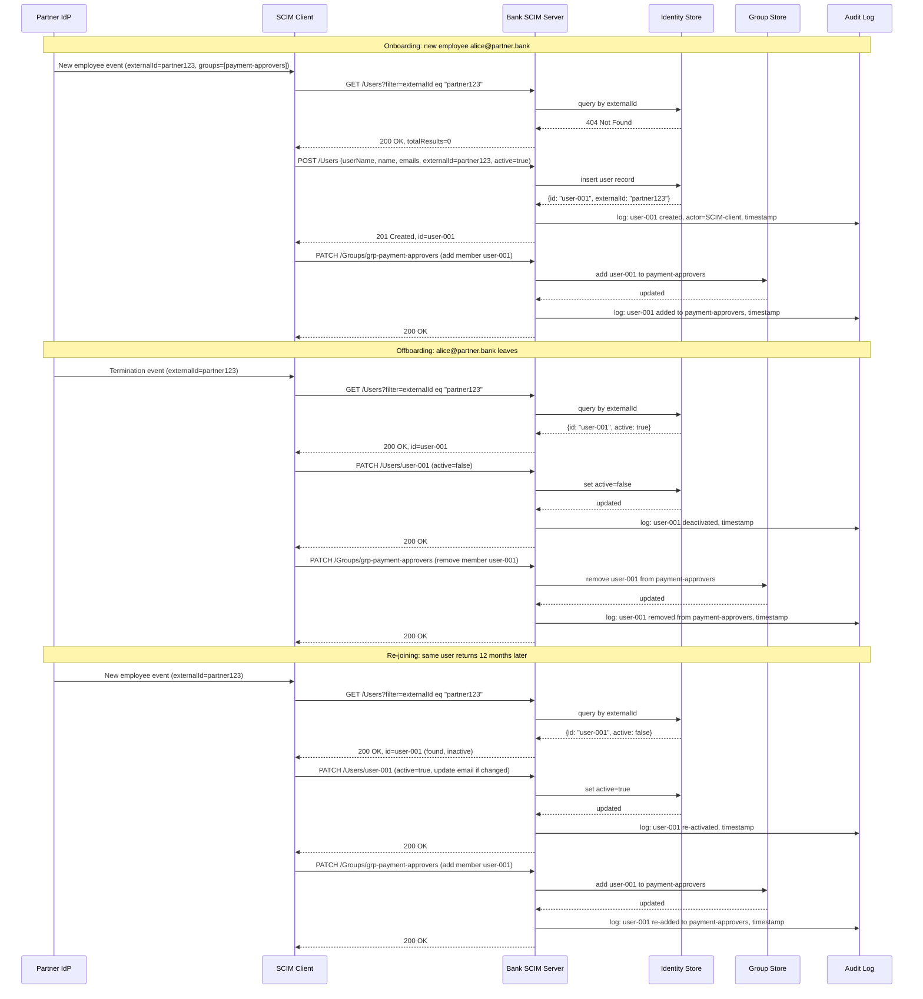

# Day 07 — SCIM Provisioning Lifecycle Diagram

## Full provisioning lifecycle: partner IdP → receiving bank

## Key observations

1. The SCIM client always checks for an existing user by `externalId` before creating — this prevents duplicate accounts on re-hire.
2. Group membership is managed on the `Group` resource, not the `User` resource. Two PATCH calls are always needed: one for the user, one for the group.
3. `DELETE /Users/{id}` is never called — `active=false` deactivates while preserving the audit record.
4. The audit log receives an entry at every lifecycle transition — this is the evidence trail for compliance reviews.
