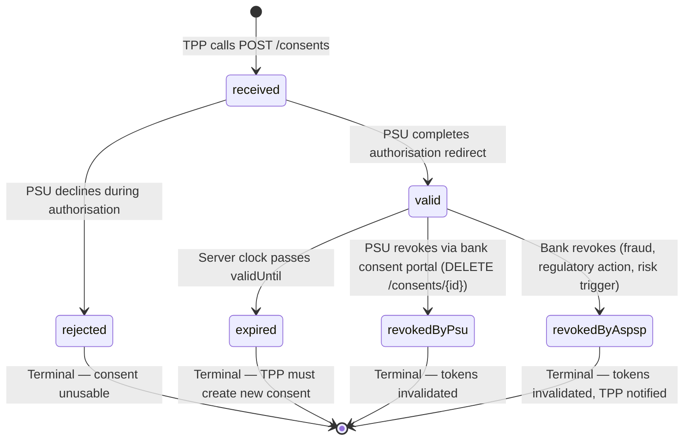

# Day 08 — Consent Lifecycle State Diagram

## Consent status state machine

## Transition details

| From | To | Trigger | Bank action required |
|---|---|---|---|
| `[*]` | `received` | TPP calls `POST /consents` | Store consent object; return `consentId`; provide authorisation link |
| `received` | `valid` | PSU completes authorisation flow (redirect or CIBA) | Issue access token linked to `consentId`; store `jti` in `linkedTokenJtis` |
| `received` | `rejected` | PSU declines during authorisation | Set status; no token issued; notify TPP via redirect with `error=access_denied` |
| `valid` | `expired` | Batch job or real-time check: `now > validUntil` | Set status; linked tokens return 401 on next resource call |
| `valid` | `revokedByPsu` | PSU calls bank's consent portal or TPP calls `DELETE /consents/{id}` | Set status; immediately add all `linkedTokenJtis` to token revocation list |
| `valid` | `revokedByAspsp` | Bank fraud detection, regulatory requirement, or manual override | Set status; immediately add all `linkedTokenJtis` to token revocation list; send webhook to TPP |

## Key design principles

1. **All terminal states are permanent.** A `rejected`, `expired`, `revokedByPsu`, or `revokedByAspsp` consent can never transition back to `valid`. The TPP must create a new consent.

2. **Token revocation is immediate on revocation transitions.** The bank cannot wait for token expiry — `revokedByPsu` and `revokedByAspsp` must invalidate tokens synchronously.

3. **Expiry is not revocation.** `expired` does not mean the user revoked; it means the consent reached its maximum validity window. The TPP may seek renewal — a new consent with a new authorisation flow.

4. **The consent object is the audit record.** Every status transition is logged with a timestamp and the actor (PSU, ASPSP, batch job). This is the evidence trail for regulatory audit.
