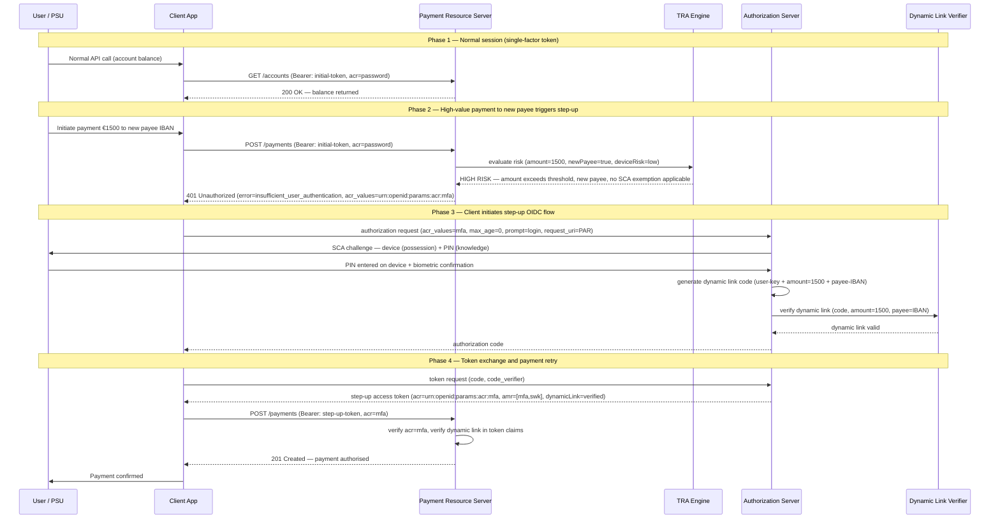

# Day 09 — SCA Step-Up Authentication Sequence Diagram

## Payment initiation → TRA evaluation → SCA step-up → authorisation

## Phase annotations

| Phase | Authentication strength | What the RS checks |
|---|---|---|
| Normal API call | `acr=password` (single factor) | Token valid, not expired, scope matches |
| Payment 401 | — | Amount + new payee → TRA fails → SCA required |
| Step-up auth | `acr=urn:openid:params:acr:mfa` | Two independent factors completed, dynamic link generated |
| Payment retry | `acr=mfa`, dynamic link in token | `acr` meets requirement, dynamic link matches this payment's amount + payee |

## Dynamic linking — what binds the code to this payment

The step-up code is computed over `(user-device-key, payment-amount, payee-iban)`. If an attacker intercepts the code:

- Cannot reuse it for a different amount — the code does not validate against a different amount
- Cannot reuse it for a different payee — the code does not validate against a different IBAN
- Cannot reuse it tomorrow — the code includes a time component (TOTP-style)
- Cannot use it on a different device — the code is bound to the user's device private key
