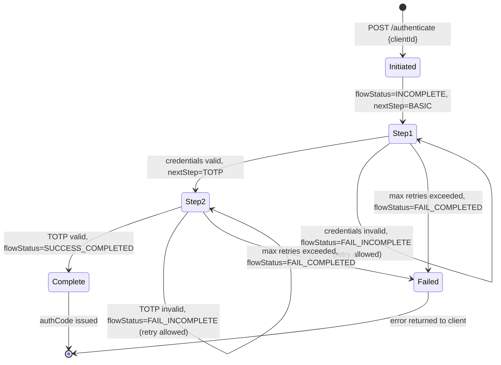

# Day 11 — App-Native Auth Session State Machine

## Key session state transitions

| `flowStatus` | Meaning | App action |
|---|---|---|
| `INCOMPLETE` | More steps required | Submit next step credentials |
| `FAIL_INCOMPLETE` | Step failed, retry allowed | Prompt user, resubmit same step |
| `SUCCESS_COMPLETED` | All steps passed | Exchange `authCode` at `/oauth2/token` |
| `FAIL_COMPLETED` | Flow terminated (locked/expired) | New initiation required |
