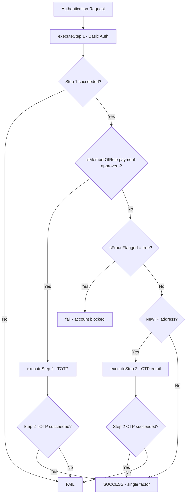

# Day 12 — Adaptive Auth Decision Flow

```mermaid
flowchart TD
    A[Authentication Request] --> B[executeStep 1 - Basic Auth]
    B --> C{Step 1 succeeded?}
    C -->|No| Z[FAIL]
    C -->|Yes| D{isMemberOfRole payment-approvers?}
    D -->|Yes| E[executeStep 2 - TOTP]
    D -->|No| F{isFraudFlagged = true?}
    F -->|Yes| G[fail - account blocked]
    F -->|No| H{New IP address?}
    H -->|Yes| I[executeStep 2 - OTP email]
    H -->|No| J[SUCCESS - single factor]
    E --> K{Step 2 TOTP succeeded?}
    K -->|Yes| J
    K -->|No| Z
    I --> L{Step 2 OTP succeeded?}
    L -->|Yes| J
    L -->|No| Z
```
