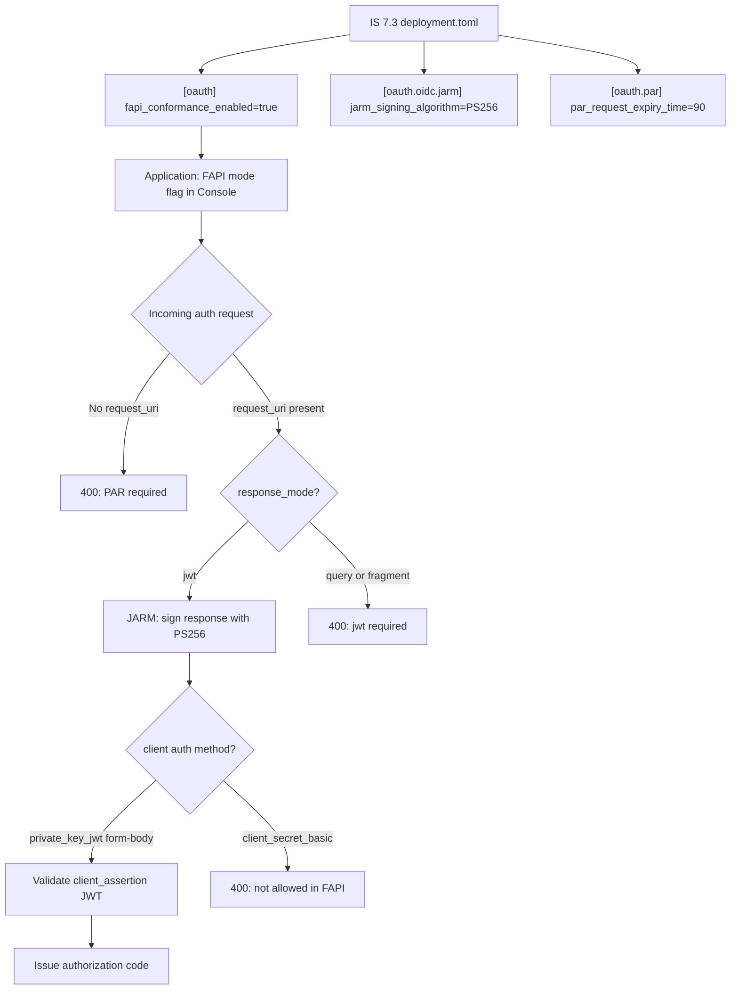

# Day 13 — FAPI 2.0 in IS 7.3: Config Points

```mermaid
graph TD
    A[IS 7.3 deployment.toml] --> B["[oauth] fapi_conformance_enabled=true"]
    A --> C["[oauth.oidc.jarm] jarm_signing_algorithm=PS256"]
    A --> D["[oauth.par] par_request_expiry_time=90"]

    B --> E[Application: FAPI mode flag in Console]
    E --> F{Incoming auth request}
    F -->|No request_uri| G[400: PAR required]
    F -->|request_uri present| H{response_mode?}
    H -->|jwt| I[JARM: sign response with PS256]
    H -->|query or fragment| J[400: jwt required]

    I --> K{client auth method?}
    K -->|private_key_jwt form-body| L[Validate client_assertion JWT]
    K -->|client_secret_basic| M[400: not allowed in FAPI]
    L --> N[Issue authorization code]
```
