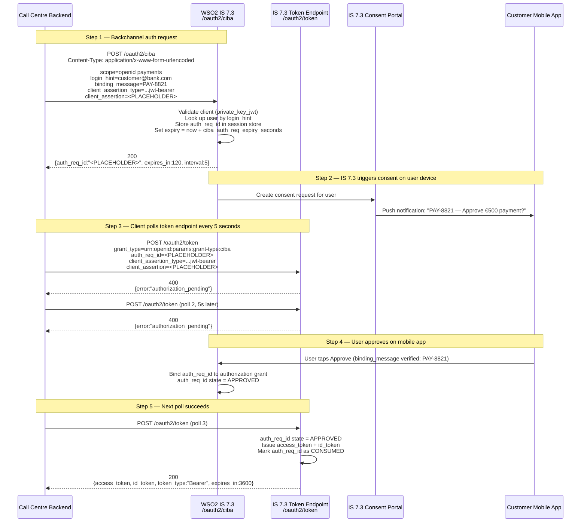
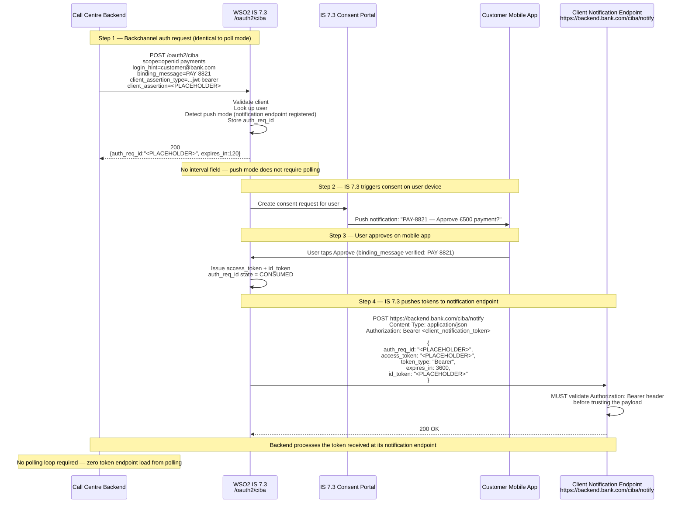
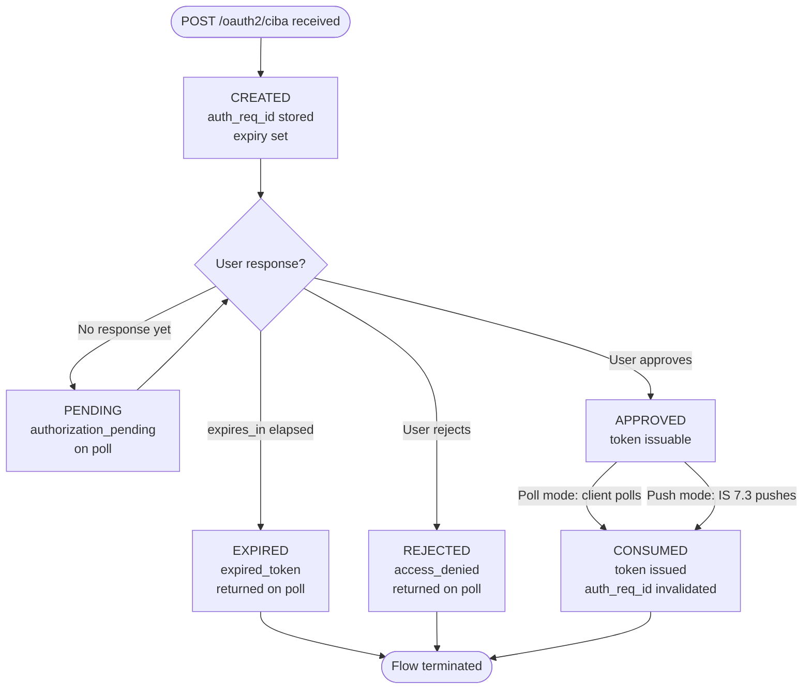

# Day 14 Lab — CIBA Sequence Diagrams (IS 7.3)

## Diagram 1: CIBA Poll Mode (IS 7.3 default)

The IS 7.3 CIBA endpoint is `POST /oauth2/ciba`. Poll mode is active when no
`client_notification_endpoint` is registered in the application's CIBA settings.
The client polls `POST /oauth2/token` using the CIBA grant type.

---

## Diagram 2: CIBA Push Mode (IS 7.3 with notification endpoint)

Push mode is activated by setting delivery mode to `push` in the IS 7.3 application CIBA
configuration AND registering an HTTPS `client_notification_endpoint`. IS 7.3 delivers tokens
directly — no polling required.

---

## Diagram 3: auth_req_id lifecycle state machine

