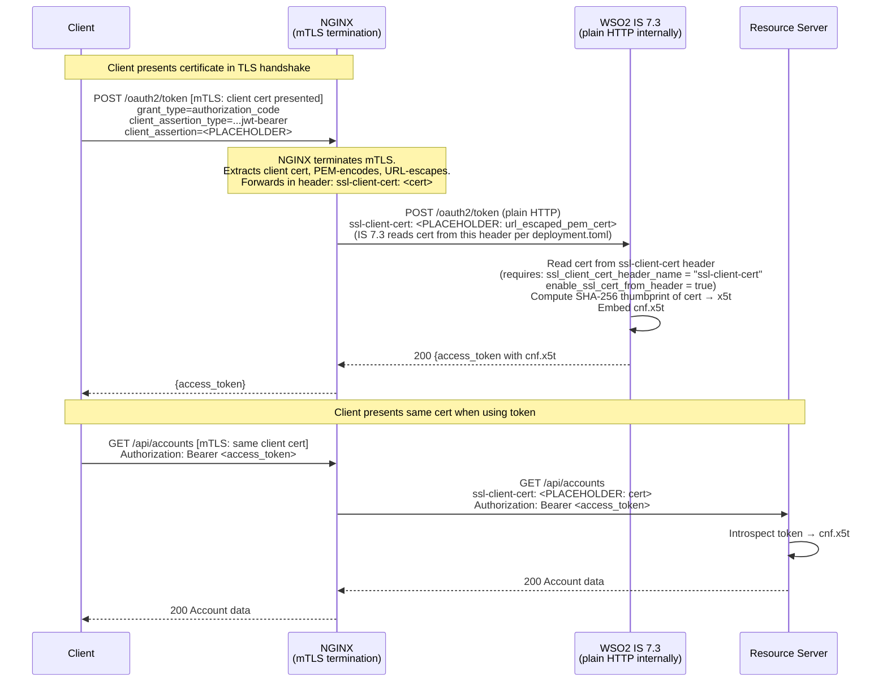
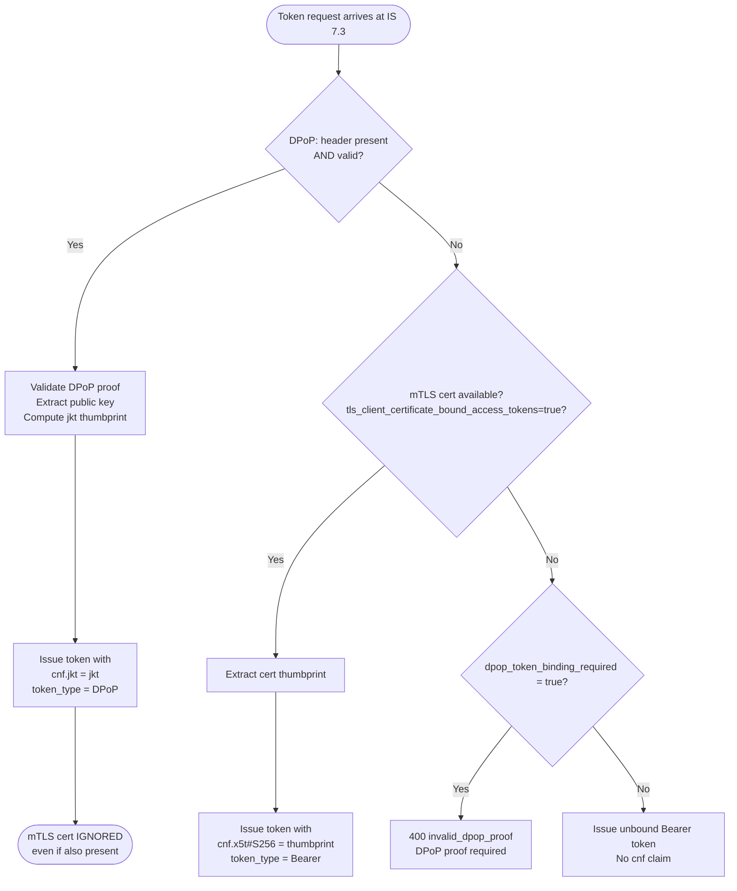

# Day 15 Lab — DPoP + mTLS Token Binding Diagrams

## Diagram 1: DPoP end-to-end flow through IS 7.3

The diagram shows where `DPoP:` headers must pass, where IS 7.3 embeds `cnf.jkt`,
and where the resource server validates binding. **Both gateway hops** must forward
the `DPoP:` header or the flow breaks.

```mermaid
sequenceDiagram
    participant C as Client (Mobile App)
    participant GW as API Gateway<br/>(TLS termination, NGINX)
    participant IS as WSO2 IS 7.3<br/>Token Endpoint
    participant RS as Resource Server
    participant IN as IS 7.3<br/>Introspection

    Note over C,GW: Phase 1 — Token issuance with DPoP proof
    C->>GW: POST /oauth2/token<br/>DPoP: <proof_jwt_1><br/>  ├─ jwk: {client public key}<br/>  ├─ htm: "POST"<br/>  ├─ htu: "https://identity.bank.com/oauth2/token"<br/>  ├─ iat: 1789008700<br/>  └─ jti: "<unique_id_1>"<br/>grant_type=authorization_code<br/>client_assertion_type=...jwt-bearer<br/>client_assertion=<PLACEHOLDER>

    Note over GW: GATEWAY CONFIG REQUIRED:<br/>proxy_pass_header DPoP;<br/>or: add_header / proxy_set_header DPoP $http_dpop;
    GW->>IS: Forward with DPoP header intact
    IS->>IS: Validate DPoP proof:<br/>  1. Verify proof JWT signature<br/>  2. Check htm="POST", htu matches token endpoint URL<br/>  3. Check iat within skew tolerance (60s)<br/>  4. Check jti not seen before (replay)<br/>  5. Extract public key from proof jwk header<br/>  6. Compute SHA-256 thumbprint of jwk → jkt

    IS->>IS: Embed cnf.jkt in access token<br/>{..., "cnf": {"jkt": "<thumbprint>"}}
    IS-->>GW: 200<br/>{access_token (with cnf.jkt), token_type:"DPoP", expires_in:3600}
    GW-->>C: {access_token, token_type:"DPoP"}

    Note over C,GW: Phase 2 — API call with DPoP-bound token
    C->>GW: GET /api/payments<br/>Authorization: DPoP <access_token><br/>DPoP: <proof_jwt_2><br/>  ├─ jwk: {same client public key}<br/>  ├─ htm: "GET"<br/>  ├─ htu: "https://api.bank.com/api/payments"<br/>  ├─ ath: base64url(SHA-256(access_token))<br/>  ├─ iat: 1789008750<br/>  └─ jti: "<unique_id_2>"

    Note over GW: GATEWAY CONFIG REQUIRED (second hop):<br/>DPoP header must reach the resource server.
    GW->>RS: GET /api/payments<br/>Authorization: DPoP <access_token><br/>DPoP: <proof_jwt_2>

    Note over RS: Phase 3 — Resource server validates binding
    RS->>IN: POST /oauth2/introspect<br/>token=<access_token>
    IN-->>RS: {active:true, cnf:{jkt:"<thumbprint>"}, sub:..., scope:...}

    RS->>RS: DPoP validation checklist:<br/>  1. cnf.jkt present → REQUIRE DPoP: header<br/>  2. Parse proof_jwt_2<br/>  3. Verify signature against public key whose jkt = cnf.jkt<br/>  4. Check htm="GET" matches request method<br/>  5. Check htu matches this endpoint URL<br/>  6. Verify ath = base64url(SHA-256(access_token))<br/>  7. Check iat within skew tolerance<br/>  8. Check jti not replayed<br/>  → ALL checks pass → request accepted

    RS-->>GW: 200 Resource data
    GW-->>C: 200 Resource data
```

---

## Diagram 2: mTLS token binding — IS 7.3 behind a reverse proxy



---

## Diagram 3: DPoP vs. mTLS binding precedence


