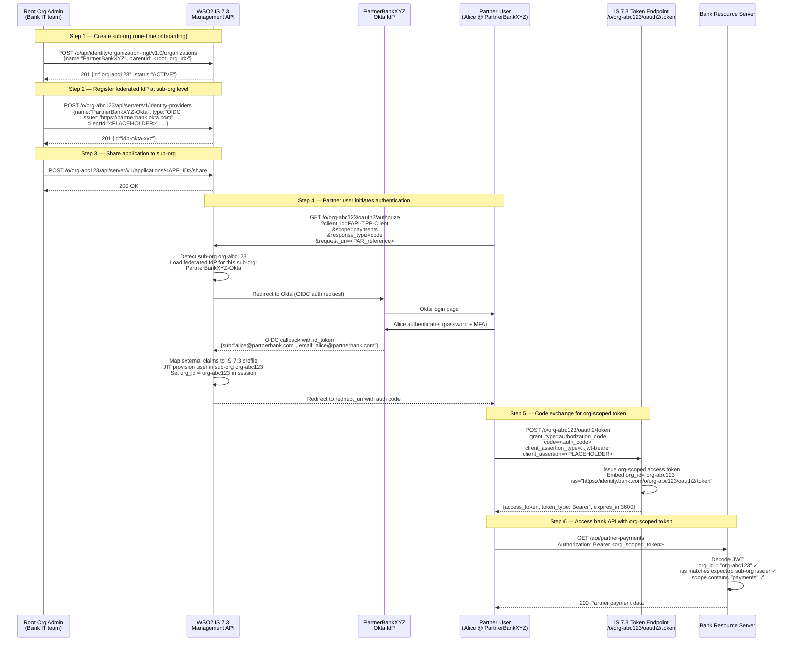
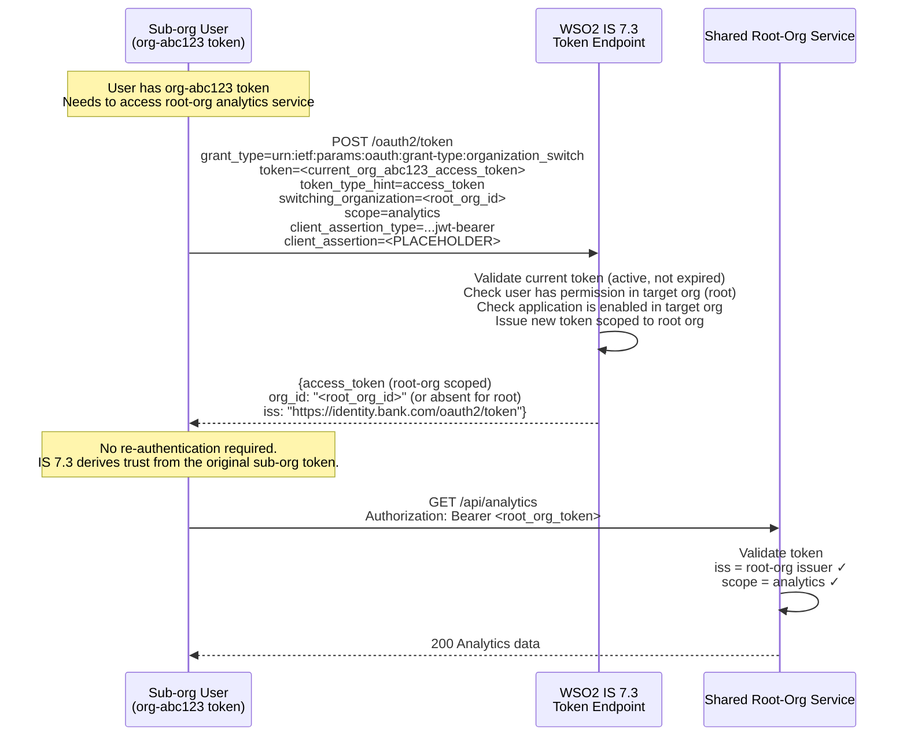

# Day 16 Lab — B2B Organization Management Diagrams

## Diagram 1: IS 7.3 organization hierarchy

```mermaid
flowchart TD
    ROOT["IS 7.3 Super-tenant\n(Root Org: 'Bank Corp')\norg_id: root-org-id"]

    ROOT --> ORG_A["Sub-org: PartnerBankXYZ\norg_id: org-abc123\nIdentity store: FEDERATED\n→ PartnerBankXYZ Okta IdP"]
    ROOT --> ORG_B["Sub-org: FintechCo\norg_id: org-def456\nIdentity store: LOCAL\n(IS 7.3 manages users)"]
    ROOT --> ORG_C["Sub-org: InternalTeams\norg_id: org-ghi789\nIdentity store: LOCAL"]

    ROOT --> APP1["Shared App: FAPI-TPP-Client\n(registered at root-org level)\nread-only in all sub-orgs"]
    ROOT --> APP2["Shared App: AdminPortal\n(root-org only)"]

    ORG_A -.->|inherits shared apps\n(read-only)| APP1
    ORG_B -.->|inherits shared apps\n(read-only)| APP1

    ORG_A --> IDP_A["Federated IdP:\nPartnerBankXYZ Okta\n(registered at sub-org level only)"]
```

---

## Diagram 2: B2B partner user authentication and org-scoped token issuance



---

## Diagram 3: Organization switch grant


