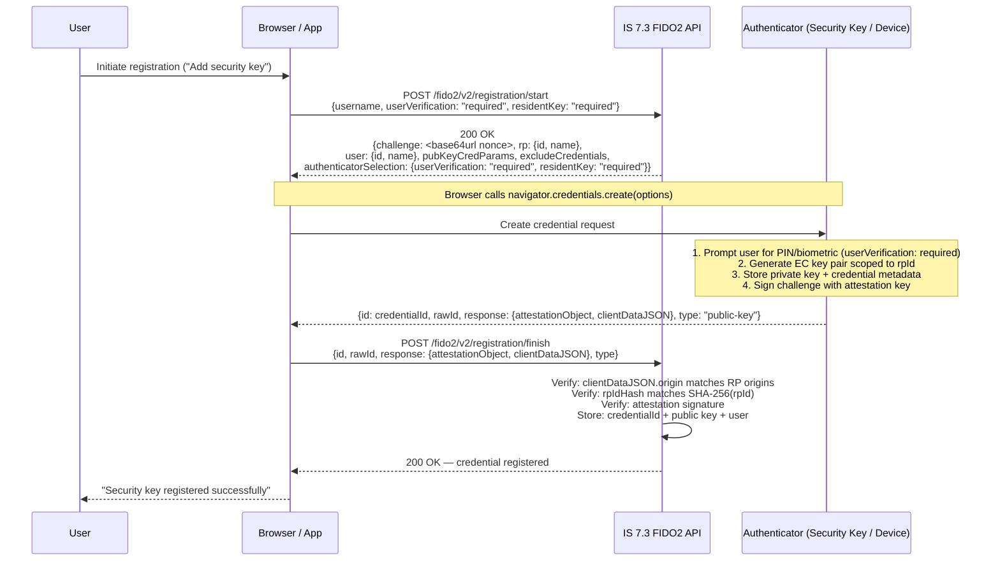
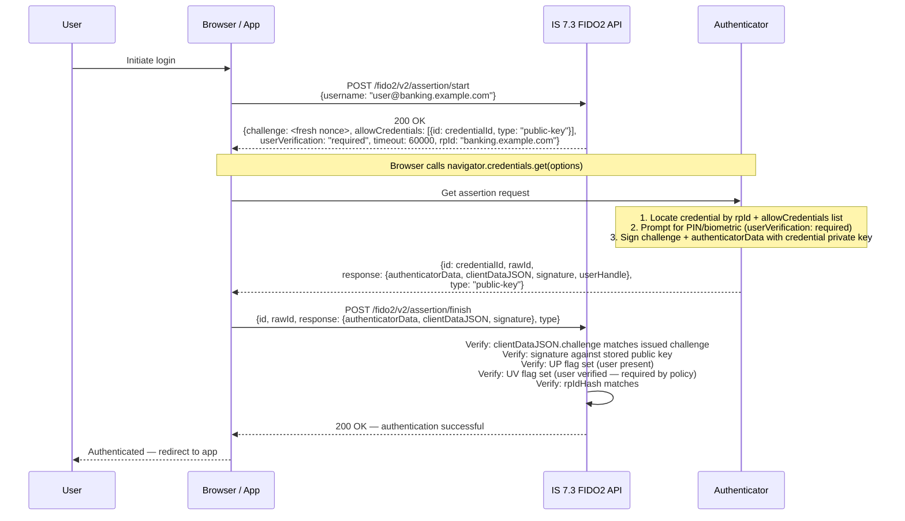
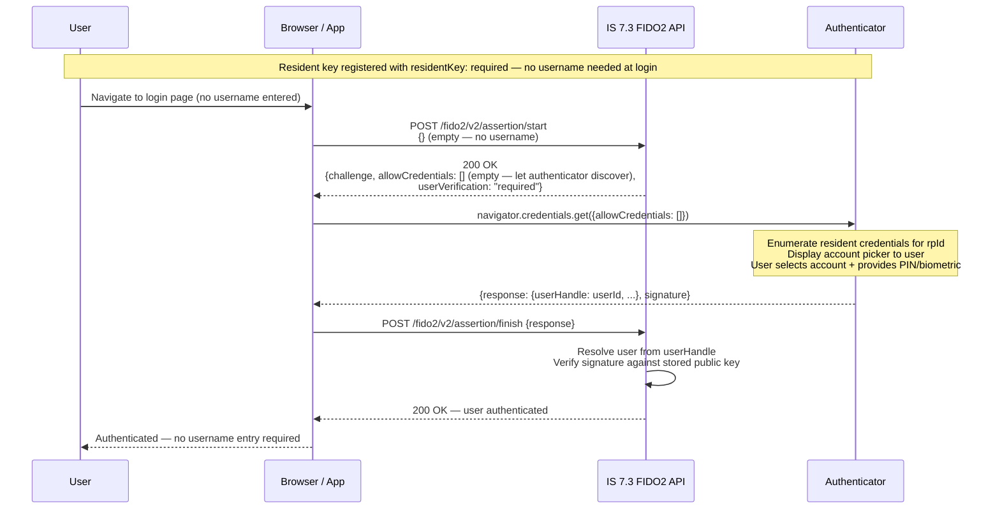

# Day 17 — FIDO2 Registration and Assertion Ceremony Diagrams

## Registration Ceremony

```mermaid
sequenceDiagram
    participant U as User
    participant B as Browser / App
    participant IS as IS 7.3 FIDO2 API
    participant Auth as Authenticator (Security Key / Device)

    U->>B: Initiate registration ("Add security key")
    B->>IS: POST /fido2/v2/registration/start<br/>{username, userVerification: "required", residentKey: "required"}
    IS-->>B: 200 OK<br/>{challenge: <base64url nonce>, rp: {id, name},<br/>user: {id, name}, pubKeyCredParams, excludeCredentials,<br/>authenticatorSelection: {userVerification: "required", residentKey: "required"}}

    Note over B,Auth: Browser calls navigator.credentials.create(options)
    B->>Auth: Create credential request
    Note over Auth: 1. Prompt user for PIN/biometric (userVerification: required)<br/>2. Generate EC key pair scoped to rpId<br/>3. Store private key + credential metadata<br/>4. Sign challenge with attestation key
    Auth-->>B: {id: credentialId, rawId, response: {attestationObject, clientDataJSON}, type: "public-key"}

    B->>IS: POST /fido2/v2/registration/finish<br/>{id, rawId, response: {attestationObject, clientDataJSON}, type}
    IS->>IS: Verify: clientDataJSON.origin matches RP origins<br/>Verify: rpIdHash matches SHA-256(rpId)<br/>Verify: attestation signature<br/>Store: credentialId + public key + user
    IS-->>B: 200 OK — credential registered
    B-->>U: "Security key registered successfully"
```

## Assertion Ceremony (Authentication)

```mermaid
sequenceDiagram
    participant U as User
    participant B as Browser / App
    participant IS as IS 7.3 FIDO2 API
    participant Auth as Authenticator

    U->>B: Initiate login
    B->>IS: POST /fido2/v2/assertion/start<br/>{username: "user@banking.example.com"}
    IS-->>B: 200 OK<br/>{challenge: <fresh nonce>, allowCredentials: [{id: credentialId, type: "public-key"}],<br/>userVerification: "required", timeout: 60000, rpId: "banking.example.com"}

    Note over B,Auth: Browser calls navigator.credentials.get(options)
    B->>Auth: Get assertion request
    Note over Auth: 1. Locate credential by rpId + allowCredentials list<br/>2. Prompt for PIN/biometric (userVerification: required)<br/>3. Sign challenge + authenticatorData with credential private key
    Auth-->>B: {id: credentialId, rawId,<br/>response: {authenticatorData, clientDataJSON, signature, userHandle},<br/>type: "public-key"}

    B->>IS: POST /fido2/v2/assertion/finish<br/>{id, rawId, response: {authenticatorData, clientDataJSON, signature}, type}
    IS->>IS: Verify: clientDataJSON.challenge matches issued challenge<br/>Verify: signature against stored public key<br/>Verify: UP flag set (user present)<br/>Verify: UV flag set (user verified — required by policy)<br/>Verify: rpIdHash matches
    IS-->>B: 200 OK — authentication successful
    B-->>U: Authenticated — redirect to app
```

## Resident Key (Passkey) — Passwordless Flow

```mermaid
sequenceDiagram
    participant U as User
    participant B as Browser / App
    participant IS as IS 7.3 FIDO2 API
    participant Auth as Authenticator

    Note over U,Auth: Resident key registered with residentKey: required — no username needed at login

    U->>B: Navigate to login page (no username entered)
    B->>IS: POST /fido2/v2/assertion/start<br/>{} (empty — no username)
    IS-->>B: 200 OK<br/>{challenge, allowCredentials: [] (empty — let authenticator discover),<br/>userVerification: "required"}

    B->>Auth: navigator.credentials.get({allowCredentials: []})
    Note over Auth: Enumerate resident credentials for rpId<br/>Display account picker to user<br/>User selects account + provides PIN/biometric
    Auth-->>B: {response: {userHandle: userId, ...}, signature}

    B->>IS: POST /fido2/v2/assertion/finish {response}
    IS->>IS: Resolve user from userHandle<br/>Verify signature against stored public key
    IS-->>B: 200 OK — user authenticated
    B-->>U: Authenticated — no username entry required
```
