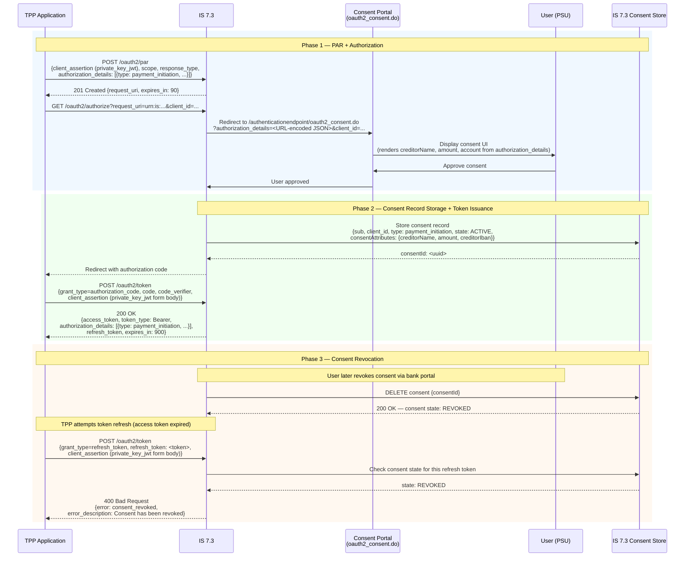
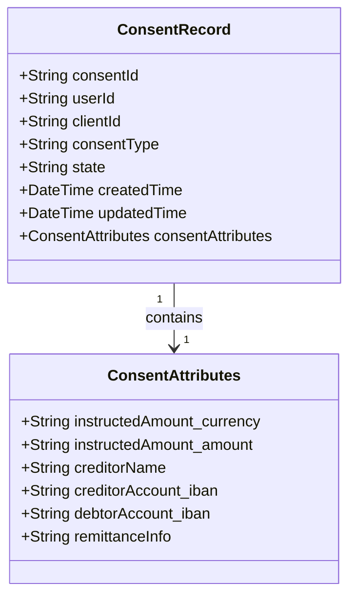
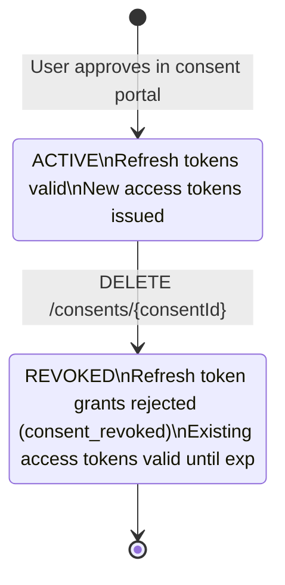

# Day 18 — RAR + Consent Portal Sequence Diagram

## Full RAR Consent Flow with Revocation

```mermaid
sequenceDiagram
    participant TPP as TPP Application
    participant IS as IS 7.3
    participant CP as Consent Portal<br/>(oauth2_consent.do)
    participant U as User (PSU)
    participant CM as IS 7.3 Consent Store

    rect rgb(240, 248, 255)
        Note over TPP,CM: Phase 1 — PAR + Authorization
        TPP->>IS: POST /oauth2/par<br/>{client_assertion (private_key_jwt), scope, response_type,<br/>authorization_details: [{type: payment_initiation, ...}]}
        IS-->>TPP: 201 Created {request_uri, expires_in: 90}

        TPP->>IS: GET /oauth2/authorize?request_uri=urn:is:...&client_id=...
        IS->>CP: Redirect to /authenticationendpoint/oauth2_consent.do<br/>?authorization_details=<URL-encoded JSON>&client_id=...
        CP->>U: Display consent UI<br/>(renders creditorName, amount, account from authorization_details)
        U->>CP: Approve consent
        CP->>IS: User approved
    end

    rect rgb(240, 255, 240)
        Note over IS,CM: Phase 2 — Consent Record Storage + Token Issuance
        IS->>CM: Store consent record<br/>{sub, client_id, type: payment_initiation, state: ACTIVE,<br/>consentAttributes: {creditorName, amount, creditorIban}}
        CM-->>IS: consentId: <uuid>
        IS-->>TPP: Redirect with authorization code

        TPP->>IS: POST /oauth2/token<br/>{grant_type=authorization_code, code, code_verifier,<br/>client_assertion (private_key_jwt form body)}
        IS-->>TPP: 200 OK<br/>{access_token, token_type: Bearer,<br/>authorization_details: [{type: payment_initiation, ...}],<br/>refresh_token, expires_in: 900}
    end

    rect rgb(255, 248, 240)
        Note over TPP,CM: Phase 3 — Consent Revocation
        Note over U,IS: User later revokes consent via bank portal
        IS->>CM: DELETE consent {consentId}
        CM-->>IS: 200 OK — consent state: REVOKED

        Note over TPP,IS: TPP attempts token refresh (access token expired)
        TPP->>IS: POST /oauth2/token<br/>{grant_type=refresh_token, refresh_token: <token>,<br/>client_assertion (private_key_jwt form body)}
        IS->>CM: Check consent state for this refresh token
        CM-->>IS: state: REVOKED
        IS-->>TPP: 400 Bad Request<br/>{error: consent_revoked,<br/>error_description: Consent has been revoked}
    end
```

## Consent Record Structure in IS 7.3

```mermaid
classDiagram
    class ConsentRecord {
        +String consentId
        +String userId
        +String clientId
        +String consentType
        +String state
        +DateTime createdTime
        +DateTime updatedTime
        +ConsentAttributes consentAttributes
    }

    class ConsentAttributes {
        +String instructedAmount_currency
        +String instructedAmount_amount
        +String creditorName
        +String creditorAccount_iban
        +String debtorAccount_iban
        +String remittanceInfo
    }

    ConsentRecord "1" --> "1" ConsentAttributes : contains
```

## Consent Revocation Impact

```mermaid
stateDiagram-v2
    [*] --> ACTIVE : User approves in consent portal
    ACTIVE --> REVOKED : DELETE /consents/{consentId}
    REVOKED --> [*]

    ACTIVE : ACTIVE\nRefresh tokens valid\nNew access tokens issued
    REVOKED : REVOKED\nRefresh token grants rejected (consent_revoked)\nExisting access tokens valid until exp
```
