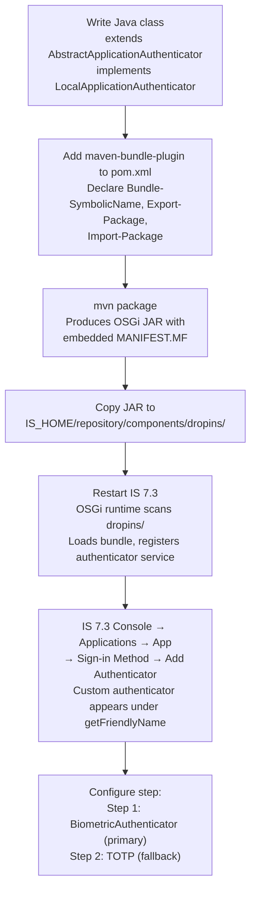
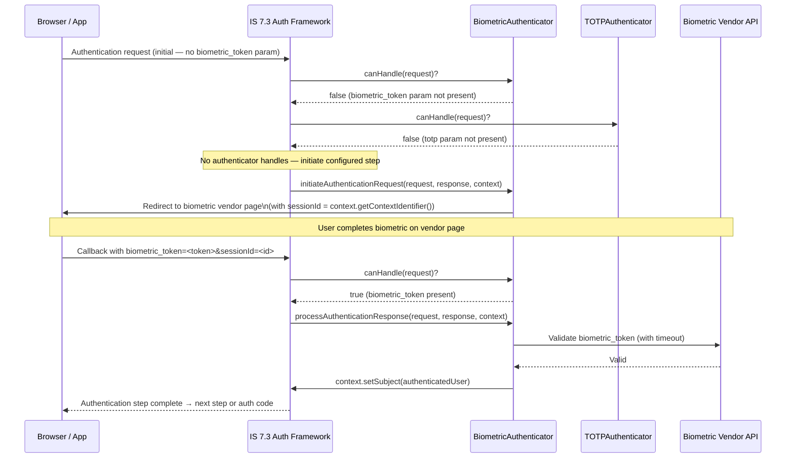
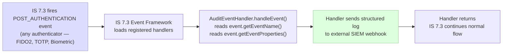

# Day 19 — Custom Authenticator Bundle Lifecycle and Execution Flow

## Bundle Lifecycle: Build to Deployment

```mermaid
flowchart TD
    A["Write Java class\nextends AbstractApplicationAuthenticator\nimplements LocalApplicationAuthenticator"] --> B["Add maven-bundle-plugin to pom.xml\nDeclare Bundle-SymbolicName, Export-Package,\nImport-Package"]
    B --> C["mvn package\nProduces OSGi JAR with\nembedded MANIFEST.MF"]
    C --> D["Copy JAR to\nIS_HOME/repository/components/dropins/"]
    D --> E["Restart IS 7.3\nOSGi runtime scans dropins/\nLoads bundle, registers authenticator service"]
    E --> F["IS 7.3 Console → Applications → App\n→ Sign-in Method → Add Authenticator\nCustom authenticator appears under getFriendlyName"]
    F --> G["Configure step:\nStep 1: BiometricAuthenticator (primary)\nStep 2: TOTP (fallback)"]
```

## Authentication Request Routing

```mermaid
sequenceDiagram
    participant B as Browser / App
    participant IS as IS 7.3 Auth Framework
    participant BA as BiometricAuthenticator
    participant TA as TOTPAuthenticator
    participant BV as Biometric Vendor API

    B->>IS: Authentication request (initial — no biometric_token param)
    IS->>BA: canHandle(request)?
    BA-->>IS: false (biometric_token param not present)
    IS->>TA: canHandle(request)?
    TA-->>IS: false (totp param not present)
    Note over IS: No authenticator handles — initiate configured step
    IS->>BA: initiateAuthenticationRequest(request, response, context)
    BA->>B: Redirect to biometric vendor page\n(with sessionId = context.getContextIdentifier())

    Note over B,BV: User completes biometric on vendor page

    B->>IS: Callback with biometric_token=<token>&sessionId=<id>
    IS->>BA: canHandle(request)?
    BA-->>IS: true (biometric_token present)
    IS->>BA: processAuthenticationResponse(request, response, context)
    BA->>BV: Validate biometric_token (with timeout)
    BV-->>BA: Valid
    BA->>IS: context.setSubject(authenticatedUser)
    IS-->>B: Authentication step complete → next step or auth code
```

## Identity Event Handler — Lifecycle

```mermaid
flowchart LR
    A["IS 7.3 fires POST_AUTHENTICATION event\n(any authenticator — FIDO2, TOTP, Biometric)"] --> B["IS 7.3 Event Framework\nloads registered handlers"]
    B --> C["AuditEventHandler.handleEvent()\nreads event.getEventName()\nreads event.getEventProperties()"]
    C --> D["Handler sends structured log\nto external SIEM webhook"]
    D --> E["Handler returns\nIS 7.3 continues normal flow"]

    style A fill:#ddf,stroke:#99c
    style D fill:#dfd,stroke:#9c9
```
