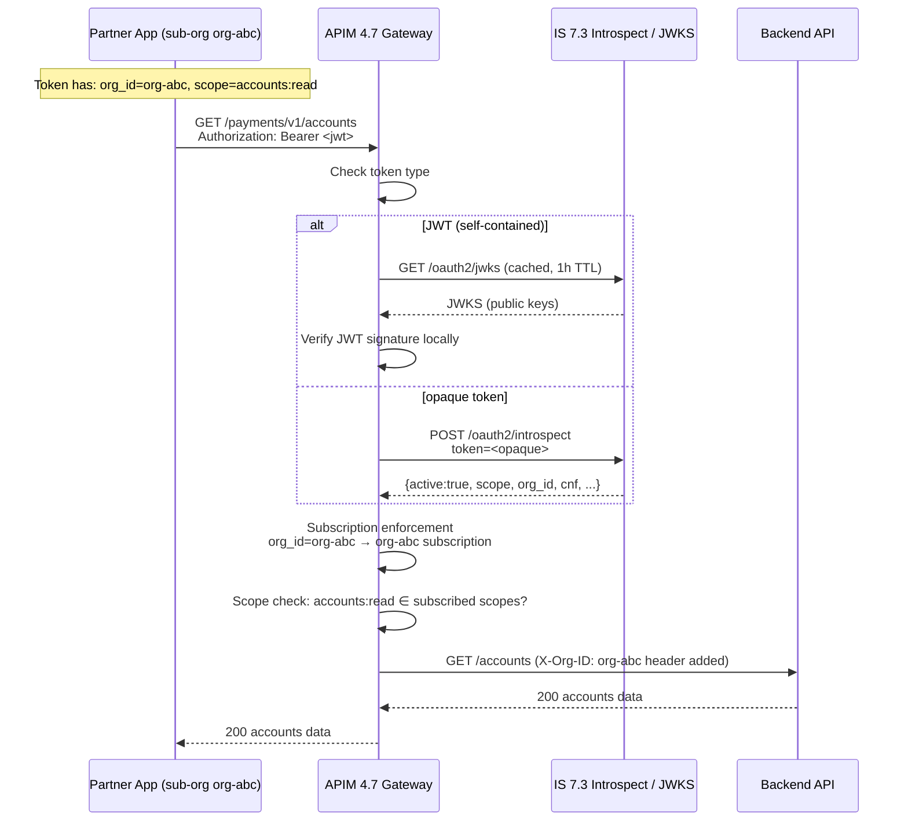
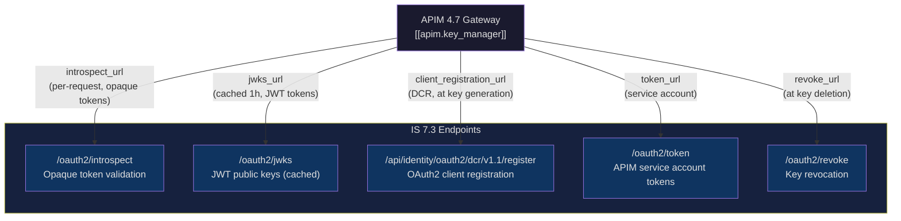

# Day 20 — APIM 4.7 + IS 7.3 Token Validation Flow

## Sequence diagram: full token validation path

## Endpoint reference table

| APIM action | IS 7.3 endpoint | When |
|---|---|---|
| JWT validation | `/oauth2/jwks` | Every JWT (cached, ~1h) |
| Opaque token validation | `/oauth2/introspect` | Every opaque token request |
| Client registration (DCR) | `/api/identity/oauth2/dcr/v1.1/register` | At subscription key generation |
| Token generation (for APIM internal calls) | `/oauth2/token` | APIM service account tokens |
| Token revocation | `/oauth2/revoke` | Key deletion in Dev Portal |

## Key Manager config relationship diagram

