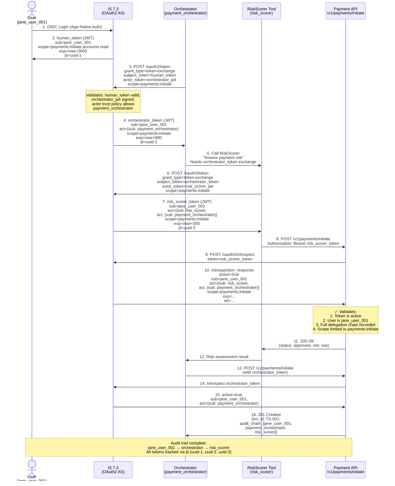

# Day 21 Lab — Delegation Chain Sequence Diagram

## 3-Tier Agent Delegation with Token Evolution

Annotate each token exchange with its resulting JWT claims:



## Key Observations

- **Token lifetime strategy**: human=3600s, orchestrator=900s, tool=300s (each hop expires before parent could re-exchange)
- **`sub` preservation**: jane_user_001 remains constant across all three tokens
- **`act` growth**: each hop adds a new `act` level, preserving the previous chain
- **Scope**: all tokens carry the same `payments:initiate` scope (narrowed from user's broader `scope`)
- **Introspection**: the API validates every token against IS 7.3 — enables revocation propagation

## Revocation Scenario

If at T+100min Jane revokes her session:

```
User revokes → IS 7.3 marks human_token as revoked
Next introspection call on any derived token → IS 7.3 returns active=false
All three APIs reject the token within cache TTL (5min max)
```

Note: tool tokens with short exp (300s) may expire before revocation propagates — trade-off between security (short exp) and compliance (timely revocation).
