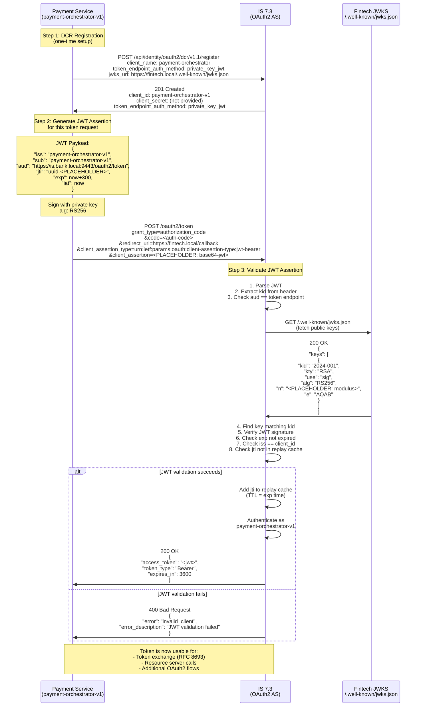

# Day 22 Lab — RFC 7523 Client Authentication Sequence

## `private_key_jwt` Token Request Flow



## Key Validation Steps in Order

1. **Parse JWT**: Verify it's well-formed base64.url.base64
2. **Extract `kid`**: JWT header contains algorithm + key ID
3. **Fetch JWKS**: GET from `jwks_uri` registered in DCR
4. **Signature Verification**: Find the key matching `kid`, verify signature with client's public key
5. **`aud` Check**: `aud` claim must equal the token endpoint URL (prevents reuse at other endpoints)
6. **`exp` Check**: Assertion must not be expired
7. **`iss` Check**: `iss` must match the registered client_id
8. **`jti` Check**: `jti` must not have been seen before (replay prevention cache)

If any check fails → `invalid_client` error

## Error Scenarios

### Scenario A: `exp` More than 5 Minutes

```
JWT payload: "exp": now+7200 (2 hours)
IS 7.3 validation: May enforce max assertion lifetime (e.g., 600s)
Result: 400 invalid_client "assertion_lifetime_exceeds_limit"
```

### Scenario B: Reused `jti`

```
Request 1: client_assertion with jti=uuid-123
IS 7.3: Validates, stores uuid-123 in cache with TTL=exp_time
Result: 200 OK, token issued

Request 2 (same second): client_assertion with jti=uuid-123
IS 7.3: Looks up cache, finds uuid-123 already present
Result: 400 invalid_client "assertion_already_used"
```

### Scenario C: Incorrect `aud`

```
JWT payload: "aud": "https://wrong-server.com/oauth2/token"
IS 7.3 token endpoint: https://is.bank.local:9443/oauth2/token
Mismatch detected
Result: 400 invalid_client "aud_mismatch"
```

### Scenario D: Wrong Authorization Header

```
POST /oauth2/token
Authorization: Bearer <client_assertion>

IS 7.3: Sees Authorization header
Treats as anonymous request with malformed Bearer token
Result: 401 Unauthorized "Invalid bearer token"
(The actual client_assertion in the header is ignored!)
```

## JWKS Fetch Optimization

IS 7.3 typically **caches** the JWKS response:

- **First request**: Fetch from `jwks_uri` (cache miss)
- **Subsequent requests**: Use cached JWKS (cache hit) — faster validation
- **Cache TTL**: Usually 1 hour (configurable in IS 7.3)
- **Cache expiration**: On cache miss, re-fetch from `jwks_uri`

This reduces latency but introduces a potential key rotation delay:
- Fintech rotates private key → updates JWKS endpoint
- IS 7.3 cache still has old key → new JWTs fail validation until cache expires
- Mitigation: Set `kid` in JWT header and JWKS to enable gradual rollover
