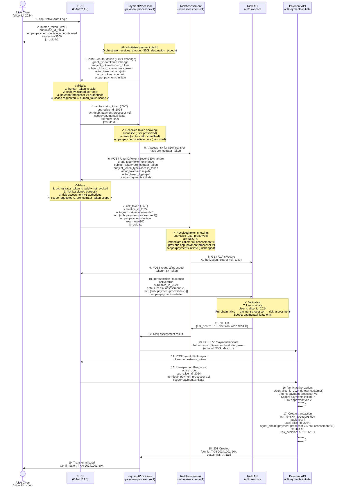

# Day 23 Lab — 2-Hop OBO Delegation Chain

## Complete RFC 8693 Token Exchange Flow



---

## Token Payload Evolution at Each Hop

### Token 1: Human Token (From Alice)

```json
{
  "sub": "alice_id_2024",
  "scope": "payments:initiate accounts:read",
  "exp": "now+3600",
  "jti": "uuid-h1"
}

State: Created by IS 7.3 during App-Native Auth (Day 11)
```

### Token 2: Orchestrator Token (After First Exchange)

```json
{
  "sub": "alice_id_2024",
  "act": {
    "sub": "payment-processor-v1"
  },
  "scope": "payments:initiate",
  "exp": "now+900",
  "jti": "uuid-o1"
}

Changes:
  ✓ sub preserved (still alice_id_2024)
  ✓ act added (payment-processor-v1)
  ✓ scope narrowed (only payments:initiate, removed accounts:read)
  ✓ exp shortened (900s vs. 3600s)
```

### Token 3: Tool Token (After Second Exchange)

```json
{
  "sub": "alice_id_2024",
  "act": {
    "sub": "risk-assessment-v1",
    "act": {
      "sub": "payment-processor-v1"
    }
  },
  "scope": "payments:initiate",
  "exp": "now+300",
  "jti": "uuid-r1"
}

Changes:
  ✓ sub preserved AGAIN (still alice_id_2024)
  ✓ act NESTED (not replaced):
      - outermost act.sub: risk-assessment-v1 (immediate caller)
      - inner act.act.sub: payment-processor-v1 (previous hop)
  ✓ scope unchanged (already narrowed)
  ✓ exp shortened further (300s for per-operation)

Full chain reconstructed: alice → payment-processor → risk-assessment
```

---

## Revocation Propagation Scenario

### Scenario: Alice Revokes at T+10min

```
Timeline:
T+0:     Alice authenticates, gets human_token (exp: T+60min)
T+2:     Orchestrator exchanges, gets orchestrator_token (exp: T+17min)
T+4:     RiskAssessment exchanges, gets tool_token (exp: T+9min)
T+5:     API 1 introspects tool_token → active:true ✓
T+10:    Alice revokes session via IS 7.3 console
T+10.5:  API 2 introspects orchestrator_token

Introspection at T+10.5min:
  IS 7.3 checks: is parent (human_token) revoked?
  Answer: YES (user revoked at T+10)
  IS 7.3 returns: active:false for orchestrator_token
  API 2 rejects the request ✓

Propagation:
  Tool token (tool_token):
    - Already expired at T+9min (5 min lifetime)
    - Next request using it: rejected (token expired)
    - Revocation is moot (token already dead)

  Orchestrator token (orchestrator_token):
    - Expires at T+17min
    - Revocation detected within introspection cache TTL (≤5min)
    - All APIs reject by T+15min ✓

  Risk API (second backend):
    - Introspection cache TTL: 5 min
    - Last introspection at T+5min → cached as active:true
    - At T+10min, still uses cached value (thinks token is active)
    - Cache expires at T+10min + TTL
    - If TTL = 5min, next introspection at T+10:05min detects revocation
    - Request at T+10:06min is rejected ✓

Compliance result: User revocation propagated to all APIs within 5–10 minutes.
```

---

## Key Points

1. **`sub` Preservation**: Every RFC 8693 exchange returns a token with the SAME `sub` claim as the subject_token. This traces every action back to Alice, preserving user accountability.

2. **`act` Nesting**: Each exchange **prepends** (not replaces) the current actor to the `act` chain. A 2-hop chain shows the full delegation path: `act.sub` (immediate caller) and `act.act.sub` (upstream caller).

3. **Scope Narrowing**: The first exchange narrows from `payments:initiate,accounts:read` to `payments:initiate`. The second exchange does not narrow further (already at minimum). This is least-privilege in action: each agent gets only the scope it needs.

4. **Token Lifetime Cascade**: human (3600s) > orchestrator (900s) > tool (300s). This ensures that if a downstream token is stolen, it expires before the upstream token could be re-exchanged for a new downstream token.

5. **Revocation Propagation**: Only if APIs use introspection (not local JWT validation). Introspection checks the exchange chain; a revoked parent token cascades to all derived tokens.
