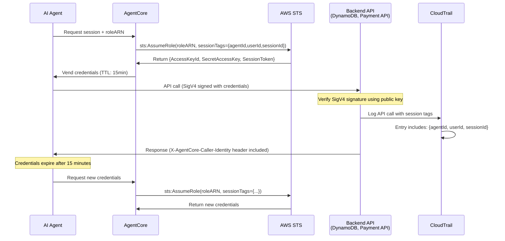
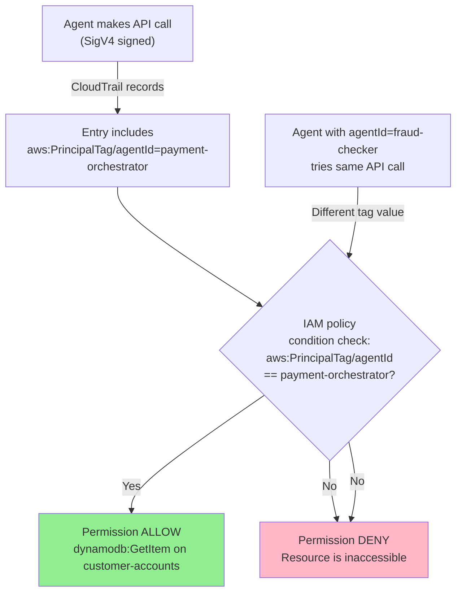
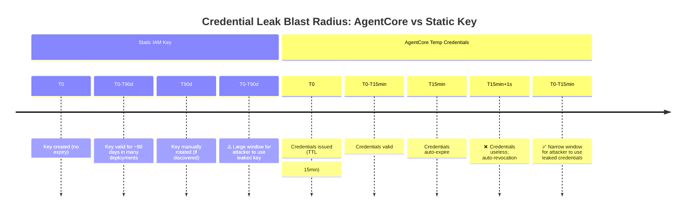
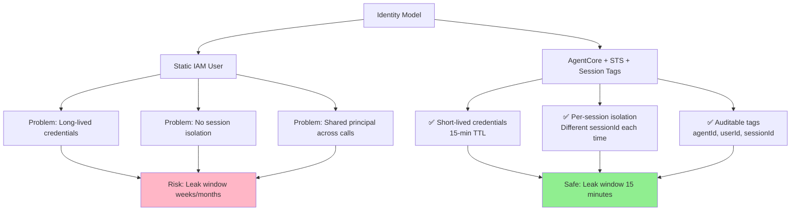

# Day 24 Lab — Diagrams

## 1. AgentCore Credential Vending Cycle

**Key points:**
- Each cycle generates new temporary credentials
- Session tags are metadata on every CloudTrail entry
- SigV4 signature prevents replay after credential expiry
- X-AgentCore-Caller-Identity header allows backend to trust agent identity

## 2. IAM Policy Conditions with Session Tags

**Key points:**
- Session tags in IAM conditions enable fine-grained RBAC
- Different agents have different `agentId` tags
- Same role can be used with different tags for different agents
- Conditions prevent agent A from impersonating agent B

## 3. Credential Blast Radius: TTL Comparison

**Key points:**
- Static keys are valid for weeks/months (large blast radius)
- Temporary credentials expire automatically (small blast radius)
- No manual rotation needed with automatic re-vending
- Breach impact is time-limited to credential TTL

## 4. Trust Policy: AgentCore vs Static User

**Key points:**
- Static users have long-lived keys (insecure for agents)
- AgentCore vends temporary credentials per-session (secure)
- Session tags enable full audit trail
- Blast radius is limited by credential TTL
