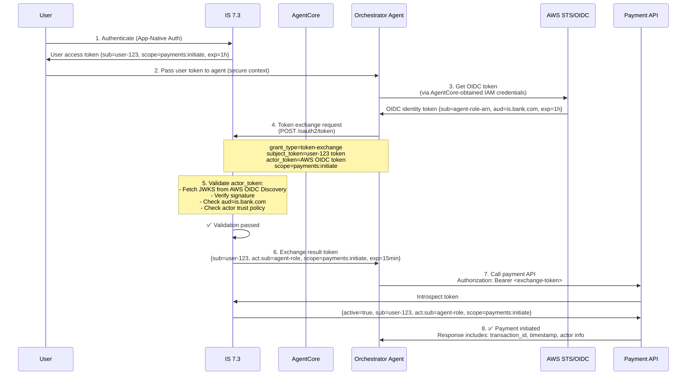
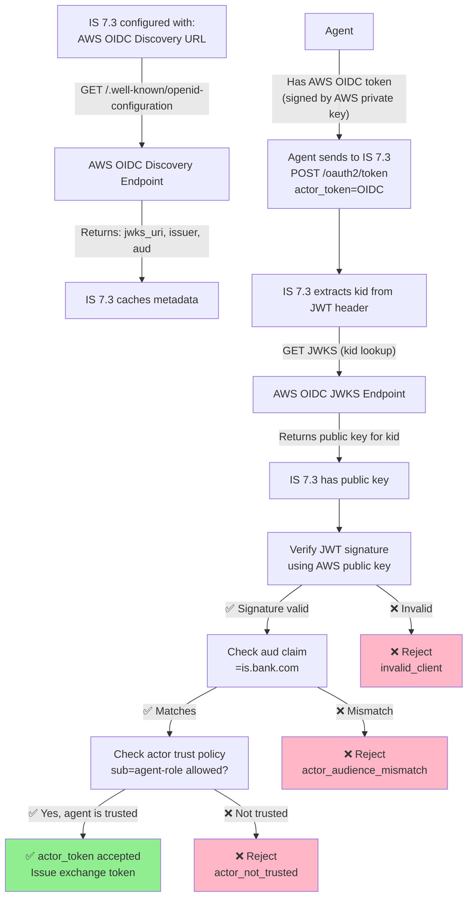
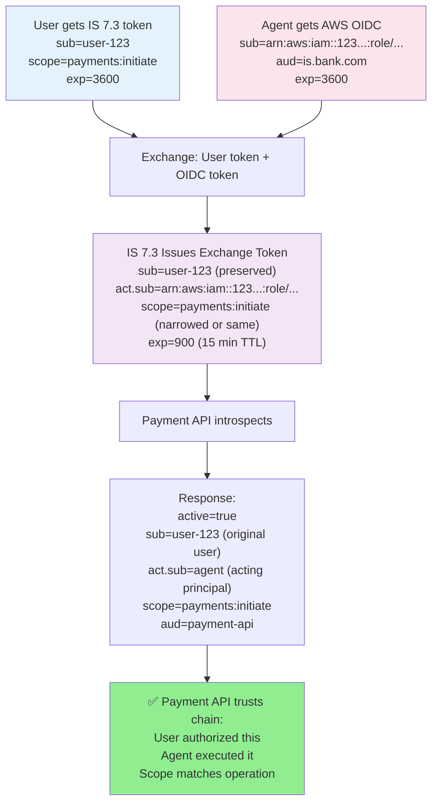
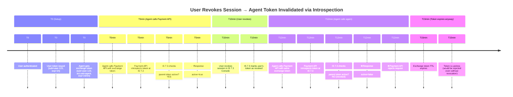
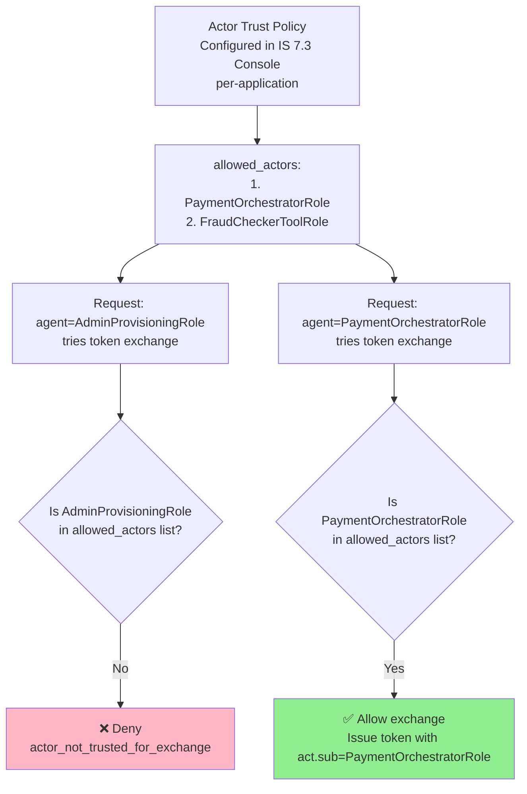

# Day 25 Lab — Diagrams

## 1. Complete 8-Step AgentCore → IS 7.3 → Payment API Flow

**Key observations:**
- Step 1: User gets IS 7.3 token with `sub=user-123`
- Step 3: Agent obtains AWS OIDC token with `sub=agent-role`
- Step 4: Agent sends BOTH tokens to IS 7.3
- Step 5: IS 7.3 validates actor (AWS OIDC signature)
- Step 6: IS 7.3 issues token with both `sub` and `act`
- Step 7-8: Payment API uses introspection to validate the chain

## 2. Trust Federation: AWS OIDC Discovery → IS 7.3 Validation

**Key points:**
- IS 7.3 must have AWS OIDC discovery URL configured
- IS 7.3 fetches JWKS on first validation (then caches)
- Every token validation checks: signature → aud claim → actor trust policy

## 3. Claim Evolution Through the Flow

**Key points:**
- `sub` is PRESERVED from user token → exchange result
- `act` is ADDED by IS 7.3 from agent's OIDC token
- `scope` is narrowed (if requested scope < subject_token scope)
- Exchange token TTL is shorter (15min vs user token 1h)

## 4. Revocation Propagation: User Revokes → Agent Token Invalidated

**Key points:**
- Introspection-based validation enables immediate revocation
- User revocation invalidates ALL derived tokens immediately
- If APIs use local JWT validation (no introspection), revocation is not seen until TTL expires

## 5. Actor Trust Policy: Which Agents Can Exchange?

**Key points:**
- Actor trust policy is the final gate (after OIDC signature validation)
- Prevents unauthorized agents from exchanging user tokens
- Configured per-application in IS 7.3 (not in this role, but in Console)
- Essential for compliance: ensures only known, vetted agents can delegate
