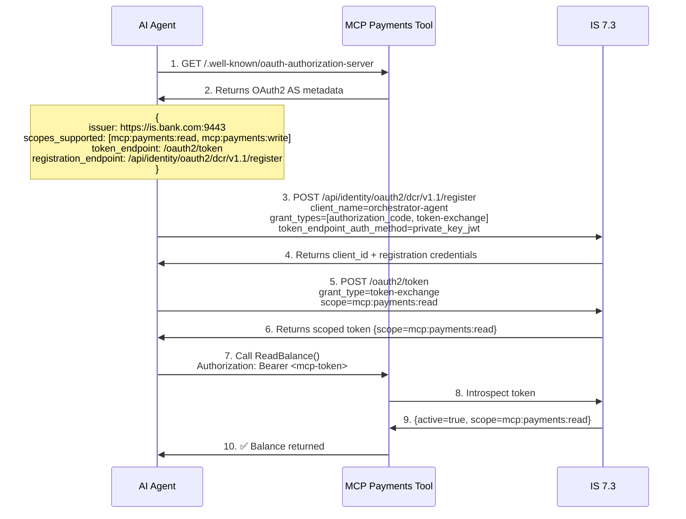
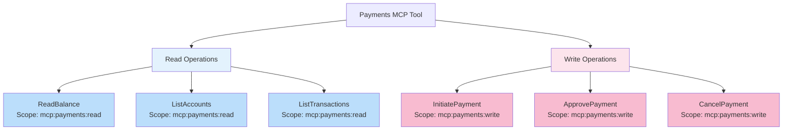
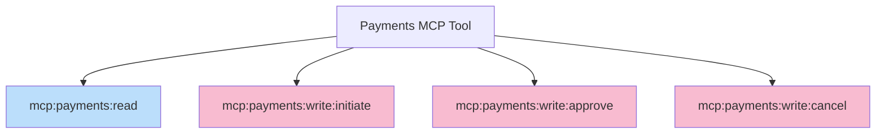
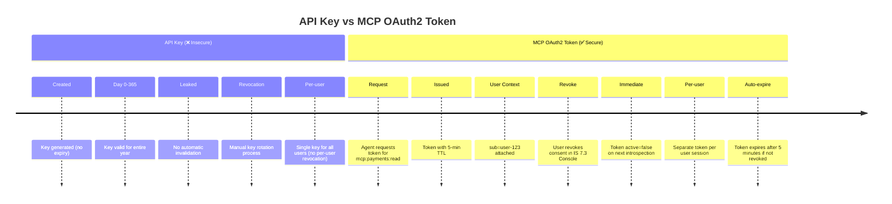
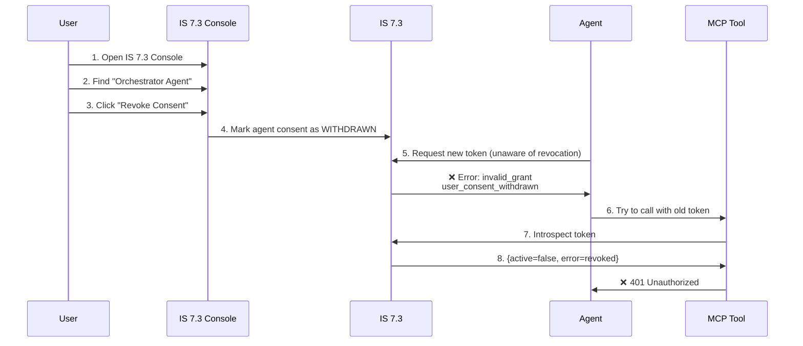
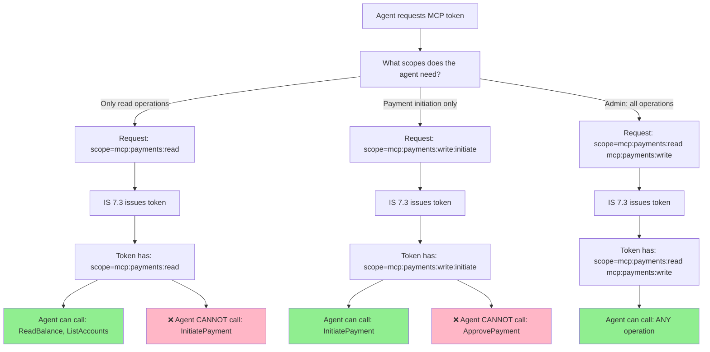
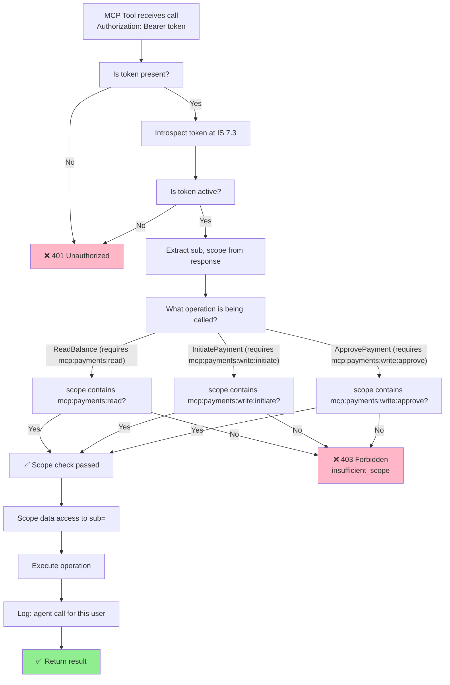

# Day 26 Lab — Diagrams

## 1. MCP Tool Discovery and OAuth2 Registration Flow

## 2. Scope Hierarchy: Read vs Write Operations

**Alternative: Fine-grained scopes**

**Decision:** Use fine-grained scopes for high-privilege operations (payment approval, cancellation).

## 3. Token Lifecycle: API Key vs MCP OAuth2

## 4. User Revocation: Consent Workflow

**Key difference from API keys:**
- API keys: Still valid until manually rotated
- OAuth2 tokens: Immediately invalid via consent withdrawal

## 5. Scope Narrowing: Least Privilege Enforcement

## 6. MCP Tool Access Control Decision Tree

