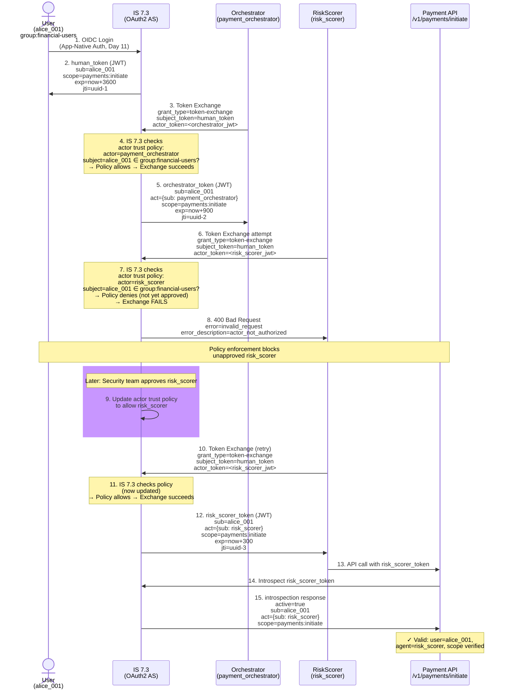
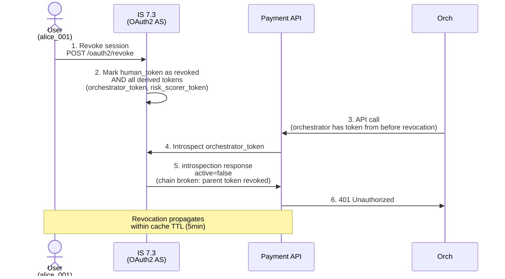

# Day 27 Lab — Agent IdP Configuration Diagram

## IS 7.3 Agent Policy Enforcement Flow



## Revocation Propagation with Actor Trust



## Actor Trust Policy Matrix

| Agent | Subject Group | Policy Effect | Justification |
|-------|---------------|---------------|---------------|
| `payment_orchestrator` | `group:financial-users` | **Allow** | Trusted, production-ready agent; operates on behalf of regular customers |
| `payment_orchestrator` | `group:admins` | **Deny** | Orchestrator should not exchange admin tokens; admins call APIs directly, not via agent |
| `risk_scorer` | `group:financial-users` | **Deny** (initially) | New agent; awaiting security review before production |
| `risk_scorer` | `group:admins` | **Deny** | Not approved for any user group yet |
| (any agent) | (special groups like `group:super-admins`) | **Deny** | No agents should exchange high-privilege tokens; high-risk users must authenticate directly |

## Key Observations

- **Per-actor, per-subject policy:** Granular control; not all agents approved for all users
- **Approval workflow:** Risk scorer starts with Deny; once security approves, change to Allow
- **Revocation propagates:** User revokes → next introspection returns `active: false` → all derived tokens rejected
- **Audit trail:** IS 7.3 logs each exchange attempt (success or failure) with `sub`, `act`, `jti` for tracing
- **Scope separation:** Agent scopes (e.g., `agent:payments:initiate`) separate from user scopes; APIM gateway applies different rate limits

## Audit Log Query Example

After the flow completes, the IS 7.3 audit log contains:

```json
{
  "timestamp": "2026-10-01T10:15:00Z",
  "event_type": "token_exchange",
  "subject_client": "alice_001",
  "actor_client": "payment_orchestrator",
  "issued_scope": "payments:initiate",
  "jti": "uuid-2",
  "policy_result": "ALLOW"
}
```

Query: Find all token exchanges by `risk_scorer` for `alice_001`:

```sql
SELECT timestamp, actor_client, issued_scope, jti, policy_result
FROM is73_audit
WHERE subject_client = "alice_001"
  AND actor_client = "risk_scorer"
  AND event_type = "token_exchange"
ORDER BY timestamp DESC
```

Result: Initially empty (Deny policy rejected the exchange). After security approval and policy update, future exchanges are logged with `policy_result=ALLOW`.
