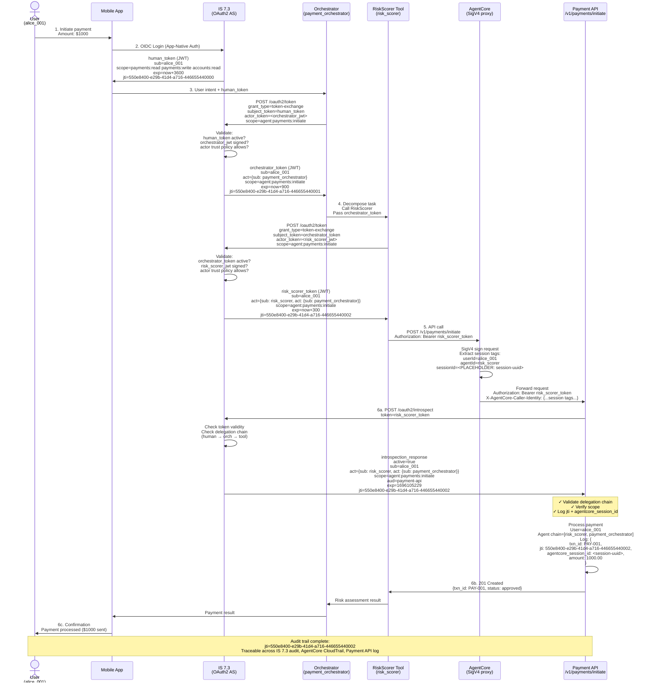
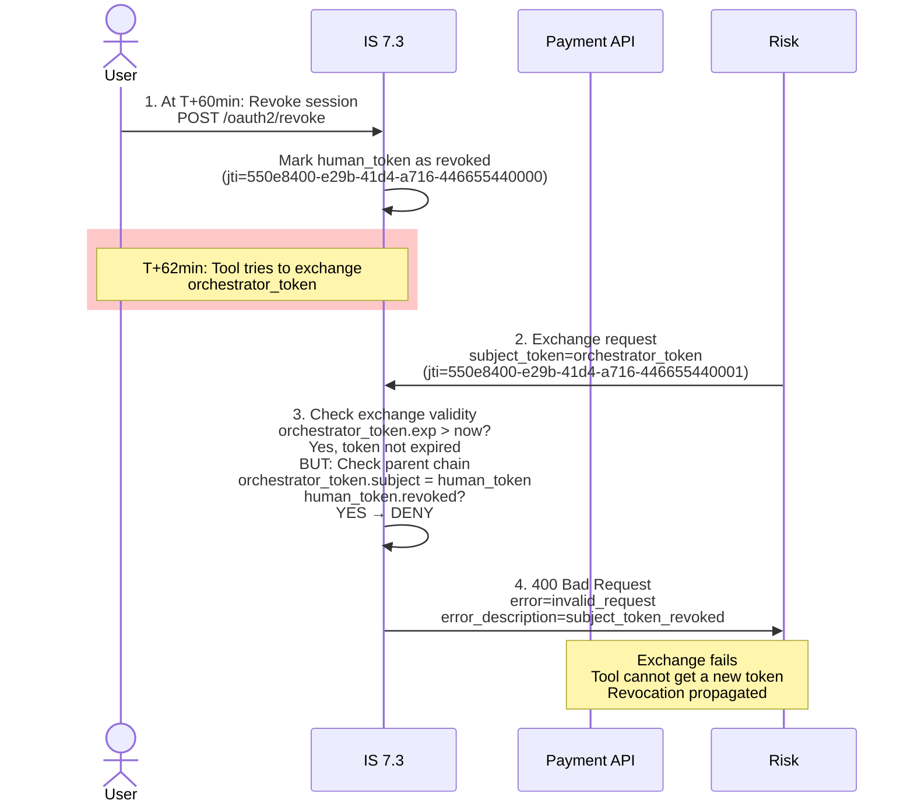

# Day 28 Lab — End-to-End Delegation Chain Diagram

## Complete 6-Step Banking AI Agent Flow



## Token Payload Evolution

| Step | Token Name | `sub` | `act` | `scope` | `exp` | `jti` |
|------|-----------|-------|-------|---------|-------|-------|
| 2 | human_token | `alice_001` | (none) | `payments:read payments:write accounts:read` | now+3600 | `uuid-0` |
| 4 | orchestrator_token | `alice_001` | `{sub: payment_orchestrator}` | `agent:payments:initiate` | now+900 | `uuid-1` |
| 5 | risk_scorer_token | `alice_001` | `{sub: risk_scorer, act: {sub: payment_orchestrator}}` | `agent:payments:initiate` | now+300 | `uuid-2` |

## Introspection Response (Step 6a)

```json
{
  "active": true,
  "sub": "alice_001",
  "act": {
    "sub": "risk_scorer",
    "act": {
      "sub": "payment_orchestrator"
    }
  },
  "scope": "agent:payments:initiate",
  "aud": "payment-api",
  "exp": 1696105229,
  "iat": 1696104929,
  "jti": "550e8400-e29b-41d4-a716-446655440002",
  "client_id": "risk_scorer",
  "token_type": "Bearer"
}
```

**What this proves:**
- `active: true` — token is not revoked
- `sub: alice_001` — original user is preserved
- `act` chain — full delegation chain is visible (risk_scorer ← payment_orchestrator ← user)
- `jti` — unique correlation ID for audit trail reconstruction
- `exp` — token expires in 5 minutes (minimal blast radius for a compromised tool)

## Audit Trail Reconstruction

### Payment API transaction log (Step 6b)

```json
{
  "timestamp": "2026-10-01T10:15:30Z",
  "txn_id": "PAY-001",
  "user_sub": "alice_001",
  "act_chain": ["risk_scorer", "payment_orchestrator"],
  "jti": "550e8400-e29b-41d4-a716-446655440002",
  "agentcore_session_id": "<PLACEHOLDER: session-uuid>",
  "status": "approved",
  "amount": 1000.00,
  "currency": "USD"
}
```

### IS 7.3 audit log (token exchanges)

**Entry 1: First exchange (user → orchestrator)**
```json
{
  "timestamp": "2026-10-01T10:15:10Z",
  "event_type": "token_exchange",
  "subject_client": "alice_001",
  "actor_client": "payment_orchestrator",
  "issued_scope": "agent:payments:initiate",
  "jti": "550e8400-e29b-41d4-a716-446655440001",
  "policy_result": "ALLOW"
}
```

**Entry 2: Second exchange (orchestrator → tool)**
```json
{
  "timestamp": "2026-10-01T10:15:15Z",
  "event_type": "token_exchange",
  "subject_client": "alice_001",
  "actor_client": "risk_scorer",
  "issued_scope": "agent:payments:initiate",
  "jti": "550e8400-e29b-41d4-a716-446655440002",
  "policy_result": "ALLOW"
}
```

### AgentCore CloudTrail (API call)

```json
{
  "eventTime": "2026-10-01T10:15:25Z",
  "eventName": "AssumeRole",
  "sourceIPAddress": "<PLACEHOLDER: agent-ip>",
  "requestParameters": {
    "roleArn": "arn:aws:iam::<PLACEHOLDER: account>:role/RiskScorerRole",
    "roleSessionName": "<PLACEHOLDER: session-uuid>"
  },
  "responseElements": {
    "credentials": {
      "sessionToken": "<PLACEHOLDER: sts-token>"
    }
  },
  "additionalEventData": {
    "sessionTags": {
      "userId": "alice_001",
      "agentId": "risk_scorer",
      "sessionId": "<PLACEHOLDER: session-uuid>"
    }
  }
}
```

## Revocation Scenario



## Cache Strategy Impact

| Scenario | API Behavior | Result |
|----------|--------------|--------|
| **No cache** | Introspect every request | Fast revocation (<100ms), high IS 7.3 load |
| **5min cache** | Introspect, cache result | Revocation latency ~5min, reduced IS 7.3 load; complies with banking requirement |
| **1h cache** | Introspect, cache result | Revocation latency ~60min; banking compliance violation |

**Banking compliance requirement:** Revocation must propagate within 5 minutes. 5-minute cache meets this requirement:
- User revokes at T
- Next introspection at T+0 to T+5 may use cached result (old: `active=true`)
- Introspection at T+5 onwards hits cache expiry; new query returns `active=false`
- All existing tokens rejected within 5min window

## Key Observations

- **`jti` correlation** — all three systems log `jti` or a derivative (`agentcore_session_id` links to CloudTrail)
- **`sub` preservation** — user identity is preserved at every hop; APIs know which user initiated the action
- **`act` growth** — each hop adds a nesting level; full chain is visible at the API
- **Scope narrowing** — orchestrator narrowed from user's full scope; tool inherits orchestrator's already-narrowed scope
- **Revocation chain** — user revocation breaks the parent token, preventing further exchanges or introspections
- **Lifetime hierarchy** — human (3600s) > orchestrator (900s) > tool (300s); each expires before parent could cause damage
