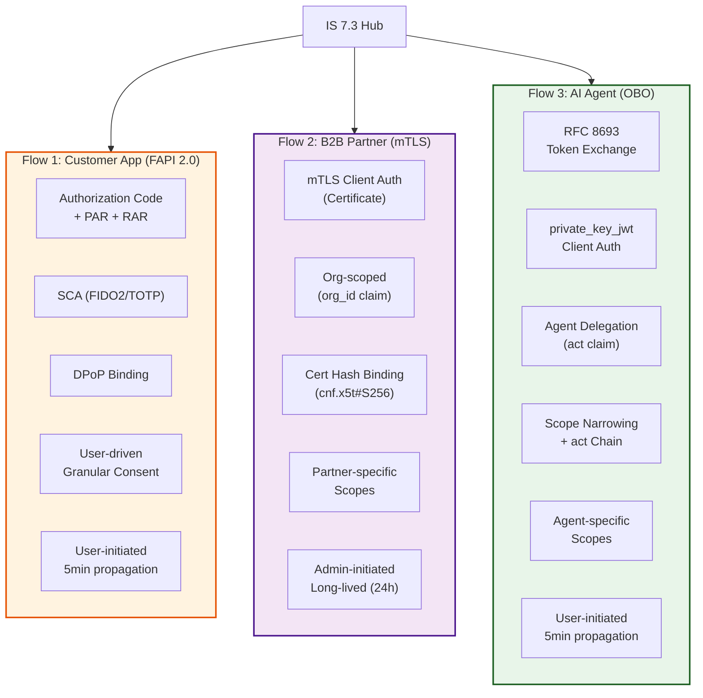
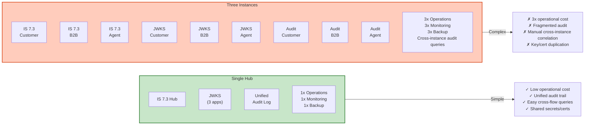

# Day 29 Lab — IS 7.3 Hub Architecture Diagram

## Three Flows Converging on Single IS 7.3 Hub

```mermaid
graph TB
  subgraph Client["Client Applications"]
    MobileApp["📱 Mobile Banking App<br/>(Customer-facing)"]
    Partner["🏢 B2B Partner App<br/>(Organization)"]
    Agent["🤖 AI Agent Orchestrator<br/>(Bedrock)"]
  end

  subgraph Hub["IS 7.3 Hub<br/>(Centralized OAuth2)"]
    AuthEP["Authorization Endpoint<br/>(/oauth2/authorize)"]
    TokenEP["Token Endpoint<br/>(/oauth2/token)"]
    PAR["PAR Endpoint<br/>(/oauth2/par)"]
    Introspect["Introspection Endpoint<br/>(/oauth2/introspect)"]
    JWKS["JWKS Endpoint<br/>(/oauth2/jwks)"]
    DCR["DCR Endpoint<br/>(/api/identity/oauth2/dcr)"]
    AuditLog["Structured Audit Log"]
  end

  subgraph Resource["Resource Servers"]
    APIM["🔐 APIM Gateway<br/>(Payment API, Accounts API)"]
    PartnerAPI["🔐 Partner API<br/>(Data Exchange)"]
    PaymentAPI["🔐 Payment API<br/>(Transaction Processing)"]
  end

  MobileApp -->|Authorization Code<br/>PAR + RAR + SCA| AuthEP
  MobileApp -->|Access Token<br/>via token endpoint| TokenEP
  MobileApp -->|DPoP-bound<br/>Token Validation| APIM

  Partner -->|mTLS Client Cert| TokenEP
  Partner -->|Client Credentials<br/>org_id-scoped Token| TokenEP
  Partner -->|Org-level<br/>Access Token| PartnerAPI

  Agent -->|RFC 8693<br/>Token Exchange| TokenEP
  Agent -->|Actor Token<br/>private_key_jwt| TokenEP
  Agent -->|Delegated Token<br/>sub+act claims| APIM

  TokenEP -->|Verify signature| JWKS
  TokenEP -->|Generate token| PAR
  
  APIM -->|Verify token<br/>Check scope & binding| Introspect
  APIM -->|Log all calls| AuditLog

  PartnerAPI -->|Verify org_id<br/>Check cert hash| Introspect
  PartnerAPI -->|Log partner calls| AuditLog

  PaymentAPI -->|Verify delegation chain<br/>Check act claim| Introspect
  PaymentAPI -->|Log agent+user calls| AuditLog

  AuthEP -->|Forward to auth| AuditLog
  TokenEP -->|Log token events| AuditLog

  style Hub fill:#e1f5ff,stroke:#01579b,stroke-width:3px
  style MobileApp fill:#fff3e0,stroke:#e65100
  style Partner fill:#f3e5f5,stroke:#4a148c
  style Agent fill:#e8f5e9,stroke:#1b5e20
  style APIM fill:#ffe0b2,stroke:#e65100
  style PartnerAPI fill:#f3e5f5,stroke:#4a148c
  style PaymentAPI fill:#c8e6c9,stroke:#1b5e20
```



## Shared Infrastructure (All Three Flows)

| Endpoint | Purpose | Used By | Configuration |
|----------|---------|---------|---------------|
| **PAR** (`/oauth2/par`) | Secure authorization request initiation | All three flows | Global (all apps can use) |
| **JWKS** (`/oauth2/jwks`) | JWT key set for signature verification | All three flows + resource servers | Global (JWKS endpoint lists all app keys) |
| **Introspection** (`/oauth2/introspect`) | Token status & chain validation | All three flows' resource servers | Global (introspection validates all token types) |
| **DCR** (`/api/identity/oauth2/dcr/v1.1/register`) | Dynamic client registration | All three flows' clients | Global (registration API accepts all client types) |
| **Audit Log** | Centralized event recording | All three flows | Structured JSON logging (all events recorded) |

## Per-Flow Divergences



## Comparison: Three Flows on Six Dimensions

| Dimension | Customer App (FAPI 2.0) | B2B Partner (mTLS) | AI Agent (OBO) |
|-----------|-------------------------|--------------------|----------------|
| **Auth Method** | Authorization Code + PAR + PKCE | mTLS Client Certificate | RFC 8693 Token Exchange |
| **Token Binding** | DPoP (Demonstration of Possession) | Cert Hash (cnf.x5t#S256) | Scope Narrowing + `act` Chain |
| **Audit Claim** | `sub` (user), `aud`, `scope` | `sub` (org_id), `cnf.x5t#S256` | `sub` (user), `act` (agent), `scope` |
| **Revocation** | User-initiated; introspection-based | Admin-initiated; weekly refresh | User-initiated; introspection-based |
| **APIM Enforcement** | Scope + DPoP binding; per-user rate limit | Org_id subscription; per-org rate limit | Scope + `act` verification; per-agent rate limit |
| **Regulatory Driver** | PSD2 (SCA, Consent, Revocation) | B2B Audit Trail (Org-level) | Agent Auditability (Per-user Tracing) |

## Architecture Benefits

### Why Single Hub > Three Instances



## Trade-offs

| Aspect | Single Hub | Three Instances |
|--------|-----------|-----------------|
| **Operational Cost** | Low (1 instance, 1 team) | High (3 instances, coordination) |
| **JWKS Management** | Simple (1 endpoint, 3 apps' keys) | Complex (3 endpoints, key duplication) |
| **Audit Trail** | Unified (correlated via `jti`) | Fragmented (manual correlation by timestamp) |
| **Single Point of Failure** | IS 7.3 down = all flows down | One instance down = one flow affected, others continue |
| **Scaling** | Single hub must handle 3x load | Per-flow scaling independent |
| **Configuration Complexity** | Medium (3 apps in 1 Hub) | Low (each instance focused) |

**Recommendation:** Single hub for most deployments (cost and audit trail benefits outweigh the single point of failure risk). Use active-active clustering and multi-region replication to mitigate availability risk.

## Configuration Summary

### Global `deployment.toml` (enables all flows)

```toml
[oauth]
allowed_grant_types = [
  "authorization_code",      # Flow 1: Customer app
  "refresh_token",           # Flow 1: Customer app
  "client_credentials",      # Flow 2: B2B partner
  "urn:ietf:params:oauth:grant-type:token-exchange"  # Flow 3: AI agent
]

[oauth.jwt]
enable_jarm = true           # Flow 1: JARM response encoding

[oauth.mtls]
enable_client_auth = true    # Flow 2: mTLS support

[oauth.token_exchange]
enable = true                # Flow 3: Token exchange

[log.audit]
log_format = "structured"    # All flows: JSON audit logging
```

### Per-Application Console Config

| Application | Flow | Grant Types | Auth Method | Token Binding | Scopes |
|-------------|------|-------------|-------------|---------------|--------|
| **MobileBank** | Customer | `authorization_code`, `refresh_token` | PKCE | DPoP | `payments:read payments:write accounts:read accounts:write` |
| **PartnerAPI** | B2B | `client_credentials` | mTLS | Cert Hash | `partner-api:read partner-api:write` |
| **AgentOrchestrator** | Agent | `token-exchange` | `private_key_jwt` | Scope narrowing | `agent:payments:initiate accounts:read` |

---

## Key Insights

1. **Single hub is feasible:** All three flows can coexist on one IS 7.3 instance without interference
2. **Shared primitives reduce cost:** PAR, JWKS, introspection, DCR are used by all flows; no duplication needed
3. **Per-flow divergences are configuration:** Each flow's unique requirements are set per-application in Console, not in separate deployments
4. **Unified audit trail is powerful:** Compliance can correlate customer actions, partner integrations, and agent operations in a single query
5. **Trade-off: availability vs. cost:** Single hub simplifies operations but creates single point of failure; mitigate with clustering
