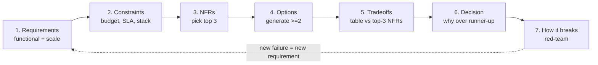

# Day 1 — How architects reason (method, NFRs, C4, ADRs)

> After today you can: run a repeatable design method on a novel problem, name the
> top-3 NFRs that dominate a system, draw a C4 context + container diagram, and
> write an ADR that a stranger can understand — and say when *not* to bother with
> any of it.

This is Phase 0: you are not learning a pattern today, you are installing the
**operating system** every later day runs on. Everything else (storage,
replication, caching, sagas, RAG) is a rep that exercises the method below.

---

## The core problem

A builder asks *"how do I make this work?"* An architect asks *"which of the ways
that work should we pick, and how will we defend and communicate that choice when
it's expensive to change?"*

The mental model to install:

> **Architecture is the set of decisions that are costly to reverse.** Everything
> else is a detail you can refactor on a Tuesday.

A "detail" (which HTTP router, which log library, a function's name) is cheap to
change locally and invisible outside the module. A "decision" (sync vs async, one
database vs many, strong vs eventual consistency, monolith vs services) is
expensive to reverse because it leaks into data models, team structure, and
client contracts. The architect's job is to spend judgment on the second kind and
delegate the first.

Three failure modes this solves:

1. **Vibes-based design** — "it'll scale" with no number behind it. Fixed by the
   method's requirements + estimation steps.
2. **Single-option design** — you built the first thing you thought of and can't
   say what you rejected. Fixed by forcing ≥2 options.
3. **Undocumented decisions** — the design lives in one person's head and gets
   relitigated every quarter. Fixed by C4 + ADRs.

---

## Key concepts

### 1. The 7-step design method (the spine)

You rehearse this **every day, in order** (full text in
`reference/design-method.md`). The loop:

The two questions that separate architects from builders live in steps 4–7:
**"When would I NOT use this?"** (there must be an alternative) and **"How does it
break?"** (the happy path is the easy 20%). If you can't answer either, you don't
understand the design yet.

### 2. NFRs — the "-ilities"

Functional requirements say *what it does*; **non-functional requirements decide
almost every architecture argument** — how fast, how available, how consistent,
how cheap. You cannot maximize all of them at once, so the discipline is: **pick
the top 3 that this system lives or dies by**, give each a *number*, and judge
every option against exactly those three. (Full checklist:
`reference/nfr-checklist.md`.)

The test: *if this system failed, which "-ility" would the business scream about
first?* For a payment path it's correctness/consistency; for a redirect service
it's availability + tail latency; for an internal report it's cost. Naming the
top 3 forces the tradeoffs to surface instead of hiding.

A useful cross-check is the **AWS Well-Architected** lens — six pillars
(Operational Excellence, Security, Reliability, Performance Efficiency, Cost
Optimization, Sustainability). Walk them when stuck; each surfaces an NFR you
skipped.

### 3. The C4 model — communicating structure

Four zoom levels; you mostly use the first two (recipes in `reference/c4-guide.md`):

| Level | Name | Audience | Answers |
|-------|------|----------|---------|
| C1 | System Context | everyone | what is this system, who uses it, what does it talk to? |
| C2 | Containers | technical | what deployable units (apps, DBs, queues) make it up? |
| C3 | Components | developers | what's inside one interesting container? |
| C4 | Code | (rarely drawn) | classes/functions — let the IDE show this |

**Rule: one diagram = one level of zoom.** A newcomer should understand the system
from C1 + C2 alone. Diagrams are text (Mermaid `.mmd`) so they diff in git.

### 4. ADRs — communicating *why*

C4 shows *structure*; an **Architecture Decision Record** captures *why*, so
future-you doesn't relitigate or blindly reverse it. One decision per ADR, numbered
globally (`0001`, `0002`, …), immutable (supersede, never edit). Format in
`reference/adr-template.md`. The non-negotiable section is **Alternatives
considered** — an ADR with no rejected option means you evaluated exactly one, which
is not a decision.

The one-sentence test: *"We chose X over Y because, for our top NFR of ___, X gives
us ___ while Y would have cost us ___."* If you can't finish it, you're not ready to
write the ADR.

Putting the artifacts together: **C4 = structure, ADR = why, arc42 = the binder
of prose around them.** Use all three; they answer different questions.

---

## The decision / tradeoffs

The recurring judgment call today is **"is this a decision or a detail?"** — i.e.
does it deserve an ADR and a diagram, or not?

| | Decision (ADR-worthy) | Detail (just build it) |
|---|---|---|
| Reversibility | expensive/slow to undo | cheap, local refactor |
| Blast radius | crosses teams, services, or client contracts | inside one module |
| Who needs to agree | others must understand & align | author's discretion |
| Example | sync call vs event; SQL vs KV; one region vs cells | router lib, struct layout, log format |
| Artifact | ADR + C4 + tradeoff table | code + a comment |

Amazon frames this as **one-way vs two-way doors**: two-way doors (reversible) you
walk through fast and alone; one-way doors (costly to reverse) get the method, the
options, and the ADR. Most decisions are two-way doors mislabeled as one-way — the
skill is telling them apart so you don't over-govern cheap choices *or*
under-govern expensive ones.

Which C4 level to draw is itself a right-sizing call: **always C1 + C2; draw C3
only for the one container that's genuinely interesting;** never draw C4 (the IDE
is your C4).

---

## When NOT this

**C4 + ADR overhead is for decisions others must understand or that are expensive
to reverse. When neither holds, a whiteboard sketch (or nothing) wins.**

- **Throwaway spikes / prototypes** — you're buying information, not shipping. A
  photo of a whiteboard is the right artifact; a formal ADR is procedural theater.
- **Two-way-door details** — choosing a JSON library. Reversible + local ⇒ no ADR.
- **A solo, short-lived tool** nobody else will maintain — the audience for the
  artifact is zero.

The breaking point that flips it back *on*: the moment a second person must build
against your choice, or the choice bakes into a data model / public contract / team
boundary, write it down. The cost of an undocumented one-way-door decision is paid
later, with interest, in a meeting where nobody remembers why.

Note the symmetry with every later day: the method *itself* has a "when NOT this."
Don't run a 90-minute formal pass on a decision that's a 5-minute two-way door.

---

## Real-world

Log takeaways into `reference/real-world-case-studies.md`.

- **The C4 model (Simon Brown).** Reaction to UML sprawl and "boxes and arrows with
  no meaning." Lesson: **one diagram = one level of abstraction**; a shared,
  low-ceremony notation beats a perfect-but-unread one. The architectural lesson is
  about *communication as a first-class NFR* (evolvability/operability depend on
  people understanding the system).
- **AWS Well-Architected Framework.** Six pillars turned "is this a good
  architecture?" from opinion into a **checklist you can run**. Lesson: NFRs are not
  vibes — each pillar has questions with measurable answers. Use it as an NFR
  backstop, not a grading rubric to satisfy.
- **arc42 + ADRs (Michael Nygard's original ADR post, 2011).** Lesson: the *decision
  and its context* decays fastest and hurts most when lost — capture it at the moment
  of choosing, immutably, because the alternatives you rejected are exactly what a
  future reader needs and exactly what memory drops first.

Your Day-1 case study is **a real system you operate** — you reverse-engineer it
with the method (see the day plan). That is the most valuable teardown you'll do,
because you know where the bodies are buried.

---

## Common mistakes / gotchas

1. **Documenting details, ignoring decisions.** An ADR for the logging library and
   none for "we went eventually-consistent." Governance aimed at the wrong altitude.
2. **The single-option ADR.** "Alternatives considered: none." That's a justification
   written after the fact, not a decision. Always name the runner-up and why it lost.
3. **Mixing C4 levels in one diagram.** A context diagram with a table schema in it.
   Nobody can read it. One zoom per diagram.
4. **NFR laundry lists.** "It must be scalable, available, secure, fast, cheap." That
   ranks nothing. Pick 3, put a number on each, and accept you're trading the rest.
5. **Numbers-free requirements.** "Lots of users." 100 RPS and 100k RPS are different
   architectures. If you don't have a number, estimate one (Day 2) and label it an
   assumption.
6. **Treating the method as paperwork.** The output isn't the document; it's the
   *rejected options and named failure modes* you'd otherwise have missed. If the
   method produced no surprise, you ran it too shallowly.

---

## Practice

### Exercise 1 — decision or detail?

Classify each and say why: (a) picking PostgreSQL over DynamoDB for the primary
store; (b) picking `chi` over `gorilla/mux` as the HTTP router; (c) making the
order-confirmation email asynchronous instead of inline; (d) the JSON field naming
convention in an internal API; (e) choosing 3 availability zones vs 1.

Hint 1

Ask two questions per item: how expensive is it to reverse, and does anyone outside
the author's module have to agree or build against it?

Hint 2

"Bakes into the data model / a client contract / a team boundary" ⇒ decision.
"Local refactor, invisible outside the module" ⇒ detail.

Solution sketch

- **(a) Decision.** Store choice bakes into the data model and access patterns;
  migrating stores later is a project. ADR-worthy (this is literally Day 3's ADR).
- **(b) Detail.** Both are `http.Handler` routers; swapping is a local change behind
  the same interface. No ADR.
- **(c) Decision.** Sync→async changes the failure model and client expectations
  (delivery timing, ordering, at-least-once). Crosses a contract. ADR-worthy.
- **(d) Detail — usually.** A refactor + a lint rule. *But* once it's a **published**
  API others code against, the convention becomes a contract ⇒ promote to decision.
  The context flips the classification — that's the real lesson.
- **(e) Decision.** Availability/cost tradeoff, expensive to change post-deploy,
  affects every other component's failure assumptions. ADR-worthy.

### Exercise 2 — name the top-3 NFRs

For each system, pick the 3 dominant "-ilities" and give each a target number:
(a) a URL-shortener redirect path; (b) a bank's core ledger; (c) an internal nightly
analytics report.

Hint 1

Use the test: if it failed, what would the business scream about first? That's #1.

Hint 2

Different systems put *consistency* and *availability* in opposite orders — that's
the whole point of naming them.

Solution sketch

- **(a) Redirect path:** availability (99.99%, ~52 min/yr down), latency (p99 < 50ms),
  scalability (60k+ reads/s peak). Consistency barely matters — a redirect can be a
  few seconds stale. This asymmetry drives caching + replicas (Days 4, 6).
- **(b) Core ledger:** consistency/correctness (linearizable, no lost or double
  entries), durability (RPO ≈ 0, many nines), auditability. Latency and even
  availability yield to correctness — you'd rather reject a write than corrupt the
  ledger.
- **(c) Nightly report:** cost (cheapest compute that finishes by 6am), operability
  (reruns cleanly), correctness of the output. Availability and latency are nearly
  irrelevant — it runs once, offline. Spending on "nines" here is waste.

The lesson: the *same* NFR list ranked differently is a different architecture.

### Exercise 3 — the one-sentence ADR test

Take one real decision from a system you operate and complete: *"We chose X over Y
because, for our top NFR of ___, X gives us ___ while Y would have cost us ___."*
If you can't, that's your signal.

Hint 1

If you can't name Y (the runner-up), you never made a decision — you made a default.
Go find the option you didn't take.

Solution sketch

A good one reads like: *"We chose an event/queue over a synchronous call between
Orders and Email because, for our top NFR of availability, async lets Orders keep
committing when the email provider is down, while a sync call would have coupled
Orders' uptime to a third party's."* Note it names the NFR, the win, and the
specific cost avoided. A weak one ("it's more scalable") names no alternative and no
number — rewrite it until it passes.

### Exercise 4 — right-size the ceremony

You're prototyping a demo you'll throw away in two weeks; a teammate says "write an
ADR and full C4 for it." What do you do, and what would change your mind?

Hint 1

Apply today's "When NOT this." Who is the audience for the artifact? How reversible
is the work?

Solution sketch

Push back: throwaway + solo ⇒ a whiteboard sketch is the right artifact; a formal ADR
is procedural theater that buys nothing. **What flips it:** if the demo is likely to
become the real thing (demos have a way of shipping), or a second engineer joins,
capture the one or two genuinely one-way-door decisions *then* — not the whole thing,
just the expensive-to-reverse parts. Right-sizing ceremony *is* the architecture
skill; more documentation is not automatically better.

---

## Go deeper (offline-friendly)

- **DDIA (Kleppmann), Ch. 1 — Reliable, Scalable, Maintainable Applications.** The
  book's own framing of the "-ilities"; read it as the canonical NFR chapter.
- **Fundamentals of Software Architecture (Richards & Ford), Ch. 4 "Architecture
  Characteristics"** and the chapters on identifying/prioritizing them — the clearest
  treatment of NFR selection and tradeoff thinking.
- **Documenting Software Architectures: Views and Beyond (Clements et al.)** — the
  rigorous ancestor of C4; skim for *why* multiple views exist.
- **Simon Brown, *The C4 Model*** (c4model.com writeup / his "Software Architecture
  for Developers" book) — the notation, and the philosophy of lightweight diagrams.
- **Michael Nygard, "Documenting Architecture Decisions" (2011 blog post)** — the
  origin of the ADR; four short paragraphs that started the practice.
- **AWS Well-Architected Framework whitepaper** — the six pillars; read the pillar
  overviews as an NFR checklist, not cover to cover.
- **Alex Xu, *System Design Interview* Vol. 1, Ch. 1–3** — the interview compression
  of exactly this method (scope → estimate → high-level design → deep dive).

---

## Check yourself

- Can you state the 7 steps of the method from memory, in order?
- Can you give the two questions that separate architects from builders?
- Can you explain "decision vs detail" with your own example of each?
- For a system you operate, can you name the top-3 NFRs with a number on each — and
  say which "-ility" you're deliberately *not* optimizing?
- When would you NOT write an ADR or draw C4? What flips it back on?
- Can you finish the one-sentence ADR test for one real decision you've made?
