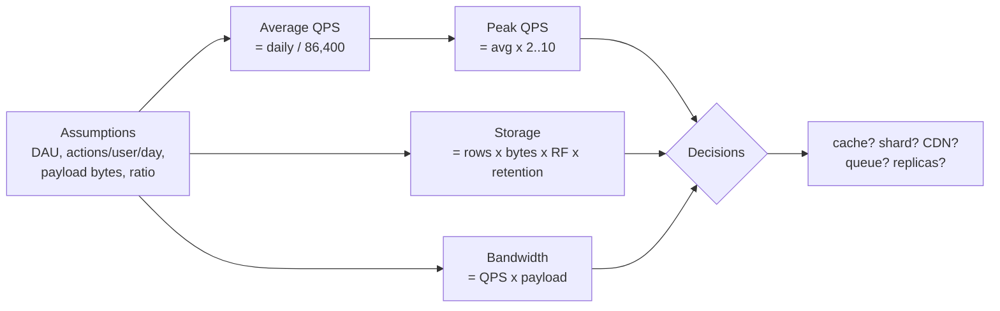

# Day 2 — Back-of-envelope estimation & workload characterization

> After today you can: turn "will it scale?" into numbers — QPS (avg + peak),
> storage over retention, bandwidth, working-set/cache size, and connection counts —
> translate each number into an architecture *decision*, and validate the estimate
> against a real load test instead of trusting it.

Full formulas and the latency table live in `reference/estimation-cheatsheet.md`;
this page is about *reasoning with* them, not re-deriving them.

---

## The core problem

Most designs die at the first "will it scale?" because the answer is a vibe. An
estimate replaces the vibe with a number, and — critically — with the **decision the
number forces**. You are not computing to be precise; you are computing to reach the
*order of magnitude that changes the design*:

- "single box" vs "needs sharding" vs "needs a CDN"
- "cache is optional" vs "reads will melt the DB without a cache"
- "sync is fine" vs "writes spike 10× → put a queue in front"

If your estimate doesn't change a box on the diagram, you either estimated the wrong
quantity or you're polishing digits that don't matter.

The workload's **shape** matters as much as its size: read/write ratio, spikiness
(peak ÷ average), payload size, and whether load is diurnal (daily wave), bursty
(flash sale, tweet), or steady (batch). Two systems at the same average QPS but
different shapes are different architectures.

---

## Key concepts

### The estimation pipeline



State assumptions **out loud** and label the one that would break the design if
wrong by 10× — that's your riskiest assumption, and the thing to validate first (in
the lab, or with real telemetry).

### Numbers you must have memorized

Round aggressively. `1 day ≈ 86,400 s ≈ 10^5 s` is the workhorse.

- `1M writes/day ≈ 12/s` average; `1B/day ≈ 12k/s`. (Both are just `daily / 10^5`.)
- **Peak multiplier:** ×2 for steady/diurnal, ×5 typical consumer, ×10 for bursty
  (viral, flash sale). Pick and *justify* it.
- Record sizing: `char = 1 B`, `int = 4 B`, `timestamp = 8 B`, `UUID = 16 B`. Add
  ~2–3× for row/JSON/index overhead — a "500-byte" logical record is often ~1 KB on
  disk once you count indexes and per-row headers.
- Replication factor (RF) 3 is the default assumption for durable stores; it triples
  storage.
- Latency anchors (Jeff Dean): memory ref ~100 ns, SSD random 4 KB ~150 μs, same-DC
  round trip ~500 μs, disk seek ~10 ms, **CA↔EU round trip ~150 ms**. The
  cross-continent RT dominates everything → put data near the user.

### Little's Law — the one formula for concurrency

```
L = λ × W        concurrency = arrival_rate × avg_latency
```

At 5,000 req/s with 20 ms average service time, you need `5000 × 0.02 = 100`
concurrent in-flight requests → ~100 worker slots / connections / threads. This is
how you size connection pools, thread counts, and "how many instances?" — and it's
why a *latency* regression silently becomes a *capacity* regression (W up ⇒ L up ⇒
pool exhausts). You'll feel exactly this in the Day 9 cascade lab.

### Working set & the cache decision

`cache size ≈ hot_fraction (~20%) × total_data` (Pareto rule of thumb). The point
isn't the 20% — it's: *does the hot set fit in RAM cheaply?* If yes → a cache turns
a read-bound DB into a memory-bound service. If the "hot set" is basically the whole
dataset (no locality), a cache won't save you and you need more read replicas or a
different store.

### Worked example — the URL shortener (today's design brief)

100M new URLs/day, 10:1 read:write. (Cheatsheet has the full worked version; here's
the reasoning.)

| Quantity | Compute | Result | Decision it forces |
|---|---|---|---|
| Write QPS (avg) | 100M / 10^5 | ~1.2k/s | modest — a single writer node can take this |
| Write QPS (peak ×5) | 1.2k × 5 | ~6k/s | still one node, but smooth spikes with a queue |
| Read QPS (peak) | 6k × 10 | ~60k/s | **reads are the pressure** → cache + replicas |
| 5-yr storage | 100M × 365 × 5 × ~500 B × RF 3 | **~270 TB** | **won't fit one box → shard** (Day 5) |
| Read bandwidth (peak) | 60k/s × 500 B | ~30 MB/s | trivial for a LB; not the bottleneck |
| Cache working set | 20% × 91 TB (1×RF) | ~18 TB | too big to cache *all* → cache only truly-hot keys |

Three architecture decisions fell out **before drawing a single box**: reads
dominate (cache + read replicas), storage is huge (shard), writes are modest but
spiky (a queue smooths peaks). That is the entire value of the exercise.

---

## The decision / tradeoffs — the ID scheme (today's ADR)

The shortener needs a short, unique code per URL. Three canonical options; the
estimate (peak ~6k writes/s, need ~62^7 ≈ 3.5T codes for 5 years) is what lets you
choose:

| Option | How | Pros | Cons | When it wins |
|---|---|---|---|---|
| **base62 of auto-increment counter** | encode a global counter | shortest codes, sequential = index-friendly writes | needs a *distributed* counter (single point / coordination); codes are guessable & enumerable | single-writer or you have a cheap global counter; guessability is OK |
| **hash of URL (e.g. SHA-256 → base62, truncated)** | `code = base62(hash(url))[:7]` | no coordination, dedups identical URLs for free | collisions at 7 chars → must check-and-retry (a read per write); not shorter | you want statelessness + dedup and can pay a collision check |
| **key-generation service (KGS)** | pre-generate keys, hand ranges to app servers | no per-write coordination, no collisions, fast | extra service to run; must persist "issued" ranges; keys wasted on crashes | high write rate where per-write coordination is the bottleneck |

**Defensible pick:** a **KGS** (or the equivalent: each app server draws a *block* of
counter values, e.g. 1,000 at a time, and hands out base62 encodings locally). At
~6k writes/s peak, per-write coordination on a single counter is exactly the
bottleneck you avoid; block allocation removes it while keeping codes short and
collision-free. The runner-up (hash-of-URL) loses because the collision check adds a
read to every write and the codes aren't shorter — you pay complexity for dedup you
may not need. Write this as ADR-0002.

---

## When NOT this

**Don't do premature capacity math for a product with no users, and don't estimate
past the order of magnitude that changes the design.**

- **Pre-PMF product:** you don't know DAU within 3 orders of magnitude, so any storage
  number is fiction. Build the simplest thing that works on one box, instrument it,
  and let *real* numbers drive the next decision. Estimation here is procrastination
  dressed as rigor.
- **Three-sig-fig precision:** "we'll do 58,231 QPS" is a false-precision trap.
  "~60k/s, so we need a cache and replicas" is the useful answer. Extra digits don't
  move a box on the diagram.
- The estimate's *job* is to be wrong in a way that doesn't matter. If halving or
  doubling an assumption doesn't change the design, stop — you're done.

The alternative that wins in these cases is **measure, don't estimate**: ship, watch
p95 and RPS, and design against observed load. Today's lab is exactly this — you
estimate, then measure, and compare.

---

## Real-world

- **Jeff Dean, "Numbers Everyone Should Know" (Google).** The latency table that
  anchors all capacity reasoning. *Lesson:* memory ≫ SSD ≫ disk ≫ cross-continent RT,
  by orders of magnitude — so the biggest wins are (1) don't go to disk when memory
  will do (cache), and (2) don't cross an ocean on the hot path (CDN/edge/replica
  near the user). Every caching and geo decision traces back to this table.
- **Twitter's "fan-out" sizing (feed).** The push-vs-pull decision (Day 17 / interview
  Problem 3) is *driven by an estimate*: average fan-out cost = followers × post rate.
  For a normal user, push is cheap; for a celebrity with 100M followers, one post =
  100M writes → the number forces a hybrid. The lesson: an estimate can flip the
  entire architecture, not just size a box.
- **Instagram's early scale on a handful of Postgres shards.** They didn't
  pre-shard into oblivion; they estimated, ran lean, and sharded when the numbers
  said so. Reinforces the "When NOT this": estimate to the decision, then measure.

---

## Common mistakes / gotchas

1. **Designing for average, operating at peak.** The system falls over at the peak
   you didn't multiply for. Always carry avg *and* peak, and justify the multiplier.
2. **Forgetting the replication factor.** Your "90 TB" is 270 TB at RF 3. RF triples
   storage *and* write bandwidth (every write goes to N replicas).
3. **Ignoring metadata/index/overhead.** The logical record is 200 B; on disk with
   indexes and row headers it's ~1 KB. Under-counting by 3–5× is common.
4. **Bits vs bytes; base-10 vs base-2.** Network is quoted in bits (1 Gbps = 125 MB/s);
   storage in bytes. `2^30 ≈ 10^9`, close enough for envelopes but know you're rounding.
5. **Estimating the wrong quantity.** For the shortener, *reads* and *storage* drive
   the design; obsessing over write QPS (which is modest) wastes the exercise.
6. **No named riskiest assumption.** If you didn't flag the one number that, wrong by
   10×, breaks the design, you don't know what to validate first.

---

## Practice

### Exercise 1 — size a photo-sharing feed

50M DAU, each uploads 2 photos/day (avg 1.5 MB each) and loads their feed 20×/day.
Estimate: upload write QPS (avg + peak ×5), photo storage growth per year (RF 3),
feed-read QPS (peak), and read bandwidth if a feed load pulls 30 thumbnails @ 30 KB.

<details><summary>Hint 1</summary>
Uploads = 50M × 2 = 100M/day. Feed loads = 50M × 20 = 1B/day. Use `daily / 10^5`.
</details>
<details><summary>Hint 2</summary>
Storage is dominated by the original photos, not metadata. Bandwidth is dominated by
the feed reads (thumbnails × loads), not uploads.
</details>
<details><summary>Solution sketch</summary>

- **Upload QPS:** 100M / 10^5 ≈ **1.2k/s avg**, ×5 ≈ **6k/s peak**.
- **Photo storage/yr:** 100M/day × 365 × 1.5 MB × RF 3 ≈ 100M × 365 × 4.5 MB ≈
  **~164 PB/yr**. Decision: object storage (S3-class) + CDN, *not* a database; tiered
  storage / lifecycle policies matter more than compute. (This one number kills any
  "store photos in Postgres" idea instantly.)
- **Feed-read QPS:** 1B / 10^5 ≈ **12k/s avg**, ×5 ≈ **60k/s peak**.
- **Read bandwidth:** 60k/s × 30 × 30 KB ≈ 60k × 900 KB ≈ **~54 GB/s** at peak →
  **must be a CDN**, no origin serves that. The number *is* the decision.
</details>

### Exercise 2 — size a connection pool with Little's Law

A service handles 8,000 req/s. Each request makes one DB query averaging 4 ms, and
the handler's total service time averages 12 ms. How many concurrent requests are
in flight? How big should the DB connection pool be (roughly)? What happens if the DB
query latency triples to 12 ms?

<details><summary>Hint 1</summary>
Two applications of L = λ × W: one for in-flight requests (use total service time),
one for concurrent DB queries (use the DB portion).
</details>
<details><summary>Solution sketch</summary>

- **In-flight requests:** L = 8000 × 0.012 = **96** concurrent → size worker
  concurrency ≥ ~100 (plus headroom).
- **Concurrent DB queries:** L = 8000 × 0.004 = **32** → a pool of ~32–50 covers it.
- **DB latency 4 ms → 12 ms:** concurrent queries = 8000 × 0.012 = **96**. If the pool
  is still 32, requests queue for a connection, W climbs further, and you get a
  **latency-induced capacity collapse** — the same feedback loop behind cascading
  failure (Day 9). Lesson: a latency regression is silently a capacity regression.
</details>

### Exercise 3 — does a cache help here?

System A: 200 GB dataset, requests follow a strong 80/20 hot pattern. System B: 200 GB
dataset, requests are uniform random across all keys. Both are read-bound on one
Postgres instance. For which does adding a 64 GB Redis cache help, and why?

<details><summary>Hint 1</summary>
Cache value = hit ratio. Hit ratio depends on whether the working set fits in cache.
</details>
<details><summary>Solution sketch</summary>

- **System A:** hot 20% ≈ 40 GB fits in the 64 GB cache → hit ratio ~80%+, so ~80% of
  reads served from memory (~100 ns/copy vs ~150 μs SSD + query cost). **Cache is a
  huge win.**
- **System B:** uniform access ⇒ no working set; 64 GB caches 32% of a 200 GB set, so
  ~32% hit ratio at best and every miss still hits the DB. Marginal win, and you now
  operate a cache for little gain. **Better spend:** read replicas, a bigger box, or a
  store better suited to the access pattern. Locality, not dataset size, decides
  whether a cache pays.
</details>

### Exercise 4 — pick and defend the peak multiplier

You're sizing (a) an internal payroll system used at month-end, (b) a consumer app
with a normal diurnal curve, (c) a ticketing site that sells out a concert in 90
seconds. What peak-÷-average multiplier do you use for each, and what does it change?

<details><summary>Hint 1</summary>
Spikiness is about *concentration in time*, not total volume. A sellout concentrates
a day's traffic into seconds.
</details>
<details><summary>Solution sketch</summary>

- **(a) Payroll:** ×2 within the month-end window, but the real "peak" is a *batch*
  concentrated on one day — size for the batch window, not average. Consider offloading
  to an async job rather than provisioning for a spike you can schedule.
- **(b) Consumer app:** ×3–5 for the diurnal evening peak. Standard autoscaling covers it.
- **(c) Ticketing sellout:** ×50–100+ — a day's demand in seconds. You **cannot**
  provision for it directly; the design changes qualitatively → a queue/waiting-room
  (load leveling, Day 7), admission control, and shedding. The multiplier is so
  extreme it stops being a sizing exercise and becomes an *architecture* exercise.
</details>

---

## Go deeper (offline-friendly)

- **Alex Xu, *System Design Interview* Vol. 1 — "Back-of-the-envelope estimation"**
  chapter (and Ch. 2). The tightest drill on exactly this skill.
- **DDIA (Kleppmann), Ch. 1** — "Describing load" (Twitter fan-out example), percentiles
  (p95/p99/p999), and why the tail is what users feel.
- **Jeff Dean, "Numbers Everyone Should Know"** (Stanford talk / LADIS 2009 slides) and
  Peter Norvig's "Latency Numbers Every Programmer Should Know" interactive table —
  memorize the shape (ratios), not the exact ns.
- **Google SRE book, "Handling Overload" & "Addressing Cascading Failures"** — how
  peak and Little's Law show up as real production failure modes.
- **AWS Builders' Library, "Using load shedding to avoid overload"** — what to do when
  the peak exceeds anything you'd provision for (ties to Exercise 4c).

---

## Check yourself

- Can you get from a daily count to avg *and* peak QPS in your head using `/10^5`?
- Can you state Little's Law and use it to size a connection pool — and explain why a
  latency regression becomes a capacity problem?
- For the shortener, which quantity drives the design: write QPS, read QPS, or storage?
  Why?
- When does a cache *not* help, regardless of dataset size?
- When would you NOT estimate at all, and what do you do instead?
- What was your riskiest assumption in today's design, and how would you validate it?
