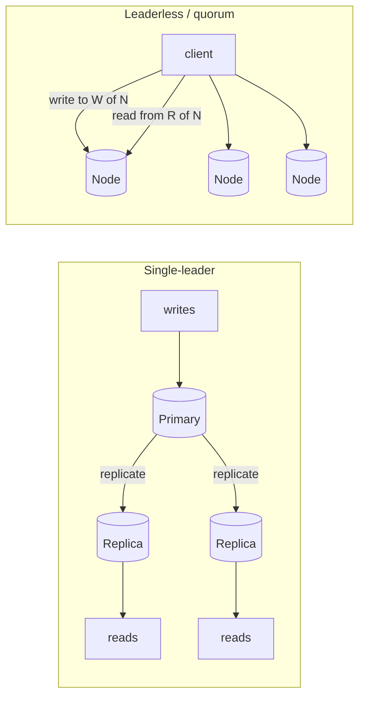

# Day 4 — Replication & consistency; CAP / PACELC

*After today you can choose a replication topology and a per-read consistency
level for a given workload, and defend it by naming the staleness window the
business can tolerate and the failure it survives.*

## The core problem

One copy of your data is a single point of failure, a read bottleneck, and a
latency wall for far-away users. **Replication** — keeping the same data on
multiple nodes — fixes all three: it survives a node loss, spreads reads across
copies, and puts a copy near the reader.

The moment you have more than one copy, they can **disagree**. A write lands on
one node; another node hasn't seen it yet. Every replicated system therefore
forces a question the single-copy system never had to answer: *when a client
reads, which copy answers, and how stale is it allowed to be?* That question —
not the mechanics of copying bytes — is the architecture work.

The mental model: **replication buys you availability, read scale, and locality;
you pay for it in consistency and write latency.** Your job is to spend exactly
as much consistency as the business needs and no more.

## Key concepts

### Replication topologies

- **Single-leader (primary/replica):** all writes go to one primary; replicas
  stream its changes and serve reads. Simple, no write conflicts, linear write
  ordering. Postgres streaming replication, MySQL, most RDBMS. **This is the
  default and what you should reach for first.**
- **Multi-leader:** more than one node accepts writes (e.g. one per region).
  Buys write locality and write availability, but introduces **write conflicts**
  you must resolve (last-write-wins, CRDTs, app logic). Use only when you truly
  need low-latency writes in multiple regions.
- **Leaderless (Dynamo-style quorum):** clients write to and read from multiple
  nodes directly; correctness comes from **quorum overlap**. DynamoDB,
  Cassandra, Riak. Great availability, tunable consistency, no failover step.

### Synchronous vs asynchronous replication

The single knob that decides your consistency/latency/durability tradeoff:

| Mode | Primary waits for replica? | Write latency | On primary crash |
|------|----------------------------|---------------|------------------|
| **Async** | No — commits locally, ships WAL later | fast (local commit only) | **data loss** up to the lag (RPO > 0) |
| **Sync** | Yes — waits for ≥1 replica to confirm | +1 network RT per write | no loss to a confirmed replica (RPO = 0) |
| **Semi-sync / quorum** | Waits for *some* (e.g. 1 of N, or W of N) | +1 RT to the slowest of the quorum | no loss if that many survive |

Concrete cost: a synchronous ack inside one datacenter adds **~0.5 ms** to every
write; **synchronous across CA↔EU adds ~150 ms** — often a dealbreaker, which is
exactly why cross-region setups usually replicate async and accept an RPO.

### Replication lag and the guarantees that fix it

Async replication means a replica trails the primary by a **lag window** —
microseconds when idle, but **seconds to minutes** under write load, long
transactions, or a slow network. A read from a lagging replica is a **stale
read**. Four practical guarantees, weakest to strongest:

- **Eventual consistency:** if writes stop, all replicas converge. Says nothing
  about *when*. Fine for a like-count or a follower list.
- **Read-your-writes (read-after-write):** a user always sees their *own* writes.
  Violated when the user posts, then their profile reads from a lagging replica
  and the post is gone. Fix: route that user's reads to the primary for a short
  window, or read from a replica known to be caught up past the write's LSN.
- **Monotonic reads:** a user never sees time *go backwards* (read v5, then v3).
  Happens when successive reads hit different replicas at different lag. Fix:
  pin a user to one replica (sticky routing by hash of user id).
- **Consistent prefix reads:** you never see a write without the writes that
  causally preceded it (the answer before the question). Matters across
  partitions/shards.

**Linearizability** is the gold standard: the system behaves as if there is one
copy and every operation takes effect atomically at a single point in time. It
requires synchronous coordination (consensus) and costs latency/availability.

### CAP — only about the partition

CAP: when a **network partition (P)** splits your nodes, you may keep
**Consistency (C)** or **Availability (A)**, not both. Two honest choices during
a partition:

- **CP:** refuse writes/reads on the minority side (or everywhere) to avoid
  divergence. The data stays correct; some requests fail. (A leader-election
  system that won't accept writes without a quorum.)
- **AP:** keep serving on both sides and reconcile later. Everyone stays up;
  copies diverge and need conflict resolution.

CAP's trap is that people quote it as "pick 2 of 3" always. **Partitions are
rare and transient; the C-vs-A choice only applies *during* one.** The rest of
the time you're not choosing between C and A at all — which is what PACELC adds.

### PACELC — the part that actually runs 99.9% of the time

> **if Partition → choose A or C, Else → choose L (latency) or C (consistency).**

The **ELC** half is the daily reality: with no partition, you *still* trade
latency against consistency on every request (sync ack vs async, quorum read vs
single-replica read). Classify systems by both letters:

| System | PAC (during partition) | ELC (normal) | Meaning |
|--------|------------------------|--------------|---------|
| **Google Spanner** | **PC** | **EC** | always consistent; pays latency (TrueTime waits, sync quorum) |
| **DynamoDB / Cassandra (default)** | **PA** | **EL** | stays available & fast; accepts staleness |
| **DynamoDB strongly-consistent read** | **PA** | **EC** | per-request: pay latency for a fresh read |
| **Postgres primary + async replica** | ~PA (replica serves stale) | **EL** on the replica, **EC** on the primary | you choose *per read* which node answers |

The senior insight: **consistency is a per-operation choice, not a per-database
one.** DynamoDB lets you ask for a strong read on the request that needs it and
an eventual read everywhere else. Postgres lets you route the read-your-writes
query to the primary and the redirect to a replica.

### Quorums (N/R/W)

Leaderless systems tune consistency with three numbers: **N** replicas, wait for
**W** to ack a write, wait for **R** to answer a read. If **R + W > N**, read and
write sets overlap on ≥1 node, so a read sees the latest write (strong-ish).
Examples with N=3: `W=3,R=1` (fast reads, slow/fragile writes), `W=1,R=3` (fast
writes), `W=2,R=2` (balanced, tolerates 1 node down and still overlaps).

## The decision / tradeoffs

For the shortener: **redirects** (`GET /abc` → long URL) are read-heavy and
tolerate staleness (a URL barely changes after creation); the **"my URLs" list**
must show a user their just-created link (read-your-writes).

| Option | Consistency | Read latency | Availability | Read scale | When it wins |
|--------|-------------|--------------|--------------|-----------|--------------|
| **Primary-only reads** | linearizable | primary RT (+ maybe cross-AZ) | primary is SPOF for reads | none — primary bottleneck | small scale; correctness > everything |
| **Async replica reads** | eventual (bounded by lag) | local replica RT | high (replicas absorb reads) | horizontal on reads | read-heavy, staleness-tolerant paths (redirects) |
| **Replica reads + read-your-writes routing** | eventual, except own writes | mostly replica, primary for own recent writes | high | horizontal | mixed workload (the realistic answer) |
| **Sync/quorum** | strong | + network RT (or +150ms cross-region) | tolerates node loss, costs latency | moderate | money, inventory, anything a stale read corrupts |

**Decision for the shortener:** async replicas for redirects, and route each
user's "my URLs" read to the primary (or a caught-up replica) for a short window
after they write — because the dominant NFR is read latency/scale for redirects,
while only the tiny own-writes path needs freshness.

## When NOT this

- **Don't buy strong consistency for a tolerant read.** A like-count, a view
  counter, a "trending" list, a follower count — serving these from an async
  replica (or even a cache) is correct engineering. Paying quorum latency and
  availability for a number nobody audits is waste. **Alternative that wins:**
  eventual consistency / replica reads, when the business cost of a few seconds
  of staleness is zero.
- **Don't put a read-your-writes path on an async replica.** If a user deposits
  money and immediately checks their balance, a stale replica read looks like the
  money vanished. **Alternative that wins:** primary read (or synchronous replica)
  for the specific path where the user observes their own recent write.
- **Don't go multi-leader for write *scale*.** Multi-leader solves write
  *locality/availability across regions*, not throughput — and it hands you
  conflict resolution. **Alternative that wins:** single-leader + partitioning
  (Day 5) when you need more write throughput.

## Real-world

- **Google Spanner (PACELC: PC/EC).** Globally-distributed SQL that offers
  **external consistency** (linearizable across regions) using **TrueTime** —
  GPS/atomic clocks give every node a bounded-uncertainty timestamp, and Spanner
  *waits out* the uncertainty (a few ms) before committing so timestamp order
  matches real order. **Lesson:** strong global consistency is achievable, but
  you pay for it in commit latency and expensive infrastructure — you buy it only
  when correctness across regions is worth that price.
- **Amazon Dynamo (PA/EL).** The 2007 paper chose availability and low latency
  over consistency: leaderless, quorum (N/R/W), vector clocks / app-side conflict
  resolution, always writable (writes never blocked, even during partitions).
  **Lesson:** match consistency to the *business cost of staleness* — a shopping
  cart that occasionally resurrects a removed item is a better outcome than a cart
  that won't accept writes. DynamoDB later exposed the choice **per request**
  (eventual by default, strongly-consistent read on demand).

## Common mistakes / gotchas

1. **Reading your own writes off a replica.** The #1 replication bug. The write
   succeeded, the immediate read hit a lagging replica, the user thinks it failed
   and retries — sometimes creating a duplicate.
2. **Ignoring RPO with async failover.** If the primary dies before shipping its
   last WAL, an async replica promoted to primary **loses** those committed
   writes. "Replicated" ≠ "durable across a failover." Know your RPO.
3. **Treating replication lag as constant.** Lag is near-zero when idle and
   **blows out under write bursts, long transactions, vacuum, or a slow link.**
   Design for the p99 lag, and *monitor* it (`pg_stat_replication`,
   `pg_last_wal_replay_lsn`), don't assume it.
4. **Non-monotonic reads from a replica pool.** A load balancer spraying a user's
   reads across replicas at different lag can show data going backwards. Pin the
   user (sticky) or read from primary.
5. **Quoting CAP as "pick 2 always."** You don't sacrifice C or A except *during*
   a partition. Use PACELC to reason about the 99.9% of the time there's no
   partition.
6. **Setting `synchronous_commit`/quorum globally.** Making every write
   synchronous to protect the 1% that needs it taxes the 99% that doesn't. Set it
   per-transaction / per-path.

## Practice

### Exercise 1 — Classify the reads

For the URL shortener, classify each read as *tolerant of staleness* or
*read-your-writes required*, and say which node should serve it:
(a) anonymous user follows `short.ly/abc`; (b) creator opens "My Links" right
after creating a link; (c) the public "top 100 most-clicked links today"
dashboard; (d) admin checks whether a reported link was deleted.

Hint 1
Ask: "if this read is a few seconds stale, does anyone notice or get hurt?"

Hint 2
Read-your-writes only applies when the *same actor* who just wrote is reading their *own* write.

Solution sketch

- (a) **Tolerant** → replica. A newly-changed target is rare; seconds of
  staleness is invisible. Redirect path = replica reads.
- (b) **Read-your-writes** → primary (or a replica confirmed past the write's
  LSN) for a short window. The creator must see the link they just made.
- (c) **Tolerant** → replica (or a cache/materialized view). A dashboard that's
  a minute stale is fine; don't tax the primary with an aggregate scan.
- (d) **Depends on stakes.** Moderation is safety-sensitive; read from primary so
  the admin sees the true current state (a stale "still live" read could keep bad
  content up). This is a *business cost of staleness* judgment, not a technical one.

### Exercise 2 — Failover mid-write (red-team)

The primary is doing 2,000 writes/s with **async** replicas. The primary's host
dies. Your orchestrator promotes the most-caught-up replica. Walk the failure:
what is lost, what could go *wrong* for a client, and what would you change if
losing any committed write is unacceptable?

Hint 1
How far behind is the promoted replica, in writes, if lag was 200 ms?

Hint 2
What does a client that got a 200-OK on a now-lost write believe?

Solution sketch

- At 2,000 w/s and ~200 ms lag, the replica is missing **~400 committed writes**
  (RPO ≈ 400 records). Those acked-to-the-client writes silently vanish.
- Client harm: a user saw "saved," retries later find it gone, or a downstream
  system that consumed the ack now disagrees with the DB. Worse: if the old
  primary comes back and isn't fenced, you get a **split brain** (two primaries).
- If zero loss is required: use **synchronous / quorum commit** (e.g. Postgres
  `synchronous_standby_names` with `ANY 1`) so a write isn't acked until a replica
  has it — accepting the added write latency and the risk that the write path
  *stalls* if no standby is available. That's the CP choice: correctness over
  availability of the write path. Also fence the old primary (STONITH) to prevent
  split brain.

### Exercise 3 — Place a system in PACELC

Where do these sit in PACELC, and why: (a) a bank ledger; (b) a social feed's
"who liked this"; (c) a globally-distributed inventory for a flash sale?

Hint
Two independent choices: during a partition (A vs C), and normally (L vs C).

Solution sketch

- (a) **Ledger → PC/EC.** Never serve or accept an inconsistent balance, even at
  the cost of availability during a partition and latency normally. Correctness
  is the product.
- (b) **Likes → PA/EL.** Stay up and fast; an eventually-consistent like count is
  perfectly acceptable. Staleness cost ≈ 0.
- (c) **Flash-sale inventory → PC/EC (at least for the decrement).** Overselling
  is a real cost, so the "reserve last unit" decision needs strong consistency
  (single-leader per SKU or a consensus decrement); browsing the catalog can be
  PA/EL. Note the *split*: different operations on the same system pick
  differently.

### Exercise 4 — Bound the staleness (from the lab)

Your lab shows the replica catching up in ~X ms normally. Product says "a user
must see their new link within 1 second." Design the read routing so this holds
**even when lag spikes to 5 s** under load, without sending all reads to the
primary.

Hint 1
You can compare the replica's replayed LSN to the LSN of the user's write.

Hint 2
What cheap thing can you store client-side or in a cookie after a write?

Solution sketch

Capture the write's LSN (`pg_current_wal_lsn()` at commit) and stash it with the
user (session/cookie/token). On their next read, compare against the chosen
replica's `pg_last_wal_replay_lsn()`; if the replica is **≥** that LSN, serve
from the replica (fresh enough); otherwise fall back to the primary **for that
read only**. This gives read-your-writes with a bounded primary load — only reads
whose replica hasn't caught up hit the primary, so a 5 s lag spike routes just
that user's recent-write reads to the primary, not the whole redirect firehose.
(This is exactly what "read-your-writes via LSN tokens" means in production.)

## Go deeper (offline-friendly)

- **DDIA (Kleppmann), Ch. 5 "Replication"** — single/multi-leader/leaderless,
  replication lag, read-your-writes, monotonic reads. The canonical treatment.
- **DDIA, Ch. 9 "Consistency and Consensus"** — linearizability, CAP done right,
  ordering guarantees.
- **"Spanner: Google's Globally-Distributed Database" (OSDI 2012)** — TrueTime and
  external consistency.
- **"Dynamo: Amazon's Highly Available Key-value Store" (SOSP 2007)** — quorums,
  eventual consistency, conflict resolution.
- **Daniel Abadi, "Consistency Tradeoffs in Modern Distributed Database System
  Design"** — the PACELC paper. Also his blog posts on why CAP is incomplete.
- **Alex Xu, *System Design Interview* Vol. 1** — replication & consistency
  chapters for interview framing.
- **Aphyr / Jepsen** analyses — real systems' consistency claims stress-tested;
  read one (e.g. the Postgres or Cassandra post) for how these break in practice.
- **Postgres docs** — "High Availability, Load Balancing, and Replication";
  `synchronous_commit`, `synchronous_standby_names`, `pg_stat_replication`.

## Check yourself

- Explain read-your-writes vs monotonic reads — give a bug each one prevents.
- When would you NOT use synchronous replication? When would you NOT use an async
  replica for a read?
- State PACELC for DynamoDB (both letters), and change one letter by changing one
  request option.
- What is your RPO with async replication at 200 ms lag and 2k writes/s?
- Why is "CAP means pick 2" misleading? What does PACELC add?
- How would you give read-your-writes without sending every read to the primary?
